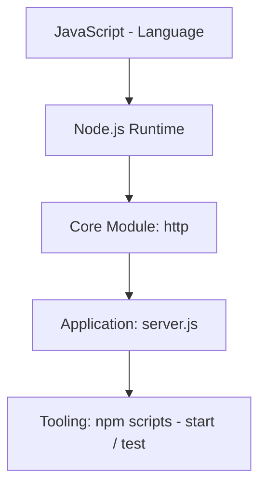
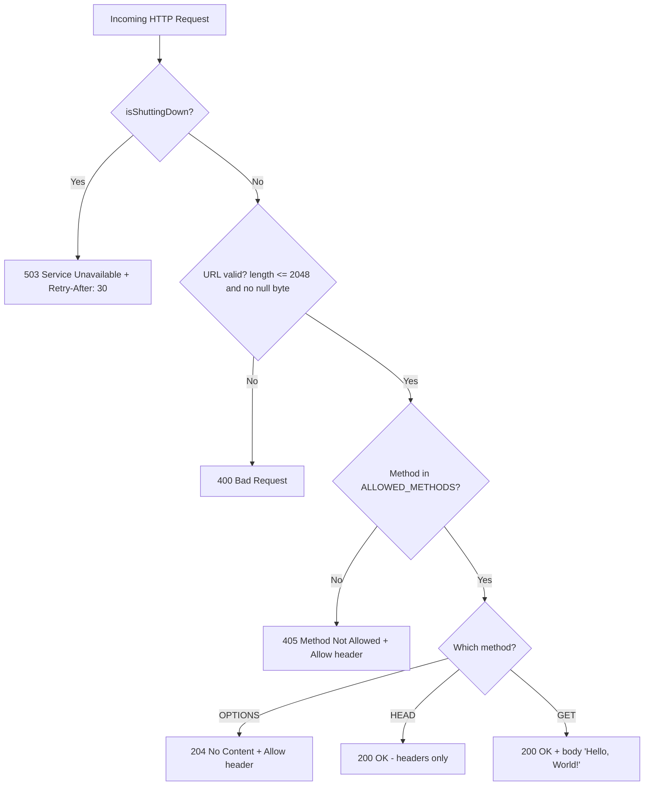
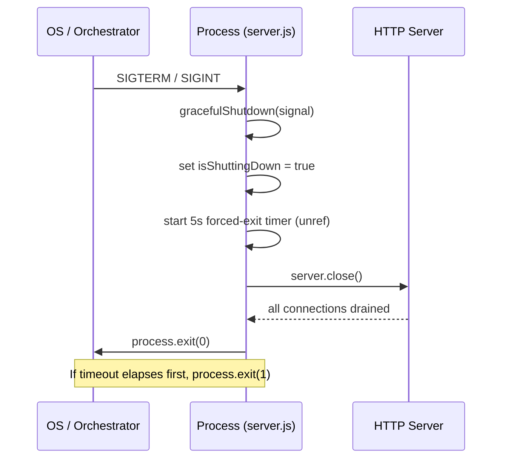

# hello_world

> A hardened, dependency-free Node.js HTTP server — also known by the repository alias **`hao-backprop-test`**.

*Naming note: the canonical npm package name is `hello_world` (`Source: package.json:L2`), while the repository is aliased **`hao-backprop-test`**. This document uses the package name `hello_world` as its title; the discrepancy between the package name and the repository alias is flagged here for user clarification.*

## Table of Contents

- [Overview](#overview)
- [Features](#features)
- [Requirements / Tech Stack](#requirements--tech-stack)
- [Getting Started](#getting-started)
  - [Prerequisites](#prerequisites)
  - [Installation](#installation)
  - [Running the Server](#running-the-server)
  - [Running Tests](#running-tests)
- [API Documentation](#api-documentation)
- [Configuration Reference](#configuration-reference)
- [Architecture / How It Works](#architecture--how-it-works)
  - [Request-Decision Cascade](#request-decision-cascade)
  - [Graceful-Shutdown Lifecycle](#graceful-shutdown-lifecycle)
  - [Error-Handling Layers](#error-handling-layers)
- [Deployment Guide](#deployment-guide)
- [Troubleshooting](#troubleshooting)
- [Testing](#testing)
- [Project Structure](#project-structure)
- [License](#license)

## Overview

`hello_world` is a single-file, dependency-free HTTP server built on the Node.js core `http` module using CommonJS (`Source: server.js:L22`). It is intentionally small and hardened, serving as a reference fixture rather than a full application framework.

The server binds to the loopback interface `127.0.0.1` on port `3000` (`Source: server.js:L30-L36`) and answers **every** request path through a single catch-all request handler — there is no router and no multi-endpoint surface (`Source: server.js:L300-L362`). (Methods that Node.js dispatches to dedicated events rather than the request handler — namely `CONNECT` and `Upgrade` — are the exception and fall outside this contract; see [API Documentation](#api-documentation).) Despite its size, it layers in production-grade concerns: input validation, method enforcement, graceful shutdown, signal handling, and a process-level error safety net.

## Features

- **Server-level error handling** for startup/runtime failures such as `EADDRINUSE` (port in use) and `EACCES` (privileged port) (`Source: server.js:L381-L397`).
- **Request/response stream error handling** to survive client disconnects while a request or response is in flight (`Source: server.js:L302-L313`).
- **HTTP method validation** — only `GET`, `HEAD`, and `OPTIONS` are permitted; any other method that reaches the handler receives `405`, but only once the request has passed the earlier shutdown (`503`) and URL-validation (`400`) stages of the request-decision cascade. (`CONNECT` and `Upgrade` are routed by Node.js to separate events and never reach this check — see [API Documentation](#api-documentation).) (`Source: server.js:L68`, `Source: server.js:L332-L338`).
- **URL validation** — rejects request URLs longer than 2048 characters and any URL containing a null byte (`Source: server.js:L188-L206`).
- **Graceful shutdown** with a 5-second forced-exit timeout so the process never hangs indefinitely (`Source: server.js:L134-L165`).
- **Signal handling** for `SIGTERM` and `SIGINT` that triggers the graceful-shutdown sequence (`Source: server.js:L421-L434`).
- **Process-level safety net** for `uncaughtException` and `unhandledRejection`, attempting a graceful shutdown before exiting (`Source: server.js:L446-L479`).

## Requirements / Tech Stack

| Layer | Technology | Notes |
|-------|------------|-------|
| Language | JavaScript (CommonJS) | Single-module source, no transpilation |
| Runtime | Node.js — a currently supported **Active or Maintenance LTS** line (**22.x** or **24.x**) | Node.js 20.x reached end-of-life on 2026-04-30 and must not be used; odd-numbered and other EOL majors are unsupported. Verified working with Node.js v22.23.1 (v22 LTS) |
| Package manager | npm **10.x or later** | Verified working with npm 10.9.8 |
| Core module | `http` | The only module required by the server (`Source: server.js:L22`) |
| Dependencies | **None** | Zero third-party dependencies (`Source: package-lock.json:L6-L12`) |

The project has **zero third-party dependencies**: `package-lock.json` uses `lockfileVersion` 3 and its `packages` map contains only the root entry (`Source: package-lock.json:L6-L12`). The entire stack is JavaScript (CommonJS) running on the Node.js runtime, using only the core `http` module (`Source: server.js:L22`).

## Getting Started

### Prerequisites

Ensure a **currently supported Node.js LTS** (Active or Maintenance — presently 22.x or 24.x) and a matching npm are installed:

```bash
node --version   # expect a currently supported LTS: v22.x or v24.x (verified with v22.23.1)
npm --version    # expect 10.x or later (verified with 10.9.8)
```

### Installation

Clone the repository and install from the project root:

```bash
npm install
```

Because the project has **zero third-party dependencies** (`Source: package-lock.json:L6-L12`), `npm install` completes almost instantly, reporting `up to date` and `found 0 vulnerabilities`.

### Running the Server

Start the server with the npm `start` script, which runs `node server.js` (`Source: package.json:L7`):

```bash
npm start
```

On successful startup the server logs the following and then waits for requests (`Source: server.js:L407-L410`):

```text
Server running at http://127.0.0.1:3000/
Press Ctrl+C to stop the server gracefully.
```

### Running Tests

Run the self-contained test suite with the npm `test` script, which runs `node server.test.js` (`Source: package.json:L8`):

```bash
npm test
```

On POSIX platforms (Linux, macOS), where the harness's termination signals are delivered, all ten tests pass and the final line reads (`Source: server.test.js:L456`):

```text
Test Results: 10 passed, 0 failed
```

On Windows, `npm test` reports `Test Results: 8 passed, 2 failed` and exits with code `1`: the eight HTTP-contract tests pass, while the two graceful-shutdown tests (`SIGTERM`, `SIGINT`) fail because Windows does not deliver those POSIX termination signals to the spawned Node.js process the way the harness expects. This is a limitation of the signal-based test harness on Windows, not a defect in the server itself. See the [Testing](#testing) section for the full breakdown (`Source: server.test.js:L343-L393`).

## API Documentation

The server exposes a **single catch-all request handler** — there is no router, and the same handler observes every path (`Source: server.js:L300-L362`). The complete observable HTTP contract is summarized below. The contract covers only request methods that Node.js delivers to this handler; `CONNECT` and `Upgrade` are dispatched by Node to separate server events and are therefore **excluded** (see the *`CONNECT` and `Upgrade`* note after the table). The `GET`, `HEAD`, `OPTIONS`, and `405` rows were verified live against the running server and are additionally asserted by the automated test harness; the `400` (over-length URL) row was likewise verified live with a manual `curl` probe. The `503` (shutdown) row is **race-dependent and is not externally reproducible with a fresh `curl`** (see the notes below); its response is verified by code inspection and by direct handler invocation rather than a live external probe.

| Condition | Method / Path | Response | Key Headers | Source |
|-----------|---------------|----------|-------------|--------|
| Successful read | `GET` any path | `200 OK`, body `Hello, World!\n` | `Content-Type: text/plain`, `Content-Length: 14` | `server.js:L358-L361`, `server.test.js:L187-L197` |
| Headers-only read | `HEAD` any path | `200 OK`, no body | `Content-Type: text/plain`, `Content-Length: 14` | `server.js:L349-L356`, `server.test.js:L205-L215` |
| Method discovery | `OPTIONS` any path | `204 No Content`, no body | `Allow: GET, HEAD, OPTIONS`, `Content-Length: 0` | `server.js:L340-L347`, `server.test.js:L223-L235` |
| Disallowed method | `POST` / `PUT` / `DELETE` / any other **handler-dispatched** method (excludes `CONNECT` / `Upgrade` — see note) | `405 Method Not Allowed`, body `Method Not Allowed\n` | `Allow: GET, HEAD, OPTIONS` | `server.js:L332-L338`, `server.test.js:L243-L289` |
| Over-length URL | any path **> 2048 characters** | `400 Bad Request`, body `Bad Request - URL exceeds maximum length of 2048 characters\n` | `Content-Type: text/plain` | `server.js:L188-L206`, `server.js:L324-L330` |
| Shutting down (race-dependent — see notes) | a request that still reaches the handler on an **already-accepted** connection after `SIGTERM`/`SIGINT` | `503 Service Unavailable` | `Retry-After: 30`, `Connection: close` | `server.js:L315-L322` |

**Notes on the contract:**

- **Evaluation order.** The handler evaluates the cascade in order — shutdown (`503`) → URL validation (`400`) → method check (`405`) → method dispatch — so an earlier stage can short-circuit a later one. For example, a `POST` carrying an over-length URL is answered with `400`, not `405` (`Source: server.js:L315-L338`).
- **`CONNECT` and `Upgrade` are outside this contract.** The `405` rule applies only to request methods that Node.js actually delivers to the catch-all request handler. Node routes a `CONNECT` request to the server's `'connect'` event and any `Upgrade` request to the `'upgrade'` event — **not** to the request handler. Because this server registers no `'connect'` or `'upgrade'` listener, such requests never reach the method check: the connection is closed with **no response bytes** (it is *not* answered with `405`), while the server stays healthy for subsequent requests (`Source: server.js:L332-L338`).
- **`OPTIONS` is method discovery, not CORS.** The `OPTIONS` response returns `204` with an `Allow` header only; the server does **not** implement CORS and sends no `Access-Control-Allow-*` headers, so this is not a browser CORS preflight (`Source: server.js:L340-L347`).
- **Null bytes.** A percent-encoded `%00` in the path is **not** treated as a null byte — the request-target string contains the literal characters `%00`, so URL validation does not reject it and the request is handled normally (`GET /%00` returns `200`). A **raw** null byte in the request target is rejected by Node's HTTP parser *before* the handler runs, producing a bare `400 Bad Request` with `Connection: close` and **no** `Content-Type` or response body. The handler's own null-byte guard in `validateUrl` is defense-in-depth that a raw null byte does not normally reach (`Source: server.js:L188-L206`).
- **`503` during shutdown is race-dependent.** The `503` branch is reached only by a request that arrives on a connection accepted *before* graceful shutdown called `server.close()` (for example an in-flight or already-established keep-alive connection). A brand-new connection opened during shutdown is refused at the transport layer (connection refused), **not** answered with `503` — so clients must not rely on receiving a `503` while the server is draining (`Source: server.js:L315-L322`). See the shutdown worked example below.
- **`HEAD` responses never carry a body.** For a `HEAD` request Node.js suppresses the response body and the automatic `Content-Length`. The body strings shown for the `400` (over-length URL) and `503` (shutdown) rows above — and in their worked examples below — are what a **non-`HEAD`** method such as `GET` receives. A `HEAD` request that triggers `400` or `503` returns the same status line and headers but **no body** (`Source: server.js:L218-L228`).

### Worked Examples

The `GET`, `HEAD`, `OPTIONS`, `405`, and `400` responses below were captured live from the running server; the `503` (shutdown) response is **not externally reproducible with a fresh `curl`** (see the note in that example) and is shown exactly as the handler emits it, verified by code inspection and by direct handler invocation. Ancillary headers emitted by Node (for example `Date` and `Connection`) are elided for clarity.

**`GET /` → `200 OK`** (`Source: server.js:L358-L361`)

```bash
curl -i http://127.0.0.1:3000/
```

```http
HTTP/1.1 200 OK
Content-Type: text/plain
Content-Length: 14

Hello, World!
```

**`HEAD /` → `200 OK` (headers only)** (`Source: server.js:L349-L356`)

```bash
curl -I http://127.0.0.1:3000/
```

Returns status `200 OK` with `Content-Type: text/plain` and `Content-Length: 14`, and **no response body**.

**`OPTIONS /` → `204 No Content`** (`Source: server.js:L340-L347`)

```bash
curl -i -X OPTIONS http://127.0.0.1:3000/
```

```http
HTTP/1.1 204 No Content
Allow: GET, HEAD, OPTIONS
Content-Length: 0
```

**`POST /` (or `PUT`/`DELETE`) → `405 Method Not Allowed`** (`Source: server.js:L332-L338`)

```bash
curl -i -X POST http://127.0.0.1:3000/
```

```http
HTTP/1.1 405 Method Not Allowed
Allow: GET, HEAD, OPTIONS
Content-Type: text/plain

Method Not Allowed
```

> **`CONNECT`/`Upgrade` caveat.** This `405` applies only to methods delivered to the request handler. A raw `CONNECT` (for example `CONNECT example.com:443 HTTP/1.1`) is routed by Node.js to the server's `'connect'` event, not the handler; with no `'connect'` listener registered, the socket is closed with **no response bytes** — you will *not* receive a `405` — and the server remains healthy for subsequent requests (`Source: server.js:L332-L338`).

**Over-length URL → `400 Bad Request`** (`Source: server.js:L188-L206`, `Source: server.js:L324-L330`)

A request whose URL exceeds 2048 characters is rejected by the handler's URL validation — before method handling — with a `text/plain` body. The body shown below is what a non-`HEAD` request (e.g. `GET`) receives; a `HEAD` request with an over-length URL returns the same `400` status and headers but **no body** (see the **`HEAD` responses never carry a body** note above). (Null-byte handling differs and is not produced by this branch; see **Notes on the contract** above for the `%00` and raw-null-byte behavior.) For example, issuing a request with an over-length path:

The **Bash + `curl`** form requires a POSIX-style shell and `curl` (optional prerequisites); the **Node.js** and **PowerShell** forms are dependency-free — Node.js already runs the server, and PowerShell ships with Windows. All three produce the identical `400` shown afterward.

```bash
# Bash + curl (requires a POSIX shell and curl — optional prerequisites)
# Path with more than 2048 characters is rejected before routing
curl -i "http://127.0.0.1:3000/$(printf 'a%.0s' $(seq 1 3000))"
```

```javascript
// Node.js (dependency-free — uses only the core http module that already runs the server)
const http = require('http');
const longPath = '/' + 'a'.repeat(3000); // 3001-character target exceeds MAX_URL_LENGTH (2048)
http.get({ host: '127.0.0.1', port: 3000, path: longPath }, (res) => {
  let body = '';
  res.setEncoding('utf8');
  res.on('data', (chunk) => { body += chunk; });
  res.on('end', () => {
    console.log('Status:', res.statusCode);  // 400
    console.log('Body:', body.trimEnd());    // Bad Request - URL exceeds maximum length of 2048 characters
  });
});
```

```powershell
# PowerShell (built in on Windows — no curl required)
$longPath = '/' + ('a' * 3000)   # exceeds MAX_URL_LENGTH (2048)
try {
    Invoke-WebRequest -Uri "http://127.0.0.1:3000$longPath" -UseBasicParsing -ErrorAction Stop | Out-Null
} catch {
    "Status: $([int]$_.Exception.Response.StatusCode)"   # Status: 400
}
```

```http
HTTP/1.1 400 Bad Request
Content-Type: text/plain

Bad Request - URL exceeds maximum length of 2048 characters
```

**During shutdown → `503 Service Unavailable`** (race-dependent) (`Source: server.js:L315-L322`)

> **Important:** this response is **not** reproducible with a plain fresh `curl` issued after shutdown begins. Graceful shutdown calls `server.close()`, which stops the listening socket from accepting new connections, so a brand-new connection opened during drain is **refused** (`curl` reports `Connection refused`) rather than answered with `503`.

The `503` branch is reached only when a request reaches the handler on a connection that was **already accepted** before `server.close()` took effect and is **still open** — for example a request already in flight when shutdown begins, or the first request sent on a freshly accepted connection at the moment shutdown starts. Note that Node.js closes *idle* keep-alive connections when `server.close()` runs, so a brand-new request that tries to reuse a previously-idle keep-alive socket is reset (`ECONNRESET`) rather than answered with `503` (`Source: server.js:L154-L164`). When the timing is met, the handler emits the following for a non-`HEAD` request (a `HEAD` request receives the same status line and headers but **no body**):

```http
HTTP/1.1 503 Service Unavailable
Content-Type: text/plain
Connection: close
Retry-After: 30

Service Unavailable - Server is shutting down
```

You can reproduce this deterministically with the self-contained script below. It imports the server, lets the OS accept a connection, begins shutdown by calling the exported `gracefulShutdown()` (the same action the `SIGTERM`/`SIGINT` handlers perform), and then sends the request on that **same** already-accepted connection. Save it as `shutdown-503-demo.js` in the project root and run `node shutdown-503-demo.js` (`Source: server.js:L315-L322`, `Source: server.js:L134-L165`):

```javascript
// shutdown-503-demo.js — run from the project root: `node shutdown-503-demo.js`
const net = require('net');
const { server, gracefulShutdown } = require('./server.js');

// gracefulShutdown() calls process.exit(0) once the server finishes draining
// (Source: server.js:L154-L164). Because this demo observes the response in the
// SAME process, defer that exit until the 503 has been printed.
const realExit = process.exit.bind(process);
process.exit = () => {};

// server.js begins listening when it is required; wait for the 'listening' event.
server.on('listening', () => {
  // Open a connection and let the server accept it BEFORE shutdown begins.
  const socket = net.connect(3000, '127.0.0.1', () => {
    // Begin graceful shutdown, then send this connection's request while the
    // already-accepted socket is still open.
    gracefulShutdown('SIGTERM');
    socket.write(
      'GET /health HTTP/1.1\r\n' +
      'Host: 127.0.0.1:3000\r\n' +
      'Connection: keep-alive\r\n\r\n'
    );
  });

  let response = '';
  socket.on('data', (chunk) => { response += chunk.toString(); });
  socket.on('close', () => {
    process.stdout.write('\n--- Response on the already-accepted connection ---\n');
    process.stdout.write(response);
    realExit(0);
  });
  socket.on('error', () => {}); // if the timing is missed the socket is reset; just re-run
});
```

Running it prints the server's lifecycle logs followed by the exact `503` received on the already-accepted connection (the `Date` header reflects the current time):

```text
Server running at http://127.0.0.1:3000/
Press Ctrl+C to stop the server gracefully.
SIGTERM received. Starting graceful shutdown...
Server closed successfully. All connections terminated.

--- Response on the already-accepted connection ---
HTTP/1.1 503 Service Unavailable
Content-Type: text/plain
Connection: close
Retry-After: 30
Date: <current GMT timestamp>
Content-Length: 46

Service Unavailable - Server is shutting down
```

A fresh connection opened *after* shutdown begins is refused instead of receiving this `503`, which is why a plain `curl` cannot observe it. Because it depends on this timing, clients must not treat the `503` as a guarantee during shutdown.

## Configuration Reference

All configuration is expressed as five module-level constants in `server.js` (`Source: server.js:L30-L80`). There is **no environment-variable configuration** in the current implementation — to change a value, edit the constant directly in `server.js`.

| Constant | Value | Type | Purpose | Source |
|----------|-------|------|---------|--------|
| `hostname` | `127.0.0.1` | string | Bind interface (loopback) | `server.js:L30` |
| `port` | `3000` | number | TCP listen port | `server.js:L36` |
| `SHUTDOWN_TIMEOUT` | `5000` | number (ms) | Forced-exit timeout during graceful shutdown | `server.js:L47` |
| `ALLOWED_METHODS` | `['GET', 'HEAD', 'OPTIONS']` | string[] | Permitted HTTP methods | `server.js:L68` |
| `MAX_URL_LENGTH` | `2048` | number | Maximum request-URL length | `server.js:L80` |


## Architecture / How It Works

The application is a thin, well-guarded layer over the Node.js core `http` module. The technology stack composes as follows:



All request-time behavior lives in one catch-all handler, and all lifecycle behavior lives in a set of signal/error listeners. The three subsections below walk through the request-decision cascade, the graceful-shutdown lifecycle, and the layered error-handling model.

### Request-Decision Cascade

Every incoming request passes through the same ordered sequence of decisions inside the single handler (`Source: server.js:L300-L362`). The handler first attaches stream error listeners, then evaluates, in order: (1) whether the server is shutting down (→ `503`); (2) whether the URL is valid — length ≤ 2048 and no null byte (→ `400` if not); (3) whether the method is in `ALLOWED_METHODS` (→ `405` if not); and finally (4) it dispatches by method — `OPTIONS` → `204`, `HEAD` → `200` headers-only, `GET` → `200` with the `Hello, World!` body.



### Graceful-Shutdown Lifecycle

Graceful shutdown is **idempotent**: a second signal while a shutdown is already in progress is ignored. When first triggered, the handler sets `isShuttingDown = true`, arms an `unref`'d 5-second forced-exit timer (so it never keeps the process alive on its own), and calls `server.close()`. If existing connections drain cleanly, the process exits with code `0`; if the timer elapses first or `server.close()` reports an error, the process exits with code `1` (`Source: server.js:L134-L165`). The `SIGTERM` and `SIGINT` signals are both wired to this same routine (`Source: server.js:L421-L434`).



### Error-Handling Layers

The server defends against failure at four distinct layers, from the innermost request scope outward to the process:

1. **Request/response stream errors** — per-request `error` listeners are attached to both `req` and `res` to catch mid-flight failures such as a client disconnecting during upload. The **request** (`req`) listener responds with `400` if response headers have not already been sent; the **response** (`res`) listener only logs the error and does not send a response (`Source: server.js:L302-L313`).
2. **Input validation** — URL validation and method validation short-circuit invalid traffic with `400` and `405` respectively, before any body is produced (`Source: server.js:L324-L338`).
3. **Server-level errors** — a `server.on('error')` listener handles bind-time failures, giving actionable messages for `EADDRINUSE` and `EACCES` before exiting (`Source: server.js:L381-L397`).
4. **Process-level safety net** — `uncaughtException` and `unhandledRejection` handlers catch anything that escapes the layers above, attempting a graceful shutdown before the process exits (`Source: server.js:L446-L479`).

## Deployment Guide

- **Production start** — launch with `npm start` (equivalently `node server.js`). There is **no build step**: the project is pure JavaScript with JSDoc comments and requires no compilation (`Source: package.json:L7`).
- **Host/port binding** — the server binds to the loopback address `127.0.0.1:3000` (`Source: server.js:L30-L36`). Because it binds to loopback, it is reachable only from within its own network namespace: it is **not** reachable through ordinary Docker port publishing (`-p`) or a Kubernetes `Service` as written. To accept traffic from beyond localhost you must change the `hostname` constant in `server.js` (for example to `0.0.0.0`) and/or run a co-located reverse proxy (nginx, Caddy, a cloud load balancer) inside the same network namespace.
- **Signals & graceful shutdown** — the process honors `SIGTERM` (sent by process managers such as Docker, Kubernetes, and PM2 on POSIX hosts) and `SIGINT` (Ctrl+C), draining connections within a 5-second cap before exiting (`Source: server.js:L47`, `Source: server.js:L421-L434`).
- **Container / process-manager compatibility** — the compatibility this server provides is limited to **signal handling**: because it honors `SIGTERM`, a process manager (PM2) or orchestrator (Docker, Kubernetes) can stop it gracefully on POSIX hosts (`Source: server.js:L421-L434`). It is **not** otherwise container- or Kubernetes-ready out of the box — there is no container image, deployment manifest, readiness/liveness probe, health-check endpoint, horizontal scaling, TLS, or authentication, and the loopback bind above must be changed before the process can receive external traffic. During drain the `503` behavior is race-dependent and applies only to already-accepted connections (see [API Documentation](#api-documentation)), so it does **not** by itself provide a zero-downtime rolling-deployment guarantee; true zero-downtime rollouts would require additional infrastructure (multiple replicas, a load balancer, and readiness gating) that is out of scope for this project (`Source: server.js:L315-L322`).

## Troubleshooting

The conditions below map directly to the server's error-handling paths (`Source: server.js:L381-L397`, `Source: server.js:L315-L322`).

| Symptom | Cause | Resolution | Source |
|---------|-------|------------|--------|
| `EADDRINUSE` on startup | Port `3000` is already in use by another process | Stop the other process, or change the `port` constant in `server.js` | `server.js:L382-L386` |
| `EACCES` on startup | Attempting to bind a privileged port (< 1024) without sufficient permissions | Prefer an unprivileged port (≥ 1024, which is the default), front the process with a reverse proxy, or grant a narrowly scoped capability (e.g. Linux `CAP_NET_BIND_SERVICE`). Running the process with elevated/root privileges is **discouraged**, as it needlessly broadens the process's privileges | `server.js:L388-L392` |
| `503 Service Unavailable` on a request | The server is draining during graceful shutdown and the request reached the handler on an already-accepted connection | Expected, race-dependent behavior — retry after the advertised `Retry-After: 30` seconds once the process has restarted. Note that a fresh connection opened during drain is refused (connection refused), not answered with `503` | `server.js:L315-L322` |

## Testing

Run the suite with npm, which executes the self-contained harness `node server.test.js` (`Source: package.json:L8`). The harness needs no test framework or third-party dependency; it spawns the server as a child process and drives it over HTTP (`Source: server.test.js:L407-L461`):

```bash
npm test
```

The suite contains **10 tests**. On POSIX platforms (Linux, macOS) all ten pass (`Test Results: 10 passed, 0 failed`); on Windows the result is `Test Results: 8 passed, 2 failed` (exit code `1`), because Windows does not deliver `SIGTERM`/`SIGINT` to the spawned Node.js process the way the harness expects, so the two graceful-shutdown tests fail there. The tests cover the following (`Source: server.test.js:L181-L400`):

- `GET` success — `200` with body `Hello, World!\n`.
- `HEAD` handling — `200` with no body.
- `OPTIONS` handling — `204` with the `Allow` header.
- Method rejection — `POST`, `PUT`, and `DELETE` each return `405`.
- `Content-Type` validation — responses are `text/plain`.
- Multi-path routing — `/`, `/test`, `/api`, and `/any/path` all behave identically.
- Graceful shutdown — both `SIGTERM` and `SIGINT` shut the server down cleanly with exit code `0` (**these two tests pass on POSIX platforms but fail on Windows**, as noted above).

The harness does **not** assert the `400` (URL-validation) or `503` (shutdown) branches of the contract. The `400` behavior is verified manually with a live `curl` probe; the `503` (shutdown) branch is **race-dependent and not externally reproducible with a fresh `curl`** (see [API Documentation](#api-documentation)), so it is verified by code inspection and by direct handler invocation rather than a live probe.

## Project Structure

The meaningful files of the Node.js server are mapped below; `server.js` is the package entry point (`Source: package.json:L5`).

```text
.
├── server.js        # HTTP server implementation (documented with JSDoc)
├── server.test.js   # Self-contained test harness (10 tests)
├── package.json     # Package metadata & npm scripts
└── README.md        # This document
```

Other files present in the repository — for example `industry.csv`, `LoginTest.java`, `test.py.txt`, `test.txt.txt`, `100Pages.pdf`, `demo.jpg`, `sample.doc`, and the `blitzy/` directory — are **not** part of the Node.js server and are out of scope for this documentation.

## License

This project is licensed under the **MIT License** (`Source: package.json:L11`). Author: **hxu** (`Source: package.json:L10`).
