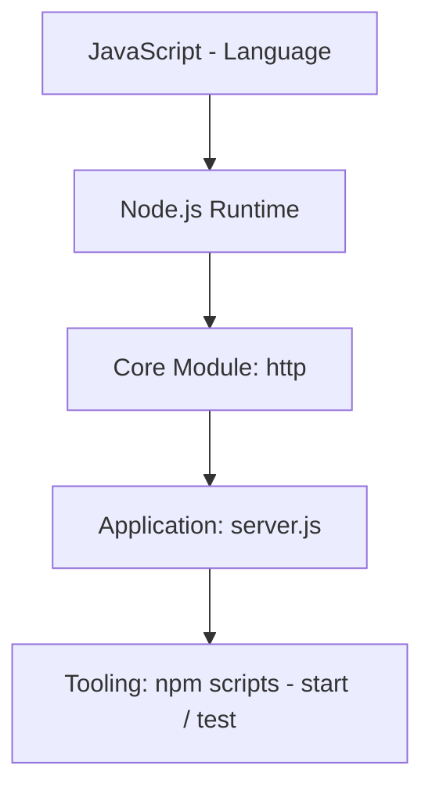
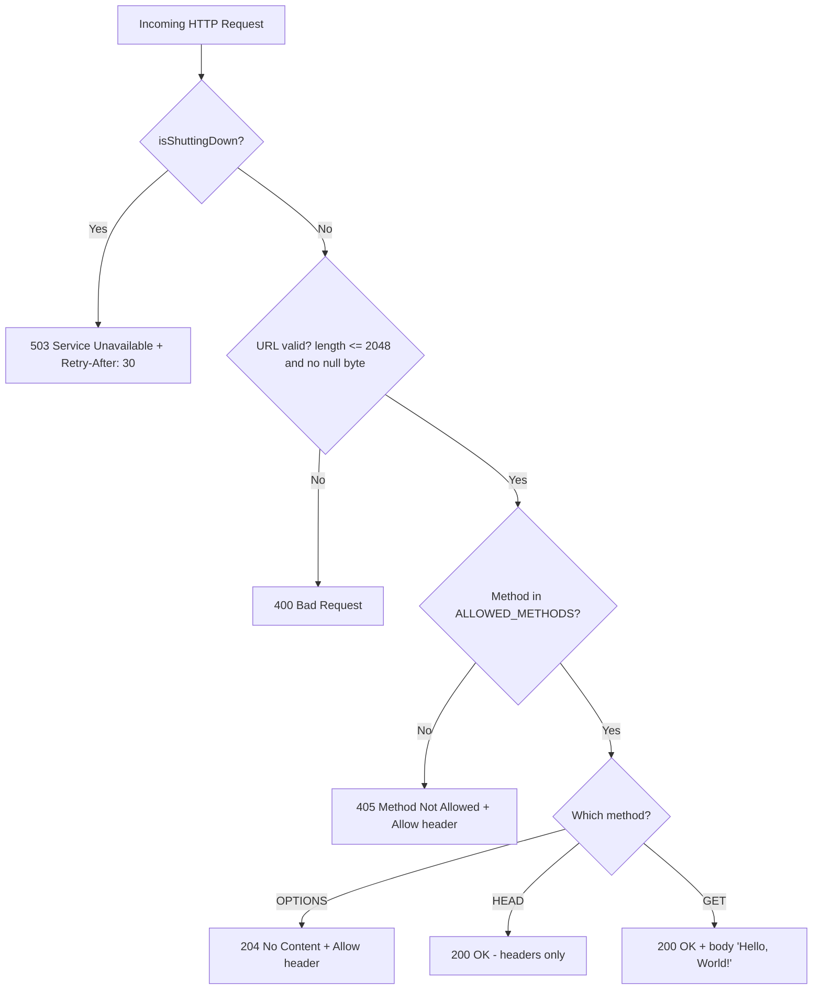
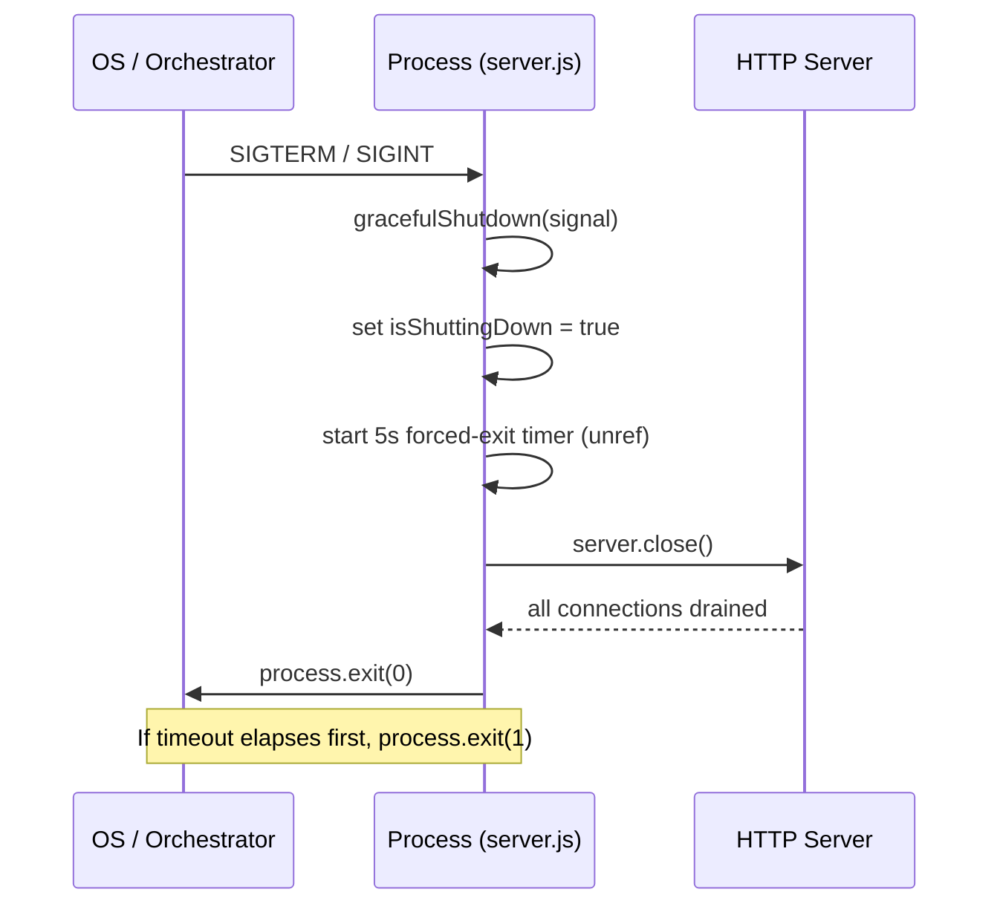

# hello_world

> A hardened, dependency-free Node.js HTTP server — also known by the repository alias **`hao-backprop-test`**.

*Naming note: the canonical npm package name is `hello_world` (`Source: package.json:L2`), while the repository is aliased **`hao-backprop-test`**. This document uses the package name `hello_world` as its title; the discrepancy between the package name and the repository alias is flagged here for user clarification.*

## Table of Contents

- [Overview](#overview)
- [Features](#features)
- [Requirements / Tech Stack](#requirements--tech-stack)
- [Getting Started](#getting-started)
  - [Prerequisites](#prerequisites)
  - [Installation](#installation)
  - [Running the Server](#running-the-server)
  - [Running Tests](#running-tests)
- [API Documentation](#api-documentation)
- [Configuration Reference](#configuration-reference)
- [Architecture / How It Works](#architecture--how-it-works)
  - [Request-Decision Cascade](#request-decision-cascade)
  - [Graceful-Shutdown Lifecycle](#graceful-shutdown-lifecycle)
  - [Error-Handling Layers](#error-handling-layers)
- [Deployment Guide](#deployment-guide)
- [Troubleshooting](#troubleshooting)
- [Testing](#testing)
- [Project Structure](#project-structure)
- [License](#license)

## Overview

`hello_world` is a single-file, dependency-free HTTP server built on the Node.js core `http` module using CommonJS (`Source: server.js:L17`). It is intentionally small and hardened, serving as a reference fixture rather than a full application framework.

The server binds to the loopback interface `127.0.0.1` on port `3000` (`Source: server.js:L20-L21`) and answers **every** request path through a single catch-all request handler — there is no router and no multi-endpoint surface (`Source: server.js:L126-L188`). Despite its size, it layers in production-grade concerns: input validation, method enforcement, graceful shutdown, signal handling, and a process-level error safety net.

## Features

- **Server-level error handling** for startup/runtime failures such as `EADDRINUSE` (port in use) and `EACCES` (privileged port) (`Source: server.js:L194-L210`).
- **Request/response stream error handling** to survive client disconnects while a request or response is in flight (`Source: server.js:L128-L139`).
- **HTTP method validation** — only `GET`, `HEAD`, and `OPTIONS` are permitted; all other methods receive `405` (`Source: server.js:L27`, `Source: server.js:L159-L164`).
- **URL validation** — rejects request URLs longer than 2048 characters and any URL containing a null byte (`Source: server.js:L82-L100`).
- **Graceful shutdown** with a 5-second forced-exit timeout so the process never hangs indefinitely (`Source: server.js:L43-L74`).
- **Signal handling** for `SIGTERM` and `SIGINT` that triggers the graceful-shutdown sequence (`Source: server.js:L225-L231`).
- **Process-level safety net** for `uncaughtException` and `unhandledRejection`, attempting a graceful shutdown before exiting (`Source: server.js:L237-L259`).

## Requirements / Tech Stack

| Layer | Technology | Notes |
|-------|------------|-------|
| Language | JavaScript (CommonJS) | Single-module source, no transpilation |
| Runtime | Node.js **20.x or later** | Verified working with Node.js v22.23.1 |
| Package manager | npm **10.x or later** | Verified working with npm 10.9.8 |
| Core module | `http` | The only module required by the server (`Source: server.js:L17`) |
| Dependencies | **None** | Zero third-party dependencies (`Source: package-lock.json:L6-L12`) |

The project has **zero third-party dependencies**: `package-lock.json` uses `lockfileVersion` 3 and its `packages` map contains only the root entry (`Source: package-lock.json:L6-L12`). The entire stack is JavaScript (CommonJS) running on the Node.js runtime, using only the core `http` module (`Source: server.js:L17`).

## Getting Started

### Prerequisites

Ensure a supported Node.js and npm are installed:

```bash
node --version   # expect v20.x or later (verified with v22.23.1)
npm --version    # expect 10.x or later (verified with 10.9.8)
```

### Installation

Clone the repository and install from the project root:

```bash
npm install
```

Because the project has **zero third-party dependencies** (`Source: package-lock.json:L6-L12`), `npm install` completes almost instantly, reporting `up to date` and `found 0 vulnerabilities`.

### Running the Server

Start the server with the npm `start` script, which runs `node server.js` (`Source: package.json:L7`):

```bash
npm start
```

On successful startup the server logs the following and then waits for requests (`Source: server.js:L215-L218`):

```text
Server running at http://127.0.0.1:3000/
Press Ctrl+C to stop the server gracefully.
```

### Running Tests

Run the self-contained test suite with the npm `test` script, which runs `node server.test.js` (`Source: package.json:L8`):

```bash
npm test
```

Expected final line of output (`Source: server.test.js:L456`):

```text
Test Results: 10 passed, 0 failed
```

## API Documentation

The server exposes a **single catch-all request handler** — there is no router, and the same handler observes every path (`Source: server.js:L126-L188`). The complete observable HTTP contract is summarized below; every row is asserted in `server.test.js` and verified live.

| Condition | Method / Path | Response | Key Headers | Source |
|-----------|---------------|----------|-------------|--------|
| Successful read | `GET` any path | `200 OK`, body `Hello, World!\n` | `Content-Type: text/plain`, `Content-Length: 14` | `server.js:L184-L187`, `server.test.js:L187-L197` |
| Headers-only read | `HEAD` any path | `200 OK`, no body | `Content-Type: text/plain`, `Content-Length: 14` | `server.js:L176-L182`, `server.test.js:L205-L215` |
| Method discovery / preflight | `OPTIONS` any path | `204 No Content`, no body | `Allow: GET, HEAD, OPTIONS`, `Content-Length: 0` | `server.js:L167-L173`, `server.test.js:L223-L235` |
| Disallowed method | `POST` / `PUT` / `DELETE` / other | `405 Method Not Allowed`, body `Method Not Allowed\n` | `Allow: GET, HEAD, OPTIONS` | `server.js:L159-L164`, `server.test.js:L243-L289` |
| Invalid URL | any path > 2048 chars **or** containing a null byte | `400 Bad Request` | `Content-Type: text/plain` | `server.js:L82-L100,L150-L156` |
| During shutdown | any request after `SIGTERM`/`SIGINT` | `503 Service Unavailable` | `Retry-After: 30`, `Connection: close` | `server.js:L142-L148` |

### Worked Examples

The responses below are live-verified. Ancillary headers emitted by Node (for example `Date` and `Connection`) are elided for clarity.

**`GET /` → `200 OK`** (`Source: server.js:L184-L187`)

```bash
curl -i http://127.0.0.1:3000/
```

```http
HTTP/1.1 200 OK
Content-Type: text/plain
Content-Length: 14

Hello, World!
```

**`HEAD /` → `200 OK` (headers only)** (`Source: server.js:L176-L182`)

```bash
curl -I http://127.0.0.1:3000/
```

Returns status `200 OK` with `Content-Type: text/plain` and `Content-Length: 14`, and **no response body**.

**`OPTIONS /` → `204 No Content`** (`Source: server.js:L167-L173`)

```bash
curl -i -X OPTIONS http://127.0.0.1:3000/
```

```http
HTTP/1.1 204 No Content
Allow: GET, HEAD, OPTIONS
Content-Length: 0
```

**`POST /` (or `PUT`/`DELETE`) → `405 Method Not Allowed`** (`Source: server.js:L159-L164`)

```bash
curl -i -X POST http://127.0.0.1:3000/
```

```http
HTTP/1.1 405 Method Not Allowed
Allow: GET, HEAD, OPTIONS
Content-Type: text/plain

Method Not Allowed
```

**Invalid URL → `400 Bad Request`** (`Source: server.js:L82-L100,L150-L156`)

A request whose URL exceeds 2048 characters, or whose URL contains a null byte, is rejected during validation — before method handling. For example, issuing a request with an over-length path:

```bash
# Path with more than 2048 characters is rejected before routing
curl -i "http://127.0.0.1:3000/$(printf 'a%.0s' $(seq 1 3000))"
```

```http
HTTP/1.1 400 Bad Request
Content-Type: text/plain

Bad Request - URL exceeds maximum length of 2048 characters
```

**During shutdown → `503 Service Unavailable`** (`Source: server.js:L142-L148`)

Once the process has received `SIGTERM` or `SIGINT` and entered graceful shutdown, any newly arriving request is answered with `503` and advised to retry:

```bash
curl -i http://127.0.0.1:3000/
```

```http
HTTP/1.1 503 Service Unavailable
Content-Type: text/plain
Connection: close
Retry-After: 30

Service Unavailable - Server is shutting down
```

## Configuration Reference

All configuration is expressed as five module-level constants in `server.js` (`Source: server.js:L20-L30`). There is **no environment-variable configuration** in the current implementation — to change a value, edit the constant directly in `server.js`.

| Constant | Value | Type | Purpose | Source |
|----------|-------|------|---------|--------|
| `hostname` | `127.0.0.1` | string | Bind interface (loopback) | `server.js:L20` |
| `port` | `3000` | number | TCP listen port | `server.js:L21` |
| `SHUTDOWN_TIMEOUT` | `5000` | number (ms) | Forced-exit timeout during graceful shutdown | `server.js:L24` |
| `ALLOWED_METHODS` | `['GET', 'HEAD', 'OPTIONS']` | string[] | Permitted HTTP methods | `server.js:L27` |
| `MAX_URL_LENGTH` | `2048` | number | Maximum request-URL length | `server.js:L30` |


## Architecture / How It Works

The application is a thin, well-guarded layer over the Node.js core `http` module. The technology stack composes as follows:



All request-time behavior lives in one catch-all handler, and all lifecycle behavior lives in a set of signal/error listeners. The three subsections below walk through the request-decision cascade, the graceful-shutdown lifecycle, and the layered error-handling model.

### Request-Decision Cascade

Every incoming request passes through the same ordered sequence of decisions inside the single handler (`Source: server.js:L126-L188`). The handler first attaches stream error listeners, then evaluates, in order: (1) whether the server is shutting down (→ `503`); (2) whether the URL is valid — length ≤ 2048 and no null byte (→ `400` if not); (3) whether the method is in `ALLOWED_METHODS` (→ `405` if not); and finally (4) it dispatches by method — `OPTIONS` → `204`, `HEAD` → `200` headers-only, `GET` → `200` with the `Hello, World!` body.



### Graceful-Shutdown Lifecycle

Graceful shutdown is **idempotent**: a second signal while a shutdown is already in progress is ignored. When first triggered, the handler sets `isShuttingDown = true`, arms an `unref`'d 5-second forced-exit timer (so it never keeps the process alive on its own), and calls `server.close()`. If existing connections drain cleanly, the process exits with code `0`; if the timer elapses first or `server.close()` reports an error, the process exits with code `1` (`Source: server.js:L43-L74`). The `SIGTERM` and `SIGINT` signals are both wired to this same routine (`Source: server.js:L225-L231`).



### Error-Handling Layers

The server defends against failure at four distinct layers, from the innermost request scope outward to the process:

1. **Request/response stream errors** — per-request `error` listeners on both `req` and `res` catch mid-flight failures such as a client disconnecting during upload, responding with `400` only if headers have not already been sent (`Source: server.js:L128-L139`).
2. **Input validation** — URL validation and method validation short-circuit invalid traffic with `400` and `405` respectively, before any body is produced (`Source: server.js:L150-L164`).
3. **Server-level errors** — a `server.on('error')` listener handles bind-time failures, giving actionable messages for `EADDRINUSE` and `EACCES` before exiting (`Source: server.js:L194-L210`).
4. **Process-level safety net** — `uncaughtException` and `unhandledRejection` handlers catch anything that escapes the layers above, attempting a graceful shutdown before the process exits (`Source: server.js:L237-L259`).

## Deployment Guide

- **Production start** — launch with `npm start` (equivalently `node server.js`). There is **no build step**: the project is pure JavaScript with JSDoc comments and requires no compilation (`Source: package.json:L7`).
- **Host/port binding** — the server binds to the loopback address `127.0.0.1:3000` (`Source: server.js:L20-L21`). To accept traffic from beyond localhost, either change the `hostname` constant in `server.js` (for example to `0.0.0.0`) and/or front the process with a reverse proxy (nginx, Caddy, a cloud load balancer).
- **Signals & graceful shutdown** — the process honors `SIGTERM` (sent by process managers such as Docker, Kubernetes, and PM2) and `SIGINT` (Ctrl+C), draining connections within a 5-second cap before exiting (`Source: server.js:L24`, `Source: server.js:L225-L231`).
- **Container / process-manager compatibility** — because it honors `SIGTERM`, the server works cleanly under Docker, Kubernetes, and PM2. During drain it answers new requests with `503` and a `Retry-After: 30` header, which supports zero-downtime rolling deployments (`Source: server.js:L142-L148`).

## Troubleshooting

The conditions below map directly to the server's error-handling paths (`Source: server.js:L194-L210`, `Source: server.js:L142-L148`).

| Symptom | Cause | Resolution | Source |
|---------|-------|------------|--------|
| `EADDRINUSE` on startup | Port `3000` is already in use by another process | Stop the other process, or change the `port` constant in `server.js` | `server.js:L195-L199` |
| `EACCES` on startup | Attempting to bind a privileged port (< 1024) without sufficient permissions | Use an unprivileged port (≥ 1024), or run with elevated permissions | `server.js:L201-L205` |
| `503 Service Unavailable` on requests | The server is draining during graceful shutdown | Expected behavior — retry after the advertised `Retry-After: 30` seconds once the process has restarted | `server.js:L142-L148` |

## Testing

Run the suite with npm, which executes the self-contained harness `node server.test.js` (`Source: package.json:L8`). The harness needs no test framework or third-party dependency; it spawns the server as a child process and drives it over HTTP. Expected output is `Test Results: 10 passed, 0 failed` (`Source: server.test.js:L407-L461`):

```bash
npm test
```

The 10 tests cover the full observable contract (`Source: server.test.js:L181-L400`):

- `GET` success — `200` with body `Hello, World!\n`.
- `HEAD` handling — `200` with no body.
- `OPTIONS` handling — `204` with the `Allow` header.
- Method rejection — `POST`, `PUT`, and `DELETE` each return `405`.
- `Content-Type` validation — responses are `text/plain`.
- Multi-path routing — `/`, `/test`, `/api`, and `/any/path` all behave identically.
- Graceful shutdown — both `SIGTERM` and `SIGINT` shut the server down cleanly (exit code `0`).

## Project Structure

The meaningful files of the Node.js server are mapped below; `server.js` is the package entry point (`Source: package.json:L5`).

```text
.
├── server.js        # HTTP server implementation (documented with JSDoc)
├── server.test.js   # Self-contained test harness (10 tests)
├── package.json     # Package metadata & npm scripts
└── README.md        # This document
```

Other files present in the repository — for example `industry.csv`, `LoginTest.java`, `test.py.txt`, `test.txt.txt`, `100Pages.pdf`, `demo.jpg`, `sample.doc`, and the `blitzy/` directory — are **not** part of the Node.js server and are out of scope for this documentation.

## License

This project is licensed under the **MIT License** (`Source: package.json:L11`). Author: **hxu** (`Source: package.json:L10`).
