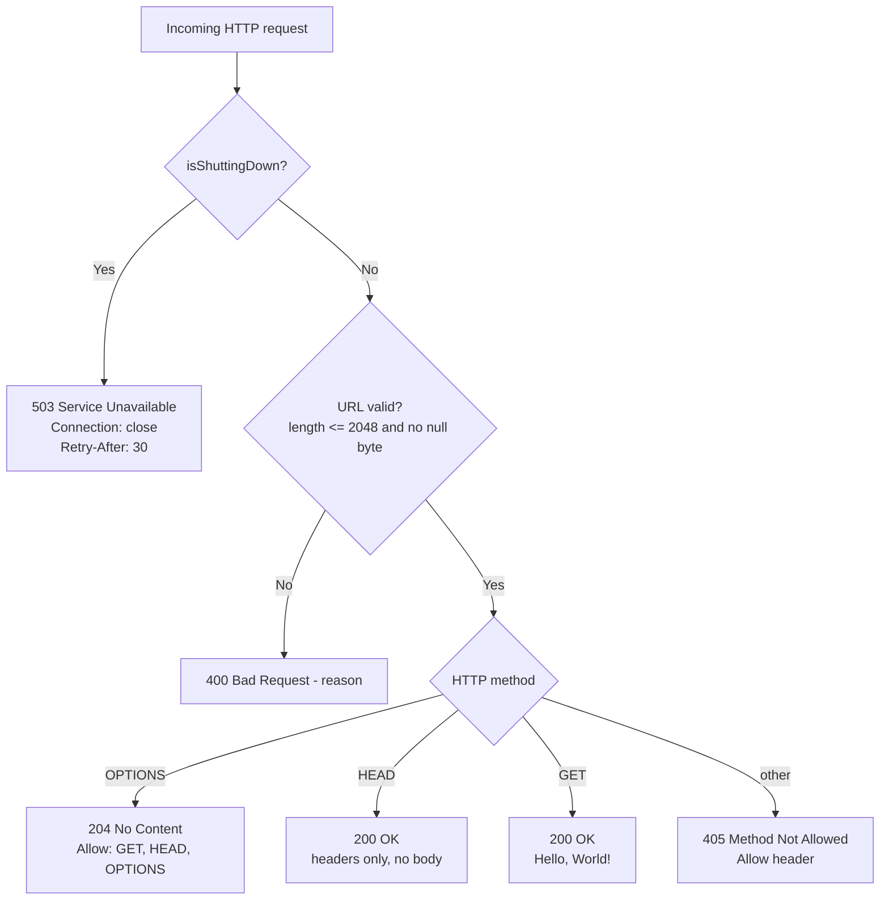
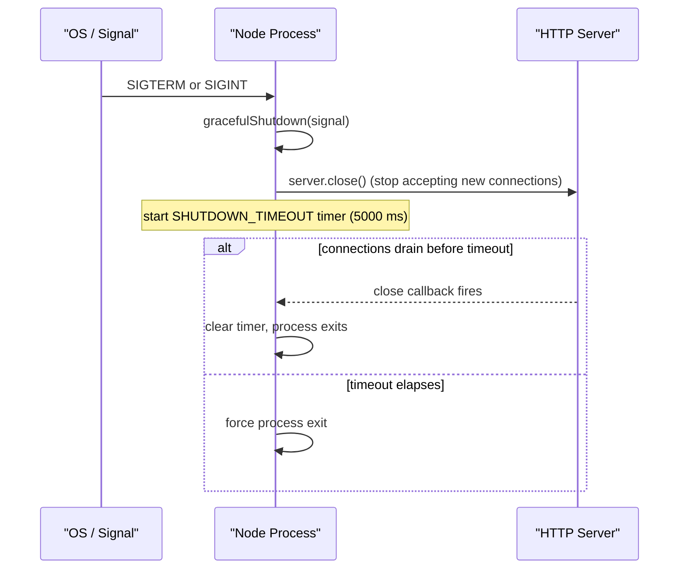

# hello_world — Node.js HTTP Server

A minimal, dependency-free, production-hardened Node.js HTTP server that responds with `Hello, World!`. It is built exclusively on the Node.js core `http` module — no frameworks, no third-party packages — yet it ships with real-world hardening: HTTP method validation, URL validation, structured error handling, signal-based graceful shutdown, and process-level crash safety.

> **Project name:** the authoritative name is **`hello_world`** (from `package.json`). This repository was historically titled `hao-backprop-test` in its placeholder README; that title has been reconciled to the package name and is retained here only as a historical note.

`Source: server.js:L1-L21`

## Table of Contents

- [Features / Behavior Overview](#features--behavior-overview)
- [Requirements](#requirements)
- [Installation & Setup](#installation--setup)
- [Usage / Quick Start](#usage--quick-start)
- [API Documentation](#api-documentation)
- [Configuration](#configuration)
- [Architecture](#architecture)
- [Deployment & Operations](#deployment--operations)
- [Code Walkthrough](#code-walkthrough)
- [Testing](#testing)
- [Project Structure](#project-structure)
- [License](#license)

## Features / Behavior Overview

- **Catch-all "Hello, World!" server.** There is **no path routing** — every request path (`/`, `/test`, `/api`, `/any/path`) behaves identically. The response is selected entirely by shutdown state, URL validity, and HTTP method, never by the path.
- **Allowed HTTP methods:** `GET`, `HEAD`, and `OPTIONS`. Any other method receives `405 Method Not Allowed`.
- **Production hardening baked in:**
  - Server-level error handling for startup/bind errors (`EADDRINUSE`, `EACCES`).
  - Per-request error listeners on both the request and response streams.
  - URL validation — rejects URLs longer than 2048 characters or containing a null byte.
  - Graceful shutdown with a bounded force-exit timeout.
  - Signal handling for `SIGTERM` and `SIGINT`.
  - Process-level handlers for `uncaughtException` and `unhandledRejection`.
- **Zero dependencies.** The only module required at runtime is the Node.js built-in `http`.

`Source: server.js:L33, L209-L211` (allowed methods and the `Hello, World!` response); `Source: server.js:L1-L21` (feature summary in the module header).

## Requirements

- **Node.js v22.x** — verified on **v22.23.1**. `package.json` declares no `engines` field, so this is the tested version rather than an enforced floor.
- **npm** — bundled with Node.js; used for setup (`npm install`) and to run the `start` and `test` scripts.
- **Zero external dependencies** — the server uses only the Node.js core `http` module, so there is nothing to download or build.

`Source: package.json, package-lock.json`

## Installation & Setup

Obtain the source (clone or download this repository) and change into the project root (the directory that contains `server.js`). Then install dependencies (a no-op here — the project has **zero** dependencies), and start the server:

```bash
# 1. Install dependencies
#    This is effectively a no-op: package-lock.json lists no third-party
#    packages, so npm has nothing to download.
npm install

# 2. Start the server
npm start
```

`npm start` runs `node server.js`; `npm test` runs `node server.test.js`.

`Source: package.json:L6-L9`

## Usage / Quick Start

Start the server with either the npm script or Node directly:

```bash
npm start
# equivalently:
node server.js
```

On a successful start, the server prints exactly these two lines to stdout:

```text
Server running at http://127.0.0.1:3000/
Press Ctrl+C to stop the server gracefully.
```

Send your first request from another terminal:

```bash
curl http://127.0.0.1:3000/
```

```http
Hello, World!
```

`Source: server.js:L250-L253`

## API Documentation

### Routing model

This server is a **catch-all**: it performs **no path-specific routing**. It does not match the request path against any route table, so `/`, `/test`, `/api`, and `/any/deep/path` all produce the same response for a given HTTP method. The URL is still validated for length and null bytes, so an overlong URL — or one containing a null byte — is rejected with `400 Bad Request` regardless of its path. This behavior is verified by the test suite's multi-path routing test (Test 8).

`Source: server.js:L150-L212`

### Method contract

| Method / Condition | Status | Key Headers | Body |
|--------------------|--------|-------------|------|
| `GET` (any path) | `200 OK` | `Content-Type: text/plain`, `Content-Length: 14` | `Hello, World!\n` |
| `HEAD` (any path) | `200 OK` | `Content-Type: text/plain`, `Content-Length: 14` | *(no body)* |
| `OPTIONS` (any path) | `204 No Content` | `Allow: GET, HEAD, OPTIONS`, `Content-Length: 0` | *(none)* |
| `POST` / `PUT` / `DELETE` / other | `405 Method Not Allowed` | `Allow: GET, HEAD, OPTIONS` | `Method Not Allowed\n` |
| Invalid URL (> 2048 chars) | `400 Bad Request` | `Content-Type: text/plain` | `Bad Request - URL exceeds maximum length of 2048 characters\n` |
| Invalid URL (contains a null byte) | `400 Bad Request` | `Content-Type: text/plain` | `Bad Request - URL contains invalid null bytes\n` |
| Request received while shutting down | `503 Service Unavailable` | `Connection: close`, `Retry-After: 30` | `Service Unavailable - Server is shutting down\n` |

`Source: server.js:L150-L212` (handler), `server.js:L166-L188` (503 / 400 / 405 paths).

### Examples

Each example below is a copy-paste-runnable `curl` command with its observed response. (For brevity, the auto-generated `Date`, `Connection`, and `Keep-Alive` headers Node adds are omitted; the semantically relevant headers are shown.)

**GET — 200 OK**

```bash
curl -i http://127.0.0.1:3000/
```

```http
HTTP/1.1 200 OK
Content-Type: text/plain
Content-Length: 14

Hello, World!
```

**HEAD — 200 OK (headers only, no body)**

```bash
curl -I http://127.0.0.1:3000/
```

```http
HTTP/1.1 200 OK
Content-Type: text/plain
Content-Length: 14
```

**OPTIONS — 204 No Content**

```bash
curl -i -X OPTIONS http://127.0.0.1:3000/
```

```http
HTTP/1.1 204 No Content
Allow: GET, HEAD, OPTIONS
Content-Length: 0
```

**POST (or any disallowed method) — 405 Method Not Allowed**

```bash
curl -i -X POST http://127.0.0.1:3000/
```

```http
HTTP/1.1 405 Method Not Allowed
Allow: GET, HEAD, OPTIONS
Content-Length: 19

Method Not Allowed
```

**Invalid URL (> 2048 characters) — 400 Bad Request**

```bash
# A request-target longer than MAX_URL_LENGTH (2048) is rejected.
curl -i "http://127.0.0.1:3000/$(printf 'a%.0s' {1..2050})"
```

```http
HTTP/1.1 400 Bad Request
Content-Type: text/plain
Content-Length: 60

Bad Request - URL exceeds maximum length of 2048 characters
```

**503 Service Unavailable — request received during shutdown**

While the server is shutting down (`isShuttingDown === true`), the request handler answers any request that still reaches it with `503`, setting `Content-Type: text/plain`, `Connection: close`, and `Retry-After: 30`:

```http
HTTP/1.1 503 Service Unavailable
Content-Type: text/plain
Connection: close
Retry-After: 30

Service Unavailable - Server is shutting down
```

> **A fresh `curl` issued after the signal does *not* observe this `503` — it sees a connection error instead.** Graceful shutdown calls `server.close()`, which stops accepting **new** connections and drops idle keep-alive connections. A `curl` started *after* the signal therefore opens a new connection and is refused (`ECONNREFUSED`), and a client reusing a now-closed keep-alive connection sees a reset (`ECONNRESET`) — not a `503`. The `503` above is what the handler emits for a request that is already in flight (has reached the handler) at the instant the shutdown state flips. See [Deployment & Operations](#deployment--operations).

Because that in-flight window is not reliably reproducible from an external client, the controlled reproduction below drives the exported handler directly: it starts the server, flips it into the shutting-down state via the exported `gracefulShutdown()`, then invokes the request handler once and prints the exact `503` shown above. Save it as `repro-503.js` in the project root and run `node repro-503.js`:

```js
const EventEmitter = require('events');
// Importing the module starts the server listening on 127.0.0.1:3000.
const { server, gracefulShutdown } = require('./server.js');

server.on('listening', () => {
  gracefulShutdown('SIGTERM');                     // enter the shutting-down state
  const handler = server.listeners('request')[0];  // the http.createServer callback

  // Minimal stand-ins for http.IncomingMessage / http.ServerResponse:
  const req = Object.assign(new EventEmitter(), { url: '/', method: 'GET' });
  const res = Object.assign(new EventEmitter(), {
    statusCode: 200,
    headersSent: false,
    _headers: {},
    setHeader(name, value) { this._headers[name] = value; },
    end(body) {
      console.log('status  =', this.statusCode);
      console.log('headers =', JSON.stringify(this._headers));
      console.log('body    =', JSON.stringify(body));
    },
  });

  handler(req, res);
});
```

Expected output (interleaved with the server's own startup and shutdown log lines):

```text
status  = 503
headers = {"Content-Type":"text/plain","Connection":"close","Retry-After":"30"}
body    = "Service Unavailable - Server is shutting down\n"
```

`Source: server.js:L150-L212` (request handler); `server.js:L166-L172` (the `503` shutting-down branch).

## Configuration

The server reads no environment variables. All tunable values are constants defined near the top of `server.js`; change them there and restart the process.

| Constant | Value | Meaning | Source |
|----------|-------|---------|--------|
| `hostname` | `127.0.0.1` | Loopback bind address — **not externally reachable by default**. | `server.js:L26` |
| `port` | `3000` | TCP port the server listens on. | `server.js:L27` |
| `SHUTDOWN_TIMEOUT` | `5000` | Milliseconds to wait for connections to drain during a graceful shutdown before forcing exit. | `server.js:L30` |
| `ALLOWED_METHODS` | `GET, HEAD, OPTIONS` | HTTP methods that are accepted and advertised in the `Allow` header. | `server.js:L33` |
| `MAX_URL_LENGTH` | `2048` | Maximum request-URL length; longer URLs receive `400 Bad Request`. | `server.js:L36` |

## Architecture

The request handler applies a fixed decision order to every incoming request: shutdown check → URL validation → method check → per-method response. The following diagram models that flow.



`Source: server.js:L150-L212`

## Deployment & Operations

- **Loopback-only by default.** The server binds to `127.0.0.1`, so it is **not reachable from other hosts** out of the box. `Source: server.js:L26`
- **Public exposure — security caveat.** This server speaks **plain HTTP and implements no authentication, no authorization, and no rate limiting, and it terminates no TLS**. Changing the bind address to a non-loopback interface (for example `0.0.0.0`) therefore publishes an **unauthenticated, unencrypted** service to every host that can reach that interface. Do not bind it to a public interface directly. Keep it on `127.0.0.1` and put a **TLS-terminating reverse proxy** (nginx, Caddy) in front of it to handle HTTPS and access control, and restrict inbound traffic with a **firewall / security group**. The application adds none of these protections itself.
- **Graceful shutdown.** `SIGTERM` (sent by process managers such as Docker, Kubernetes, and PM2) and `SIGINT` (Ctrl+C in a terminal) both invoke `gracefulShutdown()`. It stops accepting new connections via `server.close()`, waits for in-flight requests to finish, and force-exits after `SHUTDOWN_TIMEOUT` (5000 ms) if connections have not drained. A clean shutdown exits with code `0`. Observed stdout:

  ```text
  SIGTERM received. Starting graceful shutdown...
  Server closed successfully. All connections terminated.
  ```

  (`SIGINT` prints `SIGINT received. Starting graceful shutdown...`.) `Source: server.js:L52-L83, L264-L278`
- **Startup / bind errors.** If the port is already in use (`EADDRINUSE`) or binding is not permitted (`EACCES`, e.g. a privileged port `< 1024`), the server logs a diagnostic and exits with code `1`. Example stderr for a busy port:

  ```text
  Error: Port 3000 is already in use.
  Please stop the other process using this port or use a different port.
  ```

  `Source: server.js:L224-L240`
- **Crash safety.** Process-level handlers for `uncaughtException` and `unhandledRejection` log the error (message, stack, and offending promise/reason) and attempt a graceful shutdown rather than crashing silently. `Source: server.js:L290-L323`
- **Process-manager guidance.** The server honors `SIGTERM` and `SIGINT` (`Source: server.js:L264-L278`), so it can integrate with process managers and orchestrators — **but only when the signal is actually delivered to the Node process.** Signal delivery depends on how the process is launched: under **Docker**, `docker stop` sends `SIGTERM` to PID 1, so start Node with the **exec form** `CMD ["node", "server.js"]` (the shell form `CMD node server.js` runs under `/bin/sh -c`, which does **not** forward signals to the child), or run with an init such as `tini` (`docker run --init`) so PID 1 forwards signals. **Kubernetes** sends `SIGTERM` on pod termination, and **PM2** and **systemd** deliver `SIGTERM` on stop/restart — each subject to the same requirement that the signal reach the Node process. **This repository ships no deployment manifests** (no Dockerfile, Compose file, Kubernetes manifest, PM2 ecosystem file, or systemd unit); you must supply those for your platform and confirm that `SIGTERM` / `SIGINT` reaches Node so the graceful-shutdown path runs.

The following diagram models the graceful-shutdown lifecycle.



`Source: server.js:L52-L83` (`gracefulShutdown`), `server.js:L264-L278` (signal handlers).

## Code Walkthrough

`server.js` is a single CommonJS module. Reading top to bottom:

1. **Module header & import.** A `@fileoverview` JSDoc block documents the module's purpose and feature list, followed by the sole import, `const http = require('http')`. `Source: server.js:L1-L23`
2. **Configuration constants.** `hostname`, `port`, `SHUTDOWN_TIMEOUT`, `ALLOWED_METHODS`, and `MAX_URL_LENGTH` are declared as constants — the single place to tune the server's behavior. `Source: server.js:L25-L36`
3. **Module state.** Two mutable module-level variables track lifecycle: `isShuttingDown` (a boolean guard that flips once a shutdown begins) and `shutdownTimer` (the handle for the force-exit timeout). `Source: server.js:L39-L40`
4. **Helper functions.**
   - `gracefulShutdown(signal)` — idempotent (repeat calls are ignored while a shutdown is in progress). It sets the force-exit timer, calls `server.close()`, and exits with code `0` once connections drain. `Source: server.js:L52-L83`
   - `validateUrl(url)` — returns `{ valid: boolean, error?: string }`, rejecting URLs over `MAX_URL_LENGTH` characters or containing a null byte. `Source: server.js:L92-L110`
   - `sendErrorResponse(res, statusCode, message, additionalHeaders = {})` — writes a plain-text error response, applying any extra headers and appending a trailing newline. `Source: server.js:L122-L132`
5. **Request handler.** `http.createServer((req, res) => { ... })` first attaches `error` listeners to `req` and `res`, then applies the decision order: **503** if shutting down → **400** on an invalid URL → **405** if the method is not allowed → **204** for `OPTIONS` → **200** headers-only for `HEAD` → **200** with `Hello, World!\n` for `GET`. `Source: server.js:L150-L212`
6. **Server `'error'` handler.** Diagnoses `EADDRINUSE` and `EACCES` specifically, logs the cause, and calls `process.exit(1)`. `Source: server.js:L224-L240`
7. **`listen` callback.** Once the server is bound, it logs the startup banner and the Ctrl+C hint. `Source: server.js:L250-L253`
8. **Signal handlers.** `process.on('SIGTERM', ...)` and `process.on('SIGINT', ...)` each delegate to `gracefulShutdown()` with the corresponding signal name. `Source: server.js:L264-L278`
9. **Process-level handlers.** `uncaughtException` and `unhandledRejection` log diagnostics and attempt a graceful shutdown, guarding against silent crashes. `Source: server.js:L290-L323`
10. **Exports.** `module.exports = { server, gracefulShutdown }` exposes the server instance and shutdown routine to programmatic consumers and future in-process tests. The current test suite does **not** import these exports — it runs the server as a child process (`spawn('node', [server.js])`) and drives it over HTTP requests and OS signals (`serverProcess.kill(...)`). `Source: server.js:L326` (exports); `Source: server.test.js:L16, L76` (child-process harness).

`Source: server.js:L1-L326`

## Testing

Run the suite with either command:

```bash
npm test
# equivalently:
node server.test.js
```

Expected output (on the POSIX deployment target — Linux/macOS):

```text
Test Results: 10 passed, 0 failed
```

The 10 tests cover:

1. `GET` request success (`200`, body `Hello, World!\n`).
2. `HEAD` request handling (`200`, no body).
3. `OPTIONS` request (`204`, `Allow: GET, HEAD, OPTIONS`).
4. `POST` rejection (`405`).
5. `PUT` rejection (`405`).
6. `DELETE` rejection (`405`).
7. `Content-Type` header validation (`text/plain`).
8. Multi-path routing (catch-all — several paths all return `Hello, World!`).
9. `SIGTERM` graceful shutdown (clean exit, shutdown message).
10. `SIGINT` graceful shutdown (clean exit, shutdown message).

> **Platform note.** Tests 9 and 10 assert graceful shutdown by delivering `SIGTERM`/`SIGINT` to a spawned child process. POSIX signals are catchable on Linux/macOS, so all 10 tests pass there. On native Windows, Node.js cannot deliver a catchable `SIGTERM`/`SIGINT` to a child process (the call is mapped to an unconditional process termination), so those two signal tests do not pass on Windows even though the server's shutdown code is correct. Run the suite on Linux/macOS (or under WSL/Docker) to reproduce `10 passed, 0 failed`. This was verified on Linux (WSL2, Ubuntu 24.04) with the documented Node.js v22.23.1, where the suite exits with code `0` and all 10 tests pass, including the two signal tests.

`Source: server.test.js`

## Project Structure

```text
hello_world/
├── server.js           # The HTTP server (application entry point)
├── server.test.js      # Comprehensive unit test suite (10 tests)
├── package.json        # Project manifest (scripts, metadata, MIT license)
├── package-lock.json   # Dependency lock (no third-party packages)
└── README.md           # This document
```

The repository also contains unrelated sample/fixture files (for example `LoginTest.java`, `industry.csv`, `demo.jpg`, `sample.doc`, `100Pages.pdf`, and empty `*.txt` files) that are **not** part of the application and can be ignored.

## License

Released under the **MIT** License. `Source: package.json`
