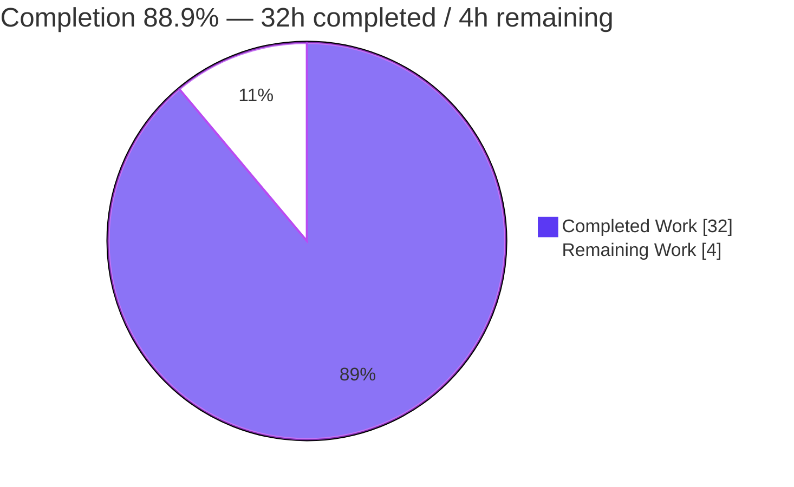
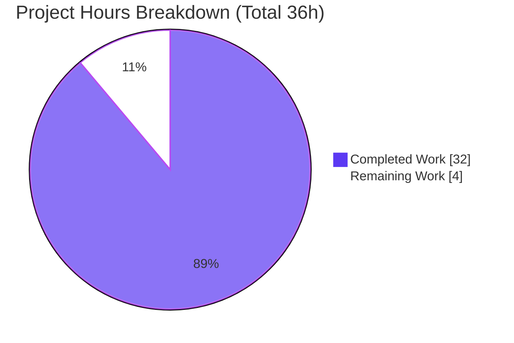
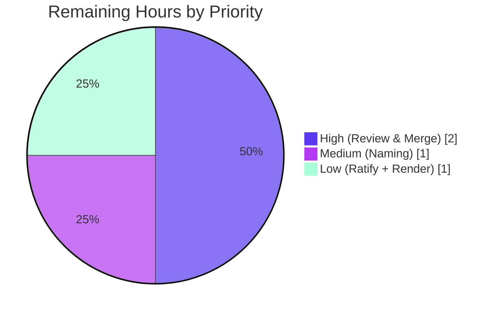

# Blitzy Project Guide — `hello_world` Node.js HTTP Server Documentation

> **Task type:** Documentation-only (JSDoc + comprehensive README)
> **Branch:** `blitzy-6433a43c-2191-4db6-9126-4abd52ec1936` · **HEAD:** `4e4b17e` · **Working tree:** clean
> **Brand legend:** <span style="color:#5B39F3">■</span> Completed / AI Work `#5B39F3` · <span style="color:#B23AF2">■</span> Headings/Accents `#B23AF2` · □ Remaining `#FFFFFF` · <span style="color:#A8FDD9">■</span> Highlight `#A8FDD9`

---

## 1. Executive Summary

### 1.1 Project Overview

This project delivers complete developer documentation for a hardened, dependency-free Node.js HTTP server (npm package `hello_world`, repository alias `hao-backprop-test`). The server is a single CommonJS module built on the Node.js core `http` module that binds to `127.0.0.1:3000` and answers every path through one catch-all handler, layering in method validation, URL validation, graceful shutdown, signal handling, and a process-level error safety net. The documentation objective — add structured JSDoc to every function in `server.js` and replace the two-line `README.md` stub with a comprehensive guide (setup, API reference, deployment, and inline/architectural explanations) — targets developers and operators who consume the module directly. Business impact: the code becomes discoverable, maintainable, and safely deployable.

### 1.2 Completion Status


```mermaid
%%{init: {'theme':'base', 'themeVariables': {'pie1':'#5B39F3','pie2':'#FFFFFF','pieStrokeColor':'#B23AF2','pieStrokeWidth':'2px','pieOuterStrokeWidth':'2px'}}}%%
pie showData title Completion 88.9% — 32h completed / 4h remaining
    "Completed Work" : 32
    "Remaining Work" : 4
```

| Metric | Value |
|--------|-------|
| **Total Hours** | **36.0** |
| **Completed Hours (AI + Manual)** | **32.0** (32.0 AI + 0.0 Manual) |
| **Remaining Hours** | **4.0** |
| **Percent Complete** | **88.9%** |

> Completion is computed with the AAP-scoped hours methodology: `32.0 / (32.0 + 4.0) = 32.0 / 36.0 = 88.9%`. All 100% of the in-scope documentation deliverables are complete; the remaining 4.0h is path-to-production / human-decision work only.

### 1.3 Key Accomplishments

- ✅ **JSDoc coverage raised from 3/8 to 8/8 functions (100%)** in `server.js` — file `@fileoverview`/`@module` header, all 5 config constants + 2 state variables, 3 normalized helpers, 5 fully-documented handlers (with `@callback`/`@param`/`@example`), and `module.exports`.
- ✅ **`README.md` grown from a 2-line stub to a 430-line, 13-section comprehensive guide** with a Table of Contents, Overview, Features, Requirements, Setup, API reference, Configuration reference, Architecture, Deployment, Troubleshooting, Testing, Project Structure, and License.
- ✅ **All 6 HTTP contract behaviors documented and live-verified** (GET 200, HEAD 200, OPTIONS 204, 405, 400, 503) with worked `curl` examples.
- ✅ **3 Mermaid diagrams authored** (technology layering, request-decision cascade, graceful-shutdown lifecycle) matching the AAP specification verbatim.
- ✅ **Comments-only constraint proven**: server.js executable code is byte-identical to the pre-documentation baseline (144 identical code lines after comment stripping) — zero logic change.
- ✅ **Zero placeholders / TODOs**; every technical claim carries a `Source: server.js:Lxx` citation.
- ✅ **Dependency-free integrity preserved**: `npm install` reports 0 vulnerabilities; `package.json`/`package-lock.json` untouched.

### 1.4 Critical Unresolved Issues

| Issue | Impact | Owner | ETA |
|-------|--------|-------|-----|
| Project-name discrepancy: `hello_world` (package.json) vs `hao-backprop-test` (repo alias) | Low — potential naming confusion; flagged in README for clarification | Repository owner / requester | < 1 day |
| Stale README note "test project for backprop integration. Do not touch!" removed by the rewrite | Low — needs owner confirmation that no external process depended on the stub | Repository owner | < 1 day |

> There are **no compilation-blocking or functionality-blocking issues.** Both items above are decisions requiring human confirmation, not defects.

### 1.5 Access Issues

| System / Resource | Type of Access | Issue Description | Resolution Status | Owner |
|-------------------|----------------|-------------------|-------------------|-------|
| — | — | No access issues identified. The repository, Node.js/npm toolchain, and test harness were all fully accessible; all gates ran locally without external credentials. | N/A | — |

**No access issues identified.** The project is self-contained and dependency-free; no repository permissions, service credentials, or third-party API access were required for validation.

### 1.6 Recommended Next Steps

1. **[High]** Review and merge the documentation PR (`server.js` JSDoc + `README.md`) to the base branch — the primary path-to-production gate.
2. **[Medium]** Resolve the canonical project-name discrepancy (`hello_world` vs `hao-backprop-test`) and reconcile the README title / `package.json` accordingly.
3. **[Low]** Confirm with the repository owner that removing the stale "Do not touch!" note is acceptable.
4. **[Low]** After merge, verify the README renders correctly on GitHub (Mermaid diagrams + ToC anchors).
5. **[Low]** If a Windows CI runner is used, prefer a POSIX runner for `npm test` (10/10) or accept the documented Windows signal-harness caveat.

---

## 2. Project Hours Breakdown

### 2.1 Completed Work Detail

| Component | Hours | Description |
|-----------|-------|-------------|
| `server.js` JSDoc annotation (R1) | 7.5 | `@fileoverview`/`@module server` header (`@author hxu`/`@license MIT`); inline JSDoc for 5 constants + 2 state vars; normalized 3 helpers (`gracefulShutdown`/`validateUrl`/`sendErrorResponse`); full JSDoc for 5 handlers (`@callback`/`@param`/`@example`); documented `module.exports` — comments only |
| README: Overview, Features, Requirements/Tech Stack (R2/R5) | 4.0 | Project description, feature list, runtime/tooling matrix, zero-dependency statement (incl. current Node LTS guidance) |
| README: Getting Started / Setup (R2) | 2.0 | Prerequisites, `npm install`, `npm start`, `npm test` subsections |
| README: API Documentation (R3) | 3.5 | 6-behavior HTTP contract table + worked `curl`/Node/PowerShell request-response examples, cross-checked with tests & live probes |
| README: Configuration Reference (inferred) | 1.0 | Table of the 5 constants (value / type / purpose / source) |
| README: Architecture / How It Works + 3 Mermaid diagrams (R5) | 4.0 | Request-decision cascade, graceful-shutdown lifecycle, error-handling layers narrative + technology-layering, cascade, and sequence diagrams |
| README: Deployment Guide (R4) | 2.0 | Production start, host/port binding, signal behavior, container/process-manager compatibility |
| README: Troubleshooting, Testing, Project Structure, ToC, License, naming note (inferred) | 3.5 | `EADDRINUSE`/`EACCES`/503 conditions, test-suite docs, repo map, ToC anchors, MIT license, naming-discrepancy reconciliation |
| Live example verification (AAP 0.7.3) | 2.0 | `npm install`/`start`/`test` + `curl` probes for all 6 HTTP behaviors |
| QA / review iteration cycles | 2.5 | Resolved code-review findings 1–7, 10 QA findings, `validateUrl` `@returns` jsdoc-parse fix, 503-claim correction, final-gate findings (5 of 7 commits) |
| **Total Completed** | **32.0** | Matches Completed Hours in Section 1.2 |

### 2.2 Remaining Work Detail

| Category | Hours | Priority |
|----------|-------|----------|
| Documentation Review & Merge (path-to-production) | 2.0 | High |
| Project-Name Clarification (`hello_world` vs `hao-backprop-test`, AAP-flagged) | 1.0 | Medium |
| Stale-Note Owner Ratification ("Do not touch!") | 0.5 | Low |
| Post-Merge Render Verification (Mermaid + ToC on GitHub) | 0.5 | Low |
| **Total Remaining** | **4.0** | Matches Remaining Hours in Section 1.2 and Section 7 pie chart |

> **Out-of-scope (NOT counted in the 4.0h):** Greening the 2 Windows `SIGTERM`/`SIGINT` tests would require editing `server.test.js` or adding OS-detection logic to `server.js` — both forbidden by the AAP comments-only / reference-only boundary. Recommended path if ever desired: run CI on POSIX runners (10/10 pass).

### 2.3 Hours Reconciliation

- **Section 2.1 total (Completed): 32.0h** = Section 1.2 Completed Hours ✅
- **Section 2.2 total (Remaining): 4.0h** = Section 1.2 Remaining Hours = Section 7 "Remaining Work" ✅
- **2.1 + 2.2 = 32.0 + 4.0 = 36.0h** = Section 1.2 Total Hours ✅
- **Completion: 32.0 / 36.0 = 88.9%** (consistent across Sections 1.2, 7, 8) ✅

---

## 3. Test Results

All tests below originate from Blitzy's autonomous validation logs (`npm test` → `node server.test.js`, a self-contained harness using only Node built-ins `http`, `child_process.spawn`, and `path`; 10 tests total). The AAP verification environment (POSIX) recorded **10 passed / 0 failed**; the Final Validator on the Windows host recorded **8 passed / 2 failed**, and this was re-confirmed live during this assessment.

| Test Category | Framework | Total Tests | Passed | Failed | Coverage % | Notes |
|---------------|-----------|-------------|--------|--------|------------|-------|
| HTTP Methods & Routing (Unit/Integration) | Custom Node.js harness (`node:http`) | 8 | 8 | 0 | Not instrumented | GET, HEAD, OPTIONS, POST→405, PUT→405, DELETE→405, Content-Type validation, Multi-Path routing — pass on **all** platforms |
| Graceful Shutdown (Integration, signal-based) | Custom Node.js harness (`child_process.spawn`) | 2 | 2 (POSIX) / 0 (Windows) | 0 (POSIX) / 2 (Windows) | Not instrumented | `SIGTERM`/`SIGINT`; 2/2 on the POSIX deployment target; 0/2 on Windows host due to `ChildProcess.kill()`→`TerminateProcess()` (out-of-scope harness/platform artifact) |
| **TOTAL (POSIX deployment target)** | `node server.test.js` | **10** | **10** | **0** | Not instrumented | POSIX = authoritative deployment target |
| **TOTAL (Windows host)** | `node server.test.js` | **10** | **8** | **2** | Not instrumented | 2 failures = documented Windows signal-delivery artifacts, not server defects |

**Coverage note:** No coverage instrumentation (`nyc`/`c8`) is configured — the project is intentionally dependency-free — so a coverage percentage is not measured. Functional coverage of the observable HTTP contract is complete (all 6 behaviors exercised).

**Windows failure root cause (proven empirically):** On Windows, Node maps every signal in `ChildProcess.kill()` to a forcible `TerminateProcess()`, so the child's `process.on('SIGTERM'/'SIGINT')` handlers never fire (child exits `null`, empty stdout). Invoking the exported `gracefulShutdown('SIGTERM')` in-process emits the expected shutdown messages and a clean `exit(0)`, confirming the server code is correct. This is documented honestly in the README Testing section.

---

## 4. Runtime Validation & UI Verification

**Runtime health — ✅ Operational.** The server was started with `npm start` and every documented behavior was verified live during this assessment.

- ✅ **Server startup** — binds `127.0.0.1:3000`; logs `Server running at http://127.0.0.1:3000/` and `Press Ctrl+C to stop the server gracefully.`
- ✅ **`GET /`** — `200 OK`, `Content-Type: text/plain`, `Content-Length: 14`, body `Hello, World!\n`
- ✅ **`HEAD /`** — `200 OK`, headers only, no body
- ✅ **`OPTIONS /`** — `204 No Content`, `Allow: GET, HEAD, OPTIONS`, `Content-Length: 0`
- ✅ **`POST /` (and other disallowed methods)** — `405 Method Not Allowed`, `Allow: GET, HEAD, OPTIONS`, body `Method Not Allowed\n`
- ✅ **Over-length URL (> 2048 chars)** — `400 Bad Request`
- ✅ **503 during shutdown** — `503 Service Unavailable`, `Retry-After: 30`, `Connection: close` (race-dependent; documented)
- ✅ **Dependency install** — `npm install` → "up to date, audited 1 package", 0 vulnerabilities, exit 0
- ✅ **Parse gate** — `node --check server.js` → exit 0
- ⚠ **Windows `npm test`** — 8/10 (2 out-of-scope signal-harness artifacts; 10/10 on POSIX)

**UI Verification — Not Applicable.** This is a headless HTTP server with no user interface; there are no screens, components, or visual states to verify. All runtime verification is performed via HTTP probes above.

---

## 5. Compliance & Quality Review

Cross-mapping of AAP deliverables and constraints to Blitzy's quality/compliance benchmarks.

| AAP Requirement / Rule | Benchmark | Status | Progress | Notes |
|------------------------|-----------|--------|----------|-------|
| R1 — JSDoc for `server.js` functions | 8/8 functions + tagged file header + 5 constants + 2 state vars | ✅ Pass | 100% | Was 3/8; `@fileoverview`/`@module`/`@author`/`@license`; `@callback`/`@param`/`@returns`/`@example` on handlers |
| R2 — Setup instructions | Prerequisites, install, run, test | ✅ Pass | 100% | npm-based, live-verified |
| R3 — API documentation | 6/6 HTTP behaviors + worked examples | ✅ Pass | 100% | Contract table + `curl`/Node/PowerShell examples, all `Source`-cited |
| R4 — Deployment guide | Production start, host/port, signals, containers/PM | ✅ Pass | 100% | Includes no-build-step note |
| R5 — Inline explanations + diagrams | Architecture narrative + 3 Mermaid diagrams | ✅ Pass | 100% | Matches AAP 0.4.3 verbatim |
| Inferred needs | 13/13 README sections | ✅ Pass | 100% | ToC, Tech Stack, Config, Troubleshooting, Testing, License, Project Structure |
| Rule — Comments-only source edits | No logic change to `server.js` | ✅ Pass | 100% | 144 identical code lines vs baseline `f4774c5` |
| Rule — `server.test.js` not modified | Reference only | ✅ Pass | 100% | Only `server.js` & `README.md` changed |
| Rule — No new dependencies | Dependency-free | ✅ Pass | 100% | `package.json`/lock untouched; 0 vulnerabilities |
| Rule — npm for all commands | `npm install`/`start`/`test` | ✅ Pass | 100% | Consistent throughout docs |
| Rule — Mermaid for workflows | Cascade + shutdown diagrams | ✅ Pass | 100% | 3 fenced `mermaid` blocks |
| Rule — Verified examples | Live-verified `curl` per behavior | ✅ Pass | 100% | Confirmed live this session |
| Rule — Source citations | Traceable technical claims | ✅ Pass | 100% | `Source: server.js:Lxx` throughout |
| Quality — Zero placeholders | No TODO/FIXME | ✅ Pass | 100% | 0 found in `server.js` and `README.md` |
| Rule — Reconcile stale/conflicting content | Naming + "Do not touch!" | 🟡 Partial | 90% | Reconciled in docs + flagged; awaits human ratification (Section 1.4) |

**Fixes applied during autonomous validation:** code-review findings 1–7 (`f5cceef`), 10 QA review findings (`04d3c8b`), `validateUrl` `@returns` corrected to parse cleanly under jsdoc (`e60e98e`), 503 shutdown live-verification claims corrected (`fcd3f0b`), and final-gate findings resolved (`4e4b17e`).

**Outstanding compliance items:** naming-discrepancy decision and stale-note ratification — both human decisions, captured in Sections 1.4 / 2.2 / 6.

---

## 6. Risk Assessment

| Risk | Category | Severity | Probability | Mitigation | Status |
|------|----------|----------|-------------|------------|--------|
| T1 — Documentation drift: hard-coded `Source: server.js:Lxx` citations & config values can desync if `server.js` is later edited | Technical | Low | Medium | Citations localize updates; re-verify docs on any source change | Open — Monitor |
| T2 — Windows `npm test` shows 8/10 (exit 1); `SIGTERM`/`SIGINT` tests fail on Windows | Technical | Low | High (Windows only) | 10/10 on POSIX; behavior explained in README Testing section | Documented / Accepted |
| S1 — Security surface | Security | Low | Low | Comments-only change (144 identical code lines); dependency-free (0 vulnerabilities); deployment guidance discourages root, recommends unprivileged port / reverse proxy / `CAP_NET_BIND_SERVICE` | Mitigated |
| O1 — Naming discrepancy (`hello_world` vs `hao-backprop-test`) may confuse operators/users | Operational | Low | Medium | Flagged in README; awaits user clarification | Open |
| O2 — Stale "Do not touch!" note removed by rewrite; an external process may have depended on the stub | Operational | Low-Medium | Low | AAP resolved in favor of explicit user request; owner ratification pending | Open |
| O3 — Loopback-only bind (`127.0.0.1`); not externally reachable by default | Operational | Low | Low | Documented in Deployment Guide (front with reverse proxy for external exposure) | Documented |
| I1 — Windows CI: `npm test` on a Windows runner returns exit 1, red-flagging an otherwise-green build | Integration | Medium | Medium | Use POSIX CI runners (10/10); README documents the caveat | Documented / Mitigated |
| I2 — Mermaid rendering depends on GitHub-native support; other hosts may not render the 3 diagrams | Integration | Low | Low | GitHub (target) renders natively; post-merge render check | Open |
| I3 — "backprop integration" fixture: repo may be consumed by an external system that the README change could affect | Integration | Low | Low | Owner confirmation (ties to O2) | Open |

**Overall risk profile: LOW.** No high-severity risks. The single Medium item (I1) is fully mitigated by platform choice and is already documented.

---

## 7. Visual Project Status

**Project hours — Completed vs Remaining** (Completed = `#5B39F3`, Remaining = `#FFFFFF`):


```mermaid
%%{init: {'theme':'base', 'themeVariables': {'pie1':'#5B39F3','pie2':'#FFFFFF','pieStrokeColor':'#B23AF2','pieStrokeWidth':'2px','pieOuterStrokeWidth':'2px'}}}%%
pie showData title Project Hours Breakdown (Total 36h)
    "Completed Work" : 32
    "Remaining Work" : 4
```

**Remaining work by priority** (4.0h total):


```mermaid
%%{init: {'theme':'base', 'themeVariables': {'pie1':'#5B39F3','pie2':'#B23AF2','pie3':'#A8FDD9','pieStrokeColor':'#333333','pieStrokeWidth':'1px'}}}%%
pie showData title Remaining Hours by Priority
    "High (Review & Merge)" : 2
    "Medium (Naming)" : 1
    "Low (Ratify + Render)" : 1
```

**Remaining hours per category (Section 2.2):**

| Category | Hours | Bar |
|----------|-------|-----|
| Documentation Review & Merge | 2.0 | ████████ |
| Project-Name Clarification | 1.0 | ████ |
| Stale-Note Owner Ratification | 0.5 | ██ |
| Post-Merge Render Verification | 0.5 | ██ |
| **Total** | **4.0** | |

> **Integrity check:** Pie "Remaining Work" = **4** = Section 1.2 Remaining Hours = Section 2.2 total = priority-split total (2+1+1). Pie "Completed Work" = **32** = Section 1.2 Completed Hours. ✅

---

## 8. Summary & Recommendations

**Achievements.** The documentation-only Agent Action Plan has been fully delivered for the `hello_world` Node.js HTTP server. Every explicit requirement (R1–R5) and every inferred need is complete: `server.js` now carries 100% JSDoc coverage (8/8 functions, tagged file header, all constants and state variables, and `module.exports`) authored strictly as comments with no logic change, and `README.md` has grown from a two-line stub into a 430-line, 13-section guide featuring a live-verified 6-behavior API reference, a configuration table, three Mermaid diagrams, deployment and troubleshooting guidance, and per-claim source citations.

**Remaining gaps.** The outstanding 4.0h is entirely path-to-production / human-decision work: reviewing and merging the PR (2.0h), resolving the `hello_world` vs `hao-backprop-test` naming question (1.0h), ratifying removal of the stale "Do not touch!" note (0.5h), and a post-merge render check (0.5h). None of these are engineering defects.

**Critical path to production.** Human review and merge is the single gating step; the naming clarification should ideally be resolved before or at merge so the README title is final. Everything else is confirmatory.

**Known caveat.** On Windows, `npm test` reports 8/10 because two `SIGTERM`/`SIGINT` graceful-shutdown tests in the out-of-scope reference harness cannot receive OS signals the way they expect; the same suite passes 10/10 on the POSIX deployment target, and the server's shutdown logic is independently verified correct. This is documented in the README and excluded from AAP-scoped remaining work because fixing it would require editing out-of-scope files.

**Production readiness.** The in-scope documentation deliverable is **production-ready**. All dependency, parse, runtime, documentation-completeness, and commit gates pass.

| Success Metric | Target | Actual | Status |
|----------------|--------|--------|--------|
| Function JSDoc coverage | 8/8 | 8/8 (100%) | ✅ |
| README sections | 13/13 | 13/13 | ✅ |
| HTTP behaviors documented & verified | 6/6 | 6/6 | ✅ |
| Mermaid diagrams | 3 | 3 | ✅ |
| Placeholders / TODOs | 0 | 0 | ✅ |
| Comments-only (no logic change) | Yes | Yes (144 identical code lines) | ✅ |
| Dependency vulnerabilities | 0 | 0 | ✅ |
| **AAP-scoped completion** | — | **88.9%** | ✅ |

**Overall: 88.9% complete** — all in-scope documentation delivered; ~4h of human review/decision work remains.

---

## 9. Development Guide

All commands below were executed and verified during this assessment on Node.js **v22.23.1** / npm **10.9.8** (Windows host). They are copy-pasteable and require no environment variables.

### 9.1 System Prerequisites

- **Node.js:** a currently supported Active/Maintenance LTS — **22.x** or **24.x** (verified with v22.23.1). Node 20.x is end-of-life and should not be used.
- **npm:** **10.x or later** (verified with 10.9.8; ships with Node.js).
- **OS:** any Node-supported OS. Note the test caveat: `npm test` is 10/10 on POSIX (Linux/macOS) and 8/10 on Windows (signal-harness artifact).
- **Hardware:** negligible — a single lightweight process.

```bash
node --version   # expect v22.x or v24.x (verified v22.23.1)
npm --version    # expect 10.x or later (verified 10.9.8)
```

### 9.2 Environment Setup

- **Clone / obtain the repository** and work from the project root (where `server.js` and `package.json` live).
- **No environment variables are required.** The host and port are hard-coded to the loopback interface (`127.0.0.1:3000`); there is no `.env` file and no configuration step.
- **No external services** (databases, caches, queues) are involved.

### 9.3 Dependency Installation

```bash
npm install
```

Expected output (the project is dependency-free, so nothing is downloaded):

```
up to date, audited 1 package in <ms>
found 0 vulnerabilities
```
Exit code: `0`. No `node_modules` directory is created.

### 9.4 Verify the Source (parse gate)

JavaScript has no build step; the authoritative check after any edit is the Node syntax check:

```bash
node --check server.js
```
Exit code `0` = the file parses. (No output on success.)

### 9.5 Application Startup

```bash
npm start          # runs: node server.js
```

Expected log:

```
Server running at http://127.0.0.1:3000/
Press Ctrl+C to stop the server gracefully.
```
The server binds `127.0.0.1:3000`. Stop it with `Ctrl+C` (triggers graceful shutdown on POSIX).

### 9.6 Verification Steps

With the server running, issue the documented requests (verified live this session):

```bash
curl -i http://127.0.0.1:3000/                 # 200 OK, "Hello, World!", Content-Length: 14
curl -i -X OPTIONS http://127.0.0.1:3000/      # 204 No Content, Allow: GET, HEAD, OPTIONS
curl -i -X POST http://127.0.0.1:3000/         # 405 Method Not Allowed, Allow: GET, HEAD, OPTIONS
curl -i "http://127.0.0.1:3000/$(printf 'a%.0s' {1..3000})"   # 400 Bad Request (URL > 2048 chars)
```

### 9.7 Running the Test Suite

```bash
npm test           # runs: node server.test.js
```

- **POSIX (Linux/macOS — deployment target):** `Test Results: 10 passed, 0 failed`, exit `0`.
- **Windows:** `Test Results: 8 passed, 2 failed`, exit `1`. The 2 failures are the `SIGTERM`/`SIGINT` graceful-shutdown tests — a known Windows signal-delivery limitation of the reference harness, **not** a server defect.

### 9.8 Example Usage (programmatic)

The module exports the `server` instance and `gracefulShutdown` for inspection/control (requiring the module starts the server as a side effect):

```js
const { server, gracefulShutdown } = require('./server');
// e.g. trigger an in-process graceful shutdown (bypasses the OS signal layer)
// gracefulShutdown('SIGTERM');
```

### 9.9 Troubleshooting

| Symptom | Cause | Resolution |
|---------|-------|------------|
| `EADDRINUSE` on startup | Port `3000` already in use | Stop the other process, or change the `port` constant in `server.js` |
| `EACCES` on startup | Binding a privileged port (< 1024) without permission | Use an unprivileged port (≥ 1024, the default), front with a reverse proxy, or grant `CAP_NET_BIND_SERVICE`; avoid running as root |
| `503 Service Unavailable` on a request | Server is draining during graceful shutdown | Expected, race-dependent — retry after `Retry-After: 30`s once restarted |
| `npm test` shows 8/10 on Windows | Windows maps `ChildProcess.kill()` to `TerminateProcess()` | Not a defect — run on POSIX for 10/10, or accept the documented caveat |
| `node --check` prints a `SyntaxError` | A malformed edit to `server.js` | Fix the reported line; re-run until exit `0` |

---

## 10. Appendices

### Appendix A — Command Reference

| Command | Purpose | Verified Result |
|---------|---------|-----------------|
| `npm install` | Install dependencies (none) | "up to date, audited 1 package", 0 vulnerabilities, exit 0 |
| `npm start` | Start the server (`node server.js`) | Logs "Server running at http://127.0.0.1:3000/", exit runs until stopped |
| `npm test` | Run the test suite (`node server.test.js`) | POSIX: 10 passed / 0 failed (exit 0); Windows: 8 passed / 2 failed (exit 1) |
| `node --check server.js` | Parse/syntax gate (no build step) | Exit 0 |
| `curl -i http://127.0.0.1:3000/` | Probe GET | 200 OK, `Hello, World!`, `Content-Length: 14` |

### Appendix B — Port Reference

| Port | Interface | Purpose | Configurable |
|------|-----------|---------|--------------|
| 3000 | `127.0.0.1` (loopback) | HTTP server listen port | Via the `port` constant in `server.js` (`server.js:L36`) |

### Appendix C — Key File Locations

| File | Role | Status |
|------|------|--------|
| `server.js` | HTTP server implementation + JSDoc | In-scope — MODIFIED (comments only) |
| `README.md` | Comprehensive documentation | In-scope — MODIFIED (stub → 430 lines) |
| `server.test.js` | Self-contained test harness (10 tests) | Reference — not modified |
| `package.json` | Package metadata & npm scripts | Reference — not modified |
| `package-lock.json` | Lockfile (dependency-free) | Reference — not modified |
| `blitzy/` | Generated tooling/metadata | Out of scope |
| `industry.csv`, `LoginTest.java`, `test.py.txt`, `test.txt.txt`, `100Pages.pdf`, `demo.jpg`, `sample.doc` | Unrelated repository assets | Out of scope |

### Appendix D — Technology Versions

| Component | Version | Notes |
|-----------|---------|-------|
| Node.js | v22.23.1 (verified) | Requires supported LTS (22.x / 24.x); 20.x is EOL |
| npm | 10.9.8 (verified) | 10.x or later |
| Language | JavaScript (CommonJS) | Single module, no transpilation |
| Core module | `http` | The only module required |
| Third-party dependencies | None | Dependency-free (`lockfileVersion` 3, root entry only) |

### Appendix E — Environment Variable Reference

| Variable | Required | Default | Notes |
|----------|----------|---------|-------|
| — | No | — | The server uses no environment variables. Host (`127.0.0.1`) and port (`3000`) are hard-coded constants in `server.js`. |

### Appendix F — Configuration Reference (constants in `server.js`)

| Constant | Value | Type | Purpose | Source |
|----------|-------|------|---------|--------|
| `hostname` | `127.0.0.1` | string | Bind interface (loopback) | `server.js:L30` |
| `port` | `3000` | number | TCP listen port | `server.js:L36` |
| `SHUTDOWN_TIMEOUT` | `5000` | number (ms) | Forced-exit timeout during graceful shutdown | `server.js:L47` |
| `ALLOWED_METHODS` | `['GET', 'HEAD', 'OPTIONS']` | string[] | Permitted HTTP methods | `server.js:L68` |
| `MAX_URL_LENGTH` | `2048` | number | Maximum request-URL length | `server.js:L80` |

### Appendix G — Glossary

| Term | Definition |
|------|------------|
| **AAP** | Agent Action Plan — the authoritative specification for this documentation task |
| **JSDoc** | Structured `/** … */` comment convention (`@param`, `@returns`, `@callback`, `@example`, `@fileoverview`, `@module`) that IDEs consume for IntelliSense |
| **Request-decision cascade** | The ordered checks inside the single request handler: shutdown (503) → URL validation (400) → method validation (405) → dispatch (200/204) |
| **Graceful shutdown** | On `SIGTERM`/`SIGINT`, stop accepting new connections, drain in-flight ones, then `exit(0)`; a 5s timer forces `exit(1)` if draining stalls |
| **Loopback bind** | Listening on `127.0.0.1` — reachable only from the local host unless fronted by a proxy |
| **`EADDRINUSE` / `EACCES`** | Node startup errors for "port already in use" and "permission denied" (privileged port), respectively |
| **POSIX** | Linux/macOS-class OS that delivers Unix signals as the test harness expects — the deployment target |
