# Technical Specification

# 1. Introduction

## 1.1 Executive Summary

The system documented in this Technical Specification is a **minimal, dependency-free HTTP server implemented in Node.js**. The repository `README.md` identifies the project as `hao-backprop-test` and describes it as a *"test project for backprop integration,"* accompanied by the maintainer directive *"Do not touch!"*. The npm manifest (`package.json`), however, names the package `hello_world`, version `1.0.0`, with the description *"Hello world in Node.js,"* authored by `hxu` under the MIT license. This naming discrepancy between the README (`hao-backprop-test`) and the package manifest (`hello_world`) is noted here and reflects the project's dual identity as both an integration test fixture and a canonical "Hello World" service.

The entire executable surface consists of two files: a single service module, `server.js`, and a self-executing test harness, `server.test.js`. The package declares **no runtime or development dependencies**; `package-lock.json` (lockfile version 3) records only the root package with zero resolved external packages, confirming the implementation relies exclusively on the Node.js built-in `http` module. At runtime, `server.js` binds to `127.0.0.1:3000` and returns the plain-text greeting `Hello, World!\n` for any GET request path.

**Core Business Problem.** Although the externally observable behavior is trivial, the substance of the project is **operational robustness**. The header comment in `server.js` and the project's own git history (commit message *"fix: Add robust HTTP server with comprehensive error handling, graceful shutdown, and input validation"*) show that a bare "Hello World" server was deliberately hardened. The core problem the current code addresses is that a naive HTTP server lacks the safeguards needed to run and terminate reliably: it has no server/request/response/process-level error handling, no controlled shutdown, and no request validation. The implemented server closes these gaps by enforcing an allow-list of HTTP methods (GET, HEAD, OPTIONS), validating request URLs (length and null-byte checks), centralizing error responses, and performing a timed graceful shutdown on operating-system signals — while preserving the original greeting, host, and port.

**Key Stakeholders and Users.** The following groups are evidenced directly in the repository:

| Stakeholder / User Group | Role and Interest | Evidence in Repository |
| --- | --- | --- |
| Project author / maintainer (`hxu`) | Owns the package; the README `"Do not touch!"` directive signals restricted modification | `package.json` (`author`), `README.md` |
| Developers / integrators | Use the project as a reference implementation and integration/test fixture ("backprop integration") | `README.md`, `server.js` |
| Quality / test automation | Execute the bundled 10-case regression suite to verify behavior | `server.test.js`, `package.json` (`test` script) |
| Operators / process managers (Docker, Kubernetes, PM2) | Start and stop the service, relying on graceful shutdown via `SIGTERM`/`SIGINT` | `server.js` signal handlers and comments |
| HTTP clients | Issue GET/HEAD/OPTIONS requests to `127.0.0.1:3000` | `server.js` request handler |

**Expected Business Impact and Value Proposition.** The value of the system lies in delivering a small, easily auditable, and operationally resilient reference service rather than in feature breadth. The concrete, evidence-backed benefits are:

- **Zero supply-chain and installation overhead** — the service and its tests run on Node.js built-ins alone, with no third-party packages to install or audit (`package-lock.json`).
- **Operational resilience** — explicit handling of `EADDRINUSE`/`EACCES` startup errors, request/response stream errors, and `uncaughtException`/`unhandledRejection`, plus a five-second timed graceful shutdown, make the process safe to run under container orchestrators and process managers (`server.js`).
- **Verified correctness** — a self-contained regression suite (`server.test.js`) asserts the full HTTP contract; executing `node server.test.js` produces `Test Results: 10 passed, 0 failed`, confirming behavior empirically.
- **Predictable, minimal footprint** — a single-process, single-endpoint service bound to loopback, suitable as a controlled fixture for integration and automation testing.

Productionization activities beyond the code itself (environment configuration, deployment pipeline, monitoring) remain future work and are treated as out of scope for the current implementation; these boundaries are detailed in sections 1.2.3 and 1.3.2.

## 1.2 System Overview

This overview positions the project within its (deliberately narrow) context, describes the system at a high level, and states the measurable criteria by which its current implementation can be judged. All statements are grounded in the repository's source, manifests, runtime behavior, and its own committed change documentation.

### 1.2.1 Project Context

**Business context and market positioning.** The project is not a commercial or market-facing product; it is a **reference / test fixture**. The `README.md` explicitly frames it as a *"test project for backprop integration"* and instructs *"Do not touch!"*, while `package.json` presents it as a canonical *"Hello world in Node.js"* package (`hello_world`). Its positioning is therefore internal: a minimal, self-contained HTTP service that can be used as a known-good target for integration and automation testing rather than as a feature-competitive application.

**Current system limitations (prior implementation being upgraded).** The current code is a hardening of a simpler predecessor. According to the repository's own change documentation (`blitzy/documentation/Technical Specifications.md`), the immediately prior implementation was an approximately 14-line `http.createServer` that returned `Hello, World!\n` but lacked operational safeguards; the same document enumerates the gaps as root causes, and the current `server.js` remediates each of them:

| Limitation in the Prior Minimal Server | Remediation in Current `server.js` |
| --- | --- |
| No server-level error handling | `server.on('error')` diagnoses `EADDRINUSE`/`EACCES`, logs, and exits non-zero |
| No request/response stream error handling | `req.on('error')` returns 400 (if headers unsent); `res.on('error')` is logged |
| No graceful shutdown or resource cleanup | `gracefulShutdown()` calls `server.close()` with a 5-second forced-exit timer |
| No HTTP method validation | `ALLOWED_METHODS` allow-list; disallowed methods get 405 with an `Allow` header |
| No URL validation | `validateUrl()` rejects URLs > 2048 chars or containing null bytes → 400 |
| No process-level safety net | `uncaughtException` and `unhandledRejection` handlers attempt graceful shutdown |

**Integration with the existing enterprise landscape.** Integration surface is intentionally small. The service binds to the loopback interface `127.0.0.1:3000`, so it is not directly network-exposed by default. The `SIGTERM` handler comment in `server.js` documents intended compatibility with process managers — *"Sent by process managers (Docker, Kubernetes, PM2) for graceful termination"* — and the `blitzy/documentation/Project Guide.md` additionally notes reverse-proxy and orchestrator compatibility as integration considerations. Within the repository itself, the only concrete integration is that `server.test.js` launches `server.js` as a spawned child process to exercise it.

### 1.2.2 High-Level Description

**Primary system capabilities.** The service (`server.js`) implements a deliberately narrow HTTP contract:

- Serves a fixed plain-text greeting `Hello, World!\n` (`Content-Type: text/plain`) for GET requests on any path.
- Honors an allow-list of methods — GET (200 with body), HEAD (200, headers only), OPTIONS (204 with an `Allow` header) — and rejects all others with 405.
- Validates request URLs, returning 400 for URLs exceeding 2048 characters or containing null bytes.
- Returns 503 (`Connection: close`, `Retry-After: 30`) to requests that arrive while the process is shutting down.
- Performs a timed, idempotent graceful shutdown on `SIGTERM`/`SIGINT` and installs process-level handlers for uncaught errors.

**Major system components.** The repository contains one executable service, one test harness, supporting manifests/documentation, and several unused static/placeholder assets:

| Component | Type | Responsibility |
| --- | --- | --- |
| `server.js` | Node.js service module | HTTP server: request handling, URL/method validation, error handling, lifecycle |
| `server.test.js` | Self-executing test harness | Spawns the server and asserts the HTTP contract across 10 test cases |
| `package.json` | npm manifest | Metadata, `main` entry point, `start`/`test` scripts, MIT license |
| `package-lock.json` | npm lockfile | Reproducible-install surface; records zero external dependencies |
| `README.md` | Documentation | States the project identity and purpose |
| `blitzy/documentation/` | Generated documentation | Prior technical specification and project-status/guide artifacts |
| `industry.csv`, `LoginTest.java`, `test.py.txt`, `test.txt.txt`, `100Pages.pdf`, `demo.jpg`, `sample.doc` | Static / placeholder assets | Present in the tree but not referenced by the service or tests |

**Core technical approach.** The system is a single-process, dependency-free CommonJS application built entirely on Node.js built-ins (the `http` module for the server; `child_process` and `path` used only by the test harness). Configuration is expressed as module-level constants (`hostname`, `port`, `SHUTDOWN_TIMEOUT`, `MAX_URL_LENGTH`, `ALLOWED_METHODS`), request handling is a synchronous decision cascade inside a single `http.createServer` callback, and the process lifecycle is signal-driven. The runtime request flow and lifecycle interactions are summarized below:

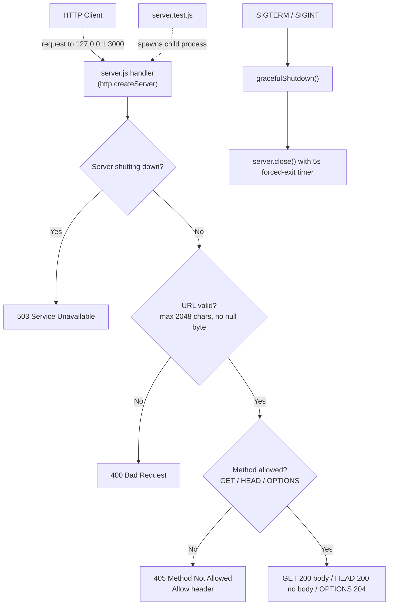
```mermaid
flowchart TD
    Client["HTTP Client"] -->|"request to 127.0.0.1:3000"| Handler["server.js handler<br/>(http.createServer)"]
    Handler --> ShutCheck{"Server shutting down?"}
    ShutCheck -->|Yes| R503["503 Service Unavailable"]
    ShutCheck -->|No| UrlCheck{"URL valid?<br/>max 2048 chars, no null byte"}
    UrlCheck -->|No| R400["400 Bad Request"]
    UrlCheck -->|Yes| MethodCheck{"Method allowed?<br/>GET / HEAD / OPTIONS"}
    MethodCheck -->|No| R405["405 Method Not Allowed<br/>Allow header"]
    MethodCheck -->|Yes| Dispatch["GET 200 body / HEAD 200 no body / OPTIONS 204"]
    Signals["SIGTERM / SIGINT"] --> Graceful["gracefulShutdown()"]
    Graceful --> CloseSrv["server.close() with 5s forced-exit timer"]
    Tests["server.test.js"] -.->|"spawns child process"| Handler
```

### 1.2.3 Success Criteria

Because the repository defines no business-level SLAs (latency, throughput, or uptime targets) in code or configuration, the success criteria below are limited to the measurable, evidence-backed indicators actually present in the repository.

**Measurable objectives.**

- All bundled automated tests pass: executing `node server.test.js` yields `Test Results: 10 passed, 0 failed`.
- The service remains dependency-free (no third-party packages introduced), as recorded by `package-lock.json`.
- The original response contract is preserved: `GET /` returns HTTP 200 with body `Hello, World!\n` on host `127.0.0.1`, port `3000`.

**Critical success factors.** Preserving the original greeting/host/port behavior while layering in robustness; keeping the implementation dependency-free and auditable; ensuring the server starts, responds, and shuts down cleanly under process-manager signals; and maintaining a self-contained test harness that requires no external test framework.

**Key performance indicators (KPIs) observed in the repository.**

| Indicator | Observed / Target Value | Source |
| --- | --- | --- |
| Automated test pass rate | 10 of 10 passing (100%) | `server.test.js` runtime output |
| External runtime dependencies | 0 | `package.json`, `package-lock.json` |
| Reported dependency-audit vulnerabilities | 0 | `blitzy/documentation/Project Guide.md` |
| Preserved response contract | `GET /` → 200, `Hello, World!\n` | `server.js`, Test 1 in `server.test.js` |
| Documented implementation completion | 66.7% (10 of 15 hours) | `blitzy/documentation/Project Guide.md` |

The documented completion figure and its remaining tasks (production configuration, deployment pipeline, monitoring) indicate that these KPIs measure implementation completeness and correctness, not runtime service-level performance; runtime performance targets are not defined in this repository.

## 1.3 Scope

This section delimits what the current implementation delivers and what it deliberately excludes. In-scope items are verified against `server.js`, `server.test.js`, and the package manifests; out-of-scope items are corroborated both by their absence in the code and by the explicit scope boundaries recorded in `blitzy/documentation/Technical Specifications.md`.

### 1.3.1 In-Scope

**Core features and functionalities (must-have capabilities).** The following capabilities are implemented in `server.js` and asserted by `server.test.js`:

| Capability | In-Scope Behavior | Evidence |
| --- | --- | --- |
| GET handling | HTTP 200, `Content-Type: text/plain`, body `Hello, World!\n` for any path | `server.js`, `server.test.js` |
| HEAD handling | HTTP 200 with the greeting's `Content-Length`, no body | `server.js`, `server.test.js` |
| OPTIONS handling | HTTP 204 with `Allow` header and `Content-Length: 0` | `server.js`, `server.test.js` |
| Method enforcement | HTTP 405 with `Allow` header for non-allowed methods | `server.js`, `server.test.js` |
| URL validation | HTTP 400 for URLs > 2048 characters or containing null bytes | `server.js` |
| Shutdown behavior | HTTP 503 while shutting down; idempotent graceful close on `SIGTERM`/`SIGINT` | `server.js`, `server.test.js` |
| Error handling | Server, request, response, and process-level error handlers | `server.js` |

**Primary user workflows.** (1) Start the service via `npm start` or `node server.js`; (2) issue HTTP requests and receive the greeting or the appropriate status code; (3) stop the service via `SIGTERM`/`SIGINT` (Ctrl+C) and observe graceful shutdown; (4) run the regression suite via `npm test` or `node server.test.js`.

**Essential integrations.** The Node.js runtime and its built-in `http` module (the service); `child_process` and `path` (the test harness spawning the server); and operating-system signal delivery (`SIGTERM`/`SIGINT`) for lifecycle control.

**Key technical requirements.** A Node.js runtime (the `Project Guide.md` states Node.js 20.x+ / npm 10.x+; behavior was verified here on Node v22); a dependency-free CommonJS codebase; loopback binding to `127.0.0.1:3000`; and constants-based configuration (`SHUTDOWN_TIMEOUT`, `MAX_URL_LENGTH`, `ALLOWED_METHODS`).

**Implementation boundaries.**

| Boundary Dimension | Scope in This Implementation |
| --- | --- |
| System boundary | A single Node.js process exposing one TCP listener on loopback `127.0.0.1:3000` |
| Endpoint surface | One static greeting served for all request paths; no path-based routing or persistence |
| User groups covered | Developers/integrators, test automation, local operators, and loopback HTTP clients |
| Geographic / market coverage | None — loopback-only on a single host; no deployment target or region configured |
| Data domains included | None — a static greeting string only; no user data or database; `industry.csv` is present but unused by the service |

### 1.3.2 Out-of-Scope

**Explicitly excluded features and capabilities.** The following are neither implemented in the code nor intended, consistent with the prohibited/excluded list in `blitzy/documentation/Technical Specifications.md` (Section 0.5):

| Excluded Feature / Capability | Basis | Evidence |
| --- | --- | --- |
| HTTPS / TLS | Plain `http` only; no TLS termination | `server.js`, `package-lock.json` |
| Databases / persistence | Static response; no storage layer | `server.js`; prior spec §0.5 |
| External / third-party dependencies | Node built-ins only | `package-lock.json`; prior spec §0.5 |
| Logging framework | Uses `console` only | `server.js`; prior spec §0.5 |
| Load balancing / clustering | Single process, single listener | `server.js`; prior spec §0.5 |
| Rate limiting | Not implemented | prior spec §0.5 |
| Authentication / authorization | No auth; all loopback clients treated equally | `server.js` |
| Request-body processing (POST/PUT/DELETE) | Rejected with HTTP 405 | `server.js`, `server.test.js` |
| Dynamic / path-specific content | Fixed greeting returned for every path | `server.js`, `server.test.js` |

**Future phase considerations.** The `blitzy/documentation/Project Guide.md` lists four remaining tasks that lie beyond the current code implementation: human code review, production environment configuration, deployment pipeline setup, and monitoring/logging enhancement.

**Integration points not covered.** No reverse-proxy or orchestrator manifests are committed (compatibility with Docker/Kubernetes/PM2 is by design only, not configured); no CI/CD automation exists (no `.github/` workflows, no `Dockerfile`); and no external service, API, or backend integrations are present.

**Unsupported use cases.** Public or non-loopback network exposure; HTTP methods other than GET/HEAD/OPTIONS; processing of request payloads; serving dynamic or per-path content; TLS termination; and multi-instance/clustered operation are all unsupported by the current implementation.

**Non-functional repository artifacts.** Several files exist in the tree but are outside the service's functional scope and are not consumed at runtime: `LoginTest.java` (a non-functional Java stub), `industry.csv` (static industry labels), the empty `test.py.txt` and `test.txt.txt` placeholders, and the binary assets `100Pages.pdf`, `demo.jpg`, and `sample.doc`.

## 1.4 References

The following repository files, folders, and verification activities were inspected as evidence for this Introduction. No external web sources were used.

**Files**

- `README.md` — Established the project identity (`hao-backprop-test`), its stated purpose ("test project for backprop integration"), and the "Do not touch!" maintainer directive.
- `package.json` — Established package name (`hello_world`), version `1.0.0`, description, `main` entry point, `start`/`test` scripts, author (`hxu`), MIT license, and the absence of declared dependencies.
- `package-lock.json` — Confirmed lockfile version 3 with only the root package and zero resolved external dependencies (dependency-free).
- `server.js` — Primary evidence for the HTTP service: loopback bind `127.0.0.1:3000`, configuration constants, GET/HEAD/OPTIONS handling, method allow-listing (405), URL validation (400), shutdown-aware 503, graceful shutdown, and server/request/response/process error handling.
- `server.test.js` — Established the self-executing 10-case regression harness, the asserted HTTP contract (including multi-path routing and SIGTERM/SIGINT shutdown), and test configuration.
- `industry.csv` — Established a static single-column list of industry labels that is not consumed by the service.
- `LoginTest.java` — Established a non-functional Java placeholder unrelated to the Node.js service.
- `test.py.txt`, `test.txt.txt` — Confirmed empty (0-byte) placeholder files.
- `100Pages.pdf`, `demo.jpg`, `sample.doc` — Confirmed binary asset files present in the tree but unreferenced by the code.

**Folders**

- `blitzy/documentation/` — Contained the project's committed generated documentation artifacts used as supporting context.
- `blitzy/documentation/Project Guide.md` — Provided documented completion status (66.7%, 10 of 15 hours), zero reported audit vulnerabilities, prerequisites (Node.js 20.x+ / npm 10.x+), configuration values, and the four remaining future tasks.
- `blitzy/documentation/Technical Specifications.md` — Provided the prior "Agent Action Plan," the description of the ~14-line predecessor server, and the explicit scope boundaries and prohibited items (Section 0.5).

**Repository root**

- `` (repository root) — Established the overall top-level structure: nine root files plus the `blitzy/` folder, confirming the executable surface is limited to `server.js` and `server.test.js`.

**Runtime and repository-state verification**

- Executed `node server.test.js` on Node.js v22.23.1 — produced `Test Results: 10 passed, 0 failed`, empirically confirming the documented HTTP contract and shutdown behavior.
- Terminal inspection (`ls -la`, `git log`) — Confirmed the branch (`QA-13-july-branch`), the hardening commit history, and the absence of `.blitzyignore`, CI workflows, `Dockerfile`, and other deployment configuration.

# 2. Product Requirements

## 2.1 Feature Catalog

This catalog decomposes the system into discrete, independently testable features. The functional surface of this repository is intentionally narrow: it consists of a single Node.js HTTP service (`server.js`) and its self-executing regression harness (`server.test.js`). All features below are derived exclusively from those two files; the remaining repository artifacts (`README.md`, `package.json`, `package-lock.json`, `industry.csv`, `LoginTest.java`, and the empty `test.py.txt`/`test.txt.txt` placeholders) are metadata, static, or non-functional assets and therefore define no product features. This boundary is consistent with the in-scope/out-of-scope determinations recorded in Section 1.3.

**Versioning and status baseline.** All features are documented against package version `1.0.0` as declared in `package.json`. Every feature is marked **Completed** because the repository's own committed status artifact (`blitzy/documentation/Project Guide.md`) records "All code implementation is complete and verified with 10/10 tests passing," and the bundled suite was re-executed during this analysis, producing `Test Results: 10 passed, 0 failed`. The runtime request pipeline that these features participate in is illustrated by the flowchart in Section 1.2.2.

**Feature catalog overview.**

| Feature ID | Feature Name | Category | Priority |
| --- | --- | --- | --- |
| F-001 | Static Greeting Response Service | Core HTTP Service | Critical |
| F-002 | HTTP Method Governance | HTTP Protocol Compliance | High |
| F-003 | Request URL Validation | Input Validation & Security | Medium |
| F-004 | Graceful Shutdown & Signal Handling | Process Lifecycle Management | High |
| F-005 | Multi-Layer Error Handling | Reliability & Error Handling | High |
| F-006 | Automated Regression Test Harness | Quality Assurance | Medium |

**Assumptions and constraints.** The catalog assumes a Node.js runtime with the built-in `http` module and OS-level signal delivery; no third-party packages are required or present (`package-lock.json` records zero external dependencies). The service is constrained to loopback binding (`127.0.0.1:3000`) and to the configuration constants declared in `server.js`. No business-level SLAs, throughput, or latency targets are defined anywhere in the repository, so no such values are asserted as feature requirements.

### 2.1.1 F-001: Static Greeting Response Service

| Metadata | Value |
| --- | --- |
| Unique ID | F-001 |
| Feature Name | Static Greeting Response Service |
| Feature Category | Core HTTP Service |
| Priority Level | Critical |
| Status | Completed |

**Description**

- **Overview:** For any `GET` request on any path, the service responds with HTTP `200`, a `Content-Type: text/plain` header, and the fixed plain-text body `Hello, World!\n`. This is implemented in the terminal branch of the `http.createServer` request callback in `server.js` (lines 185–187).
- **Business Value:** This is the preserved original response contract that defines the service's identity as the canonical "Hello World" package (`package.json` names the package `hello_world`). Per Section 1.1, all robustness hardening was layered around this behavior without altering the original greeting, host, or port, making it the baseline correctness anchor of the project.
- **User Benefits:** HTTP clients receive a deterministic, path-independent response, and developers/integrators obtain a known-good target for "backprop integration" and automation testing.
- **Technical Context:** The greeting branch is reached only after the request passes the shutdown check, URL validation, and method allow-list in the same synchronous decision cascade. The service is dependency-free and built on the Node.js built-in `http` module, binding to `127.0.0.1:3000`.

**Dependencies**

| Dependency Type | Detail |
| --- | --- |
| Prerequisite Features | Executes within the shared request pipeline after F-004 (shutdown gate), F-003 (URL validation), and F-002 (method allow-list) |
| System Dependencies | Node.js runtime; built-in `http` module; a TCP loopback listener on `127.0.0.1:3000` |
| External Dependencies | None (no third-party packages) |
| Integration Requirements | An HTTP/1.1 client; exercised in-repository by `server.test.js`, which spawns the server as a child process |

### 2.1.2 F-002: HTTP Method Governance

| Metadata | Value |
| --- | --- |
| Unique ID | F-002 |
| Feature Name | HTTP Method Governance |
| Feature Category | HTTP Protocol Compliance |
| Priority Level | High |
| Status | Completed |

**Description**

- **Overview:** The service enforces an allow-list of HTTP methods — `GET`, `HEAD`, and `OPTIONS` (`ALLOWED_METHODS` constant, `server.js` line 27). `HEAD` returns `200` with the greeting's `Content-Length` and no body; `OPTIONS` returns `204 No Content` with an `Allow` header and `Content-Length: 0`; any other method (e.g., POST/PUT/DELETE) is rejected with `405 Method Not Allowed`, an `Allow` header, and a `Method Not Allowed` body (`server.js` lines 159–182).
- **Business Value:** Restricting the service to safe, idempotent methods enforces HTTP protocol correctness and reduces the attack/behavior surface, while the `OPTIONS` handler supports CORS preflight and method discovery.
- **User Benefits:** Clients can discover the supported methods through the `Allow` header, and unsupported operations receive a clear, standards-compliant rejection rather than undefined behavior.
- **Technical Context:** Method dispatch is a sequence of conditional branches inside the single request callback; `405` responses are produced via the shared `sendErrorResponse` helper (`server.js` lines 110–120).

**Dependencies**

| Dependency Type | Detail |
| --- | --- |
| Prerequisite Features | Executes after the F-004 shutdown gate and F-003 URL validation within the same request pipeline |
| System Dependencies | Node.js built-in `http` module (`req.method`, response header APIs) |
| External Dependencies | None |
| Integration Requirements | HTTP clients (including CORS preflight callers); asserted by `server.test.js` Tests 2–6 |

### 2.1.3 F-003: Request URL Validation

| Metadata | Value |
| --- | --- |
| Unique ID | F-003 |
| Feature Name | Request URL Validation |
| Feature Category | Input Validation & Security |
| Priority Level | Medium |
| Status | Completed |

**Description**

- **Overview:** Each request URL is validated by `validateUrl()` (`server.js` lines 82–100). A URL exceeding `MAX_URL_LENGTH` (2048 characters) or containing a null byte (`\0`) is rejected with `400 Bad Request`; the failure message identifies the specific validation error (`server.js` lines 151–156).
- **Business Value:** This is input hardening that mitigates the long-URL and null-byte injection risks explicitly enumerated in `blitzy/documentation/Project Guide.md` (Security Risks table).
- **User Benefits:** The service is protected from malformed or malicious URLs, and clients receive an explicit `400` diagnosing the problem.
- **Technical Context:** Validation runs after the shutdown check and before method dispatch. The internal guards are written as `url && …`, so a falsy/empty URL is treated as valid and passes through to method handling.

**Dependencies**

| Dependency Type | Detail |
| --- | --- |
| Prerequisite Features | Executes after the F-004 shutdown gate and before F-002 method dispatch in the request pipeline |
| System Dependencies | Node.js built-in `http` module (`req.url`) |
| External Dependencies | None |
| Integration Requirements | None specific; behavior is code-verified (no dedicated automated test case exists) |

### 2.1.4 F-004: Graceful Shutdown & Signal Handling

| Metadata | Value |
| --- | --- |
| Unique ID | F-004 |
| Feature Name | Graceful Shutdown & Signal Handling |
| Feature Category | Process Lifecycle Management |
| Priority Level | High |
| Status | Completed |

**Description**

- **Overview:** On `SIGTERM` or `SIGINT`, the process runs `gracefulShutdown()` (`server.js` lines 43–74): it stops accepting new connections via `server.close()`, arms a `SHUTDOWN_TIMEOUT` (5000 ms) forced-exit timer, exits with code `0` on clean close or `1` on error, and is idempotent (a second signal while shutting down is logged and ignored). Requests that arrive while shutting down receive `503 Service Unavailable` with `Connection: close` and `Retry-After: 30` (`server.js` lines 142–148).
- **Business Value:** Controlled termination is the central "operational robustness" objective identified in Section 1.1; it makes the process safe to run under process managers such as Docker, Kubernetes, and PM2, which the `SIGTERM` handler comment explicitly targets.
- **User Benefits:** Operators can stop the service reliably; in-flight connections are given time to complete within the timeout window, and clients receive an explicit retry signal during shutdown.
- **Technical Context:** Shutdown state is tracked via the module-level `isShuttingDown` flag and `shutdownTimer` (which is `unref()`-ed so it does not keep the process alive). `SIGTERM`/`SIGINT` listeners are registered at `server.js` lines 225–231.

**Dependencies**

| Dependency Type | Detail |
| --- | --- |
| Prerequisite Features | None at request time; its `503` branch is the first gate of the request pipeline and precedes F-003/F-002/F-001 |
| System Dependencies | Node.js process signal delivery (`SIGTERM`/`SIGINT`), `server.close()`, `process.exit()`, and timer APIs |
| External Dependencies | OS-level signal delivery; optionally a process manager/orchestrator to send `SIGTERM` (not required) |
| Integration Requirements | Process managers/reverse proxies that deliver termination signals; asserted by `server.test.js` Tests 9–10 |

### 2.1.5 F-005: Multi-Layer Error Handling

| Metadata | Value |
| --- | --- |
| Unique ID | F-005 |
| Feature Name | Multi-Layer Error Handling |
| Feature Category | Reliability & Error Handling |
| Priority Level | High |
| Status | Completed |

**Description**

- **Overview:** Error handling is installed at four layers: server-level (`server.on('error')` diagnoses `EADDRINUSE` and `EACCES` and exits with code `1`, `server.js` lines 194–210); request-stream (`req.on('error')` logs and returns `400` if headers are not yet sent, lines 128–134); response-stream (`res.on('error')` logs, lines 137–139); and process-level (`uncaughtException`/`unhandledRejection` log diagnostics and attempt graceful shutdown, lines 237–259).
- **Business Value:** These handlers prevent silent crashes, provide actionable startup diagnostics, and guarantee predictable non-zero exit codes for supervising process managers — addressing five of the eight root causes listed in `blitzy/documentation/Project Guide.md`.
- **User Benefits:** Operators receive specific messages for common startup failures (port already in use, insufficient permissions), and the process fails fast and cleanly rather than hanging.
- **Technical Context:** Process-level handlers delegate to `gracefulShutdown()` when a shutdown is not already in progress, otherwise they force exit with code `1`, integrating this feature with F-004.

**Dependencies**

| Dependency Type | Detail |
| --- | --- |
| Prerequisite Features | Integrates with F-004 (process-level handlers invoke `gracefulShutdown()`) |
| System Dependencies | Node.js `http`, `process`, and EventEmitter error events |
| External Dependencies | None |
| Integration Requirements | None specific; behavior is code-verified (`node --check`, per the Project Guide); no dedicated automated test case exists |

### 2.1.6 F-006: Automated Regression Test Harness

| Metadata | Value |
| --- | --- |
| Unique ID | F-006 |
| Feature Name | Automated Regression Test Harness |
| Feature Category | Quality Assurance |
| Priority Level | Medium |
| Status | Completed |

**Description**

- **Overview:** `server.test.js` is a self-executing CommonJS test runner (invoked directly at the bottom of the file, line 465) that spawns `server.js` as a child process and asserts the full HTTP contract and shutdown behavior across 10 test cases. It prints `Test Results: <passed> passed, <failed> failed` and exits with a non-zero code if any test fails (`server.test.js` line 461).
- **Business Value:** It provides empirically verified correctness with zero external test framework, enabling regression detection for the integration fixture; the Project Guide lists the "comprehensive test suite with 10 test cases" as a key achievement.
- **User Benefits:** Developers verify the entire contract with a single command (`npm test`), and the non-zero exit-on-failure makes the suite suitable for automated/CI gating.
- **Technical Context:** The harness uses only the Node built-ins `http`, `child_process` (`spawn`), and `path`. It starts the server, runs the eight HTTP tests against it, stops it, then runs the two signal tests (each of which starts and stops its own server instance).

**Dependencies**

| Dependency Type | Detail |
| --- | --- |
| Prerequisite Features | Exercises F-001 (Tests 1, 7, 8), F-002 (Tests 2–6), and F-004 (Tests 9–10); depends on the presence of `server.js` |
| System Dependencies | Node.js runtime; `child_process.spawn`; loopback networking; `server.js` resolvable via `path` |
| External Dependencies | None (no external test framework) |
| Integration Requirements | Requires TCP port `3000` to be free; spawns `node server.js` and communicates over `127.0.0.1:3000` |

## 2.2 Functional Requirements

This sub-section enumerates the testable functional requirements for each feature. Requirement priorities use the MoSCoW scale (Must-Have / Should-Have / Could-Have), distinct from the feature-level priority in Section 2.1. For each feature, four tables are provided — Requirement Details, Acceptance Criteria, Technical Specifications, and Validation Rules — each constrained to at most four columns. Acceptance criteria that map to an automated test cite the corresponding case in `server.test.js`; criteria without a dedicated test are code-verified against `server.js` at the cited line ranges.

Two repository-wide facts apply to every table below and are not repeated in each row: (1) the repository defines **no latency, throughput, or uptime SLA**, so "Performance Criteria" report only the timing constants that are actually present in the code; and (2) the service is **stateless with no persistence or external data store**, so "Data Requirements" describe only in-process state and constants.

### 2.2.1 F-001: Static Greeting Response Service

**Requirement Details**

| Requirement ID | Description | Priority | Complexity |
| --- | --- | --- | --- |
| F-001-RQ-001 | `GET` on any path returns HTTP 200 with body `Hello, World!\n` | Must-Have | Low |
| F-001-RQ-002 | `GET` responses carry `Content-Type: text/plain` | Must-Have | Low |
| F-001-RQ-003 | The identical greeting is returned for every request path | Must-Have | Low |

**Acceptance Criteria**

| Requirement ID | Acceptance Criteria |
| --- | --- |
| F-001-RQ-001 | `GET /` yields `statusCode === 200` and `body === 'Hello, World!\n'` (`server.test.js` Test 1) |
| F-001-RQ-002 | The `content-type` response header equals exactly `text/plain` (`server.test.js` Test 7) |
| F-001-RQ-003 | `GET` to `/`, `/test`, `/api`, and `/any/path` each return 200 with body `Hello, World!\n` (`server.test.js` Test 8) |

**Technical Specifications**

| Aspect | Specification |
| --- | --- |
| Input Parameters | HTTP `GET` request; any URL path (path is not used for routing); no query or body semantics |
| Output/Response | HTTP 200; header `Content-Type: text/plain`; body `Hello, World!\n` (14 bytes) |
| Performance Criteria | Synchronous, in-memory response with no I/O; no latency/throughput target defined in the repository |
| Data Requirements | A single hard-coded greeting string; no persistence or external data |

**Validation Rules**

| Aspect | Specification |
| --- | --- |
| Business Rules | The original greeting/host/port contract must be preserved unchanged; the path does not alter the response |
| Data Validation | The GET branch is reached only after the shutdown gate (F-004) and URL validation (F-003) pass |
| Security Requirements | Loopback-only binding (`127.0.0.1:3000`); no authentication (all loopback clients treated equally) |
| Compliance Requirements | None defined in the repository |

### 2.2.2 F-002: HTTP Method Governance

**Requirement Details**

| Requirement ID | Description | Priority | Complexity |
| --- | --- | --- | --- |
| F-002-RQ-001 | `HEAD` returns HTTP 200 with the greeting's `Content-Length` and no body | Must-Have | Low |
| F-002-RQ-002 | `OPTIONS` returns HTTP 204 with an `Allow` header and `Content-Length: 0` | Must-Have | Low |
| F-002-RQ-003 | Methods outside the allow-list return HTTP 405 with an `Allow` header | Must-Have | Low |

**Acceptance Criteria**

| Requirement ID | Acceptance Criteria |
| --- | --- |
| F-002-RQ-001 | `HEAD /` yields `statusCode === 200` and an empty body (`server.test.js` Test 2); `Content-Length` set from `Buffer.byteLength('Hello, World!\n')` |
| F-002-RQ-002 | `OPTIONS /` yields `statusCode === 204` and an `Allow` header containing `GET`, `HEAD`, `OPTIONS` (`server.test.js` Test 3) |
| F-002-RQ-003 | `POST`, `PUT`, and `DELETE` each yield `statusCode === 405` and a body containing `Method Not Allowed` (`server.test.js` Tests 4, 5, 6) |

**Technical Specifications**

| Aspect | Specification |
| --- | --- |
| Input Parameters | `req.method`, compared against `ALLOWED_METHODS = ['GET','HEAD','OPTIONS']` (`server.js` line 27) |
| Output/Response | `HEAD` → 200 headers only; `OPTIONS` → 204 + `Allow`; disallowed → 405 + `Allow` + `Method Not Allowed\n` body |
| Performance Criteria | Synchronous method-branch evaluation; no target defined in the repository |
| Data Requirements | The `ALLOWED_METHODS` constant only; no persistence |

**Validation Rules**

| Aspect | Specification |
| --- | --- |
| Business Rules | Only `GET`/`HEAD`/`OPTIONS` are permitted; the `Allow` header must advertise the permitted set on 405 and OPTIONS responses |
| Data Validation | Method is evaluated after URL validation (F-003) in the request pipeline |
| Security Requirements | Method allow-listing reduces surface and mitigates unsupported-method exploitation (`Project Guide.md` Security Risks) |
| Compliance Requirements | HTTP/1.1 semantics for 405 (`Allow` header) and 204 (`No Content`); no external compliance regime defined |

### 2.2.3 F-003: Request URL Validation

**Requirement Details**

| Requirement ID | Description | Priority | Complexity |
| --- | --- | --- | --- |
| F-003-RQ-001 | Reject request URLs longer than 2048 characters with HTTP 400 | Should-Have | Low |
| F-003-RQ-002 | Reject request URLs containing a null byte with HTTP 400 | Should-Have | Low |

**Acceptance Criteria**

| Requirement ID | Acceptance Criteria |
| --- | --- |
| F-003-RQ-001 | A URL whose length exceeds `MAX_URL_LENGTH` (2048) returns 400 with a message noting the maximum-length breach (`server.js` lines 82–89, 151–156) |
| F-003-RQ-002 | A URL containing `\0` returns 400 with a message noting invalid null bytes (`server.js` lines 92–97, 151–156) |

**Technical Specifications**

| Aspect | Specification |
| --- | --- |
| Input Parameters | `req.url` string passed to `validateUrl(url)` |
| Output/Response | `{ valid: true }` allows the request to proceed; otherwise `400 Bad Request - <error>` via `sendErrorResponse` |
| Performance Criteria | Linear length/character scan of the URL; no target defined in the repository |
| Data Requirements | The `MAX_URL_LENGTH` constant (2048); no persistence |

**Validation Rules**

| Aspect | Specification |
| --- | --- |
| Business Rules | Over-length and null-byte URLs are rejected before method handling; a falsy/empty URL is treated as valid (`url && …` guards) |
| Data Validation | URL length must be `<= 2048`; URL must not contain the `\0` character |
| Security Requirements | Mitigates long-URL and null-byte injection attacks (`Project Guide.md` Security Risks) |
| Compliance Requirements | None defined in the repository |

### 2.2.4 F-004: Graceful Shutdown & Signal Handling

**Requirement Details**

| Requirement ID | Description | Priority | Complexity |
| --- | --- | --- | --- |
| F-004-RQ-001 | `SIGTERM` triggers a graceful shutdown and a clean (code 0) exit | Must-Have | Medium |
| F-004-RQ-002 | `SIGINT` triggers a graceful shutdown and a clean (code 0) exit | Must-Have | Medium |
| F-004-RQ-003 | Shutdown is idempotent; duplicate signals are ignored | Should-Have | Low |
| F-004-RQ-004 | A forced-exit timer bounds the shutdown window | Should-Have | Low |
| F-004-RQ-005 | Requests during shutdown receive HTTP 503 with retry headers | Should-Have | Low |

**Acceptance Criteria**

| Requirement ID | Acceptance Criteria |
| --- | --- |
| F-004-RQ-001 | After `SIGTERM`, stdout contains a shutdown message and the process exit code is `0` (`server.test.js` Test 9) |
| F-004-RQ-002 | After `SIGINT`, stdout contains a shutdown message and the process exit code is `0` (`server.test.js` Test 10) |
| F-004-RQ-003 | A second signal while shutting down logs "Shutdown already in progress" and does not re-run `server.close()` (`server.js` lines 45–48) |
| F-004-RQ-004 | If `server.close()` does not complete within `SHUTDOWN_TIMEOUT` (5000 ms), the process exits with code `1`; the timer is `unref()`-ed (`server.js` lines 54–60) |
| F-004-RQ-005 | A request arriving while `isShuttingDown` is true returns 503 with `Connection: close` and `Retry-After: 30` (`server.js` lines 142–148) |

**Technical Specifications**

| Aspect | Specification |
| --- | --- |
| Input Parameters | OS signals `SIGTERM`/`SIGINT`; the `server.close()` callback error; requests arriving during shutdown |
| Output/Response | Process exit code (0 clean / 1 on error or timeout); 503 for in-shutdown requests; console log lines |
| Performance Criteria | Up to `SHUTDOWN_TIMEOUT` (5000 ms) grace window before forced exit; no other target defined |
| Data Requirements | Module state `isShuttingDown` and `shutdownTimer`; no persistence |

**Validation Rules**

| Aspect | Specification |
| --- | --- |
| Business Rules | The first signal wins and marks shutdown; subsequent signals are no-ops; new requests are refused during shutdown |
| Data Validation | Guarded by the `isShuttingDown` boolean flag (no request-payload validation applies) |
| Security Requirements | `Retry-After`/`Connection: close` inform clients cleanly; no authentication involved |
| Compliance Requirements | HTTP/1.1 503 semantics; no external compliance regime defined |

### 2.2.5 F-005: Multi-Layer Error Handling

**Requirement Details**

| Requirement ID | Description | Priority | Complexity |
| --- | --- | --- | --- |
| F-005-RQ-001 | Server startup/runtime errors are diagnosed and exit with code 1 | Must-Have | Low |
| F-005-RQ-002 | Request-stream errors return HTTP 400 when headers are unsent | Should-Have | Low |
| F-005-RQ-003 | Response-stream errors are logged without crashing the process | Should-Have | Low |
| F-005-RQ-004 | Uncaught exceptions/rejections attempt graceful shutdown | Should-Have | Medium |

**Acceptance Criteria**

| Requirement ID | Acceptance Criteria |
| --- | --- |
| F-005-RQ-001 | `server.on('error')` logs a specific message for `EADDRINUSE` and `EACCES` (and a generic message otherwise) and calls `process.exit(1)` (`server.js` lines 194–210) |
| F-005-RQ-002 | `req.on('error')` logs the error and, if `!res.headersSent`, sends `400 Bad Request` (`server.js` lines 128–134) |
| F-005-RQ-003 | `res.on('error')` logs the error message and takes no other action (`server.js` lines 137–139) |
| F-005-RQ-004 | `uncaughtException`/`unhandledRejection` log diagnostics; if not already shutting down they call `gracefulShutdown()`, otherwise `process.exit(1)` (`server.js` lines 237–259) |

**Technical Specifications**

| Aspect | Specification |
| --- | --- |
| Input Parameters | Error objects from server/request/response `error` events; thrown exceptions and rejected promises |
| Output/Response | `console.error` diagnostics; conditional 400 for request-stream errors; process exit code 1 on fatal errors |
| Performance Criteria | Event-driven handlers; no target defined in the repository |
| Data Requirements | Reads `err.code`/`err.message`/`err.stack`; no persistence |

**Validation Rules**

| Aspect | Specification |
| --- | --- |
| Business Rules | Fatal errors terminate with a non-zero exit code; a 400 is only sent when response headers are not yet sent |
| Data Validation | `err.code` is matched against `EADDRINUSE` and `EACCES` |
| Security Requirements | Prevents silent crashes; diagnostics are written to `console` only (no external log sink) |
| Compliance Requirements | None defined in the repository |

### 2.2.6 F-006: Automated Regression Test Harness

**Requirement Details**

| Requirement ID | Description | Priority | Complexity |
| --- | --- | --- | --- |
| F-006-RQ-001 | Running the suite executes 10 cases and prints a pass/fail summary | Must-Have | Medium |
| F-006-RQ-002 | The harness is self-contained and spawns the server as a child process | Should-Have | Medium |
| F-006-RQ-003 | The process exit code reflects the test outcome | Should-Have | Low |

**Acceptance Criteria**

| Requirement ID | Acceptance Criteria |
| --- | --- |
| F-006-RQ-001 | `node server.test.js` (or `npm test`) prints `Test Results: 10 passed, 0 failed` when the server meets its contract (empirically confirmed on Node v22.23.1) |
| F-006-RQ-002 | The harness spawns `node server.js`, waits for the `Server running` stdout marker, and asserts over HTTP using only Node built-ins (`http`, `child_process`, `path`) — no external framework |
| F-006-RQ-003 | The runner calls `process.exit(testsFailed > 0 ? 1 : 0)`, exiting non-zero if any test fails (`server.test.js` line 461) |

**Technical Specifications**

| Aspect | Specification |
| --- | --- |
| Input Parameters | None from the user; internally issues HTTP requests via `makeRequest(method, path)` and sends signals via `stopServer` |
| Output/Response | Console `PASS`/`FAIL` lines plus a `Test Results` summary; process exit code |
| Performance Criteria | `STARTUP_DELAY` 500 ms; 5000 ms startup timeout; force-kill 10000 ms after a stop signal (`server.test.js` lines 24–25, 103–108, 142–146) |
| Data Requirements | In-memory counters `testsRun`/`testsPassed`/`testsFailed`; no persistence |

**Validation Rules**

| Aspect | Specification |
| --- | --- |
| Business Rules | A single failing test fails the entire run (non-zero exit); the expected steady-state result is 10 of 10 passing |
| Data Validation | Asserts exact status codes, response bodies, `Allow`/`Content-Type` headers, and process exit codes |
| Security Requirements | Executes only against the loopback interface (`127.0.0.1:3000`) |
| Compliance Requirements | None defined in the repository |

## 2.3 Feature Relationships

Because five of the six features (F-001 through F-005) are implemented within a single module (`server.js`) and the sixth (F-006) drives that module as a spawned child process, the relationships below are all directly observable in code rather than inferred. The runtime request flow that these relationships trace is also depicted in the flowchart in Section 1.2.2.

### 2.3.1 Feature Dependency Map

The diagram below shows the ordered request-pipeline dependencies (each gate precedes the next inside the shared request callback), the lifecycle linkage between error handling and shutdown, and the test harness that exercises the runtime features.

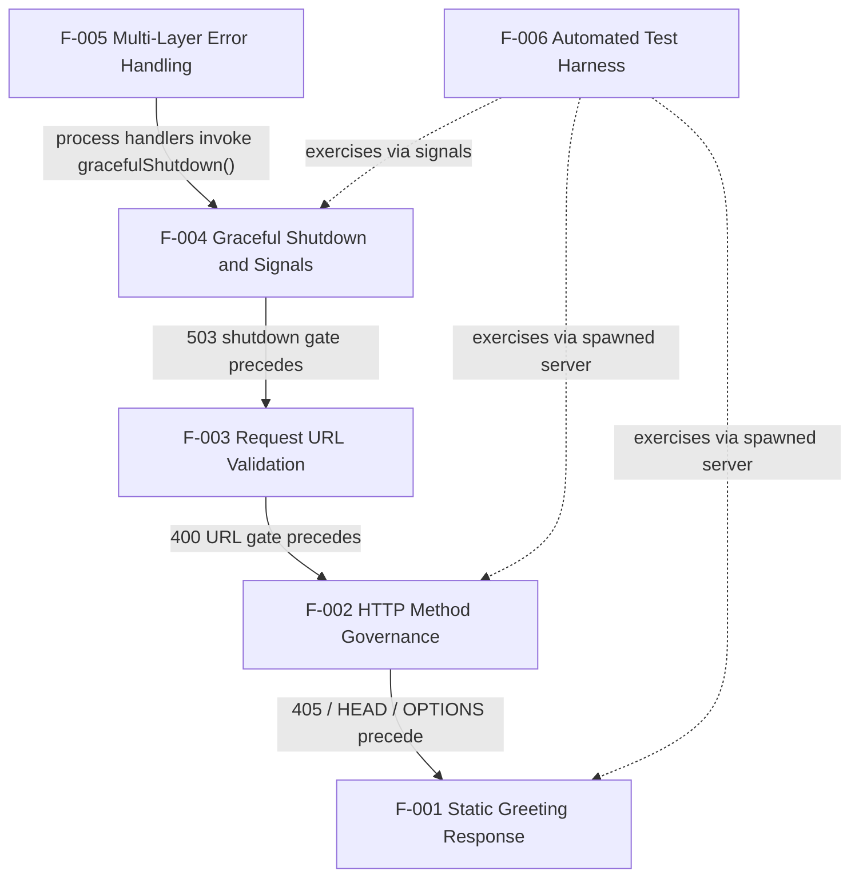
```mermaid
flowchart TD
    F004["F-004 Graceful Shutdown and Signals"]
    F003["F-003 Request URL Validation"]
    F002["F-002 HTTP Method Governance"]
    F001["F-001 Static Greeting Response"]
    F005["F-005 Multi-Layer Error Handling"]
    F006["F-006 Automated Test Harness"]

    F004 -->|"503 shutdown gate precedes"| F003
    F003 -->|"400 URL gate precedes"| F002
    F002 -->|"405 / HEAD / OPTIONS precede"| F001
    F005 -->|"process handlers invoke gracefulShutdown()"| F004
    F006 -.->|"exercises via spawned server"| F001
    F006 -.->|"exercises via spawned server"| F002
    F006 -.->|"exercises via signals"| F004
```

The solid arrows denote runtime ordering/invocation dependencies verified in `server.js`; the dashed arrows denote the verification relationship in `server.test.js`. The pipeline order is strict: the shutdown check (F-004) runs first, followed by URL validation (F-003), method governance (F-002), and finally the greeting response (F-001).

### 2.3.2 Integration Points

| Integration Point | Direction | Related Feature(s) | Evidence |
| --- | --- | --- | --- |
| OS signal delivery (`SIGTERM`/`SIGINT`) | Inbound | F-004 | `server.js` lines 225–231 |
| Process managers (Docker/Kubernetes/PM2) | Inbound (by-design, not configured) | F-004 | `server.js` signal-handler comments; `Project Guide.md` |
| Child-process spawn of `server.js` | Internal | F-006 → F-001/F-002/F-004 | `server.test.js` lines 74–110 |
| HTTP client requests over loopback | Inbound | F-001/F-002/F-003 | `server.js` line 126; `server.test.js` lines 38–68 |
| Programmatic export `{ server, gracefulShutdown }` | Outbound API | F-004 | `server.js` line 262 |

### 2.3.3 Shared Components

| Shared Component | Purpose | Shared By |
| --- | --- | --- |
| `sendErrorResponse()` (`server.js` 110–120) | Emits plain-text error responses with optional headers | F-002 (405), F-003 (400), F-004 (503), F-005 (400) |
| `http.createServer` request callback (126–188) | Hosts the single ordered request decision cascade | F-004 (503 gate), F-003, F-002, F-001 |
| `gracefulShutdown()` (43–74) | Idempotent shutdown routine with forced-exit timer | F-004 (signal handlers), F-005 (process handlers) |
| Module state `isShuttingDown` / `shutdownTimer` (33–34) | Tracks the shutdown lifecycle | F-004, F-005 |
| Configuration constants (20–30) | `hostname`, `port`, `ALLOWED_METHODS`, `MAX_URL_LENGTH`, `SHUTDOWN_TIMEOUT` | F-001, F-002, F-003, F-004 |

### 2.3.4 Common Services

| Common Service | Provided By | Consumed By |
| --- | --- | --- |
| HTTP transport | Node.js built-in `http` module | F-001, F-002, F-003 (server side); F-006 (client side) |
| Diagnostic logging | `console` (`log`/`error`) | All features |
| Process lifecycle (signals, `exit`, timers) | Node.js `process` and timer APIs | F-004, F-005 |
| Child-process management | Node.js `child_process` (`spawn`) | F-006 |

The dependency map, integration points, shared components, and common services above are confined to relationships evidenced in `server.js` and `server.test.js`; no additional inter-feature relationships are implied.

## 2.4 Implementation Considerations

This sub-section records the technical constraints, performance requirements, scalability considerations, security implications, and maintenance requirements for each feature, grounded in the source code and the repository's committed status documentation. Where the repository defines no measurable target (for example, latency or throughput), that absence is stated explicitly rather than assumed.

**Cross-cutting constraints (apply to all features).** These constraints originate from the system's single-module, dependency-free design and the scope boundaries in Section 1.3.2:

| Constraint | Detail |
| --- | --- |
| Runtime & dependencies | Single Node.js process on the built-in `http` module; zero external packages (`package-lock.json`); prerequisites Node.js 20.x+/npm 10.x+ per `Project Guide.md` (not enforced — `package.json` has no `engines` field) |
| Configuration | All settings are hard-coded module constants in `server.js`; environment-variable configuration (`PORT`, `HOST`, `SHUTDOWN_TIMEOUT`) is listed as remaining production work in `Project Guide.md`, i.e., not yet implemented |
| Concurrency & scaling | One event loop and one TCP listener bound to loopback `127.0.0.1:3000`; no clustering, load balancing, or multi-instance coordination (out of scope per Section 1.3.2) |
| Network exposure & SLAs | Loopback-only, plain HTTP (no TLS, no authentication); no latency/throughput/uptime SLA defined anywhere in the repository |

### 2.4.1 F-001: Static Greeting Response Service

| Consideration | Detail |
| --- | --- |
| Technical Constraints | The greeting `Hello, World!\n` is a hard-coded literal; the `HEAD` `Content-Length` is derived from the same literal, so the two occurrences (`server.js` lines 179 and 187) must remain in sync |
| Performance Requirements | Constant-time, synchronous, in-memory response with no I/O; no numeric target defined |
| Scalability Considerations | Bounded by the single process/event loop; loopback-only; no horizontal scaling |
| Security Implications | No authentication; static content presents no injection surface; loopback binding limits exposure |
| Maintenance Requirements | The greeting literal is asserted verbatim by `server.test.js` Tests 1 and 8; any change requires coordinated updates to the GET body, the HEAD `Content-Length`, and those tests |

### 2.4.2 F-002: HTTP Method Governance

| Consideration | Detail |
| --- | --- |
| Technical Constraints | The permitted set is fixed by the `ALLOWED_METHODS` array; adding a method requires both an allow-list edit and a new handler branch |
| Performance Requirements | An `Array.includes` check over a three-element list plus constant-time branching; negligible cost; no target defined |
| Scalability Considerations | Same single-process constraints as the service overall |
| Security Implications | Allow-listing reduces the behavior/attack surface by rejecting state-changing verbs (POST/PUT/DELETE) with 405, mitigating unsupported-method exploitation (`Project Guide.md`) |
| Maintenance Requirements | `ALLOWED_METHODS` is the single source of truth reused for validation, the OPTIONS `Allow` header, and the 405 `Allow` header; Tests 2–6 must be updated if the set changes |

### 2.4.3 F-003: Request URL Validation

| Consideration | Detail |
| --- | --- |
| Technical Constraints | Validation is limited to a length ceiling (`MAX_URL_LENGTH` = 2048) and a null-byte check; no full URL parsing/sanitization is performed, and a falsy/empty URL bypasses both checks |
| Performance Requirements | Linear length/character scan of the URL; no numeric target defined |
| Scalability Considerations | Stateless check; inherits the single-process constraints |
| Security Implications | Mitigates long-URL and null-byte injection risks (`Project Guide.md` Security Risks); other URL-encoding attack classes are not addressed and are out of scope |
| Maintenance Requirements | No dedicated automated test exists, so regressions are code-verified only; the `MAX_URL_LENGTH` constant is tunable in one place |

### 2.4.4 F-004: Graceful Shutdown & Signal Handling

| Consideration | Detail |
| --- | --- |
| Technical Constraints | `SHUTDOWN_TIMEOUT` (5000 ms) is hard-coded; shutdown relies on `server.close()` draining in-flight connections and is made idempotent by the `isShuttingDown` flag |
| Performance Requirements | Up to a 5-second grace window before forced exit; `Project Guide.md` flags this as potentially too short for long-running requests, mitigated by the tunable constant |
| Scalability Considerations | Per-process; an orchestrator must deliver `SIGTERM` to each instance individually |
| Security Implications | In-shutdown requests receive 503 with `Connection: close` and `Retry-After: 30`; no authentication is involved |
| Maintenance Requirements | The timeout is tunable via the constant; Tests 9–10 verify signal handling; environment-variable configuration remains future work |

### 2.4.5 F-005: Multi-Layer Error Handling

| Consideration | Detail |
| --- | --- |
| Technical Constraints | Diagnostics use `console` only (no structured-logging framework, which is out of scope); fatal errors call `process.exit(1)`; process-level handlers are a last-resort safety net |
| Performance Requirements | Event-driven handlers with negligible overhead; no numeric target defined |
| Scalability Considerations | Per-process; a supervisor/orchestrator is expected to restart the process after a non-zero exit |
| Security Implications | Prevents silent crashes; error `message`/`stack` are written to `console` (potential internal detail in logs), with no external log sink |
| Maintenance Requirements | No dedicated automated test (code-verified via `node --check`); structured logging and monitoring are listed future enhancements in `Project Guide.md` |

### 2.4.6 F-006: Automated Regression Test Harness

| Consideration | Detail |
| --- | --- |
| Technical Constraints | Requires TCP port 3000 to be free, spawns a real `server.js` process, and is timing-dependent (`STARTUP_DELAY` and fixed sleeps), which can be sensitive under heavy load; uses no external test framework |
| Performance Requirements | Sequential execution with fixed startup/shutdown delays; total runtime is dominated by those waits rather than by any throughput target |
| Scalability Considerations | Single-host and not parallelized (port contention would occur if run concurrently) |
| Security Implications | Executes only against the loopback interface (`127.0.0.1:3000`) |
| Maintenance Requirements | Assertions hard-code the expected status codes, bodies, and headers that mirror `server.js` and must be kept in sync; adding cases requires updating the runner sequence and the documented "10" count |

## 2.5 Traceability Matrix

This matrix links every functional requirement to its verification method and source evidence, and cross-references the related Introduction sub-sections. Verification is either an automated test case in `server.test.js` or, where no dedicated test exists, direct code inspection of `server.js` at the cited lines.

### 2.5.1 Requirement-to-Verification Traceability

| Requirement ID | Verification | Evidence (file · lines) | Cross-Reference |
| --- | --- | --- | --- |
| F-001-RQ-001 | Test 1 | `server.test.js` 187–197 · `server.js` 185–187 | §1.2.2, §1.3.1 |
| F-001-RQ-002 | Test 7 | `server.test.js` 296–307 · `server.js` 186 | §1.3.1 |
| F-001-RQ-003 | Test 8 | `server.test.js` 314–334 · `server.js` 185–187 | §1.3.1 |
| F-002-RQ-001 | Test 2 | `server.test.js` 205–215 · `server.js` 176–182 | §1.3.1 |
| F-002-RQ-002 | Test 3 | `server.test.js` 223–235 · `server.js` 167–173 | §1.3.1 |
| F-002-RQ-003 | Tests 4, 5, 6 | `server.test.js` 243–289 · `server.js` 159–164 | §1.3.1 |
| F-003-RQ-001 | Code-verified | `server.js` 84–89, 151–156 | §1.3.1 |
| F-003-RQ-002 | Code-verified | `server.js` 92–97, 151–156 | §1.3.1 |
| F-004-RQ-001 | Test 9 | `server.test.js` 343–367 · `server.js` 225–227, 43–74 | §1.3.1 |
| F-004-RQ-002 | Test 10 | `server.test.js` 376–400 · `server.js` 229–231, 43–74 | §1.3.1 |
| F-004-RQ-003 | Code-verified | `server.js` 45–48 | §1.2.1 |
| F-004-RQ-004 | Code-verified | `server.js` 54–60 | §1.2.1 |
| F-004-RQ-005 | Code-verified | `server.js` 142–148 | §1.3.1 |
| F-005-RQ-001 | Code-verified | `server.js` 194–210 | §1.2.1 |
| F-005-RQ-002 | Code-verified | `server.js` 128–134 | §1.2.1 |
| F-005-RQ-003 | Code-verified | `server.js` 137–139 | §1.2.1 |
| F-005-RQ-004 | Code-verified | `server.js` 237–259 | §1.2.1 |
| F-006-RQ-001 | Suite execution | `server.test.js` 407–462 · empirical run | §1.2.3 |
| F-006-RQ-002 | Code-verified | `server.test.js` 74–110 | §1.2.2 |
| F-006-RQ-003 | Code-verified | `server.test.js` 461 | §1.2.3 |

### 2.5.2 Automated Test Coverage

Each of the 10 automated test cases maps to a functional requirement as follows:

| Test Case (`server.test.js`) | Requirement(s) Verified |
| --- | --- |
| Test 1 — GET Request Success | F-001-RQ-001 |
| Test 2 — HEAD Request Handling | F-002-RQ-001 |
| Test 3 — OPTIONS Request | F-002-RQ-002 |
| Test 4 — POST Rejection (405) | F-002-RQ-003 |
| Test 5 — PUT Rejection (405) | F-002-RQ-003 |
| Test 6 — DELETE Rejection (405) | F-002-RQ-003 |
| Test 7 — Content-Type Header Validation | F-001-RQ-002 |
| Test 8 — Multi-Path Routing | F-001-RQ-003 |
| Test 9 — SIGTERM Graceful Shutdown | F-004-RQ-001 |
| Test 10 — SIGINT Graceful Shutdown | F-004-RQ-002 |

**Coverage summary.** Of the 20 functional requirements, 8 are covered directly by the 10 automated tests (features F-001, F-002, and the two signal requirements of F-004), all of which pass (`Test Results: 10 passed, 0 failed`, confirmed on Node v22.23.1). The remaining requirements — the URL-validation requirements of F-003, the error-handling requirements of F-005, and the idempotency/timeout/503 requirements of F-004 — have no dedicated automated test and are verified by code inspection at the cited lines (corroborated by the root-cause and risk tables in `blitzy/documentation/Project Guide.md`). F-006's own requirements are verified by executing the suite. This coverage gap for F-003 and F-005 is the most actionable maintenance follow-up for requirement verification.

## 2.6 References

The following repository files, folders, cross-referenced specification sections, and verification activities were used as evidence for this Product Requirements section. No external web sources were used.

**Files**

- `server.js` — Primary implementation evidence for features F-001 through F-005: configuration constants, `validateUrl()`/`sendErrorResponse()`/`gracefulShutdown()`, the ordered request decision cascade (503/400/405/OPTIONS/HEAD/GET), and the server/request/response/process error handlers.
- `server.test.js` — The self-executing 10-case regression harness (F-006) and the source of the testable acceptance criteria for Tests 1–10.
- `package.json` — Established package identity/version (`hello_world` 1.0.0), the `start`/`test` scripts, the MIT license, and the absence of an `engines` field or declared dependencies.
- `package-lock.json` — Confirmed a dependency-free build surface (lockfile version 3, zero resolved external packages).
- `README.md` — Established the project identity (`hao-backprop-test`) and its stated purpose as a "test project for backprop integration."
- `industry.csv` — Confirmed a static, single-column list of industry labels that is not referenced by any code and therefore defines no feature.
- `LoginTest.java` — Confirmed a non-compiling Java placeholder unrelated to the service (excluded from the feature catalog).
- `test.py.txt`, `test.txt.txt` — Confirmed empty (0-byte) placeholder files (excluded from the feature catalog).

**Folders**

- `blitzy/documentation/` — Contained the committed project documentation used as supporting context.
- `blitzy/documentation/Project Guide.md` — Provided the completion status (66.7%), validator gates and per-test results, the Security/Operational/Integration risk tables, the eight root causes addressed, the prerequisites (Node.js 20.x+/npm 10.x+), the configuration constants, and the four remaining future tasks.
- `` (repository root) — Established the overall top-level structure, confirming that the functional surface is limited to `server.js` and `server.test.js`.

**Cross-referenced specification sections**

- Section 1.1 (Executive Summary) — Project identity, the operational-robustness core problem, and stakeholder groups.
- Section 1.2 (System Overview) — Project context/limitations (§1.2.1), the high-level component list and runtime request-flow flowchart (§1.2.2), and the success criteria/KPIs (§1.2.3).
- Section 1.3 (Scope) — In-scope capabilities (§1.3.1) and out-of-scope exclusions (§1.3.2) that bound the feature catalog.

**Runtime and repository-state verification**

- Executed `node server.test.js` on Node.js v22.23.1 — produced `Test Results: 10 passed, 0 failed`, empirically confirming the acceptance criteria for the test-backed requirements and the Completed status.
- Terminal inspection (`grep`, `git log`) — Confirmed that `industry.csv` and the `.txt` placeholders are unreferenced by the code, and that `server.js` was hardened from a minimal predecessor across the recorded commit history.

# 3. Technology Stack

## 3.1 Programming Languages

The system's functional surface is implemented in a single programming language: **JavaScript**, executed by the **Node.js** runtime. This is confirmed by the two source files that constitute the executable product — `server.js` (the HTTP service) and `server.test.js` (the regression harness) — and by `package.json`, which declares `"main": "server.js"` and runs both files with the `node` interpreter (`"start": "node server.js"`, `"test": "node server.test.js"`). No other language participates in the running system; several non-JavaScript files exist in the tree but are non-functional placeholders, documented in 3.1.2.

| Language | Runtime / Toolchain | Component(s) | Functional Status |
| --- | --- | --- | --- |
| JavaScript (CommonJS) | Node.js (prerequisite 20.x+; verified on v22) | `server.js`, `server.test.js` | Active — the sole executable surface |
| Java | None configured (no JDK build, no manifest) | `LoginTest.java` | Non-functional stub (not wired in) |

### 3.1.1 Primary Language: JavaScript on Node.js

**Scope of use.** Both executable files are plain JavaScript modules that use the **CommonJS** module system: dependencies are pulled in with `require(...)` and the service exposes its handles via `module.exports = { server, gracefulShutdown }` in `server.js`. `package.json` declares no `"type": "module"` field, so Node.js loads the files as CommonJS by default rather than as ECMAScript modules.

**Observed language features.** The code relies on modern ECMAScript (ES2015+) constructs that are all natively available in the target runtime — `const` bindings, arrow-function callbacks, template literals, object destructuring (`const { spawn } = require('child_process')` in `server.test.js`), default parameters (`additionalHeaders = {}` in `server.js`), `Object.entries(...)`, Promises, and the global `URL` constructor (`server.test.js`). No transpilation step is present or required (see 3.2 and 3.6), so the JavaScript is executed exactly as authored.

**Selection criteria / justification.**

- The package identity is a canonical "Hello world in Node.js" (`package.json` description; the README names the repository `hao-backprop-test` as a "test project for backprop integration"), so JavaScript on Node.js is intrinsic to the project's stated purpose as an integration test fixture.
- Choosing JavaScript on Node.js allows the entire HTTP contract to be built on the runtime's built-in `http` module with zero third-party packages (see 3.3), keeping the artifact minimal, auditable, and dependency-free.
- Using a single language for both the service and its test harness (`server.test.js` is also JavaScript) removes any cross-language toolchain from the build/test loop driven by `npm start` and `npm test`.

**Constraints and dependencies.**

- **Runtime prerequisite:** the committed `blitzy/documentation/Project Guide.md` lists **Node.js 20.x+** as the system prerequisite, but `package.json` declares no `engines` field, so this constraint is advisory and not machine-enforced. Behavior was verified on Node.js v22 (per Section 1.3), and the observed build environment carries Node.js v22.23.1.
- **Module-system constraint:** because the code is CommonJS, `require`/`module.exports` semantics apply; introducing ES-module syntax would require adding `"type": "module"` or renaming to an `.mjs` extension.
- **No language-level configuration** (no `tsconfig`, `.babelrc`, or other transpiler/type-checker configuration) exists in the repository, confirming that the code is neither typed nor compiled ahead of execution.

### 3.1.2 Incidental and Non-Functional Language Artifacts

The repository tree contains files whose extensions imply other languages, but none participate in the running system:

- **`LoginTest.java`** — a Java class in package `com.blitzyTest` whose `main` method is empty apart from a stray `Web` token; it would not compile and is not referenced by `server.js`, `server.test.js`, or any build manifest. There is no JDK build, no `pom.xml`/Gradle file, and no Java toolchain configured anywhere in the repository. It is a non-functional placeholder only.
- **`test.py.txt` and `test.txt.txt`** — both are 0 bytes. Despite the `.py` fragment in one filename, there is no Python source and no Python interpreter involvement anywhere in the repository.

Consequently, **no TypeScript, Python, or compiled language is part of the technology stack**; JavaScript on Node.js is the only language the system actually executes.

## 3.2 Frameworks & Libraries

This system uses **no third-party web or application framework and no external libraries**. Its entire runtime capability is provided by the **Node.js standard library** — the core modules that ship with the runtime — which serves as the de-facto "framework" for both the service and its test harness. `package.json` and `package-lock.json` declare zero dependencies (detailed in 3.3), and `blitzy/documentation/Project Guide.md` explicitly records that the implementation "uses only Node.js core modules."

The layering of language, runtime, standard-library modules, application code, and tooling is summarized below:

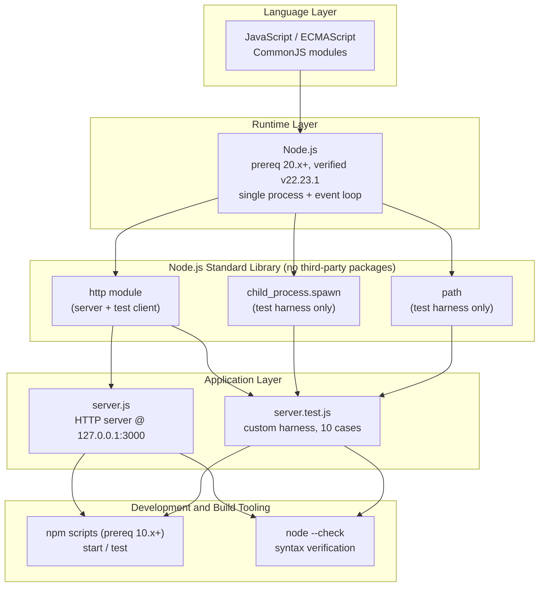
```mermaid
flowchart TD
    subgraph LangLayer["Language Layer"]
        LangJS["JavaScript / ECMAScript<br/>CommonJS modules"]
    end
    subgraph RuntimeLayer["Runtime Layer"]
        RuntimeNode["Node.js<br/>prereq 20.x+, verified v22.23.1<br/>single process + event loop"]
    end
    subgraph StdLibLayer["Node.js Standard Library (no third-party packages)"]
        ModHTTP["http module<br/>(server + test client)"]
        ModCP["child_process.spawn<br/>(test harness only)"]
        ModPath["path<br/>(test harness only)"]
    end
    subgraph AppLayer["Application Layer"]
        AppServer["server.js<br/>HTTP server @ 127.0.0.1:3000"]
        AppTest["server.test.js<br/>custom harness, 10 cases"]
    end
    subgraph ToolLayer["Development and Build Tooling"]
        ToolNpm["npm scripts (prereq 10.x+)<br/>start / test"]
        ToolCheck["node --check<br/>syntax verification"]
    end
    LangJS --> RuntimeNode
    RuntimeNode --> ModHTTP
    RuntimeNode --> ModCP
    RuntimeNode --> ModPath
    ModHTTP --> AppServer
    ModHTTP --> AppTest
    ModCP --> AppTest
    ModPath --> AppTest
    AppServer --> ToolNpm
    AppTest --> ToolNpm
    AppServer --> ToolCheck
    AppTest --> ToolCheck
```

All entries in the module inventory below are Node.js built-ins; their version equals the Node.js runtime version (prerequisite 20.x+, verified on v22), and none is independently installable or versioned:

| Built-in Module | Consumed By | Role |
| --- | --- | --- |
| `http` | `server.js`, `server.test.js` | Creates the HTTP/1.1 server (`http.createServer`) and, in tests, the HTTP client (`http.request`) |
| `child_process` (`spawn`) | `server.test.js` | Launches `server.js` as a child process for black-box testing |
| `path` | `server.test.js` | Resolves the absolute path to `server.js` (`path.resolve(__dirname, 'server.js')`) |

### 3.2.1 Application Framework: The Node.js Built-in `http` Module

The HTTP contract in `server.js` is implemented directly on Node's built-in `http` module — `const http = require('http')` is the file's only import, and the server is created with `http.createServer((req, res) => { ... })`. All request handling (method allow-listing, URL validation, status/headers/body, graceful-shutdown 503 responses) is hand-written inside that single callback using the raw `req`/`res` objects and the response API (`res.statusCode`, `res.setHeader`, `res.end`). There is no routing framework, middleware pipeline, or HTTP abstraction layer — no Express, Koa, Fastify, Hapi, or comparable dependency is present.

- **Version:** the `http` module is not independently versioned; it ships with the Node.js runtime, so its behavior tracks the installed Node.js version (prerequisite 20.x+ per `Project Guide.md`; verified on v22). The wire protocol is standard **HTTP/1.1**, which `Project Guide.md` characterizes as a "Standard HTTP/1.1 implementation."
- **Justification:** using the built-in module directly satisfies the project's dependency-free goal and its role as a minimal reference fixture; it preserves the original "Hello World" response contract while allowing the robustness hardening described in Sections 1.2 and 2.1 to be layered in without adding packages.

### 3.2.2 Test-Harness Libraries (Node.js Built-ins)

`server.test.js` is a self-contained regression harness that likewise uses only built-ins: it imports `http`, `child_process` (destructuring `spawn`), and `path`. It implements its own assertion and reporting logic — tracking `testsRun`/`testsPassed`/`testsFailed` and printing `Test Results: N passed, M failed` — rather than relying on any external test framework such as Jest, Mocha, or the `node:test` runner.

- `child_process.spawn('node', [SERVER_FILE])` starts the server under test as a real OS process, exercising it end-to-end over the loopback interface.
- `path.resolve(__dirname, 'server.js')` locates the server file portably.
- `http.request(...)` issues the test requests, and the global `URL` constructor parses the target address.

**Justification / compatibility:** keeping the harness framework-free means `npm test` (i.e., `node server.test.js`) runs anywhere a compatible Node.js runtime exists, with no install step and no devDependencies to audit.

### 3.2.3 Deliberate Absence of a Web/Application Framework

The lack of any framework is an intentional design decision rather than an omission, corroborated by the repository's committed scope documentation: external/third-party dependencies, a logging framework, load balancing/clustering, and rate limiting are all listed as out-of-scope or prohibited (Section 1.3.2; prior spec §0.5). The practical consequences and compatibility requirements are:

- **Compatibility requirement — runtime only:** the sole compatibility requirement is a Node.js runtime that exposes the `http`, `child_process`, and `path` core modules through the CommonJS API. No package-registry resolution, lockfile install, or transitive-dependency compatibility matrix applies, because there are no dependencies to reconcile.
- **Integration requirements between components:** `server.test.js` integrates with `server.js` only by spawning it as a child process and communicating over `127.0.0.1:3000`; the two share no in-process framework state. Both integrate with the operating system via signal delivery (`SIGTERM`/`SIGINT`) and with HTTP/1.1 clients over TCP.
- **Security implication:** a zero-dependency, framework-free surface means there is no third-party supply-chain attack surface and no framework CVEs to patch; `Project Guide.md` records a dependency audit of "0 vulnerabilities." Conversely, capabilities a framework would normally supply (TLS, authentication, structured logging, rate limiting) are simply absent and out of scope.

## 3.3 Open Source Dependencies

The system has **zero open-source / third-party dependencies**. Every capability is provided by the Node.js standard library (Section 3.2), so no packages are fetched from any registry at install time or runtime. This is one of the project's explicit success criteria (Section 1.2.3) and is enforced by its own committed status documentation.

**Manifest evidence.** `package.json` declares neither a `dependencies` nor a `devDependencies` block. `package-lock.json` uses `lockfileVersion: 3` and its `packages` map contains only the root-package entry (the empty-string key), i.e., no resolved external packages:

```json
"packages": {
  "": { "name": "hello_world", "version": "1.0.0", "license": "MIT" }
}
```

| Dependency Class | Count | Evidence |
| --- | --- | --- |
| Runtime (`dependencies`) | 0 | `package.json` (no block); `package-lock.json` |
| Development (`devDependencies`) | 0 | `package.json` (no block) |
| Transitive / resolved | 0 | `package-lock.json` `packages` map contains only the root entry |

**Registry and install behavior.** The only package registry implied by the npm toolchain is the public npm registry, but because no dependencies are declared, `npm install` resolves nothing external. `blitzy/documentation/Project Guide.md` records the install output as "up to date, audited 1 package in 342ms, found 0 vulnerabilities" — the single audited "package" being the project root itself, not an external dependency.

**Versions and lockfile format.**

- `lockfileVersion: 3` — the npm v7+/v9+ lockfile format, consistent with the npm 10.x+ prerequisite noted in `Project Guide.md`.
- Package self-identity: `hello_world` version `1.0.0`, license `MIT` (`package.json`, `package-lock.json`).

**Security implications.** With no third-party or transitive packages, the project has no external supply-chain attack surface and no dependency CVEs to track or patch; the recorded audit result is **0 vulnerabilities** (`Project Guide.md`). Reproducible installs are trivially deterministic because there is nothing to download or resolve. The trade-off is that any capability normally obtained from the ecosystem (for example a web framework, a validation library, or a logging library) would have to be implemented by hand or newly introduced, changing this zero-dependency posture.

## 3.4 Third-Party Services

The system integrates with **no external third-party services**. It makes no outbound network calls, authenticates against no identity provider, emits telemetry to no monitoring backend, and is bound to no cloud platform. The service binds only to the loopback interface `127.0.0.1:3000` (`server.js`), and its sole imports are Node.js built-ins (Section 3.2), so there is no client SDK, API key, credential, or service endpoint anywhere in the codebase. This is consistent with the out-of-scope determinations in Section 1.3.2.

| Service Category | Status | Evidence / Notes |
| --- | --- | --- |
| External APIs / integrations | None | `server.js` acts only as an HTTP server via built-in `http`; it issues no outbound requests |
| Authentication services | None | No authentication or authorization of any kind; all loopback clients are treated equally (Section 1.3.2) |
| Monitoring / observability | None (future work) | Diagnostics use `console` only; monitoring integration is listed as a remaining task in `Project Guide.md` |
| Cloud services | None | No cloud SDKs, credentials, region, or deployment target are configured (Section 1.3) |

**Intended (unconfigured) integration points.** Although no services are integrated, the implementation is deliberately built to be compatible with standard operational tooling. These are documented as design intent only — no manifests, credentials, or configuration exist in the repository to activate them:

- **Process managers:** the `SIGTERM`/`SIGINT` handling in `server.js` makes the process compatible with Docker (container stop), Kubernetes (pod termination), and PM2 (`Project Guide.md`). However, no `Dockerfile`, Kubernetes manifest, or PM2 ecosystem file is committed (Section 1.3.2).
- **Reverse proxies:** `Project Guide.md` notes the "Standard HTTP/1.1 implementation" as suitable for reverse-proxy integration; no proxy configuration is present.

**Security implication.** Because no external services are called and no credentials are stored, there are no secrets to leak, no token-refresh flows, and no third-party availability dependency. Combined with loopback-only binding and plain HTTP (no TLS), the network exposure and integration attack surface are minimal by design (Section 2.4).

## 3.5 Databases & Storage

The system has **no database, no cache, and no storage service of any kind**. It is a stateless HTTP service that returns a hard-coded greeting and neither reads nor writes persistent data. This matches the out-of-scope determinations in Section 1.3.2 (databases/persistence explicitly excluded) and the prior specification's prohibited list (§0.5).

| Storage Concern | Status | Evidence |
| --- | --- | --- |
| Primary database | None | No database driver or connection code; `server.js` imports only `http` |
| Secondary database | None | No secondary datastore of any kind |
| Caching layer | None | No cache library; responses are computed inline per request |
| Object / file storage | None | No storage SDK; no runtime filesystem reads or writes |
| Persistence strategy | None (stateless) | Greeting is a hard-coded literal; Section 1.3.1 records "Data domains included: None" |

**State model.** The only state maintained by the running service is transient, in-memory, and process-local: the `isShuttingDown` boolean and the `shutdownTimer` handle in `server.js`, used solely to coordinate graceful shutdown. This state is never persisted and is lost when the process exits.

**Static data present but not a storage layer.** The repository contains `industry.csv` (a single-column list of roughly 43 industry labels), but it is not read by `server.js` or `server.test.js` — whose only imports are Node.js built-ins — and is therefore not part of any storage subsystem; it is an unused static asset (Section 1.3). Likewise, the binary files `100Pages.pdf`, `demo.jpg`, and `sample.doc` are unreferenced assets, not managed content.

**Justification and implications.** Because a static greeting requires no data domain, the absence of a storage layer is intrinsic to the design rather than a gap. The security implication is favorable: with no datastore there is no data-at-rest to secure, no connection string or credential to protect, and no query-injection surface. Any future requirement for persistence would necessitate introducing a database or storage dependency, which would change the current zero-dependency, stateless posture described in Sections 3.2 and 3.3.

## 3.6 Development & Deployment

Development and deployment tooling is intentionally minimal and matches the dependency-free design. The service is run directly by the Node.js interpreter through npm scripts; there is no build/compile step, and containerization, CI/CD, and production configuration are documented as remaining ("future") work rather than committed artifacts.

| Concern | Tool / Status | Version | Evidence |
| --- | --- | --- | --- |
| Runtime | Node.js | Prerequisite 20.x+ (v22.23.1 observed) | `Project Guide.md`; build environment |
| Package manager / scripts | npm | Prerequisite 10.x+ (11.1.0 observed) | `Project Guide.md`; build environment |
| Build / bundling | None (interpreted) | n/a | No bundler/transpiler config present |
| Test runner | Custom harness (`server.test.js`) | n/a (Node built-ins) | `server.test.js`; `package.json` |
| Syntax verification | `node --check` | Node runtime | `Project Guide.md` |
| Version control | git | n/a | Branch `QA-13-july-branch` |
| Containerization | None (future work) | n/a | No `Dockerfile`; `Project Guide.md` |
| CI/CD | None (future work) | n/a | No `.github/` workflows; `Project Guide.md` |

### 3.6.1 Development Tools

- **Node.js runtime** — the only mandatory tool. `Project Guide.md` lists Node.js 20.x+ as a prerequisite (verification command `node --version`); the code was verified on Node.js v22, and the build environment carries v22.23.1. `package.json` does not pin the version via `engines`, so this is advisory.
- **npm scripts** — the developer workflow is driven entirely by two scripts declared in `package.json`:

```json
"scripts": { "start": "node server.js", "test": "node server.test.js" }
```

  `Project Guide.md` lists npm 10.x+ as a prerequisite (`npm --version`); the build environment carries npm 11.1.0.
- **Syntax verification** — `Project Guide.md` records `node --check server.js` and `node --check server.test.js` as the syntax-verification step used in lieu of a compiler.
- **Version control** — the repository is a git checkout (branch `QA-13-july-branch`).
- **No auxiliary tooling** — there is no linter, formatter, type-checker, or editor configuration in the repository (no `.eslintrc`, `.prettierrc`, `tsconfig`, `.editorconfig`, `.nvmrc`, or `.npmrc`), so code is authored and executed without an intermediate quality-gate toolchain.

### 3.6.2 Build System

There is **no build system**. The application is interpreted JavaScript executed directly by Node.js, so there is no compilation, transpilation, or bundling stage — confirmed by the absence of any Webpack, Rollup, Vite, Babel, or TypeScript configuration and by `package.json` declaring no `build` script. Because no dependencies are declared (Section 3.3), `npm install` resolves nothing; the effective "build" is simply invoking `node server.js`.

### 3.6.3 Testing

Quality assurance is provided by the self-executing harness `server.test.js`, run via `npm test` (i.e., `node server.test.js`). It spawns `server.js` as a child process and asserts the full HTTP contract across 10 test cases, printing `Test Results: N passed, M failed`. The runner exits with a non-zero status when any test fails, which makes the suite suitable for gating in a future automated pipeline. It uses no external test framework (Section 3.2.2).

### 3.6.4 Containerization & Orchestration

No containerization or orchestration is configured: there is no `Dockerfile`, Kubernetes manifest, or PM2 ecosystem file in the repository (Section 1.3.2). The code is nonetheless designed to run cleanly under such managers — its `SIGTERM`/`SIGINT` graceful-shutdown handling is explicitly aligned with Docker (container stop), Kubernetes (pod termination), and PM2 (`Project Guide.md`). `Project Guide.md` lists "Deployment Pipeline Setup" — creating a CI/CD pipeline, Docker configuration, or a PM2 ecosystem file — as remaining work, confirming these are intended future artifacts rather than current ones.

### 3.6.5 CI/CD and Production Configuration

There is **no CI/CD automation** committed (no `.github/` workflows or other pipeline configuration), and `Project Guide.md` records the deployment pipeline as an outstanding task. Related production-readiness items are likewise deferred:

- **Production configuration:** all settings are hard-coded module constants in `server.js` (`hostname` `127.0.0.1`, `port` `3000`, `SHUTDOWN_TIMEOUT` `5000`, `MAX_URL_LENGTH` `2048`). `Project Guide.md` lists environment-variable configuration (`PORT`, `HOST`, `SHUTDOWN_TIMEOUT`) as remaining production work; it is not yet implemented.
- **Monitoring/logging:** structured logging, a health-check endpoint, and monitoring integration are listed as future enhancements (Section 3.4); today, diagnostics use `console` only.

These deferrals are consistent with the repository's documented completion status (10 of 15 hours; the remaining hours are standard deployment tasks per `Project Guide.md`), and with the security posture of loopback-only, plain-HTTP operation described in Section 2.4.

## 3.7 References

The following repository artifacts, folders, and Technical Specification sections were examined as evidence for this section.

**Repository files**

- `server.js` - Established the primary language (JavaScript/CommonJS), the sole runtime import (`http`), the HTTP/1.1 contract, hard-coded configuration constants, graceful-shutdown/signal handling, and multi-layer error handling; confirmed zero third-party imports and loopback binding `127.0.0.1:3000`.
- `server.test.js` - Established the framework-free test harness using only Node.js built-ins (`http`, `child_process.spawn`, `path`), the 10-case suite, and the child-process integration pattern.
- `package.json` - Established package identity (`hello_world` 1.0.0, MIT), `main` entry point, `start`/`test` npm scripts, and the absence of `dependencies`, `devDependencies`, `engines`, and `type` fields.
- `package-lock.json` - Established `lockfileVersion: 3` and a `packages` map containing only the root package (zero external/transitive dependencies).
- `README.md` - Established the repository identity (`hao-backprop-test`) and its stated purpose as a test project.
- `LoginTest.java` - Established the presence of a non-functional Java stub not wired into the running system.
- `industry.csv` - Established an unused static data file that is not part of any storage layer.
- `test.py.txt`, `test.txt.txt` - Established 0-byte placeholder files (no Python or text-processing code).
- `100Pages.pdf`, `demo.jpg`, `sample.doc` - Established unreferenced binary assets not consumed by the service.
- `blitzy/documentation/Project Guide.md` - Established the Node.js 20.x+ / npm 10.x+ prerequisites, the "0 vulnerabilities / no external deps" audit, the `node --check` syntax verification, process-manager (Docker/Kubernetes/PM2) and HTTP/1.1 reverse-proxy compatibility, and the remaining deployment/monitoring/configuration tasks.
- `blitzy/documentation/Technical Specifications.md` - Established the prior specification's scope boundaries and prohibited-items list (§0.5): no external dependencies, HTTPS, databases, logging framework, load balancing, or rate limiting.

**Repository folders**

- `` (repository root) - Contained the complete git-tracked file inventory (nine files plus the `blitzy/` folder) confirming the overall structure and the absence of any `Dockerfile`, `.github/` CI configuration, Terraform, `.env`, or build/lint/type-checker configuration.
- `blitzy/documentation/` - Contained the committed `Project Guide.md` and `Technical Specifications.md` documentation artifacts used for corroborating versions, prerequisites, and scope.

**Cross-referenced Technical Specification sections**

- 1.2 System Overview - Confirmed the dependency-free CommonJS design on Node.js built-ins and the success criteria (0 external dependencies, 10/10 tests).
- 1.3 Scope - Confirmed in-scope runtime/module usage and the out-of-scope technologies (TLS, databases, external dependencies, logging framework, clustering, rate limiting, auth, CI/CD, Docker).
- 2.1 Feature Catalog - Confirmed that features F-001 through F-006 are built solely on Node.js built-ins and that no external test framework is used.
- 2.4 Implementation Considerations - Confirmed the cross-cutting runtime/dependency constraints, the unenforced Node.js 20.x+/npm 10.x+ prerequisite, hard-coded configuration, and the loopback-only, no-SLA, plain-HTTP posture.

**Environment / tooling observations**

- Build-environment runtime observed via terminal: Node.js v22.23.1 and npm 11.1.0; git branch `QA-13-july-branch` at commit `7244bbc`. These corroborate the documented prerequisites but are not constraints declared by the repository itself.
- No external web sources were required or consulted for this section.

# 4. Process Flowchart

## 4.1 System Workflows

This section documents the runtime workflows evidenced in the repository. The product surface consists of exactly two executable artifacts: the HTTP server `server.js` (263 lines) and its self-executing regression harness `server.test.js` (466 lines). All other files in the repository (`README.md`, `package.json`, `package-lock.json`, `industry.csv`, `LoginTest.java`, `test.py.txt`, `test.txt.txt`, `100Pages.pdf`, `demo.jpg`, `sample.doc`, and `blitzy/documentation/`) are static assets, manifests, or planning documents that define **no** runtime workflow and are therefore excluded from the flowcharts below.

The system is a **single-process, dependency-free** Node.js application built exclusively on the built-in `http` module (`server.js`, line 17). It is **stateless** — there is no database, external data store, persistence layer, cache, or transaction manager anywhere in the codebase — and it defines **no latency, throughput, or uptime Service Level Agreement (SLA)**. Consequently, the only timing values expressed in the diagrams are literal constants found in code (`SHUTDOWN_TIMEOUT`, `Retry-After`, and test-harness delays), not performance targets.

Three actors interact with the system:

| Actor | Role in Workflows | Evidence |
|-------|-------------------|----------|
| HTTP Client / Test Harness | Issues HTTP requests over loopback and consumes responses | `server.js` request callback (lines 126-188); `server.test.js` `makeRequest` (lines 38-68) |
| OS / Process Manager | Delivers `SIGTERM`/`SIGINT` and reaps the process exit code | `server.js` signal handlers (lines 225-231); `gracefulShutdown` exit codes (lines 43-74) |
| Node.js Process (`server.js`) | Binds the port, dispatches requests, and manages its own lifecycle | `server.js` (entire file) |

The workflows map directly to the six catalogued features: F-001 (Static Greeting Response), F-002 (HTTP Method Governance), F-003 (Request URL Validation), F-004 (Graceful Shutdown & Signal Handling), F-005 (Multi-Layer Error Handling), and F-006 (Automated Regression Test Harness).

### 4.1.1 Core Business Processes

The single "business process" delivered by this system is the servicing of an HTTP request with a static plaintext greeting, wrapped by a robust startup and shutdown lifecycle. Because the service is stateless, there is no multi-step transactional business workflow, no persisted user journey, and no downstream fulfillment step — the end-to-end journey begins and ends within a single synchronous request callback.

#### 4.1.1.1 High-Level System Workflow

The following swim-lane flowchart shows the complete process lifecycle across all three actors and the Node.js process boundary. It elaborates on the compact request-pipeline diagram in Section 1.2.2 by adding the startup path, the port-bind decision, and the shutdown/exit-code terminals. The synchronous request cascade (`RH`) is expanded in detail in Section 4.2.1.

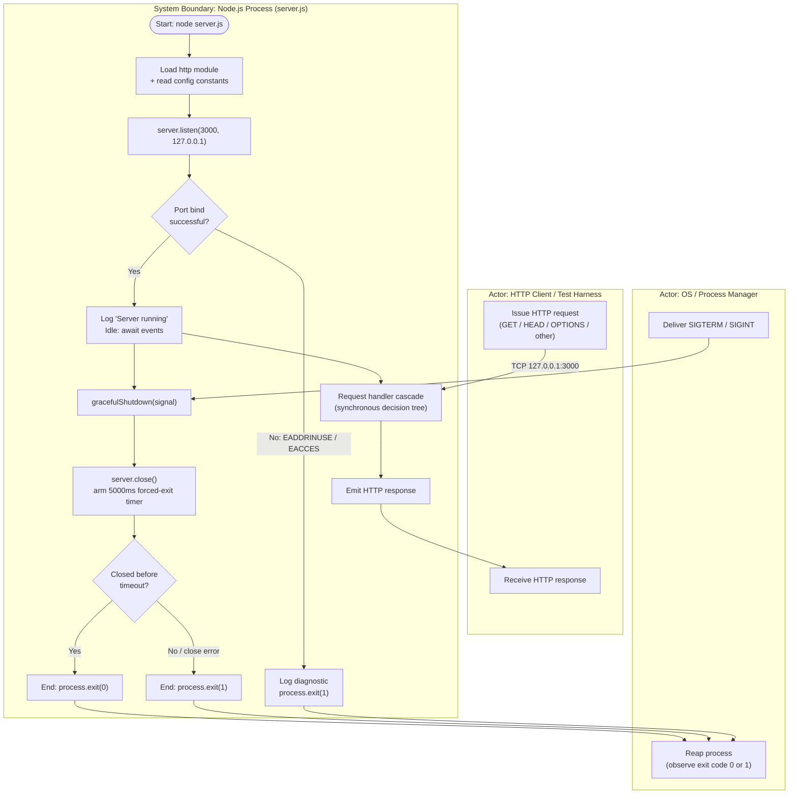
```mermaid
flowchart TD
    subgraph CLIENT["Actor: HTTP Client / Test Harness"]
        direction TB
        C1["Issue HTTP request<br/>(GET / HEAD / OPTIONS / other)"]
        C2["Receive HTTP response"]
    end
    subgraph OSMGR["Actor: OS / Process Manager"]
        direction TB
        O1["Deliver SIGTERM / SIGINT"]
        O2["Reap process<br/>(observe exit code 0 or 1)"]
    end
    subgraph PROC["System Boundary: Node.js Process (server.js)"]
        direction TB
        P0(["Start: node server.js"]) --> P1["Load http module<br/>+ read config constants"]
        P1 --> P2["server.listen(3000, 127.0.0.1)"]
        P2 --> P3{"Port bind<br/>successful?"}
        P3 -->|"No: EADDRINUSE / EACCES"| P4["Log diagnostic<br/>process.exit(1)"]
        P3 -->|"Yes"| P5["Log 'Server running'<br/>Idle: await events"]
        P5 --> RH["Request handler cascade<br/>(synchronous decision tree)"]
        RH --> RESP["Emit HTTP response"]
        P5 --> GS["gracefulShutdown(signal)"]
        GS --> CL["server.close()<br/>arm 5000ms forced-exit timer"]
        CL --> EX{"Closed before<br/>timeout?"}
        EX -->|"Yes"| EX0["End: process.exit(0)"]
        EX -->|"No / close error"| EX1["End: process.exit(1)"]
    end
    C1 -->|"TCP 127.0.0.1:3000"| RH
    RESP --> C2
    O1 --> GS
    EX0 --> O2
    EX1 --> O2
    P4 --> O2
```

#### 4.1.1.2 Server Startup Journey

Startup is a linear, synchronous sequence culminating in either an idle listening state or an immediate failure exit. Per `server.js`:

1. **Module load** — `require('http')` is the only import (line 17); configuration constants are read (`hostname` line 20, `port` line 21, `SHUTDOWN_TIMEOUT` line 24, `ALLOWED_METHODS` line 27, `MAX_URL_LENGTH` line 30) and module state is initialized (`isShuttingDown = false`, `shutdownTimer = null`, lines 33-34).
2. **Handler registration** — `http.createServer` registers the request callback (line 126), and `server.on('error', ...)` registers the server-level error handler (line 194).
3. **Bind and listen** — `server.listen(port, hostname, callback)` (lines 215-218) attempts to bind `127.0.0.1:3000`.
4. **Decision point — bind success?** On success, the listen callback logs `Server running at http://127.0.0.1:3000/` and the process becomes idle, awaiting HTTP and signal events. On failure, `server.on('error')` diagnoses `EADDRINUSE` or `EACCES` (and any other error), logs a message, and calls `process.exit(1)` (lines 194-210).
5. **Signal & process handlers armed** — `SIGTERM` (lines 225-227), `SIGINT` (lines 229-231), `uncaughtException` (lines 237-247), and `unhandledRejection` (lines 249-259) handlers are registered so the idle process can respond to lifecycle events.

The test harness treats the literal stdout marker `Server running` as the readiness signal, then waits an additional `STARTUP_DELAY` of 500 ms before issuing requests (`server.test.js`, `startServer` lines 74-110, `STARTUP_DELAY` line 24).

#### 4.1.1.3 End-to-End HTTP Request Journey

Once idle, each inbound request is processed by a single synchronous callback (`server.js` lines 126-188) that evaluates a fixed cascade of guards before dispatching a response. The ordering is authoritative and matches the F-004 → F-003 → F-002 → F-001 dependency chain documented in Section 2.3.1:

1. **Per-request error listeners** are attached to the request and response streams (`req.on('error')` lines 128-134; `res.on('error')` lines 137-139).
2. **Shutdown gate (F-004)** — if `isShuttingDown` is `true`, respond `503 Service Unavailable` with `Connection: close` and `Retry-After: 30` (lines 142-148).
3. **URL validation (F-003)** — `validateUrl` rejects URLs longer than `MAX_URL_LENGTH` (2048) or containing a null byte (`\0`) with `400 Bad Request` (lines 82-100, 151-156).
4. **Method governance (F-002)** — if the method is not in `ALLOWED_METHODS` (`GET`, `HEAD`, `OPTIONS`), respond `405 Method Not Allowed` with an `Allow` header (lines 159-164).
5. **Method dispatch (F-002/F-001)** — `OPTIONS` → `204 No Content` with `Allow` header (lines 167-173); `HEAD` → `200 OK` with headers and `Content-Length` only (lines 176-182); `GET` → `200 OK` `text/plain` body `Hello, World!\n` for any path (lines 185-187).

The decision points and user touchpoints in this journey are summarized below.

| Decision Point | Condition Evaluated | True Branch | False Branch | Requirement |
|----------------|---------------------|-------------|--------------|-------------|
| Shutdown gate | `isShuttingDown === true` | `503` + `Retry-After: 30` | Continue | F-004 |
| URL validity | length > 2048 OR contains `\0` | `400 Bad Request` | Continue | F-003 |
| Method allowed | method in {GET, HEAD, OPTIONS} | Continue to dispatch | `405` + `Allow` | F-002 |
| Method dispatch | which allowed method | OPTIONS→204 / HEAD→200 / GET→200 body | — | F-002, F-001 |

| User Touchpoint | Interaction | Observable Outcome |
|-----------------|-------------|--------------------|
| HTTP request submission | Client sends any method to any path over `127.0.0.1:3000` | Deterministic status code per cascade above |
| HTTP response consumption | Client reads status, headers, and (for GET) body | `Hello, World!\n` on GET; empty body on HEAD/OPTIONS/errors |
| Ctrl+C / signal | Operator or process manager sends `SIGINT`/`SIGTERM` | Graceful shutdown and process exit |

Error-handling paths within this journey (400 on malformed request stream, 503 during shutdown, and the multi-layer process/server error handlers) are detailed in Section 4.4.

#### 4.1.1.4 Timing Considerations

The repository defines **no SLA** (Section 2.2 confirms no latency, throughput, or uptime targets). The only timing values present are the following literal constants; they govern lifecycle behavior, not performance guarantees:

| Constant | Value | Location | Purpose |
|----------|-------|----------|---------|
| `SHUTDOWN_TIMEOUT` | 5000 ms | `server.js` line 24 | Forced-exit deadline after `server.close()` is requested |
| `Retry-After` | 30 (seconds) | `server.js` line 145 (503 path) | Advisory retry hint returned during shutdown |
| `MAX_URL_LENGTH` | 2048 chars | `server.js` line 30 | Upper bound enforced by `validateUrl` |
| `STARTUP_DELAY` | 500 ms | `server.test.js` line 24 | Harness wait after readiness marker before testing |
| Startup timeout | 5000 ms | `server.test.js` `startServer` | Abort + `SIGKILL` if `Server running` never observed |
| `SHUTDOWN_DELAY` | 2000 ms | `server.test.js` line 25 | Harness allowance for shutdown observation |
| Force-kill timeout | 10000 ms | `server.test.js` `stopServer` | `SIGKILL` fallback if graceful exit stalls |

### 4.1.2 Integration Workflows

Because the service has zero external dependencies and binds only to the loopback interface (`127.0.0.1`), there are **no integrations with external systems, third-party APIs, message brokers, or databases**. The "integration" surface documented here is therefore limited to the internal and OS-level interfaces evidenced in code: the HTTP loopback interface, OS signal delivery, Node.js process/stream events, the child-process spawn used by the test harness, and the programmatic module export.

| Integration Channel | Direction | Mechanism | Evidence |
|---------------------|-----------|-----------|----------|
| HTTP loopback | Inbound | TCP request to `127.0.0.1:3000` handled by the request callback | `server.js` lines 126-188 |
| OS signals | Inbound | `SIGTERM`/`SIGINT` → `gracefulShutdown` | `server.js` lines 225-231 |
| Process/stream events | Internal | `uncaughtException`, `unhandledRejection`, `server`/`req`/`res` `error` events | `server.js` lines 128-139, 194-210, 237-259 |
| Child-process spawn | Internal (test only) | `child_process.spawn('node', ['server.js'])` | `server.test.js` lines 74-110 |
| Programmatic export | Outbound | `module.exports = { server, gracefulShutdown }` | `server.js` line 262 |

#### 4.1.2.1 Data Flow Between Components

There is no cross-system data flow to diagram. The only runtime data payload is the constant greeting string `Hello, World!\n`, produced in-process and written directly to the HTTP response (`server.js` lines 185-187). Request URL data flows one-way into `validateUrl` (lines 82-100) and is otherwise discarded — it is never persisted, logged to a store, or forwarded. Error diagnostics flow to `console` (stdout/stderr) only, which the test harness captures via the child process's `stdout`/`stderr` streams (`server.test.js` lines 74-110).

#### 4.1.2.2 API Interaction Sequence

The following sequence diagram shows a single request's traversal of the synchronous decision cascade. The `alt` block enumerates the mutually exclusive response branches in their evaluated order.

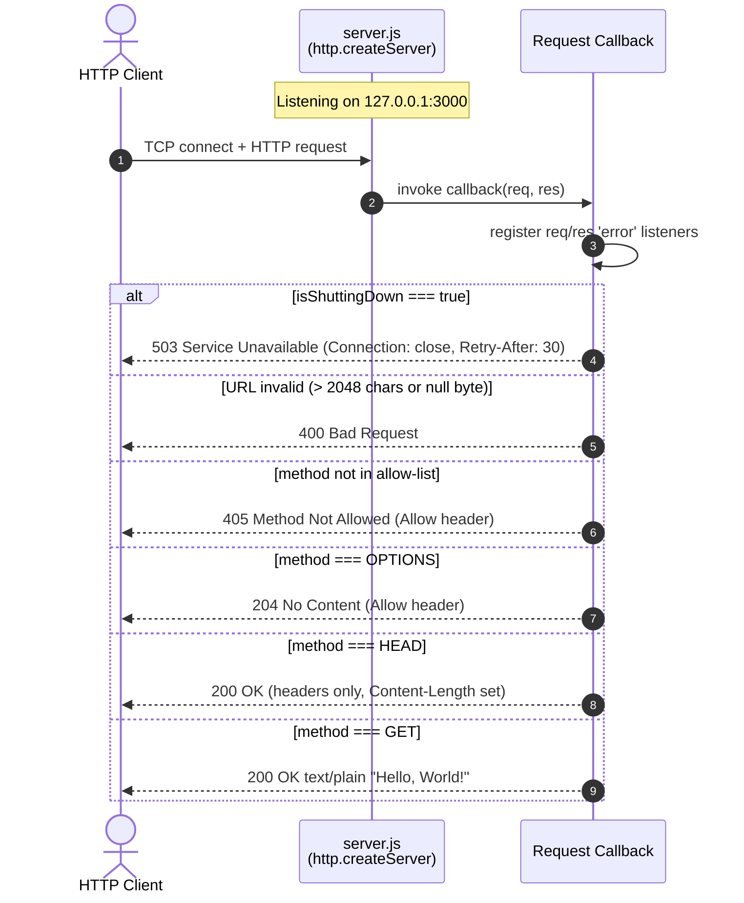
```mermaid
sequenceDiagram
    autonumber
    actor Client as HTTP Client
    participant Server as server.js<br/>(http.createServer)
    participant Handler as Request Callback
    Note over Server: Listening on 127.0.0.1:3000
    Client->>Server: TCP connect + HTTP request
    Server->>Handler: invoke callback(req, res)
    Handler->>Handler: register req/res 'error' listeners
    alt isShuttingDown === true
        Handler-->>Client: 503 Service Unavailable (Connection: close, Retry-After: 30)
    else URL invalid (> 2048 chars or null byte)
        Handler-->>Client: 400 Bad Request
    else method not in allow-list
        Handler-->>Client: 405 Method Not Allowed (Allow header)
    else method === OPTIONS
        Handler-->>Client: 204 No Content (Allow header)
    else method === HEAD
        Handler-->>Client: 200 OK (headers only, Content-Length set)
    else method === GET
        Handler-->>Client: 200 OK text/plain "Hello, World!"
    end
```

#### 4.1.2.3 Event Processing Flow

The process reacts to seven asynchronous event sources, each bound to a specific handler at startup. This mapping is the basis for the multi-layer error handling detailed in Section 4.4.

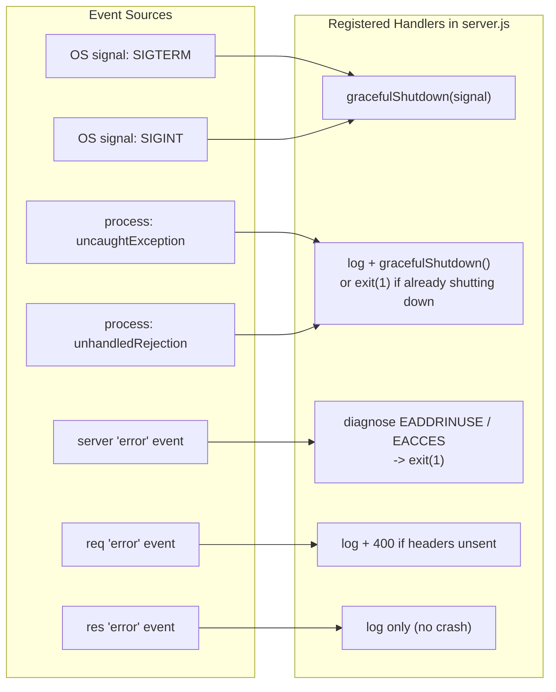
```mermaid
flowchart LR
    subgraph SOURCES["Event Sources"]
        direction TB
        S1["OS signal: SIGTERM"]
        S2["OS signal: SIGINT"]
        S3["process: uncaughtException"]
        S4["process: unhandledRejection"]
        S5["server 'error' event"]
        S6["req 'error' event"]
        S7["res 'error' event"]
    end
    subgraph HANDLERS["Registered Handlers in server.js"]
        direction TB
        H1["gracefulShutdown(signal)"]
        H2["log + gracefulShutdown()<br/>or exit(1) if already shutting down"]
        H3["diagnose EADDRINUSE / EACCES<br/>-> exit(1)"]
        H4["log + 400 if headers unsent"]
        H5["log only (no crash)"]
    end
    S1 --> H1
    S2 --> H1
    S3 --> H2
    S4 --> H2
    S5 --> H3
    S6 --> H4
    S7 --> H5
```

#### 4.1.2.4 Batch Processing Sequence (Test Harness)

The automated regression harness (F-006) is the only "batch" workflow in the repository. `runTests()` (`server.test.js` lines 407-462, invoked at top-level line 465) executes a deterministic sequence: it spawns `server.js` as a child process, waits for the readiness marker plus `STARTUP_DELAY`, runs tests 1–8 against the shared server instance, terminates it, then runs the signal-based tests 9 and 10 — each of which spawns and stops its own dedicated server process. A 1000 ms pause between phases allows the loopback port to be released. The suite prints `Test Results: X passed, Y failed` and calls `process.exit(testsFailed > 0 ? 1 : 0)`; the suite currently passes **10 of 10** tests on Node v22.23.1.

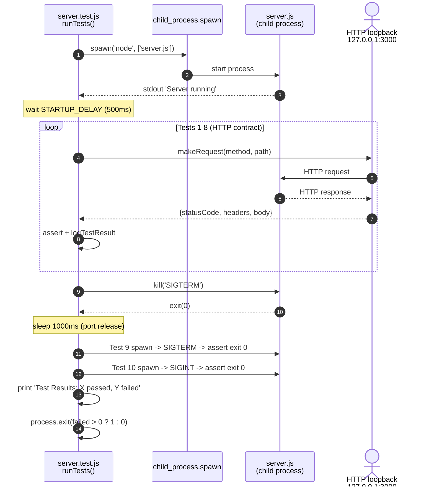
```mermaid
sequenceDiagram
    autonumber
    participant Runner as server.test.js<br/>runTests()
    participant Spawn as child_process.spawn
    participant Server as server.js<br/>(child process)
    actor Net as HTTP loopback<br/>127.0.0.1:3000
    Runner->>Spawn: spawn('node', ['server.js'])
    Spawn->>Server: start process
    Server-->>Runner: stdout 'Server running'
    Note over Runner: wait STARTUP_DELAY (500ms)
    loop Tests 1-8 (HTTP contract)
        Runner->>Net: makeRequest(method, path)
        Net->>Server: HTTP request
        Server-->>Net: HTTP response
        Net-->>Runner: {statusCode, headers, body}
        Runner->>Runner: assert + logTestResult
    end
    Runner->>Server: kill('SIGTERM')
    Server-->>Runner: exit(0)
    Note over Runner: sleep 1000ms (port release)
    Runner->>Server: Test 9 spawn -> SIGTERM -> assert exit 0
    Runner->>Server: Test 10 spawn -> SIGINT -> assert exit 0
    Runner->>Runner: print 'Test Results: X passed, Y failed'
    Runner->>Runner: process.exit(failed > 0 ? 1 : 0)
```

## 4.2 Detailed Process Flows and Validation Rules

This section decomposes the high-level workflows from Section 4.1 into the detailed process flows for each core feature, then enumerates the validation, authorization, and compliance checkpoints that govern them. Every step is grounded in `server.js`; the request cascade is strictly synchronous, so each diagram represents a deterministic path with exactly one response per request.

### 4.2.1 Request Handling Pipeline

The request-handling pipeline is the detailed elaboration of the `RH` node in the Section 4.1.1.1 workflow. It is a single-lane synchronous cascade of four ordered guards followed by method dispatch. Each guard is a terminal decision: a failed guard produces an error response via the shared `sendErrorResponse` helper (`server.js` lines 110-120) and no further guard is evaluated. There is no retry, queueing, or asynchronous continuation within the pipeline.

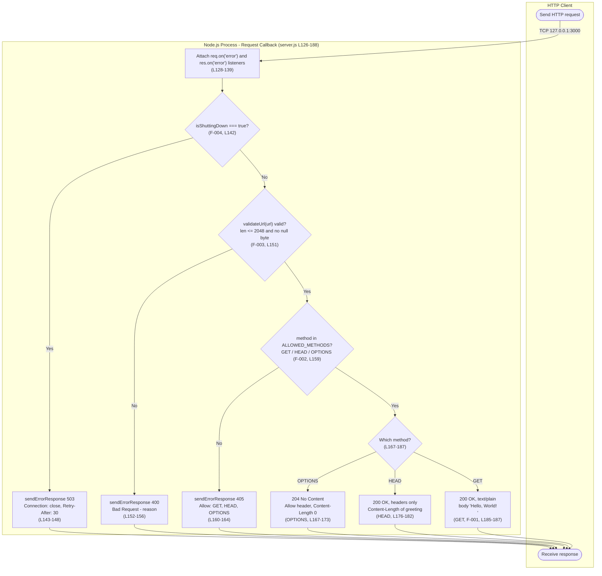
```mermaid
flowchart TD
    subgraph CLIENT["HTTP Client"]
        direction TB
        A0(["Send HTTP request"])
        AEND(["Receive response"])
    end
    subgraph SERVER["Node.js Process - Request Callback (server.js L126-188)"]
        direction TB
        B1["Attach req.on('error') and res.on('error') listeners<br/>(L128-139)"]
        B2{"isShuttingDown === true?<br/>(F-004, L142)"}
        B3["sendErrorResponse 503<br/>Connection: close, Retry-After: 30<br/>(L143-148)"]
        B4{"validateUrl(url) valid?<br/>len <= 2048 and no null byte<br/>(F-003, L151)"}
        B5["sendErrorResponse 400<br/>Bad Request - reason<br/>(L152-156)"]
        B6{"method in ALLOWED_METHODS?<br/>GET / HEAD / OPTIONS (F-002, L159)"}
        B7["sendErrorResponse 405<br/>Allow: GET, HEAD, OPTIONS<br/>(L160-164)"]
        B8{"Which method?<br/>(L167-187)"}
        B9["204 No Content<br/>Allow header, Content-Length 0<br/>(OPTIONS, L167-173)"]
        B10["200 OK, headers only<br/>Content-Length of greeting<br/>(HEAD, L176-182)"]
        B11["200 OK, text/plain<br/>body 'Hello, World!\n'<br/>(GET, F-001, L185-187)"]
    end
    A0 -->|"TCP 127.0.0.1:3000"| B1
    B1 --> B2
    B2 -->|"Yes"| B3
    B2 -->|"No"| B4
    B4 -->|"No"| B5
    B4 -->|"Yes"| B6
    B6 -->|"No"| B7
    B6 -->|"Yes"| B8
    B8 -->|"OPTIONS"| B9
    B8 -->|"HEAD"| B10
    B8 -->|"GET"| B11
    B3 --> AEND
    B5 --> AEND
    B7 --> AEND
    B9 --> AEND
    B10 --> AEND
    B11 --> AEND
```

**Timing and SLA note:** The pipeline is fully synchronous and CPU-bound with no I/O, external calls, or awaits, so no per-request latency budget or SLA is defined anywhere in the code. The only request-scoped constant is the `MAX_URL_LENGTH` bound (2048) checked at guard `B4`. The 503 branch (`B3`) is the sole path that returns a timing hint (`Retry-After: 30`).

### 4.2.2 HTTP Method Dispatch Sub-Flow

Once the shutdown and URL guards pass, method governance (F-002) and greeting dispatch (F-001) determine the response. The allow-list `ALLOWED_METHODS = ['GET', 'HEAD', 'OPTIONS']` (`server.js` line 27) is the single source of truth; any other method (e.g., `POST`, `PUT`, `DELETE`) is rejected with `405` and an `Allow` header. Among allowed methods, each has a distinct response shape.

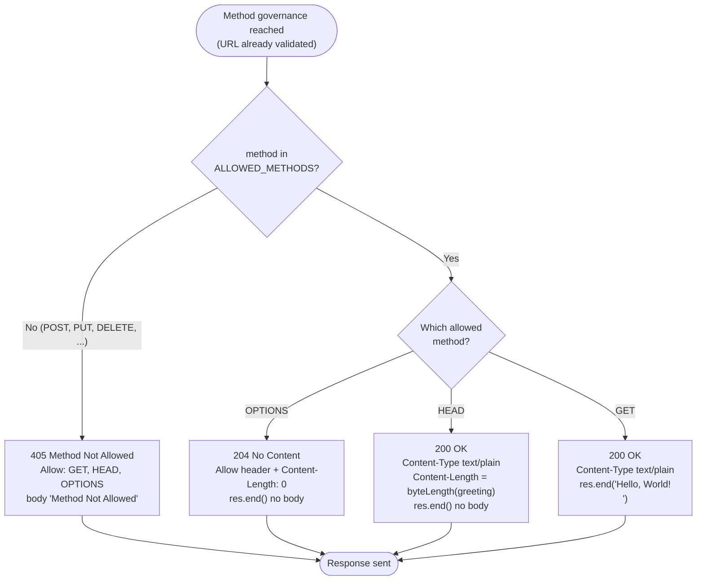
```mermaid
flowchart TD
    M0(["Method governance reached<br/>(URL already validated)"]) --> M1{"method in<br/>ALLOWED_METHODS?"}
    M1 -->|"No (POST, PUT, DELETE, ...)"| M2["405 Method Not Allowed<br/>Allow: GET, HEAD, OPTIONS<br/>body 'Method Not Allowed'"]
    M1 -->|"Yes"| M3{"Which allowed<br/>method?"}
    M3 -->|"OPTIONS"| M4["204 No Content<br/>Allow header + Content-Length: 0<br/>res.end() no body"]
    M3 -->|"HEAD"| M5["200 OK<br/>Content-Type text/plain<br/>Content-Length = byteLength(greeting)<br/>res.end() no body"]
    M3 -->|"GET"| M6["200 OK<br/>Content-Type text/plain<br/>res.end('Hello, World!\n')"]
    M2 --> MEND(["Response sent"])
    M4 --> MEND
    M5 --> MEND
    M6 --> MEND
```

The dispatch behavior is validated by the regression harness: Test 3 asserts `OPTIONS` → `204` with the `Allow` header (`server.test.js` line 223); Tests 4–6 assert `POST`/`PUT`/`DELETE` → `405` (lines 243, 261, 279); Test 2 asserts `HEAD` → `200` with an empty body (line 205); and Tests 1, 7, and 8 assert `GET` → `200` with the correct body and `text/plain` content type across multiple paths (lines 187, 296, 314). GET returns the greeting for **any** path — there is no routing table.

### 4.2.3 Graceful Shutdown Process Flow

The graceful shutdown flow (F-004) is triggered by the `SIGTERM`/`SIGINT` handlers (`server.js` lines 225-231) or by the process-level error handlers (lines 237-259). The `gracefulShutdown(signal)` function (lines 43-74) is idempotent: a second trigger while a shutdown is already in progress is logged and ignored. On the first trigger it arms an `unref()`-ed forced-exit timer of `SHUTDOWN_TIMEOUT` (5000 ms) and then requests `server.close()`, exiting `0` on clean close or `1` on close error (or if the forced-exit timer fires first).

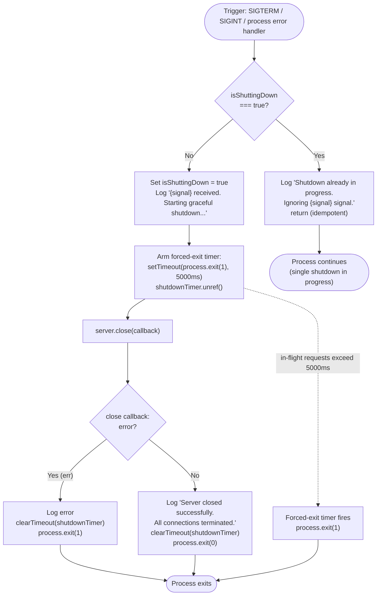
```mermaid
flowchart TD
    G0(["Trigger: SIGTERM / SIGINT / process error handler"]) --> G1{"isShuttingDown<br/>=== true?"}
    G1 -->|"Yes"| G2["Log 'Shutdown already in progress.<br/>Ignoring {signal} signal.'<br/>return (idempotent)"]
    G1 -->|"No"| G3["Set isShuttingDown = true<br/>Log '{signal} received. Starting graceful shutdown...'"]
    G3 --> G4["Arm forced-exit timer:<br/>setTimeout(process.exit(1), 5000ms)<br/>shutdownTimer.unref()"]
    G4 --> G5["server.close(callback)"]
    G5 --> G6{"close callback:<br/>error?"}
    G6 -->|"Yes (err)"| G7["Log error<br/>clearTimeout(shutdownTimer)<br/>process.exit(1)"]
    G6 -->|"No"| G8["Log 'Server closed successfully.<br/>All connections terminated.'<br/>clearTimeout(shutdownTimer)<br/>process.exit(0)"]
    G4 -.->|"in-flight requests exceed 5000ms"| G9["Forced-exit timer fires<br/>process.exit(1)"]
    G2 --> GEND(["Process continues<br/>(single shutdown in progress)"])
    G7 --> GX(["Process exits"])
    G8 --> GX
    G9 --> GX
```

Once shutdown is in progress, the request pipeline's first guard (Section 4.2.1, node `B2`) returns `503` for all new requests, providing back-pressure while existing connections drain. Tests 9 and 10 (`server.test.js` lines 343, 376) verify that both `SIGTERM` and `SIGINT` produce a clean exit code of `0` and emit the shutdown log message.

### 4.2.4 Validation Rules, Authorization, and Compliance Checkpoints

This sub-section consolidates the business rules, data-validation rules, authorization posture, and compliance checkpoints applied across the flows above. All rules are enforced in `server.js`; there is no external policy engine, configuration file, or rules service.

#### 4.2.4.1 Business Rules by Pipeline Step

| Step | Business Rule | Enforcement | Requirement |
|------|---------------|-------------|-------------|
| Shutdown gate | While shutting down, accept no new work; advise retry in 30 s | `503` + `Connection: close` + `Retry-After: 30` (L142-148) | F-004 |
| URL validation | Reject over-long or null-byte URLs before any dispatch | `validateUrl` → `400` (L82-100, 151-156) | F-003 |
| Method governance | Only GET, HEAD, OPTIONS are serviceable | allow-list → `405` + `Allow` (L27, 159-164) | F-002 |
| Greeting response | Every accepted GET returns the same greeting regardless of path | `res.end('Hello, World!\n')` (L185-187) | F-001 |

#### 4.2.4.2 Data Validation Requirements

The only inbound data validated is the request URL. `validateUrl` (`server.js` lines 82-100) applies two rules: the URL length must not exceed `MAX_URL_LENGTH` (2048 characters, returning "URL exceeds maximum length of 2048 characters"), and the URL must not contain a null byte `\0` (returning "URL contains invalid null bytes"). Both failures map to `400 Bad Request`. The guard uses a truthiness check (`url && ...`), so a falsy URL bypasses the checks and proceeds. There is **no** request-body parsing, no JSON schema validation, no query-parameter validation, and no content negotiation — the service accepts and ignores any body.

#### 4.2.4.3 Authorization Checkpoints

The codebase implements **no authentication or authorization** — there are no credentials, tokens, sessions, API keys, roles, or access-control checks anywhere in `server.js`. The only access-control mechanism is the network binding: the server listens exclusively on the loopback address `127.0.0.1` (line 20), which restricts reachability to the local host. This is a deployment-topology control, not an application-level authorization checkpoint, and it is documented as such rather than as a security feature.

#### 4.2.4.4 Regulatory and Protocol Compliance Checks

No regulatory compliance regime (e.g., PCI, HIPAA, GDPR) is referenced or implemented in the repository; the service processes no personal, financial, or regulated data. The applicable "compliance" is limited to HTTP/1.1 protocol semantics, which the server observes at the following checkpoints:

| Compliance Checkpoint | HTTP Semantic | Evidence |
|-----------------------|---------------|----------|
| Method rejection | `405` responses include an `Allow` header enumerating supported methods | `server.js` lines 160-164 |
| Preflight/OPTIONS | `OPTIONS` returns `204 No Content` with `Allow` and `Content-Length: 0` | lines 167-173 |
| HEAD semantics | `HEAD` returns response headers (including `Content-Length`) with no body | lines 176-182 |
| Service unavailability | `503` during shutdown includes advisory `Retry-After` | lines 143-148 |
| Content typing | Text responses set `Content-Type: text/plain` | lines 110-120, 176, 185 |

## 4.3 State Management and Transitions

State in this system is minimal and entirely in-process. The server holds exactly two module-level state variables — `isShuttingDown` (a boolean) and `shutdownTimer` (a timer handle) — declared in `server.js` at lines 33-34. The test harness holds three counters (`testsRun`, `testsPassed`, `testsFailed`) in `server.test.js` (lines 28-30). There is **no** database, no session store, no external state service, and no shared state between processes. This section models the two meaningful state contexts: the long-lived server lifecycle and the ephemeral per-request lifecycle.

### 4.3.1 Server Lifecycle State Machine

The server process transitions through a small set of lifecycle states driven by `server.listen`, incoming signals, and `gracefulShutdown`. The only persistent runtime flag is `isShuttingDown`, which is toggled once (false → true) and gates both new-request handling and shutdown idempotency. The states below are derived from the control flow in `server.js` (startup lines 215-218, error handler lines 194-210, `gracefulShutdown` lines 43-74, signal handlers lines 225-231).

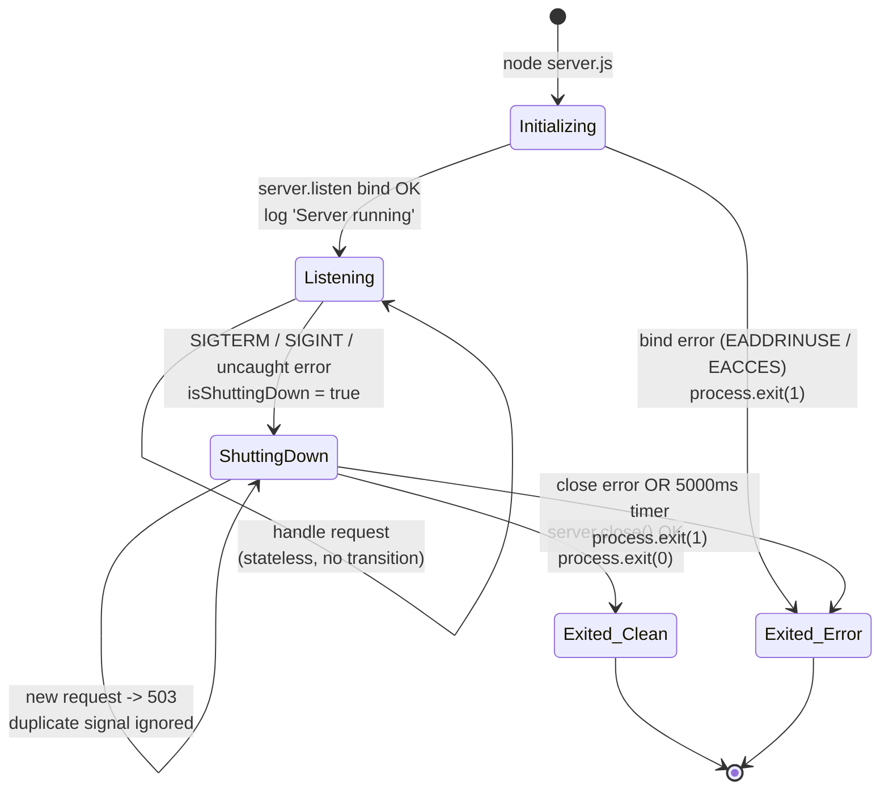
```mermaid
stateDiagram-v2
    [*] --> Initializing: node server.js
    Initializing --> Listening: server.listen bind OK<br/>log 'Server running'
    Initializing --> Exited_Error: bind error (EADDRINUSE / EACCES)<br/>process.exit(1)
    Listening --> Listening: handle request<br/>(stateless, no transition)
    Listening --> ShuttingDown: SIGTERM / SIGINT / uncaught error<br/>isShuttingDown = true
    ShuttingDown --> ShuttingDown: new request -> 503<br/>duplicate signal ignored
    ShuttingDown --> Exited_Clean: server.close() OK<br/>process.exit(0)
    ShuttingDown --> Exited_Error: close error OR 5000ms timer<br/>process.exit(1)
    Exited_Clean --> [*]
    Exited_Error --> [*]
```

| State | Meaning | Entry Action | Exit Trigger |
|-------|---------|--------------|--------------|
| Initializing | Module loaded, listen requested | Read constants; init `isShuttingDown=false`, `shutdownTimer=null` (L33-34) | Bind result |
| Listening | Idle, servicing requests | Log `Server running` (L215-218) | Signal or fatal error |
| ShuttingDown | Draining; `isShuttingDown=true` | Arm 5000 ms `unref()` timer; call `server.close()` (L54-73) | Close callback or timer |
| Exited_Clean | Clean termination | `process.exit(0)` (L69) | — (terminal) |
| Exited_Error | Failure termination | `process.exit(1)` (L48, 62, 208) | — (terminal) |

The `Listening → Listening` self-transition emphasizes that servicing a request does **not** mutate server state (the greeting is constant and no counters are kept); the only state mutation in the entire request path is none. The `ShuttingDown → ShuttingDown` self-transition captures both the idempotent handling of duplicate signals and the `503` response returned to any new request while draining.

### 4.3.2 Request Processing State and Data Persistence Boundaries

Each HTTP request is processed within a single invocation of the request callback and retains **no** state after `res.end(...)` returns. The per-request "state" is purely the local progression through the guard cascade; nothing is written to disk, memory cache, or an external store. The diagram below models this ephemeral lifecycle.

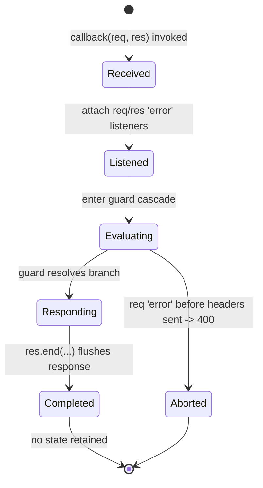
```mermaid
stateDiagram-v2
    [*] --> Received: callback(req, res) invoked
    Received --> Listened: attach req/res 'error' listeners
    Listened --> Evaluating: enter guard cascade
    Evaluating --> Responding: guard resolves branch
    Responding --> Completed: res.end(...) flushes response
    Completed --> [*]: no state retained
    Evaluating --> Aborted: req 'error' before headers sent -> 400
    Aborted --> [*]
```

#### 4.3.2.1 Data Persistence Points

There are **no data persistence points**. The service reads no files at request time, writes no files, and connects to no database or cache. The greeting payload `Hello, World!\n` is a literal string constructed in code (`server.js` lines 176-187). The static data file `industry.csv` present in the repository is never read by `server.js` or `server.test.js` (the only `require` statements are `http`, and — in the test harness — `child_process` and `path`), so it constitutes no persistence layer.

#### 4.3.2.2 Caching Requirements

There are **no caching requirements or mechanisms**. No response cache, in-memory memoization, `Cache-Control`/`ETag` headers, or CDN integration exists. Because every GET returns an identical constant, caching would be trivial to add but is not implemented; the code recomputes the response on each request without any cache lookup.

#### 4.3.2.3 Transaction Boundaries

There are **no transaction boundaries**. With no database or mutable shared resource, there is nothing to commit or roll back. The closest analog to an atomic operation is the single synchronous `res.end(...)` call that flushes exactly one response per request; because the handler contains no `await` between guard evaluation and response emission, each request is processed to completion without interleaving. The only cross-request coordination is the read of the `isShuttingDown` flag at the top of the pipeline, which is a lock-free single-threaded read on the Node.js event loop.

## 4.4 Error Handling and Recovery

Error handling (feature F-005) is implemented as four independent layers in `server.js`, each bound to a distinct error source at startup. The design goal evidenced in the code is fail-fast for unrecoverable process/server errors (exit with a non-zero code so an external supervisor can restart the process) and graceful degradation for request-scoped errors (return an appropriate HTTP status without crashing). This section presents the layered flowchart and then documents the retry, fallback, notification, and recovery behavior exactly as implemented.

### 4.4.1 Multi-Layer Error Handling Flowchart

The four layers are: (1) server-level binding/socket errors, (2) request-stream errors, (3) response-stream errors, and (4) process-level unhandled errors. Layers 1 and 4 are fatal (they call `process.exit`), Layer 2 attempts to return a `400` if the response has not yet started, and Layer 3 logs only.

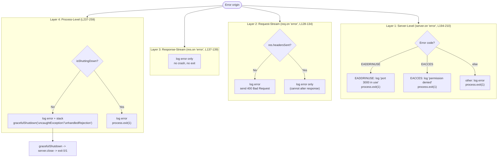
```mermaid
flowchart TD
    subgraph L1["Layer 1: Server-Level (server.on 'error', L194-210)"]
        direction TB
        SL1{"Error code?"}
        SL2["EADDRINUSE: log 'port 3000 in use'<br/>process.exit(1)"]
        SL3["EACCES: log 'permission denied'<br/>process.exit(1)"]
        SL4["other: log error<br/>process.exit(1)"]
        SL1 -->|"EADDRINUSE"| SL2
        SL1 -->|"EACCES"| SL3
        SL1 -->|"else"| SL4
    end
    subgraph L2["Layer 2: Request-Stream (req.on 'error', L128-134)"]
        direction TB
        RQ1{"res.headersSent?"}
        RQ2["log error<br/>send 400 Bad Request"]
        RQ3["log error only<br/>(cannot alter response)"]
        RQ1 -->|"No"| RQ2
        RQ1 -->|"Yes"| RQ3
    end
    subgraph L3["Layer 3: Response-Stream (res.on 'error', L137-139)"]
        direction TB
        RS1["log error only<br/>no crash, no exit"]
    end
    subgraph L4["Layer 4: Process-Level (L237-259)"]
        direction TB
        PL1{"isShuttingDown?"}
        PL2["log error + stack<br/>gracefulShutdown('uncaughtException'/'unhandledRejection')"]
        PL3["log error<br/>process.exit(1)"]
        PL1 -->|"No"| PL2
        PL1 -->|"Yes"| PL3
    end
    ESRC(["Error origin"]) --> L1
    ESRC --> L2
    ESRC --> L3
    ESRC --> L4
    PL2 --> GSD["gracefulShutdown -> server.close -> exit 0/1"]
```

| Layer | Source | Behavior | Terminal? |
|-------|--------|----------|-----------|
| 1 — Server | `server.on('error')` (L194-210) | Diagnose `EADDRINUSE`/`EACCES`/other; log; `process.exit(1)` | Yes (exit 1) |
| 2 — Request stream | `req.on('error')` (L128-134) | If headers not sent, return `400`; otherwise log only | No |
| 3 — Response stream | `res.on('error')` (L137-139) | Log only; no crash, no exit | No |
| 4 — Process | `uncaughtException`/`unhandledRejection` (L237-259) | Log + stack; `gracefulShutdown()` if not already shutting down, else `process.exit(1)` | Yes (via shutdown) |

### 4.4.2 Retry, Fallback, Notification, and Recovery Procedures

The section prompt calls for retry mechanisms, fallback processes, error notification flows, and recovery procedures. The repository implements these to a deliberately minimal degree; each is documented below honestly, including where a capability is intentionally absent.

#### 4.4.2.1 Retry Mechanisms

The **server implements no internal retry logic** — there are no retry loops, backoff timers, or automatic re-attempts for any operation, because there are no outbound calls or fallible resources to retry against. The only retry-related artifact is client-facing and advisory: the `503` shutdown response includes a `Retry-After: 30` header (`server.js` lines 143-148), signaling clients to retry after 30 seconds. Honoring that hint is the client's responsibility; the server takes no action.

The **test harness** contains one retry-like safeguard: `startServer` aborts and `SIGKILL`s the child if the `Server running` marker is not observed within a 5000 ms startup timeout (`server.test.js` lines 74-110), but it does not re-spawn — a failed start rejects the promise.

#### 4.4.2.2 Fallback Processes

There are **no application-level fallback processes** (no degraded mode, no secondary data source, no circuit breaker). The single graceful-degradation behavior is the `503` shutdown gate, which lets the server refuse new work cleanly while draining rather than dropping connections abruptly. The test harness provides an operational fallback for termination: if a child process does not exit after a signal, `stopServer` escalates to `SIGKILL` after a 10000 ms force-kill timeout (`server.test.js` lines 118-148), mirroring the server's own 5000 ms `SHUTDOWN_TIMEOUT` forced-exit timer.

#### 4.4.2.3 Error Notification Flows

Error notification is limited to **console logging**; there is no email, webhook, alerting, metrics, or structured-logging integration. All four error layers write diagnostics via `console.error`/`console.log` (e.g., server error diagnostics at lines 194-210, request-error log at lines 128-134, process-error log with stack traces at lines 237-259). When the server runs as a child of the test harness, these console streams are captured through the child process's `stdout`/`stderr` and asserted against (`server.test.js` `startServer`/`stopServer`, lines 74-148). In production the streams would flow to whatever the supervising process manager captures.

#### 4.4.2.4 Recovery Procedures

In-process recovery is intentionally minimal: fatal errors (Layer 1 binding failures and Layer 4 unhandled exceptions/rejections) result in **process termination with a non-zero exit code**, delegating restart/recovery to an external supervisor (e.g., a container runtime, Kubernetes, or a process manager such as PM2). This is the documented operational posture — the repository contains no built-in restart loop, watchdog, or self-healing logic. The recovery paths by error class are:

| Error Class | Recovery Action | Restart Responsibility |
|-------------|-----------------|------------------------|
| Port bind failure (Layer 1) | `process.exit(1)` immediately | External supervisor |
| Uncaught exception / rejection (Layer 4) | Attempt `gracefulShutdown()`; if already shutting down, `process.exit(1)` | External supervisor |
| Request-stream error before headers (Layer 2) | Return `400`; connection recovers, process continues | None (self-recovers) |
| Response-stream error (Layer 3) | Log only; process continues | None |
| Signal-driven shutdown (F-004) | `server.close()` then `exit(0)`; forced `exit(1)` after 5000 ms if draining stalls | External supervisor (for restart) |

Because the process exits `0` on a clean signal-driven shutdown and `1` on any failure, a supervising process manager can use the exit code to distinguish intentional termination from crash-triggered restarts. The regression harness validates the clean-exit path for both `SIGTERM` and `SIGINT` (Tests 9 and 10, `server.test.js` lines 343-400).

## 4.5 References

The following repository files, folders, technical-specification sections, and verification activities were used as evidence for the workflows, diagrams, decision points, state models, and error-handling paths documented in Section 4.

**Repository files inspected**

- `server.js` — Primary evidence for all workflows: the request-handling pipeline and guard cascade (lines 126-188), configuration constants `hostname`/`port`/`SHUTDOWN_TIMEOUT`/`ALLOWED_METHODS`/`MAX_URL_LENGTH` (lines 20-30), module state `isShuttingDown`/`shutdownTimer` (lines 33-34), `gracefulShutdown` (lines 43-74), `validateUrl` (lines 82-100), `sendErrorResponse` (lines 110-120), the four error-handling layers (lines 128-139, 194-210, 237-259), signal handlers (lines 225-231), `server.listen` (lines 215-218), and the module export (line 262).
- `server.test.js` — Evidence for the batch/integration test-harness sequence and timing constants: `makeRequest` (lines 38-68), `startServer` (lines 74-110), `stopServer` (lines 118-148), the ten test cases (lines 187-400), and `runTests` (lines 407-462, invoked at line 465); config `STARTUP_DELAY` and `SHUTDOWN_DELAY` (lines 24-25).
- `package.json` — Established the `start`/`test` scripts, package identity (`hello_world` v1.0.0), and the absence of external dependencies.
- `package-lock.json` — Confirmed zero external dependencies (dependency-free runtime).
- `README.md` — Established project identity (`hao-backprop-test`) and purpose.
- `industry.csv` — Verified as static data **not** read by `server.js` or `server.test.js`; documented as defining no workflow or persistence point.
- `LoginTest.java`, `test.py.txt`, `test.txt.txt`, `100Pages.pdf`, `demo.jpg`, `sample.doc` — Non-functional placeholder/asset files confirmed to define no runtime workflow (explicitly excluded from the flowcharts).

**Repository folders inspected**

- `blitzy/documentation/` — Planning/specification artifacts (`Project Guide.md`, `Technical Specifications.md`); reviewed as supporting context but not treated as application source.

**Technical Specification sections cross-referenced**

- Section 1.2.2 (High-Level Description) — Existing request-pipeline flowchart that Section 4 elaborates upon without duplicating.
- Section 2.2 (Functional Requirements) — Confirmed the absence of any latency/throughput/uptime SLA and the stateless design.
- Section 2.3.1 (Feature Dependency Map) — Confirmed the authoritative pipeline ordering F-004 → F-003 → F-002 → F-001 reflected in the request-handling flows.

**Verification activities**

- Executed `node server.test.js` on Node.js v22.23.1 — result `Test Results: 10 passed, 0 failed`, empirically confirming the request-dispatch, method-governance, and signal-driven shutdown workflows.
- Validated every Mermaid diagram in Section 4 with the Mermaid CLI (`mmdc` v11.16.0) prior to inclusion to ensure syntactic correctness and renderability.

# 5. System Architecture

## 5.1 High-Level Architecture

This section describes the architecture of the repository's only executable product surface: a single Node.js HTTP service (`server.js`) and its self-contained regression harness (`server.test.js`). Every claim below is grounded in the repository's source, manifests, and its own committed change documentation. Consistent with Sections 1.2, 4.1, 4.3, and 4.4, the system is a **single-process, dependency-free, stateless** service that preserves a minimal "Hello, World!" contract while layering in operational robustness. Because the project is a **reference / test fixture** (the `README.md` calls it a *"test project for backprop integration"*), the architecture is deliberately narrow: there is no database, no external service integration, no clustering, and no infrastructure-as-code in the repository.

### 5.1.1 System Overview

**Overall architectural style and rationale.** The system is a **single-process, single-threaded, event-driven monolith** implemented entirely on Node.js core modules. It follows the classic Node.js reactor model: one `http.createServer` instance (`server.js` line 126) registers a single request callback that runs on the libuv event loop, and the process lifecycle is driven by asynchronous OS/process events rather than by a long-running control thread. The rationale, corroborated by the repository's own `blitzy/documentation/Technical Specifications.md` (Agent Action Plan, section 0.5), is intentional minimalism: the service began as an approximately 14-line "Hello, World!" server and was hardened in place, so the architecture keeps a single deployable artifact, zero third-party dependencies, and an auditable surface small enough to be verified by a self-contained test harness.

**Key architectural principles and patterns.** The following principles are directly evidenced in `server.js`:

- **Zero-dependency, Node-core-only** — the sole runtime import is `require('http')` (line 17); `package-lock.json` records no resolved external packages.
- **Stateless request handling** — every `GET` returns the identical constant `Hello, World!\n`; no per-request state survives `res.end(...)` (see Section 4.3).
- **Guard-cascade (chain-of-guard-clauses) request processing** — the request callback is a fixed, synchronous decision cascade that evaluates guards in a strict order (shutdown → URL → method → dispatch) and emits exactly one response.
- **Fail-fast for unrecoverable errors, graceful degradation for request-scoped errors** — server-level and process-level faults call `process.exit(1)`, while malformed request streams degrade to a `400` (see Section 4.4).
- **Signal-driven, idempotent lifecycle** — `SIGTERM`/`SIGINT` trigger a single, bounded `gracefulShutdown()` (lines 43-74, 225-231).
- **Configuration-as-constants** — behavior is parameterized by module-level constants (`hostname`, `port`, `SHUTDOWN_TIMEOUT`, `MAX_URL_LENGTH`, `ALLOWED_METHODS`, lines 20-30) rather than environment variables or config files.
- **Testability via programmatic export** — `module.exports = { server, gracefulShutdown }` (line 262) exposes the internals for programmatic control.

**System boundaries and major interfaces.** The entire system runs inside **one operating-system process**. That process boundary is crossed by a small, well-defined set of interfaces: an inbound HTTP interface bound to the loopback address `127.0.0.1:3000` (so the service is not externally reachable by default); an inbound OS-signal interface (`SIGTERM`, `SIGINT`); outbound diagnostics to `stdout`/`stderr`; an outbound POSIX exit code (`0` clean, `1` failure) consumed by a supervising process manager; and an in-process CommonJS export consumed only by the test harness, which additionally spawns the service as a child process. The context diagram below shows these boundaries and interfaces.

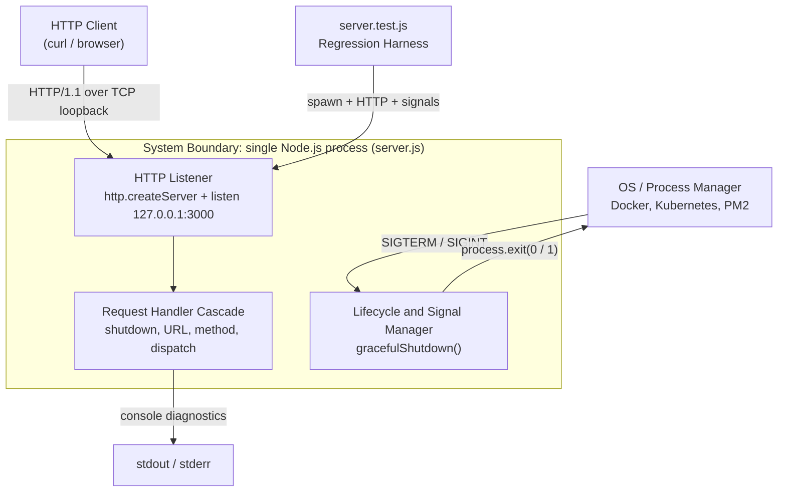
```mermaid
flowchart TB
    Client["HTTP Client<br/>(curl / browser)"]
    OSMgr["OS / Process Manager<br/>Docker, Kubernetes, PM2"]
    Harness["server.test.js<br/>Regression Harness"]
    Logs["stdout / stderr"]
    subgraph Boundary["System Boundary: single Node.js process (server.js)"]
        direction TB
        Listener["HTTP Listener<br/>http.createServer + listen 127.0.0.1:3000"]
        Cascade["Request Handler Cascade<br/>shutdown, URL, method, dispatch"]
        Lifecycle["Lifecycle and Signal Manager<br/>gracefulShutdown()"]
        Listener --> Cascade
    end
    Client -->|"HTTP/1.1 over TCP loopback"| Listener
    Harness -->|"spawn + HTTP + signals"| Listener
    OSMgr -->|"SIGTERM / SIGINT"| Lifecycle
    Cascade -->|"console diagnostics"| Logs
    Lifecycle -->|"process.exit(0 / 1)"| OSMgr
```

### 5.1.2 Core Components

Although the service is a single file, it decomposes into distinct logical components with clear responsibilities. The table below (kept to four columns) lists each component, its responsibility, key dependencies, and integration points; a second table records critical considerations for each.

| Component | Primary Responsibility | Key Dependencies |
|-----------|------------------------|------------------|
| HTTP Listener (`server.js` L126, L215-218) | Create the HTTP server and bind/listen on `127.0.0.1:3000`; hand each connection to the cascade | Node `http` built-in; config constants (L20-30) |
| Request Handler Cascade (`server.js` L126-188) | Evaluate the ordered guard chain and dispatch exactly one HTTP response | HTTP Listener; `validateUrl`; `sendErrorResponse`; `isShuttingDown` flag |
| Validation & Response Utilities (`server.js` L82-120) | `validateUrl` (length / null-byte checks) and `sendErrorResponse` (uniform `text/plain` errors) | None (pure helpers over `req`/`res`) |
| Lifecycle & Signal Manager (`server.js` L43-74, L194-210, L225-259) | Graceful shutdown, signal handling, server/process error handling, exit codes | Node `process`, `server.close()`, `setTimeout` |
| Regression Test Harness (`server.test.js`) | Spawn the server and assert the HTTP contract and shutdown behavior across 10 tests | Node `http`, `child_process.spawn`, `path`; `server.js` |
| Package Manifest & Lockfile (`package.json`, `package-lock.json`) | Declare entry point, `start`/`test` scripts, metadata; lock a zero-dependency install | npm |

| Component | Critical Considerations |
|-----------|-------------------------|
| HTTP Listener | Loopback-only bind is the sole network access control; port `3000` is hard-coded; a bind failure (`EADDRINUSE`/`EACCES`) terminates the process |
| Request Handler Cascade | Guard order is authoritative (F-004 → F-003 → F-002 → F-001, per Section 2.3); fully synchronous with no `await`; every path returns the same greeting |
| Validation & Response Utilities | Guards use a truthy check (`url && ...`), so a falsy URL passes; enforces a 2048-char cap and rejects null bytes only (no path normalization or decoding) |
| Lifecycle & Signal Manager | Shutdown is idempotent; a 5000 ms `unref()`-ed timer forces exit if draining stalls; exit code `0` vs `1` lets a supervisor distinguish clean stop from crash |
| Regression Test Harness | Requires port `3000` free; exercises real sockets and real OS signals; inserts 1000 ms inter-phase pauses for port release; uses no external test framework |
| Package Manifest & Lockfile | No `engines` field (Node version not enforced by the manifest); zero dependencies yield a reported 0-vulnerability audit |

### 5.1.3 Data Flow Description

**Primary data flows.** There is exactly one runtime data flow: an inbound HTTP request enters the HTTP Listener over the loopback TCP interface, is passed to the Request Handler Cascade, and produces one HTTP response. The only response "payload" is the constant greeting string `Hello, World!\n`, constructed in code and written directly to the response (`server.js` lines 185-187). The request URL flows one-way into `validateUrl` and is otherwise discarded — it is never persisted, forwarded, or used for routing (all paths map to the same handler). Error diagnostics flow outward only to `console` (`stdout`/`stderr`). When the service runs under the test harness, those console streams are captured through the child process's `stdout`/`stderr` (`server.test.js` lines 74-148), and request/response data flows over the same loopback interface via `makeRequest` (lines 38-68).

**Integration patterns and protocols.** The system uses four integration mechanisms, all local: **HTTP/1.1 over TCP** on `127.0.0.1:3000` for request/response; **POSIX signals** (`SIGTERM`, `SIGINT`) for lifecycle control; **Node.js event-emitter events** (`server`/`req`/`res` `'error'`, `process` `uncaughtException`/`unhandledRejection`) for internal error propagation; and **`child_process.spawn`** plus the **CommonJS module export** for the test harness. No request body is ever read or parsed, so there is no request-side (de)serialization.

**Data transformation points.** Transformations are minimal and synchronous: `Buffer.byteLength('Hello, World!\n')` computes the `Content-Length` for `HEAD` responses (line 179); `sendErrorResponse` appends a newline to each error message (line 119); and the test harness parses paths with the `URL` constructor (line 40). There are no encoders, templating engines, schema validators, or content negotiators.

**Key data stores and caches.** There are **none**. The service is stateless: it connects to no database, cache, session store, or file store, and reads no files at request time. As detailed in Section 4.3, the only in-process state is the server's `isShuttingDown` boolean and `shutdownTimer` handle (lines 33-34) plus the harness's three test counters. The static `industry.csv` file present in the repository is never read by `server.js` or `server.test.js` and therefore constitutes no data store. No response cache, memoization, or `Cache-Control`/`ETag` headers exist, even though the constant response would make caching trivial to add.

### 5.1.4 External Integration Points

This system has **no external integration points**. It integrates with no third-party APIs, databases, message brokers, identity providers, monitoring services, or cloud platforms. This is confirmed by three independent lines of evidence: `package-lock.json` records zero external dependencies; the only `require` statements are Node built-ins (`http`, `child_process`, `path`); and `blitzy/documentation/Technical Specifications.md` (section 0.5) explicitly excludes external dependencies, HTTPS, databases, logging frameworks, load balancing, and rate limiting from scope. Because the listener binds to the loopback interface, the service is not exposed to any external network by default.

What the prompt calls "integration points" therefore reduces to the process's local interface surface — the boundaries listed in Section 5.1.1. The table below documents each interface and, in place of an externally negotiated SLA (none exists), the only timing constraints actually present in code. No latency, throughput, or uptime SLA is defined anywhere in the repository (see Sections 1.2.3, 4.1.1.4).

| Interface | Direction | Protocol / Mechanism | SLA / Timing Constraint |
|-----------|-----------|----------------------|-------------------------|
| HTTP loopback (`127.0.0.1:3000`) | Inbound | HTTP/1.1 over TCP | None defined (no latency/throughput target) |
| OS signals (`SIGTERM`, `SIGINT`) | Inbound | POSIX process signals | Shutdown bounded by 5000 ms forced-exit timer |
| Console diagnostics | Outbound | `stdout` / `stderr` text streams | None |
| Process exit status | Outbound | POSIX exit code (`0` clean / `1` failure) | None |
| Programmatic export | In-process | CommonJS `module.exports = { server, gracefulShutdown }` | None |
| Child-process spawn (test only) | Internal | `child_process.spawn('node', ['server.js'])` | Harness: 5000 ms startup timeout, 10000 ms force-kill |

The one integration posture that is *designed for* but not *configured in* the repository is process-manager compatibility: the `SIGTERM` handler comment and `blitzy/documentation/Project Guide.md` both note that the graceful-shutdown path is intended to interoperate with Docker, Kubernetes, and PM2, which deliver `SIGTERM` on stop. No orchestrator manifests, Dockerfiles, or PM2 ecosystem files are present, so this remains an intended runtime integration rather than an implemented one.

## 5.2 Component Details

This section details the system's two major components — the HTTP Server Service (`server.js`) and the Regression Test Harness (`server.test.js`) — followed by the supporting configuration surface. For each component it documents purpose, technologies, key interfaces, data-persistence requirements, and scaling considerations, and provides the required component-interaction, state-transition, and sequence diagrams.

### 5.2.1 HTTP Server Service (server.js)

**Purpose and responsibilities.** `server.js` is the deployable product. It owns the complete request/response lifecycle and the process lifecycle: it binds a TCP listener on `127.0.0.1:3000`, applies an ordered guard cascade to every request, serves the constant `Hello, World!\n` greeting for `GET`, enforces an HTTP-method allow-list and URL validity checks, and manages startup errors, signal-driven graceful shutdown, and process-level error safety nets. It comprises the six logical sub-components introduced in Section 5.1.2; their interactions are shown below.

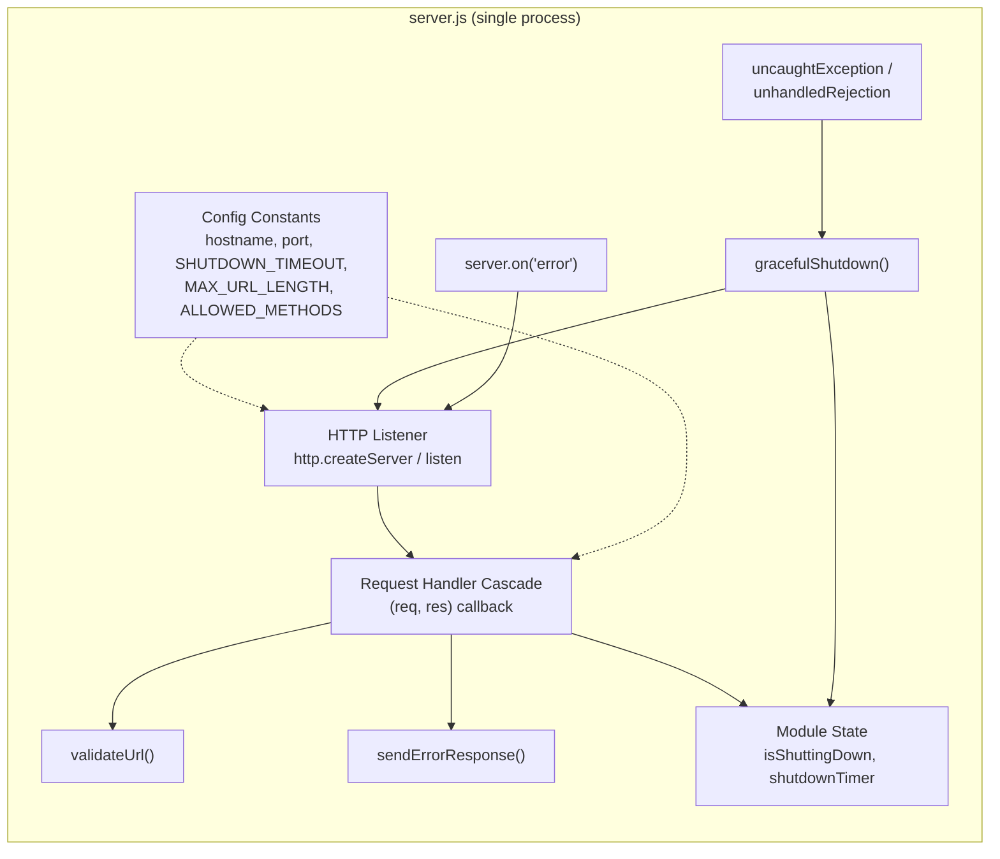
```mermaid
flowchart TD
    subgraph Server["server.js (single process)"]
        direction TB
        Config["Config Constants<br/>hostname, port, SHUTDOWN_TIMEOUT,<br/>MAX_URL_LENGTH, ALLOWED_METHODS"]
        State["Module State<br/>isShuttingDown, shutdownTimer"]
        Listener["HTTP Listener<br/>http.createServer / listen"]
        Cascade["Request Handler Cascade<br/>(req, res) callback"]
        Validate["validateUrl()"]
        SendErr["sendErrorResponse()"]
        Lifecycle["gracefulShutdown()"]
        SrvErr["server.on('error')"]
        ProcErr["uncaughtException /<br/>unhandledRejection"]
    end
    Listener --> Cascade
    Config -.-> Listener
    Config -.-> Cascade
    Cascade --> Validate
    Cascade --> SendErr
    Cascade --> State
    Lifecycle --> State
    Lifecycle --> Listener
    SrvErr --> Listener
    ProcErr --> Lifecycle
```

**Technologies and frameworks used.** The component uses **no framework**. Its entire technology surface is the **Node.js core `http` module** (line 17) running on the Node.js runtime (the repository's `blitzy/documentation/` artifacts require Node.js 20.x+/npm 10.x+; the harness has been observed passing on Node v22.23.1). The code is authored in **CommonJS** JavaScript (no `type: "module"`, no TypeScript, no transpilation) and relies on runtime globals `process`, `console`, `Buffer`, and `setTimeout`/`clearTimeout`. There is no Express, Koa, Fastify, or any other web framework — routing, method handling, and error handling are implemented directly against the `http` primitives.

**Key interfaces and APIs.** The component exposes one network API (the HTTP contract), one control interface (OS signals), and one programmatic interface (the module export). The HTTP contract is summarized below (see Sections 4.1.1.3 and 4.1.2.2 for the full request sequence):

| Request | Response Status | Response Detail |
|---------|-----------------|-----------------|
| `GET` (any path) | `200` | `Content-Type: text/plain`; body `Hello, World!\n` |
| `HEAD` (any path) | `200` | `Content-Type: text/plain`; `Content-Length` set; no body |
| `OPTIONS` | `204` | `Allow: GET, HEAD, OPTIONS`; `Content-Length: 0` |
| Disallowed method (`POST`/`PUT`/`DELETE`/…) | `405` | `Allow` header; body `Method Not Allowed` |
| URL > 2048 chars or containing a null byte | `400` | body `Bad Request - <reason>` |
| Any request while shutting down | `503` | `Connection: close`; `Retry-After: 30` |

The **control interface** consists of the `SIGTERM` and `SIGINT` handlers (lines 225-231). The **programmatic API** is `module.exports = { server, gracefulShutdown }` (line 262), which lets an importer (the test harness, or any embedding code) access the server instance and trigger shutdown directly.

The server's lifecycle — the key architectural state machine — is shown next; it aligns with the authoritative model in Section 4.3.1.

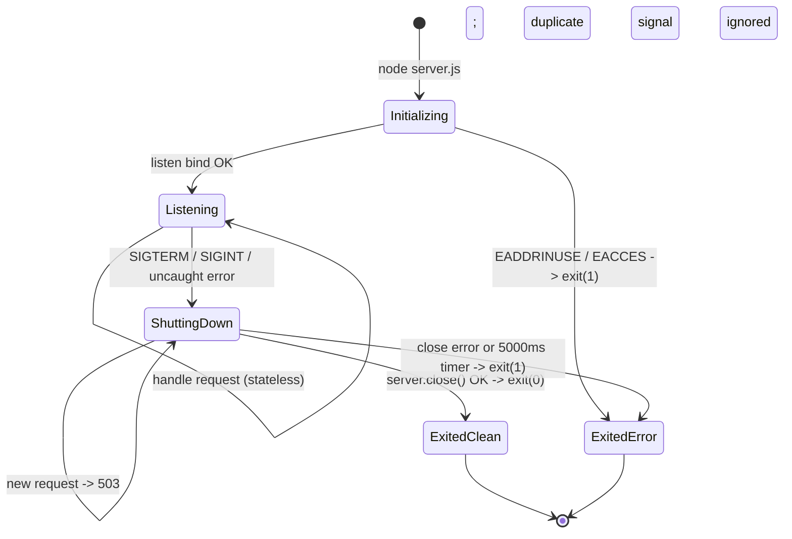
```mermaid
stateDiagram-v2
    [*] --> Initializing: node server.js
    Initializing --> Listening: listen bind OK
    Initializing --> ExitedError: EADDRINUSE / EACCES -> exit(1)
    Listening --> Listening: handle request (stateless)
    Listening --> ShuttingDown: SIGTERM / SIGINT / uncaught error
    ShuttingDown --> ShuttingDown: new request -> 503; duplicate signal ignored
    ShuttingDown --> ExitedClean: server.close() OK -> exit(0)
    ShuttingDown --> ExitedError: close error or 5000ms timer -> exit(1)
    ExitedClean --> [*]
    ExitedError --> [*]
```

The graceful-shutdown flow — a key operational sequence not otherwise diagrammed — is:

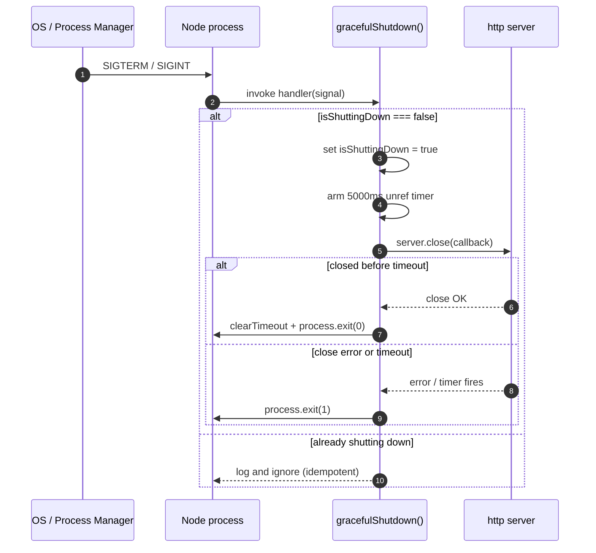
```mermaid
sequenceDiagram
    autonumber
    participant OS as OS / Process Manager
    participant Proc as Node process
    participant GS as gracefulShutdown()
    participant Srv as http server
    OS->>Proc: SIGTERM / SIGINT
    Proc->>GS: invoke handler(signal)
    alt isShuttingDown === false
        GS->>GS: set isShuttingDown = true
        GS->>GS: arm 5000ms unref timer
        GS->>Srv: server.close(callback)
        alt closed before timeout
            Srv-->>GS: close OK
            GS->>Proc: clearTimeout + process.exit(0)
        else close error or timeout
            Srv-->>GS: error / timer fires
            GS->>Proc: process.exit(1)
        end
    else already shutting down
        GS-->>Proc: log and ignore (idempotent)
    end
```

**Data persistence requirements.** None. The component reads no files at request time, writes no files, and connects to no database or cache. Its only state is the two in-process variables `isShuttingDown` and `shutdownTimer` (lines 33-34), which are lost on exit by design (see Section 4.3.2).

**Scaling considerations.** The service is a single-threaded, single-process event-loop server; one process services all connections on its port. There is **no clustering** in the repository — the `cluster` module, `worker_threads`, and any PM2 ecosystem file are absent. Because the handler performs only trivial, synchronous, constant work and holds no shared state, the service is in principle **horizontally scalable** (independent instances behind an external load balancer would need no coordination), but two practical constraints apply: (1) the host and port are **hard-coded constants** with no `PORT`/`HOST` environment override (making external configuration a documented remaining human task in `blitzy/documentation/Project Guide.md`), so multiple instances on one host would collide on port 3000 — a condition the server detects as `EADDRINUSE` and fails fast on; and (2) the loopback bind means any externally scaled deployment would require a reverse proxy or rebinding. No connection caps, keep-alive tuning, rate limiting, or backpressure controls beyond Node.js defaults are implemented.

### 5.2.2 Regression Test Harness (server.test.js)

**Purpose and responsibilities.** `server.test.js` is a self-contained, self-executing regression harness (feature F-006) that verifies the HTTP Server Service against its contract. It spawns `server.js` as a child process, drives it over real loopback HTTP and real OS signals, asserts 10 test cases, prints `Test Results: X passed, Y failed`, and exits with a non-zero code if any test fails (lines 407-465). It is the executable definition of "correct" for the service.

**Technologies and frameworks used.** Like the server, the harness uses **no external test framework** (no Jest, Mocha, or assertion library). It is built on three Node.js core modules — `http` (as an HTTP client via `http.request`), `child_process` (`spawn` to launch and signal the server), and `path` (to resolve `server.js`) — plus the global `URL` constructor and native `Promise`s (lines 15-17). Assertions are plain boolean comparisons routed through a `logTestResult` helper.

**Key interfaces.** The harness consumes the same three interfaces the server exposes: it starts the process via `child_process.spawn('node', ['server.js'])` and reads readiness from the child's `stdout` marker `Server running` (lines 74-110); it issues HTTP requests through `makeRequest` over `127.0.0.1:3000` (lines 38-68); and it drives shutdown by sending `SIGTERM`/`SIGINT` to the child and observing the exit code (lines 118-148). This is black-box integration testing — the harness treats the server as an opaque process, not an imported module.

**Data persistence requirements.** None. The harness keeps three in-memory counters (`testsRun`, `testsPassed`, `testsFailed`, lines 28-30) and writes results only to the console; it persists nothing. (The untracked `test_out.txt` seen in the working tree is a captured console transcript of a prior run, not a harness output file.)

**Scaling considerations.** The harness is deliberately **sequential and single-instance**: tests 1-8 run against one shared server process, which is then stopped before the signal tests 9-10 each spawn and stop their own dedicated process, with 1000 ms pauses between phases to allow the loopback port to be released (lines 434-444). Because every phase reuses the fixed port `3000`, the suite cannot run in parallel against itself and requires that port to be free; it does not scale to concurrent execution without code changes.

### 5.2.3 Configuration and Package Surface

**Purpose and responsibilities.** The manifests define how the component is launched and installed. `package.json` declares the package name `hello_world` (v1.0.0, MIT), the `main` entry point `server.js`, and the two npm scripts `start` (`node server.js`) and `test` (`node server.test.js`). `package-lock.json` (lockfileVersion 3) pins a reproducible install that contains **zero external dependencies**, which is the basis for the reported 0-vulnerability audit.

**Technologies and interfaces.** The only "configuration interface" at runtime is the set of **module-level constants** in `server.js` (lines 20-30): `hostname`, `port`, `SHUTDOWN_TIMEOUT`, `MAX_URL_LENGTH`, and `ALLOWED_METHODS`. There is no environment-variable layer, `.env` file, config module, or command-line argument parsing; changing behavior currently requires editing the source. Making these values environment-configurable (`PORT`, `HOST`, `SHUTDOWN_TIMEOUT`) is explicitly listed as a remaining production-configuration task in `blitzy/documentation/Project Guide.md`.

**Data persistence and scaling.** Not applicable — these are static declarative files with no runtime state and no scaling behavior of their own; they simply parameterize how the runtime and package manager treat the service.

## 5.3 Technical Decisions

This section records the significant architectural decisions evidenced in the repository and the rationale behind them. Because the project is a deliberately minimal reference/test fixture, most decisions are decisions to *exclude* complexity; those exclusions are documented as first-class choices with their tradeoffs, grounded in the code and in the scope boundaries stated in `blitzy/documentation/Technical Specifications.md` (section 0.5).

### 5.3.1 Architecture Style Decisions and Tradeoffs

The governing decision is to implement a **single-process, single-threaded, dependency-free monolith directly on the Node.js `http` module**, rather than adopting a web framework, a multi-process/clustered topology, or a service-oriented decomposition. The rationale is that the service is a hardened "Hello, World!" fixture whose original contract (host, port, greeting, simple routing) had to be preserved exactly while adding robustness; a framework or distributed topology would add dependencies, configuration, and failure modes disproportionate to a constant-response endpoint. The principal tradeoffs:

| Chosen Approach | Benefit | Tradeoff Accepted |
|-----------------|---------|-------------------|
| Node core `http`, no framework | Zero dependencies; small, auditable surface; no supply-chain risk | Routing, method handling, and errors are hand-coded rather than declarative |
| Single process, single thread | Simplest possible model; no IPC or shared-state concerns | No multi-core utilization; a blocking handler would stall all requests |
| Stateless, constant response | Trivial correctness; no persistence or cache to manage | No dynamic behavior; not representative of a data-backed service |
| Configuration as source constants | No config files/plumbing; fully deterministic | Requires code edits to retune host/port/timeouts (no env overrides) |

The following decision tree captures the consistent rule the codebase applies when evaluating whether a candidate capability belongs in the fixture — a rule inferred from which capabilities were implemented (method/URL validation, graceful shutdown, error handling) versus explicitly excluded (external dependencies, HTTPS, databases, logging frameworks, load balancing, rate limiting).

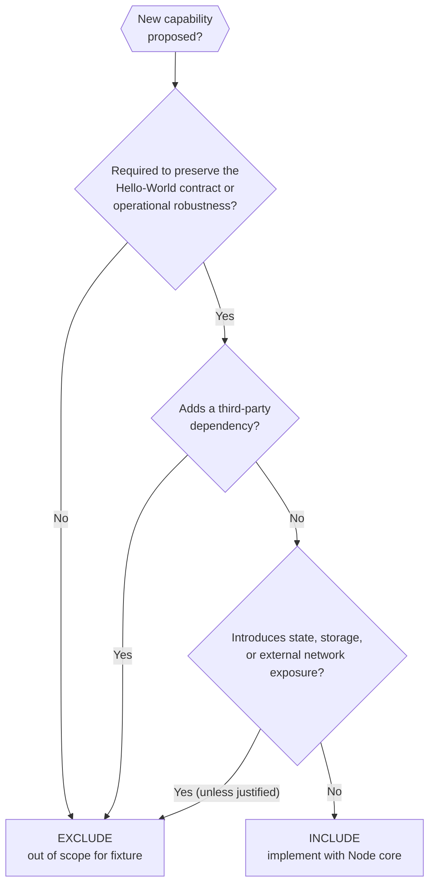
```mermaid
flowchart TD
    Start{{"New capability<br/>proposed?"}}
    Q1{"Required to preserve the<br/>Hello-World contract or<br/>operational robustness?"}
    Q2{"Adds a third-party<br/>dependency?"}
    Q3{"Introduces state, storage,<br/>or external network exposure?"}
    Include["INCLUDE<br/>implement with Node core"]
    Exclude["EXCLUDE<br/>out of scope for fixture"]
    Start --> Q1
    Q1 -->|No| Exclude
    Q1 -->|Yes| Q2
    Q2 -->|Yes| Exclude
    Q2 -->|No| Q3
    Q3 -->|"Yes (unless justified)"| Exclude
    Q3 -->|No| Include
```

### 5.3.2 Communication Pattern Choices

The service uses **synchronous request/response over HTTP/1.1** as its only external communication pattern, and **OS signals** plus **Node.js event-emitter callbacks** internally. There is no asynchronous messaging, no publish/subscribe, no streaming, and no RPC. This choice follows directly from the workload: a stateless endpoint returning a constant string has no need for queues, brokers, or long-lived connections. Two specific pattern decisions are notable:

- **Request handling is a synchronous guard cascade, not middleware.** Rather than a framework middleware chain, the callback evaluates guards in a fixed order and returns after the first match (`server.js` lines 126-188). This yields deterministic, easy-to-audit behavior at the cost of extensibility.
- **Lifecycle control is signal-driven and event-based.** `SIGTERM`/`SIGINT` and process/stream `error` events are the control channels (lines 194-259). This aligns the process with process-manager conventions (Docker/Kubernetes/PM2 send `SIGTERM`) without requiring any additional control API or admin endpoint.

### 5.3.3 Data Storage and Caching Rationale

**Data storage: intentionally none.** The service persists nothing and connects to no database, key-value store, or file store. This is a deliberate decision, not an omission: every response is a compile-time constant, so there is no entity, session, or event to store. `blitzy/documentation/Technical Specifications.md` explicitly lists "database connections" as out of scope. The consequence is that the service holds no durable state to back up, migrate, or secure — but it is also unrepresentative of any data-driven workload, and adding storage later would require introducing the dependency, configuration, and error-handling layers the fixture currently avoids.

**Caching: intentionally none.** No response cache, in-memory memoization, or HTTP cache directives (`Cache-Control`, `ETag`) are implemented (see Section 4.3.2.2). The rationale is that the single `GET` response is already a constant computed with negligible cost, so a cache would add state and invalidation logic with no measurable benefit. The tradeoff is explicit and low-risk: the handler recomputes the trivial response on each request. This decision would need revisiting only if a future version served dynamic or expensive content.

### 5.3.4 Security Mechanism Selection

Security is addressed through a small set of **defensive, dependency-free input and exposure controls** rather than any authentication/authorization framework. The selected mechanisms and what they mitigate:

| Security Mechanism | Threat Mitigated | Evidence |
|--------------------|------------------|----------|
| Loopback-only bind (`127.0.0.1`) | Unintended external network exposure | `server.js` L20, L215-218 |
| HTTP method allow-list → `405` | Unexpected/unsafe verbs; matches RFC 7231 | L27, L159-164 |
| URL length cap (2048) → `400` | Overlong-URL / buffer-abuse attempts | L30, L84-89 |
| Null-byte rejection → `400` | Null-byte injection in the request target | L92-97 |
| Zero third-party dependencies | Supply-chain and transitive-CVE exposure | `package-lock.json` |

The method allow-list decision is explicitly justified in the change documentation by **HTTP/1.1 RFC 7231**, which specifies returning `405` with an `Allow` header for unsupported methods; the null-byte and length checks are recorded in `blitzy/documentation/Project Guide.md` as mitigations for injection and long-URL risks. Equally important is what was **deliberately not selected**: there is **no authentication, no authorization, no TLS/HTTPS, no rate limiting, and no CORS policy** beyond the `OPTIONS`/`Allow` reflection. `blitzy/documentation/Technical Specifications.md` places HTTPS and rate limiting out of scope, and the loopback bind is treated as the sole access-control boundary. For any externally exposed deployment, these absent controls would need to be supplied by surrounding infrastructure (e.g., a TLS-terminating reverse proxy), a point returned to in Section 5.4.4.

### 5.3.5 Architecture Decision Records (ADRs)

The table below consolidates the significant decisions as lightweight ADRs. All are currently **Accepted** and reflected in the committed code.

| ADR | Decision | Rationale | Consequence / Tradeoff |
|-----|----------|-----------|------------------------|
| ADR-01 | Use only Node.js core modules; zero third-party dependencies | Minimal, auditable, supply-chain-free fixture; preserve reproducibility | Everything hand-coded; no framework conveniences |
| ADR-02 | No web framework — build directly on `http` | A constant-response endpoint does not warrant a framework | More boilerplate for routing/methods/errors |
| ADR-03 | Single process, single thread; no clustering | Simplest correct model for the workload | No multi-core scaling; blocking work would stall the loop |
| ADR-04 | Stateless; no database or persistence | No entity/session/event exists to store | Not representative of data-backed services |
| ADR-05 | No caching layer or HTTP cache headers | Response is a trivial constant | Response recomputed per request (negligible) |
| ADR-06 | Method allow-list (GET/HEAD/OPTIONS) → 405 + `Allow` | Conform to RFC 7231; reject unsafe verbs | Adding methods requires editing the allow-list |
| ADR-07 | Bind to loopback `127.0.0.1` only | Not externally exposed by default | External exposure needs a proxy or rebind |
| ADR-08 | Signal-driven, idempotent graceful shutdown with 5 s forced-exit timer | Interoperate with process managers; bound drain time | Long requests may be cut off at 5 s |
| ADR-09 | Fail-fast on fatal errors; delegate restart to a supervisor | Clean exit codes let orchestrators restart | No in-process self-healing/watchdog |
| ADR-10 | Console-only logging; no logging framework | Sufficient for the fixture's scope | No structured logs, levels, or sinks |
| ADR-11 | Custom Node-core test harness; no test framework | Keep the zero-dependency guarantee end-to-end | Manual assertion plumbing; sequential, port-bound suite |
| ADR-12 | Configuration via module constants; no env vars | Deterministic, no config plumbing | Retuning requires code changes (noted as a remaining task) |

## 5.4 Cross-Cutting Concerns

This section documents the cross-cutting concerns as they are actually implemented — which, for several concerns, means documenting their deliberate absence. Where a concern is unimplemented, that is stated plainly and tied to the repository's scope decisions and to the remaining production tasks recorded in `blitzy/documentation/Project Guide.md`. Error handling is summarized here from an architectural standpoint and cross-references the authoritative treatment in Section 4.4.

### 5.4.1 Monitoring and Observability Approach

There is **no monitoring or observability stack** in the repository: no metrics library, no `/metrics` or health-check endpoint, no Prometheus/StatsD exporter, and no Application Performance Monitoring (APM) or tracing integration. The observable signals the service actually emits are limited to three, all consumed out-of-process:

- **Readiness marker** — on successful bind, the process writes `Server running at http://127.0.0.1:3000/` to `stdout` (`server.js` lines 215-218). This line is the de-facto readiness probe; the test harness treats it as the signal that the server is up (`server.test.js` lines 84-89).
- **Liveness by response** — the only "health check" available is issuing a `GET` and observing a `200` with the greeting body.
- **Process exit code** — `0` (clean shutdown) versus `1` (failure) is the coarse health signal a supervisor can observe.

Adding a health-check endpoint and monitoring integration is explicitly listed as a remaining, low-priority human task in `blitzy/documentation/Project Guide.md`; it is not implemented here.

### 5.4.2 Logging and Tracing Strategy

Logging is **console-based and unstructured**. All diagnostics are written via `console.log`/`console.error` to `stdout`/`stderr`; there is no logging framework, no JSON/structured output, no log levels, no correlation/request IDs, and no distributed tracing (no OpenTelemetry or equivalent). The concrete log points are:

| Event | Stream | Location |
|-------|--------|----------|
| Startup readiness + shutdown guidance | `stdout` | `server.js` L216-217 |
| Shutdown progress (signal received, closed, timeout) | `stdout` / `stderr` | L46-70 |
| Request-stream and response-stream errors | `stderr` | L129, L138 |
| Server bind errors (`EADDRINUSE`/`EACCES`/other) | `stderr` | L196-208 |
| Uncaught exception / unhandled rejection (+ stack) | `stderr` | L238-251 |

The strategy is intentional: because the service runs as a foreground process under a supervisor, it delegates log collection, rotation, and shipping to whatever captures its `stdout`/`stderr` (a container runtime, PM2, or the shell). The test harness relies on this by capturing the child's streams to assert on shutdown messages (`server.test.js` lines 74-148). Introducing structured logging is a documented remaining task.

### 5.4.3 Error Handling Patterns

Error handling is the most developed cross-cutting concern and is implemented as **four independent handler layers** bound at startup, following a consistent pattern: **fail-fast** (`process.exit(1)`) for unrecoverable server- and process-level faults, and **graceful degradation** (return an HTTP status, keep serving) for request-scoped faults. Section 4.4 is the authoritative reference; the architecture-level disposition flow — how an error's origin determines whether the process responds, logs, or exits and hands off to a supervisor — is shown below.

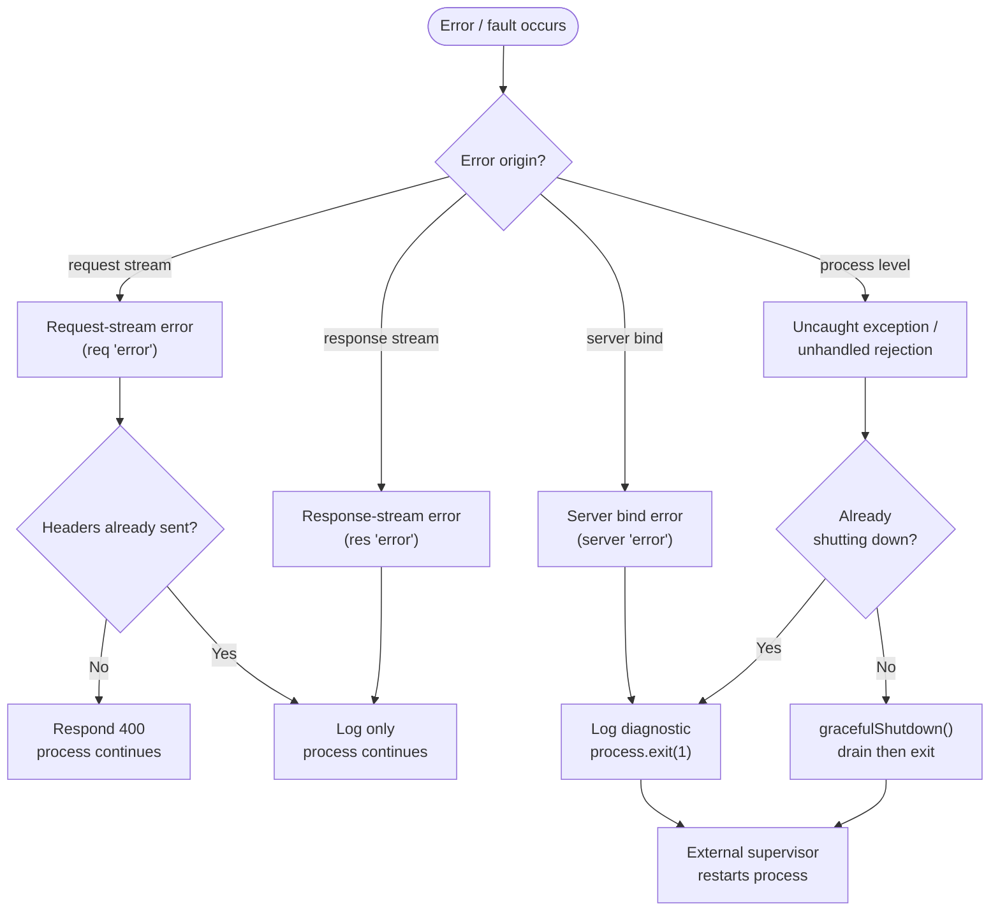
```mermaid
flowchart TD
    Err(["Error / fault occurs"])
    Class{"Error origin?"}
    ReqErr["Request-stream error<br/>(req 'error')"]
    ResErr["Response-stream error<br/>(res 'error')"]
    SrvErr["Server bind error<br/>(server 'error')"]
    ProcErr["Uncaught exception /<br/>unhandled rejection"]
    HdrCheck{"Headers already sent?"}
    R400["Respond 400<br/>process continues"]
    LogOnly["Log only<br/>process continues"]
    Fatal["Log diagnostic<br/>process.exit(1)"]
    ShutCheck{"Already<br/>shutting down?"}
    Graceful["gracefulShutdown()<br/>drain then exit"]
    Sup["External supervisor<br/>restarts process"]
    Err --> Class
    Class -->|request stream| ReqErr
    Class -->|response stream| ResErr
    Class -->|server bind| SrvErr
    Class -->|process level| ProcErr
    ReqErr --> HdrCheck
    HdrCheck -->|No| R400
    HdrCheck -->|Yes| LogOnly
    ResErr --> LogOnly
    SrvErr --> Fatal
    ProcErr --> ShutCheck
    ShutCheck -->|No| Graceful
    ShutCheck -->|Yes| Fatal
    Fatal --> Sup
    Graceful --> Sup
```

Consistent with Section 4.4.2, there are **no retry mechanisms** (the `Retry-After: 30` header on the `503` shutdown response is an advisory client hint, not server-side retry), **no fallback/circuit-breaker logic**, and **no error-notification channel** beyond console logging. Recovery for fatal errors is delegated to an external supervisor via the exit code.

### 5.4.4 Authentication and Authorization Framework

There is **no authentication or authorization framework** — no users, credentials, tokens, sessions, API keys, or role checks anywhere in the codebase. Every request that passes the shutdown, URL, and method guards is served identically regardless of origin. This is a deliberate scope decision: the **loopback-only bind (`127.0.0.1`)** is the sole access-control boundary, restricting reach to the local host by default. The only request-gating logic present is protocol-level (method allow-list and URL validation, Section 5.3.4), not identity-based. If the service were ever exposed beyond localhost, authentication, authorization, and transport security would have to be supplied entirely by surrounding infrastructure (for example, a reverse proxy performing TLS termination and access control), since none exists in-process.

### 5.4.5 Performance Requirements and SLAs

The repository defines **no performance requirements and no Service Level Agreements** — there are no latency, throughput, concurrency, or uptime targets in any source, manifest, or configuration file (consistent with Sections 1.2.3 and 4.1.1.4). The only performance-adjacent artifact is an **informal regression sanity check** in `blitzy/documentation/Technical Specifications.md` suggesting 100 sequential localhost requests should complete in under five seconds; the document frames this as a smoke check, not a committed SLA, and it is not asserted by the test suite. The only quantitative values in the runtime are the following lifecycle/limit constants, none of which is a performance guarantee:

| Constant | Value | Purpose |
|----------|-------|---------|
| `SHUTDOWN_TIMEOUT` | 5000 ms | Forced-exit deadline after `server.close()` (`server.js` L24) |
| `MAX_URL_LENGTH` | 2048 chars | Upper bound enforced by `validateUrl` (L30) |
| `Retry-After` | 30 s | Advisory retry hint on the `503` shutdown response (L145) |
| Harness timers | 500 / 5000 / 10000 ms | Startup wait, startup timeout, force-kill (`server.test.js`) |

Any capacity planning would therefore rest on the inherent characteristics of a single-threaded, stateless, constant-response Node.js `http` server rather than on stated targets.

### 5.4.6 Disaster Recovery Procedures

Disaster recovery is shaped by two facts: the service is **stateless** (there is no data to lose, back up, or restore), and it delegates restart to an **external supervisor**. Consequently, "recovery" reduces to process restart and, for defective code, source rollback:

- **Process-level recovery** — fatal faults (`EADDRINUSE`/`EACCES` at bind, or uncaught exceptions/rejections) terminate the process with exit code `1`; a supervising runtime (Docker restart policy, a Kubernetes controller, or PM2) is responsible for restarting it. There is no in-process watchdog, retry loop, or self-healing logic (Section 4.4.2.4).
- **Data recovery** — not applicable. With no database, cache, or persisted files, there is no Recovery Point/Time Objective to define and no backup/restore procedure to run.
- **Code rollback** — `blitzy/documentation/Technical Specifications.md` (section 0.7) documents a rollback path: restore the original ~14-line `server.js`, remove the test file, and revert `package.json`. The Git history is the authoritative recovery source for the code itself.
- **Port-conflict recovery** — because a bind conflict is detected and reported (`EADDRINUSE`), operational recovery is to free port 3000 (or, once configuration is externalized, rebind to another port) and restart.

These procedures are deliberately minimal and match the fixture's scope; production-grade deployment, environment configuration, and a CI/CD pipeline that would formalize them are listed as outstanding human tasks in `blitzy/documentation/Project Guide.md`.

## 5.5 References

The following repository files, folders, cross-referenced specification sections, and verification activities were used as evidence for this System Architecture section.

**Source files examined**

- `server.js` — the HTTP Server Service; established the architecture style, configuration constants (`hostname`, `port`, `SHUTDOWN_TIMEOUT`, `MAX_URL_LENGTH`, `ALLOWED_METHODS`), the synchronous guard cascade, the HTTP contract (200/204/400/405/503), `validateUrl`/`sendErrorResponse` helpers, the four error-handling layers, `gracefulShutdown`, signal/process handlers, and the `module.exports` programmatic interface.
- `server.test.js` — the Regression Test Harness; established the black-box, Node-core testing approach (`http`, `child_process.spawn`, `path`), the 10 test cases, the spawn/HTTP/signal interfaces, and the sequential, port-bound execution model.
- `package.json` — established the package identity (`hello_world`), `main` entry point, `start`/`test` scripts, MIT license, and the absence of an `engines` field or dependencies.
- `package-lock.json` — established the zero-external-dependency install surface (lockfileVersion 3).
- `README.md` — established the project identity as a reference/test fixture ("hao-backprop-test", "test project for backprop integration").
- `industry.csv` — confirmed to be unreferenced by the service/harness, supporting the "no data store" finding.
- `test_out.txt` — untracked working-tree transcript corroborating a `10 passed, 0 failed` test run.

**Documentation folder examined**

- `blitzy/documentation/` — generated documentation subtree providing rationale and scope context (not product code).
- `blitzy/documentation/Technical Specifications.md` — the Agent Action Plan; established the hardening rationale, RFC 7231 justification for `405`, environment requirements (Node.js 20.x / npm 11.x), the explicit scope exclusions (external deps, HTTPS, databases, logging frameworks, load balancing, rate limiting), the informal performance sanity check, and the rollback procedure.
- `blitzy/documentation/Project Guide.md` — established process-manager compatibility (Docker/Kubernetes/PM2), the configuration constants summary, the risk-assessment tables, and the remaining human tasks (production configuration, deployment pipeline, monitoring/logging).

**Cross-referenced specification sections**

- `1.2 System Overview` — component inventory, "reference/test fixture" framing, and confirmation that no business-level SLAs are defined.
- `2.3 Feature Relationships` — the authoritative F-004 → F-003 → F-002 → F-001 guard-order dependency chain and integration points.
- `4.1 System Workflows` — actors, the request/response and event workflows, and the timing-constants inventory.
- `4.3 State Management and Transitions` — the authoritative server-lifecycle and per-request state machines and the no-persistence/no-cache findings.
- `4.4 Error Handling and Recovery` — the authoritative four-layer error-handling model referenced by Sections 5.2 and 5.4.

**Verification activities**

- Executed `node server.test.js` (Node v22.23.1) and observed `Test Results: 10 passed, 0 failed`, confirming the documented HTTP contract and shutdown behavior.
- Enumerated `require()` statements and ran a filesystem search confirming Node-core-only imports and the absence of any Dockerfile, CI workflow, `.env`, PM2 ecosystem file, or other infrastructure/configuration file.
- Validated every Mermaid diagram in this section with the Mermaid CLI prior to submission.

# 6. SYSTEM COMPONENTS DESIGN

## 6.1 Core Services Architecture

### 6.1.1 Architecture Applicability Assessment

**Determination: Core Services Architecture is not applicable for this system.**

The `hao-backprop-test` repository implements a single-process, single-threaded, event-driven Node.js monolith rather than a set of cooperating services. The entire runtime is one operating-system process defined by `server.js`, which imports only the Node.js built-in `http` module and binds a single `http.createServer` listener to the loopback interface `127.0.0.1:3000`. There are no independently deployable services, no inter-process service mesh, no service registry, no load balancer, and no clustering or container-orchestration layer anywhere in the repository.

This determination is corroborated by the already-documented system architecture. Section 5.1 (High-Level Architecture) characterizes the system as a "single-process, single-threaded, event-driven monolith" and states there is no database, no external service integration, no clustering, and no infrastructure-as-code. Section 5.3 (Technical Decisions) records the governing architectural decision (ADR-03) as "single process, single thread; no clustering," explicitly rejecting a multi-process/clustered topology or a service-oriented decomposition. Direct inspection of `server.js` confirms it requires only `http` — with no `cluster` and no `worker_threads` — and performs exactly one `.listen()` call (L215–218).

Because the standard Core Services Architecture concerns — service decomposition, inter-service communication, service discovery, load balancing, circuit breakers, and distributed resilience — presuppose multiple cooperating services, they do not map onto this system. The remainder of this section (6.1.2 through 6.1.4) records the applicability of each required topic explicitly and documents the genuine in-process behavior that stands in for each concern, so that the assessment is unambiguous and evidence-based rather than merely omitted.

**Table 6.1.1-1: Core Services Concern Applicability Matrix**

| Core Services Concern | Determination | Basis |
|---|---|---|
| Microservice / service decomposition | Not applicable | Single monolithic process; ADR-03 (§5.3) |
| Inter-service communication | Not applicable | Only one process; in-process function calls (§5.3) |
| Service discovery | Not applicable | Static single bind to 127.0.0.1:3000 (`server.js` L215–218) |
| Load balancing | Not applicable | Single instance; explicitly out of scope (§5.1) |
| Circuit breaker | Not applicable | No downstream/remote dependencies to protect (§5.4) |
| Retry / fallback | Not applicable | No remote calls; no retry logic in code (§5.4) |
| Horizontal / auto-scaling | Not applicable | No `cluster`, orchestrator, or scaling config (§3.6) |
| Distributed data / redundancy | Not applicable | Stateless; no datastore (§5.4) |

**Diagram 6.1.1-1: Single-Process Service Interaction.** Even though no distributed services exist, the diagram below labels the one deployable process, its internal logical components (which communicate by direct in-process function calls), and its only external interaction boundaries: HTTP clients over loopback TCP, the OS/process-manager signal channel, and the in-process regression harness.

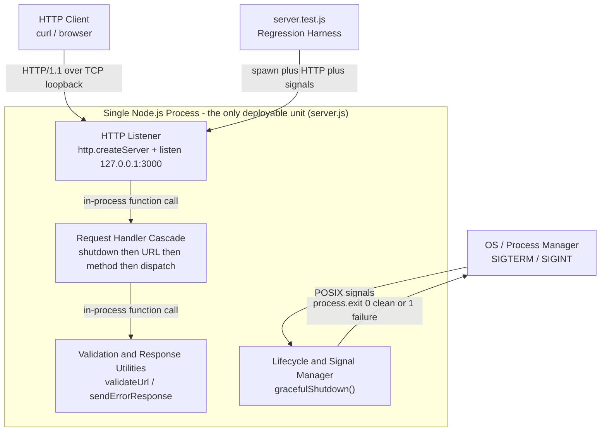
```mermaid
flowchart TB
    Client["HTTP Client<br/>curl / browser"]
    Supervisor["OS / Process Manager<br/>SIGTERM / SIGINT"]
    Harness["server.test.js<br/>Regression Harness"]
    subgraph Proc["Single Node.js Process - the only deployable unit (server.js)"]
        direction TB
        Listener["HTTP Listener<br/>http.createServer + listen 127.0.0.1:3000"]
        Cascade["Request Handler Cascade<br/>shutdown then URL then method then dispatch"]
        Utils["Validation and Response Utilities<br/>validateUrl / sendErrorResponse"]
        Lifecycle["Lifecycle and Signal Manager<br/>gracefulShutdown()"]
        Listener -->|in-process function call| Cascade
        Cascade -->|in-process function call| Utils
    end
    Client -->|HTTP/1.1 over TCP loopback| Listener
    Harness -->|spawn plus HTTP plus signals| Listener
    Supervisor -->|POSIX signals| Lifecycle
    Lifecycle -->|process.exit 0 clean or 1 failure| Supervisor
```


### 6.1.2 Service Components

The system exposes no independently deployable or network-addressable services; the single operating-system process is the sole service unit. Within that process, `server.js` is organized into cohesive logical components — plain functions and handler closures — that communicate by direct in-process calls rather than over any network or IPC channel. This subsection documents those internal boundaries and then records the applicability of each distributed-services pattern named in the section prompt.

#### 6.1.2.1 Internal Component Boundaries and Responsibilities

The following logical components exist inside the one process. They are not services: they share a single heap, a single libuv event loop, and a single lifecycle, and none can be deployed, scaled, addressed, or versioned independently of the others.

**Table 6.1.2-1: Internal Logical Components**

| Logical Component | Responsibility | Location (`server.js`) |
|---|---|---|
| HTTP listener | Creates the single `http.createServer` instance and binds it to `127.0.0.1:3000` | L126, L215–218 |
| Request handler cascade | Ordered guard cascade: shutdown check → URL validation → method allow-list → dispatch | L126–188 |
| URL validation utility | `validateUrl()` rejects URLs longer than 2048 chars or containing a null byte | L82–100 |
| Response utility | `sendErrorResponse()` writes standardized error status and headers | L110–120 |
| Lifecycle / signal manager | `gracefulShutdown()` plus SIGTERM/SIGINT and process-level handlers | L43–74, L225–259 |
| Module export surface | Exports `{ server, gracefulShutdown }` for the in-process test harness | L262 |

#### 6.1.2.2 Communication Patterns

Because there is only one process, inter-service communication is not applicable. Communication is instead confined to two planes:

- **Internal communication** is synchronous, in-process JavaScript function calls plus Node.js `EventEmitter` callbacks (`req.on('error')`, `res.on('error')`, `server.on('error')`, and the `process.on(...)` handlers). There is no message bus, queue, pub/sub, or RPC (§5.3).
- **External communication** is synchronous HTTP/1.1 request/response over loopback TCP for the data plane; inbound OS signals (SIGTERM/SIGINT) form the control plane; outbound console (stdout/stderr) and POSIX exit codes (0 clean, 1 failure) are the only egress channels (§5.1, §5.3).

#### 6.1.2.3 Discovery, Load Balancing, and Fault-Isolation Patterns

The patterns below exist to coordinate and protect many cooperating service instances. None applies to a single stateless process; the table records each determination with its confirming evidence.

**Table 6.1.2-2: Distributed-Services Pattern Applicability**

| Pattern | Status | Evidence / In-Process Reality |
|---|---|---|
| Service discovery | Not applicable | No registry; static single bind `127.0.0.1:3000` (`server.js` L215–218) |
| Load balancing | Not applicable | One instance; load balancing explicitly out of scope (§5.1) |
| Circuit breaker | Not applicable | No downstream dependencies to trip against (§5.4) |
| Retry mechanism | Not applicable | No outbound calls; the `Retry-After: 30` header on a 503 is an advisory client hint, not server retry logic (`server.js` L126–188) |
| Fallback mechanism | Not applicable | No alternate service path; the process degrades gracefully with 4xx/503 and keeps serving (§5.4) |


### 6.1.3 Scalability Design

The repository contains no built-in scalability mechanisms. Because the runtime is a single Node.js process running on one event loop, scaling is bounded to vertical headroom on a single host; horizontal scaling would require components that are not present in the codebase. Sections 5.3 and 3.6 confirm the absence of clustering, orchestration, and auto-scaling. The subsections below document the scaling approach, the (absent) auto-scaling and resource-allocation posture, the performance techniques that are genuinely present, and the state of capacity planning.

#### 6.1.3.1 Scaling Approach

- **Vertical scaling** is the only available lever: allocate a faster CPU or more memory to the single host running the process. Because all requests are serviced on one event loop, a blocking handler would stall all in-flight requests — a tradeoff explicitly recorded in §5.3.
- **Horizontal scaling** is not implemented. `server.js` requires only `http` (no `cluster` module, no `worker_threads`), there is no load balancer or reverse proxy, and no orchestrator or process manager is configured (§5.3, §3.6).

**Diagram 6.1.3-1: Scalability Architecture — Implemented vs. Not Implemented.** The left grouping is the current, implemented reality; the right grouping shows the horizontally-scaled topology that would be required but is absent from the repository.

```mermaid
flowchart TB
    subgraph Current["CURRENT - IMPLEMENTED (server.js)"]
        direction TB
        C1["Single Node.js Process<br/>one event loop, one thread"]
        C2["Bound to 127.0.0.1:3000<br/>loopback only, ADR-07"]
        C3["Vertical headroom only<br/>faster CPU / more RAM on one host"]
        C1 --> C2
        C1 --> C3
    end
    subgraph Future["NOT IMPLEMENTED - would require new work"]
        direction TB
        F0["Load Balancer / Reverse Proxy<br/>nginx or cloud LB - ABSENT"]
        F1["Process instance A"]
        F2["Process instance B"]
        F3["Process instance N"]
        F0 --> F1
        F0 --> F2
        F0 --> F3
    end
    Note["Prerequisites for horizontal scale:<br/>configurable HOST/PORT, external LB,<br/>process manager - none present, see 3.6 and 5.3"]
    Current -.->|not configured| Future
    Future -.-> Note
```

#### 6.1.3.2 Auto-Scaling Triggers and Resource Allocation

No auto-scaling triggers, rules, or resource limits are defined anywhere in the repository.

**Table 6.1.3-1: Auto-Scaling and Resource Allocation Posture**

| Aspect | Status | Detail |
|---|---|---|
| Auto-scaling triggers/rules | None | No orchestrator or metrics source exists to trigger scaling (§3.6, §5.4) |
| Resource allocation | Host defaults | No container/cgroup limits configured; the process uses host defaults (§3.6) |
| Scaling policy | None | No HPA/VPA, no PM2 instance count, and no `cluster.fork` in code (§3.6) |

#### 6.1.3.3 Performance Optimization Techniques

The techniques below are the ones actually observable in the code and manifests; they favor low overhead and predictable latency rather than scale-out throughput.

- **Zero runtime dependencies** minimize startup cost and memory footprint — `package-lock.json` (lockfileVersion 3) declares no external packages.
- **Non-blocking, event-driven I/O** on the libuv event loop through the single `http.createServer` instance (§5.1).
- **Stateless request handling** with a constant, pre-known response body (`Hello, World!\n`), avoiding per-request computation or I/O.
- **Early-exit guard cascade** that rejects shutdown-state, malformed-URL, and disallowed-method requests before dispatch (`server.js` L126–188).
- **Unref'd forced-exit timer** so the shutdown watchdog never keeps the event loop alive (`server.js` `gracefulShutdown`, L43–74).
- **No caching layer** is present or required — there is no `Cache-Control` or `ETag` handling (§5.3).

#### 6.1.3.4 Capacity Planning

- No capacity plan, throughput target, concurrency target, or uptime SLA is defined anywhere in the repository (§5.4).
- The only quantitative reference is an informal regression smoke check (approximately 100 sequential loopback requests completing within roughly 5 seconds). Section 5.4 explicitly states this is not an SLA and is not asserted by the tests.
- The prerequisites to move beyond a single vertical instance — externalized HOST/PORT configuration, an external load balancer, and a process manager — are recorded as remaining/future work in §3.6.


### 6.1.4 Resilience Patterns

This is the one Core-Services-adjacent area with substantive, implemented behavior. Although the system is not distributed, `server.js` provides deliberate in-process resilience through four independent error-handling layers, an idempotent signal-driven graceful shutdown, request-scoped graceful degradation, and a fail-fast policy that delegates recovery to an external supervisor. Sections 5.4 (Cross-Cutting Concerns) and 4.4 (Error Handling and Recovery) are authoritative for the underlying error-handling model referenced here.

**Diagram 6.1.4-1: Resilience Pattern — Fault Category to Response Strategy to Outcome.** The diagram maps each fault category the process can encounter to its response strategy in `server.js` and to the resulting outcome, distinguishing graceful degradation from fail-fast plus supervised restart.

```mermaid
flowchart TB
    subgraph Faults["Fault Categories"]
        direction TB
        Rq["Request-scoped fault<br/>bad URL / bad method / stream error"]
        Sd["Shutdown in progress<br/>SIGTERM / SIGINT received"]
        Fatal["Process-fatal fault<br/>bind error / uncaughtException"]
    end
    subgraph Strategy["Response Strategy in server.js"]
        direction TB
        Deg["Graceful degradation<br/>4xx / 503 response, process stays up"]
        Drain["Signal-driven drain<br/>gracefulShutdown, 5s forced-exit timer"]
        FailFast["Fail-fast<br/>log then process.exit(1)"]
    end
    subgraph Outcome["Outcome"]
        direction TB
        Serve["Process keeps serving<br/>other clients unaffected"]
        Clean["Clean exit(0)<br/>connections drained"]
        Restart["External supervisor restarts<br/>stateless cold start, no data loss"]
    end
    Rq --> Deg --> Serve
    Sd --> Drain --> Clean
    Fatal --> FailFast --> Restart
```

#### 6.1.4.1 Fault Tolerance Mechanisms

Fault tolerance is provided by four independent error-handling layers, each containing a fault at the narrowest scope that preserves overall availability.

**Table 6.1.4-1: Error-Handling Layers**

| Error Layer | Trigger | Disposition |
|---|---|---|
| Request-stream | `req.on('error')` | Returns 400 if headers not yet sent; isolates the faulty request (`server.js` L126–188) |
| Response-stream | `res.on('error')` | Logs to console; the connection is abandoned while the process stays up (L126–188) |
| Server-bind | `server.on('error')` (EADDRINUSE / EACCES) | Fail-fast: log diagnosis then `process.exit(1)` (L194–210) |
| Process-level | `uncaughtException` / `unhandledRejection` | Attempt `gracefulShutdown`, otherwise `process.exit(1)` (L237–259) |

There is no retry, no fallback, and no circuit breaker — consistent with the absence of downstream dependencies (§5.4).

#### 6.1.4.2 Service Degradation Policy

- **Request-scoped degradation:** invalid input yields a bounded 4xx response — 400 for URL-validation violations and 405 (with an `Allow` header) for disallowed methods — while the process continues serving other clients (`server.js` L126–188).
- **Shutdown degradation:** once `gracefulShutdown` begins, subsequent requests receive `503 Service Unavailable` with `Connection: close` and an advisory `Retry-After: 30` header (`server.js` L126–188). This constitutes graceful degradation, not a retry contract (§5.4).

#### 6.1.4.3 Disaster Recovery and Failover

- **Recovery model:** the service is stateless, so recovery is a cold restart with no data reconstruction (§5.4).
- **Failover:** no in-process watchdog or automated failover is configured. On a fatal fault the process exits with code 1 and recovery is delegated to an external supervisor (Docker, Kubernetes, PM2, or systemd) — an integration the design targets but does not configure (§5.4, §3.6).
- **Bounded drain:** graceful shutdown bounds drain time with an unref'd 5,000 ms timer that forces `process.exit(1)` if `server.close()` does not complete in time (`server.js` L43–74).
- **Data recovery:** not applicable — there is no database, cache, or file store, hence no RPO or RTO (§5.4).
- **Code rollback:** performed via git, restoring the small `server.js` source (§5.4).
- **Port-conflict recovery:** free port 3000 (or rebind) and restart the process (§5.4).

#### 6.1.4.4 Data Redundancy

Data redundancy is not applicable. The process persists no state and owns no datastore, cache, or file artifacts, so there is nothing to replicate, mirror, or back up; §5.3 records the intentional absence of data storage and caching. The stateless cold-start model described in 6.1.4.3 constitutes the entire data-recovery posture (§5.4).


### 6.1.5 References

**Repository files examined**

- `server.js` - Established the single-process, dependency-free HTTP server: sole `require('http')`, single `http.createServer` bind to 127.0.0.1:3000, the request-handler guard cascade (L126–188), `validateUrl()` (L82–100), `sendErrorResponse()` (L110–120), `gracefulShutdown()` with the 5,000 ms unref'd forced-exit timer (L43–74), `server.on('error')` bind diagnostics (L194–210), SIGTERM/SIGINT and process-level handlers (L225–259), and the `{ server, gracefulShutdown }` export (L262).
- `server.test.js` - Confirmed the in-process regression harness (requires `http`, `child_process` spawn, `path`); no service topology, discovery, or scaling constructs.
- `package.json` - Confirmed the `hello_world` v1.0.0 manifest with `start`/`test` scripts and no dependencies.
- `package-lock.json` - Confirmed lockfileVersion 3 with zero external dependencies (dependency-free performance/startup posture).
- `README.md` - Established project identity ("test project for backprop integration").
- `blitzy/documentation/Technical Specifications.md` - Confirmed scope exclusions, including load balancing and rate limiting.
- `blitzy/documentation/Project Guide.md` - Confirmed that deployment-pipeline and monitoring/logging setup are remaining/future work.

**Repository folders examined**

- `blitzy/documentation/` - Contained the project documentation subtree (Project Guide and Technical Specifications) used to corroborate scope and remaining work.

**Cross-referenced Technical Specification sections**

- Section 5.1 High-Level Architecture - Confirmed the single-process, single-threaded, event-driven monolith characterization and the absence of external integration, clustering, and infrastructure-as-code.
- Section 5.3 Technical Decisions - Confirmed ADR-03 (single process, single thread; no clustering), ADR-07 (loopback bind), the rejection of service-oriented/clustered topologies, and the intentional absence of data storage and caching.
- Section 5.4 Cross-Cutting Concerns - Confirmed the four error-handling layers, the fail-fast versus graceful-degradation model, the stateless disaster-recovery posture, and the absence of performance SLAs.
- Section 3.6 Development & Deployment - Confirmed the absence of Dockerfiles, orchestrator manifests, PM2 configuration, CI/CD, and auto-scaling, and that externalized configuration is remaining work.
- Section 4.4 Error Handling and Recovery - Authoritative reference for the multi-layer error-handling and recovery behavior summarized in 6.1.4.

No external (web) sources were required for this section; all determinations are grounded in the repository and cross-referenced Technical Specification sections listed above.


## 6.2 Database Design

### 6.2.1 Database Applicability Assessment

**Determination: Database Design is not applicable to this system.**

The `hao-backprop-test` repository implements a single-process, stateless Node.js HTTP service that neither reads nor writes persistent data of any kind. There is no database, no cache, no object/file store, no Object-Relational Mapper (ORM), no schema, and no migration tooling anywhere in the codebase. Every response is a compile-time constant, so the system has no data domain to model, index, partition, replicate, or back up.

This determination is grounded in direct inspection of the repository:

- **Zero data dependencies.** `server.js` imports only the Node.js built-in `http` module (L17); it contains no database driver, connection string, `fs` persistence call, or `process.env` configuration. `package.json` declares no `dependencies` or `devDependencies`, and `package-lock.json` (lockfileVersion 3) resolves zero external packages — no ORM, query builder, cache client, or migration library is present.
- **State is transient and in-memory only.** The sole runtime state is two process-local variables used to coordinate graceful shutdown — `isShuttingDown` (`server.js` L33) and `shutdownTimer` (L34). Neither is persisted; both are lost when the process exits.
- **No persistence artifacts.** The only directories in the repository are `blitzy/` and `blitzy/documentation/`; there are no `models/`, `migrations/`, `db/`, or `config/` folders and no `.sql`, `docker-compose`, `.env`, or ORM-configuration files.
- **Explicit exclusion in project documentation.** The only two occurrences of the word "database" in the entire tree appear in `blitzy/documentation/Technical Specifications.md`, which lists "Database connections - Not part of original design."

These findings are consistent with the already-documented architecture: Section 3.5 (Databases & Storage) states the system has "no database, no cache, and no storage service of any kind"; Section 1.3.1 records "Data domains included: None"; Section 5.3.3 and ADR-04 (Section 5.3.5) record the intentional "Stateless; no database or persistence" decision; and Section 6.1.4.4 records that data redundancy is not applicable because the process "owns no datastore, cache, or file artifacts."

Because the section prompt enumerates concrete database topics, the remainder of Section 6.2 records the applicability of each one explicitly — rather than omitting them — so the assessment is unambiguous and evidence-based. The matrix below summarizes the disposition of every database concern; subsections 6.2.2 through 6.2.5 then document each area in detail.

**Table 6.2.1-1: Database Concern Applicability Matrix**

| Database Concern | Determination | Basis / Evidence |
|---|---|---|
| Primary database | Not applicable | No driver/connection code; `server.js` imports only `http` (§3.5) |
| Secondary datastore | Not applicable | No secondary store of any kind (§3.5) |
| Caching layer | Not applicable | No cache client; no `Cache-Control`/`ETag`; ADR-05 (§5.3.3) |
| ORM / data-access layer | Not applicable | Zero dependencies in `package-lock.json` (lockfileVersion 3) |
| Schema / migrations | Not applicable | No `.sql`, schema, or migration files in the repository |
| Replication / backup | Not applicable | No datastore to replicate or back up (§6.1.4.4) |
| Persistent state | None (stateless) | Only transient in-memory flags (`server.js` L33-L34) |

**Diagram 6.2.1-1: Data Flow — Stateless Request/Response with No Persistence Boundary.** The diagram traces how request and response data move through the single process. Every response body originates from a compile-time constant, the only state consulted is a transient in-memory flag, and no database, cache, or file store is ever read or written.

```mermaid
flowchart TB
    Client["HTTP Client<br/>curl / browser (loopback)"]
    subgraph Proc["Single Node.js Process (server.js) - no persistence layer"]
        direction TB
        Listener["HTTP Listener<br/>http.createServer bind 127.0.0.1:3000"]
        Handler["Request Handler Cascade<br/>shutdown then URL then method then dispatch"]
        Const["Constant Response Source<br/>literal Hello World (compile-time)"]
        State["Transient In-Memory State<br/>isShuttingDown / shutdownTimer<br/>process-local, never persisted"]
    end
    NoStore[("No Database / Cache / File Store<br/>NONE - nothing read or written")]
    Client -->|"HTTP/1.1 request"| Listener
    Listener -->|"in-process call"| Handler
    Handler -->|"reads literal"| Const
    Handler -.->|"reads flag only"| State
    Const -->|"200 text/plain body"| Client
    Handler -.->|"no query / no read / no write"| NoStore
```

The consequence of this design is favorable from a data-management standpoint: with no data at rest, there is no schema to evolve, no connection credential to protect, no query-injection surface, and no backup or replication pipeline to operate. Any future requirement for persistence would necessitate introducing a database or storage dependency, which would change the current zero-dependency, stateless posture recorded in Sections 3.2, 3.3, and 3.5.

### 6.2.2 Schema Design

Schema design is not applicable because the system defines no persistent data schema. This subsection records, for each schema concern named in the prompt — entity relationships, data models and structures, indexing strategy, partitioning approach, replication configuration, and backup architecture — the evidence of its absence, and, where a genuine in-process analogue exists (the transient runtime state), documents that analogue explicitly.

#### 6.2.2.1 Entity Relationships and Data Models

There are no persistent entities, tables, collections, documents, or relationships in the system. `server.js` declares no data models, no classes, and no type definitions; the HTTP response body is the string literal `Hello, World!\n` computed inline rather than assembled from any stored record (§5.3.3). Consequently there is no entity-relationship model to normalize and no foreign-key graph to describe.

The only data structure the running process holds is a small block of transient, in-memory runtime state used to coordinate graceful shutdown. It is process-local, is never serialized or persisted, and is discarded when the process exits. The table and entity-relationship-style diagram below model this state solely to make the system's complete (and non-persistent) data footprint explicit; they do not describe a database schema and imply no storage, keys, or relationships.

**Table 6.2.2-1: Complete Runtime Data Footprint**

| Data Element | Type | Persistence | Location |
|---|---|---|---|
| `isShuttingDown` | boolean | None (in-memory, transient) | `server.js` L33 |
| `shutdownTimer` | Timeout handle | None (in-memory, transient) | `server.js` L34 |

**Diagram 6.2.2-1: Conceptual Data Model (Transient In-Memory State Only).** This ER-style diagram depicts the only data the process holds. It is explicitly NOT a database schema: the element persists nothing, has no primary or foreign keys, no indexes, and no relationships to any other entity — because no other entity exists.

```mermaid
erDiagram
    TRANSIENT_IN_MEMORY_STATE {
        boolean isShuttingDown "server.js L33 - non-persisted shutdown flag"
        TimeoutHandle shutdownTimer "server.js L34 - non-persisted timer handle"
    }
```

#### 6.2.2.2 Indexing Strategy, Constraints, and Partitioning

Indexing, integrity constraints, and partitioning are all not applicable because there are no tables or collections to index, constrain, or partition. The section prompt requires that all indexes and constraints be documented; the complete set is empty, as recorded in the inventory below.

**Table 6.2.2-2: Index and Constraint Inventory**

| Category | Count | Status |
|---|---|---|
| Primary keys | 0 | None — no entities exist |
| Foreign keys | 0 | None — no relationships exist |
| Unique / check constraints | 0 | None — no persisted columns exist |
| Secondary indexes | 0 | None — no tables/collections exist |
| Partitions / shards | 0 | None — no dataset to partition |

**Partitioning approach:** not applicable. Because there is no dataset, there is no horizontal partitioning (sharding), no vertical partitioning, and no partition or shard key. The single process serves one static response for every path and holds no per-tenant or per-range data that could motivate partitioning.

#### 6.2.2.3 Replication Configuration

Replication is not applicable: the process owns no datastore, so there is nothing to replicate, and no primary/replica topology, replication stream, or consistency mode is configured. Section 6.1.4.4 records that data redundancy is not applicable for exactly this reason. The diagram below contrasts the current implemented reality (a single stateless process with nothing to replicate) with the illustrative components that a replicated, data-backed design would require — none of which exist in the repository.

**Diagram 6.2.2-2: Replication Architecture — Current vs. Illustrative (Not Implemented).**

```mermaid
flowchart TB
    subgraph Current["CURRENT - IMPLEMENTED (server.js)"]
        direction TB
        P1["Single Node.js Process<br/>stateless, 127.0.0.1:3000"]
        P2["No datastore owned<br/>nothing to replicate"]
        P1 --> P2
    end
    subgraph Illustrative["ILLUSTRATIVE ONLY - NOT IMPLEMENTED"]
        direction TB
        App["Application Tier"]
        Primary[("Primary DB")]
        Replica[("Read Replica")]
        App -->|"writes"| Primary
        Primary -->|"replication stream"| Replica
        App -->|"reads"| Replica
    end
    Note["A replicated, data-backed design would require these components.<br/>None exist in the repository - see 3.5 and 6.1.4.4"]
    Current -.->|"would require new work"| Illustrative
    Illustrative -.-> Note
```

#### 6.2.2.4 Backup Architecture

There is no data backup architecture because there is no data at rest to back up; correspondingly, no Recovery Point Objective (RPO) or Recovery Time Objective (RTO) is defined anywhere in the repository (§5.4.6, §6.1.4.4). The only recoverable asset is the source code itself, whose backup and recovery mechanism is the Git version-control history (§5.4.6). Recovery of the running service is therefore a stateless cold restart with no data-reconstruction step (§6.1.4.3): a supervisor relaunches the process, which rebinds and immediately resumes serving the constant response.

### 6.2.3 Data Management

Data management is not applicable in the conventional database sense because the system stores and retrieves no data. This subsection records the disposition of each data-management concern named in the prompt: migration procedures, versioning strategy, archival policies, data storage and retrieval mechanisms, and caching policies.

#### 6.2.3.1 Migration and Versioning Strategy

**Migration procedures** are not applicable. Because no schema exists, there is no schema-migration tool (no Knex, Sequelize, Prisma, Flyway, Liquibase, or equivalent), no `migrations/` directory, no migration files, and therefore no forward-migration or rollback procedure. A repository-wide scan for migration artifacts returned nothing.

**Versioning strategy** applies only to the source code, not to any data or schema. There is no schema version table, data-format version marker, or record-level version field, because there are no records. The only versioning present is:

- **Package versioning** — `package.json` declares version `1.0.0`.
- **Source versioning** — the codebase is tracked in Git, which is also the code recovery/rollback mechanism (§5.4.6).

#### 6.2.3.2 Data Storage and Retrieval Mechanisms

The system implements no storage mechanism and no retrieval mechanism:

- **No writes.** The request handler performs no `INSERT`/`UPDATE`, no file writes, and no cache puts. `server.js` contains no `fs` calls and no database client (§6.2.1).
- **No reads.** The handler performs no `SELECT`, file read, or cache get. The response body is the compile-time string literal `Hello, World!\n` returned inline for every request (§5.3.3).
- **Static asset is not a data layer.** The repository contains `industry.csv`, but it is not read by `server.js` or `server.test.js` (whose only imports are Node.js built-ins) and is therefore an unused static asset, not a storage/retrieval mechanism (§3.5, §1.3.1). The binary files `100Pages.pdf`, `demo.jpg`, and `sample.doc` are likewise unreferenced and unmanaged.

#### 6.2.3.3 Archival and Caching Policies

**Archival policies** are not applicable. With no data captured or retained, there is nothing to archive: no cold-storage tier, no retention window, and no archival job exist.

**Caching policies:** none are implemented. There is no response cache, no in-memory memoization, and no HTTP cache directives (`Cache-Control`, `ETag`, `Last-Modified`). ADR-05 (§5.3.5) records the deliberate decision of "No caching layer or HTTP cache headers," on the rationale that the single response is a trivial constant already computed at negligible cost, so a cache would add state and invalidation logic with no measurable benefit (§5.3.3, §6.1.3.3). The handler recomputes the trivial response on each request.

### 6.2.4 Compliance Considerations

Because the system collects, processes, and stores no data, the data-oriented compliance concerns named in the prompt are largely not applicable. Where a genuine control exists at the process or transport level (for example, the loopback bind), it is documented explicitly rather than merely omitted.

#### 6.2.4.1 Data Retention and Privacy Controls

**Data retention rules** are not applicable. The service is stateless and retains no data between requests or across restarts; there is no retention schedule, purge job, or time-to-live setting because there is nothing retained (§5.4.6).

**Privacy controls** are not applicable in the data sense. The service collects no personal data or Personally Identifiable Information (PII), stores no user data, and returns a fixed greeting to every caller regardless of origin. Section 1.3.1 records "Data domains included: None." Consequently there is no data classification scheme, consent capture, anonymization/pseudonymization step, or data-subject-access process to implement, because no personal data ever enters the system.

#### 6.2.4.2 Access Controls and Audit Mechanisms

**Access controls:** there is no database, so there are no database roles, grants, schemas, or row-level security policies. At the service level there is also no authentication or authorization framework — no users, credentials, tokens, sessions, API keys, or role checks anywhere in the codebase. The **loopback-only bind (`127.0.0.1`)** is the sole access-control boundary, restricting reach to the local host by default (§5.4.4, ADR-07). The only request-gating logic present is protocol-level — the HTTP method allow-list and URL validation — which restricts *what* may be requested, not *who* may request it (§5.3.4).

**Audit mechanisms:** there is no audit log and no data-access audit trail, because there is no data access to audit. The only record of activity is unstructured console diagnostics written to `stdout`/`stderr` — startup readiness, shutdown progress, request/response stream errors, server bind errors, and uncaught exceptions — with no structured format, no log levels, no correlation or request IDs, and no tamper-evident or centralized storage (§5.4.2). Introducing structured logging is a documented remaining task.

#### 6.2.4.3 Backup and Fault-Tolerance Policies

**Data backup** is not applicable: with no data at rest there is no backup or restore procedure, and no Recovery Point Objective (RPO) or Recovery Time Objective (RTO) is defined (§5.4.6, §6.1.4.4).

**Fault tolerance** is implemented at the *process* level rather than the *data* level. The process provides four independent error-handling layers, a fail-fast policy (`process.exit(1)`) for unrecoverable faults with restart delegated to an external supervisor, and graceful degradation (4xx/`503`, keep serving) for request-scoped faults (§6.1.4, §5.4.3). Because the service is stateless, a restart loses no data and requires no data-reconstruction step; source-code recovery is via the Git history (§5.4.6). This constitutes the entire "backup and fault-tolerance" posture for a system that owns no datastore.

### 6.2.5 Performance Optimization

The database performance-optimization techniques named in the prompt — query optimization, database caching, connection pooling, read/write splitting, and batch processing — are all not applicable because there is no database, no query, and no dataset. This subsection records each disposition and then points to the genuine, application-level performance characteristics documented elsewhere.

#### 6.2.5.1 Database Performance Technique Applicability

**Table 6.2.5-1: Database Performance Technique Applicability**

| Technique | Status | Basis / Evidence |
|---|---|---|
| Query optimization patterns | Not applicable | No database and no queries to plan, index, or tune (§3.5) |
| Database caching strategy | Not applicable | No cache layer; no `Cache-Control`/`ETag`; ADR-05 (§5.3.3) |
| Connection pooling | Not applicable | No outbound DB connections to pool (§3.5) |
| Read/write splitting | Not applicable | No reads/writes and no primary/replica topology (§6.2.2.3) |
| Batch processing approach | Not applicable | No scheduled jobs or dataset processing; each request handled independently (`server.js` L126-L188) |

**Connection pooling — clarification.** In the database sense, connection pooling is not applicable because the process opens no outbound datastore connections. The only connections the process manages are *inbound* HTTP/1.1 client sockets, which are handled by Node.js's built-in `http` server with its default keep-alive behavior — this is not a database connection pool and requires no pool configuration (§6.1.2).

#### 6.2.5.2 Actual Application-Level Performance Posture

Although no database optimization applies, the service does exhibit genuine, application-level performance characteristics, documented authoritatively in Section 6.1.3.3. They favor low overhead and predictable latency rather than data-scale throughput:

- **Zero runtime dependencies** minimize startup cost and memory footprint — `package-lock.json` (lockfileVersion 3) declares no external packages.
- **Non-blocking, event-driven I/O** on the libuv event loop through the single `http.createServer` instance.
- **Stateless, constant-response handling** with a pre-known body (`Hello, World!\n`), which avoids per-request computation, I/O, or data access.
- **Early-exit guard cascade** that rejects shutdown-state, malformed-URL, and disallowed-method requests before dispatch (`server.js` L126-L188).

No performance Service Level Agreements are defined anywhere in the repository (§5.4.5); the only performance-adjacent artifact is an informal regression smoke check (approximately 100 sequential loopback requests completing within roughly 5 seconds), which the documentation explicitly frames as a smoke check and not an SLA. Any capacity planning therefore rests on the inherent characteristics of a single-threaded, stateless, constant-response Node.js `http` server rather than on database tuning, which is absent by design.

### 6.2.6 References

**Repository files examined**

- `server.js` - Established the single, dependency-free `require('http')` import (L17), the compile-time constant response, the absence of any database driver / connection / `fs` persistence / `process.env` usage, the two transient in-memory state variables `isShuttingDown` (L33) and `shutdownTimer` (L34), and the request-handler cascade (L126-L188) that performs no data reads or writes.
- `server.test.js` - Confirmed the test harness imports only Node.js built-ins (`http`, `child_process`, `path`); no database setup, fixtures, or persistence.
- `package.json` - Confirmed the `hello_world` v1.0.0 manifest declares no `dependencies` or `devDependencies` (no ORM, cache client, or migration library).
- `package-lock.json` - Confirmed lockfileVersion 3 resolves zero external packages, corroborating the absence of any data/persistence dependency.
- `industry.csv` - Confirmed to be a single-column static list that is not read at runtime — an unused static asset, not a storage/retrieval mechanism.
- `README.md` - Established repository identity (`hao-backprop-test`).
- `blitzy/documentation/Technical Specifications.md` - Confirmed the only two "database" references in the tree, including the explicit exclusion "Database connections - Not part of original design."

**Repository folders examined**

- `` (repository root) - Established the complete file/directory inventory; confirmed there are no `models/`, `migrations/`, `db/`, or `config/` directories and no schema/DDL, `docker-compose`, `.env`, or ORM-configuration files.
- `blitzy/documentation/` - Contained the project documentation subtree used to corroborate the explicit exclusion of database connections and persistence.

**Cross-referenced Technical Specification sections**

- Section 1.3 Scope - Confirmed "Data domains included: None" (§1.3.1) and that databases/persistence are explicitly out of scope (§1.3.2).
- Section 3.5 Databases & Storage - Confirmed the system has "no database, no cache, and no storage service of any kind" and is a stateless HTTP service.
- Section 5.3 Technical Decisions - Confirmed the Data Storage and Caching Rationale (§5.3.3) and ADR-04 (stateless; no database or persistence), ADR-05 (no caching layer or HTTP cache headers), and ADR-07 (loopback bind).
- Section 5.4 Cross-Cutting Concerns - Confirmed unstructured console logging with no audit trail (§5.4.2), the absence of authentication/authorization with the loopback bind as sole access-control boundary (§5.4.4), the absence of performance SLAs (§5.4.5), and the stateless disaster-recovery posture with no RPO/RTO (§5.4.6).
- Section 6.1 Core Services Architecture - Confirmed inbound HTTP connection handling (§6.1.2), the genuine application-level performance techniques (§6.1.3.3), the process-level resilience and fault-tolerance model (§6.1.4), the stateless cold-restart recovery (§6.1.4.3), and that data redundancy is not applicable because the process owns no datastore (§6.1.4.4).

No external (web) sources were required for this section; every determination is grounded in the repository files and cross-referenced Technical Specification sections listed above.

## 6.3 Integration Architecture

### 6.3.1 Integration Architecture Applicability Assessment

**Determination: Integration with external systems and services is not applicable for this system. The single inbound HTTP/1.1 interface documented in 6.3.2 is the system's only integration boundary.**

The `hao-backprop-test` repository implements a single-process, dependency-free Node.js HTTP service (`server.js`) that neither invokes nor is invoked by any external system, message broker, identity provider, or third-party service. Its sole runtime import is the Node.js built-in `http` module (`server.js` line 17), and `package-lock.json` (lockfileVersion 3) records zero external dependencies, so there is no client SDK, API key, credential, or remote service endpoint anywhere in the codebase. The listener binds to the loopback address `127.0.0.1:3000` (`server.js` lines 20-21 and 215-218), so the service is not reachable from any external network by default.

This determination is corroborated by the already-documented architecture. Section 5.1 (High-Level Architecture, §5.1.4) states plainly that the system "has no external integration points" and integrates with "no third-party APIs, databases, message brokers, identity providers, monitoring services, or cloud platforms." Section 3.4 (Third-Party Services) independently confirms the system "integrates with no external third-party services," makes "no outbound network calls," and holds "no client SDK, API key, credential, or service endpoint." Section 6.1 (Core Services Architecture) records the same single-process, monolithic reality (ADR-03) with a loopback-only bind (ADR-07).

Consequently, the classic Integration Architecture concerns — API gateways, message queues, event streaming, batch integration, third-party service contracts, and legacy-system adapters — presuppose interactions that do not exist here. The one genuine integration boundary the system presents is an **inbound** HTTP/1.1 request/response interface. Because the section prompt's API DESIGN topics (protocol, authentication, authorization, rate limiting, versioning, documentation) map directly onto that inbound interface, 6.3.2 documents it in full — including the capabilities that are deliberately absent — while 6.3.3 (Message Processing) and 6.3.4 (External Systems Integration) record their non-applicability explicitly and with evidence. This mirrors the treatment already applied in Sections 6.1 and 6.2, so the specification remains internally consistent.

**Table 6.3.1-1: Integration Architecture Concern Applicability Matrix**

| Integration Concern | Determination | Basis |
|---|---|---|
| Inbound API (HTTP interface) | Applicable — see 6.3.2 | Single `http.createServer` on 127.0.0.1:3000 (`server.js` L126, L215) |
| Outbound external service calls | Not applicable | No outbound client code; sole import is `http` (§3.4; `server.js` L17) |
| Authentication / authorization | Not applicable | No auth of any kind; loopback bind is the only access control (§5.4, §3.4) |
| Rate limiting | Not applicable | No throttling; explicitly out of scope (§1.3.2) |
| API versioning | Not applicable | No version prefixes, headers, or media-type versioning in code |
| Message queue / broker | Not applicable | No broker client; no queue or topic (§5.1.4) |
| Event / stream processing | Not applicable | Only OS signals plus in-process EventEmitter callbacks (§6.1.2.2) |
| Batch processing | Not applicable | No scheduler, job, or bulk data pipeline in the repository |
| API gateway | Not applicable | No gateway config; no proxy manifests present (§3.4) |
| Third-party / legacy integration | Not applicable | Zero external dependencies; no adapters (`package-lock.json`) |

**Diagram 6.3.1-1: Integration Boundary / Context.** The diagram locates the system's one deployable process, its single inbound HTTP integration boundary on loopback, the inbound OS-signal control channel, the in-process export consumed only by the regression harness, the outbound diagnostic and exit-code channels, and — explicitly — the complete absence of any outbound external integration.

```mermaid
flowchart TB
    Client["HTTP Client<br/>curl / browser - loopback only"]
    Supervisor["OS / Process Manager<br/>designed-for, not configured"]
    Harness["server.test.js<br/>Regression Harness"]
    Logs["stdout / stderr"]
    NoExt["NO OUTBOUND INTEGRATIONS<br/>no database, no third-party API,<br/>no message broker, no cloud SDK, no TLS"]
    subgraph Proc["Integration Boundary: one Node.js process - server.js"]
        direction TB
        Listener["Inbound HTTP/1.1 Endpoint<br/>http.createServer + listen 127.0.0.1:3000"]
        Cascade["Request Handler Cascade<br/>shutdown, URL, method, dispatch"]
        Lifecycle["Lifecycle and Signal Manager<br/>gracefulShutdown"]
        Export["In-process CommonJS Export<br/>server, gracefulShutdown"]
        Listener --> Cascade
    end
    Client -->|"HTTP/1.1 over TCP loopback"| Listener
    Harness -->|"spawn plus HTTP plus signals"| Listener
    Harness -->|"require in-process"| Export
    Supervisor -->|"SIGTERM / SIGINT"| Lifecycle
    Cascade -->|"console diagnostics"| Logs
    Lifecycle -->|"process.exit 0 or 1"| Supervisor
    Cascade -.->|"no outbound calls"| NoExt
```


### 6.3.2 API Design

The system's only integration surface is a single **inbound HTTP/1.1 interface** implemented by `server.js` using the Node.js built-in `http` module. It is deliberately minimal — a hardened "Hello, World!" responder — so several conventional API-design concerns (authentication, rate limiting, versioning, and formal API documentation tooling) are intentionally absent. Each concern below is documented against the actual implementation, and absence is stated explicitly with its supporting evidence rather than omitted. There is no second (outbound) API: `server.js` issues no requests to any other system.

#### 6.3.2.1 Protocol Specifications

The service speaks **HTTP/1.1 over plain TCP** on the loopback address `127.0.0.1:3000` (`server.js` lines 17, 20-21, 126, 215-218). There is no TLS/HTTPS (§1.3.2, §3.4). Requests are handled by one `http.createServer` callback that runs an ordered, synchronous guard cascade and emits exactly one response; the request body is never read or parsed, and there is no content negotiation, encoding, or templating (§5.1.3). Routing is intentionally absent — every request path (for example `/`, `/test`, `/api`, `/any/path`) maps to the same handler and returns the same greeting, a behavior asserted by test T8 in `server.test.js`.

**Table 6.3.2-1: Supported HTTP Methods**

| Method | Result | Key Response Detail |
|---|---|---|
| GET | 200 OK | `Content-Type: text/plain`; body `Hello, World!\n` (any path) — `server.js` L185-187 |
| HEAD | 200 OK | `Content-Length` of the greeting set; no body — `server.js` L176-182 |
| OPTIONS | 204 No Content | `Allow: GET, HEAD, OPTIONS`; `Content-Length: 0` — `server.js` L167-173 |
| POST / PUT / DELETE / other | 405 Method Not Allowed | `Allow: GET, HEAD, OPTIONS`; body `Method Not Allowed` — `server.js` L159-164 |

**Table 6.3.2-2: HTTP Status Codes Emitted**

| Status | Condition | Notable Headers |
|---|---|---|
| 200 OK | GET or HEAD on an allowed method | `Content-Type: text/plain` |
| 204 No Content | OPTIONS request | `Allow`, `Content-Length: 0` |
| 400 Bad Request | URL > 2048 chars or containing a null byte; malformed request stream | `Content-Type: text/plain` |
| 405 Method Not Allowed | Method not in the allow-list | `Allow: GET, HEAD, OPTIONS` |
| 503 Service Unavailable | Request received while graceful shutdown is in progress | `Connection: close`, `Retry-After: 30` |

**Table 6.3.2-3: Protocol and Endpoint Parameters**

| Parameter | Value | Source |
|---|---|---|
| Protocol | HTTP/1.1 over TCP, no TLS | `server.js` L17, L126 |
| Bind address | 127.0.0.1:3000 (loopback only) | `server.js` L20-21, L215 |
| Allowed methods | GET, HEAD, OPTIONS | `server.js` L27 |
| Max URL length | 2048 characters (else 400) | `server.js` L30, L82-100 |
| Routing | None — all paths return the same response | `server.js` L185-187; test T8 |
| Request body | Never read or parsed | §5.1.3 |
| Response media type | `text/plain` (all responses) | `server.js` L112, L178, L186 |

**OPTIONS and CORS.** Although the inline comment at `server.js` L166 mentions "CORS preflight," the OPTIONS handler emits only the `Allow` and `Content-Length` headers — it sets **no** `Access-Control-*` headers. A repository-wide search confirms no Access-Control headers exist anywhere. OPTIONS therefore provides HTTP **method discovery** via the `Allow` header, not a functional CORS implementation.

**Diagram 6.3.2-1: API Architecture — Inbound Request Pipeline.** The diagram shows the layered path of a request from the loopback client, across the plain-TCP transport, into the single-process guard cascade that terminates in exactly one response.

```mermaid
flowchart TB
    subgraph ClientZone["Client Zone - loopback"]
        direction TB
        C["HTTP Client"]
    end
    subgraph Transport["Transport - plain TCP, no TLS"]
        direction TB
        TCP["TCP socket 127.0.0.1:3000<br/>HTTP/1.1"]
    end
    subgraph App["Application - server.js single process"]
        direction TB
        Srv["http.createServer callback<br/>L126-188"]
        G1{"Shutting down?<br/>L142"}
        G2{"URL valid?<br/>validateUrl L82-100"}
        G3{"Method allowed?<br/>GET HEAD OPTIONS L159"}
        D["Dispatch by method<br/>GET 200 / HEAD 200 / OPTIONS 204"]
        E503["503 + Retry-After 30"]
        E400["400 Bad Request"]
        E405["405 + Allow header"]
        Srv --> G1
        G1 -->|yes| E503
        G1 -->|no| G2
        G2 -->|no| E400
        G2 -->|yes| G3
        G3 -->|no| E405
        G3 -->|yes| D
    end
    C -->|"request"| TCP
    TCP --> Srv
```

**Diagram 6.3.2-2: Sequence — Key Inbound HTTP Flows.** The sequence diagram captures the request/response pairs that define the API contract, including the disallowed-method, invalid-URL, and shutdown paths.

```mermaid
sequenceDiagram
    participant C as HTTP Client
    participant S as server.js on 127.0.0.1:3000
    Note over C,S: Key inbound HTTP flows - no auth, no rate limiting
    C->>S: GET /any/path
    S-->>C: 200 text/plain greeting body
    C->>S: HEAD /
    S-->>C: 200 Content-Length set, no body
    C->>S: OPTIONS /
    S-->>C: 204 Allow GET HEAD OPTIONS
    C->>S: POST / (disallowed method)
    S-->>C: 405 Method Not Allowed + Allow header
    C->>S: GET with URL over 2048 chars or null byte
    S-->>C: 400 Bad Request
    Note over S: While gracefulShutdown in progress
    C->>S: GET /
    S-->>C: 503 Connection close + Retry-After 30
```

#### 6.3.2.2 Authentication Methods

There are **no authentication methods**. The service implements no API keys, bearer tokens, OAuth, JWT, HTTP Basic/Digest auth, cookies, or sessions; a repository-wide search for such mechanisms returns no matches, and the only response headers ever set are `Content-Type`, `Allow`, `Content-Length`, `Connection`, and `Retry-After`. Section 3.4 confirms the system "authenticates against no identity provider" and holds "no client SDK, API key, credential, or service endpoint." Every client is treated identically. This is consistent with the reference/test-fixture nature of the project and the out-of-scope determinations in §1.3.2.

#### 6.3.2.3 Authorization Framework

There is **no authorization framework** — no roles, scopes, permissions, or access-control lists exist in the code. The single access-control mechanism is a network one: binding to the loopback interface `127.0.0.1:3000` (ADR-07) so the service is not reachable from any external network by default (§5.4, §5.1.1). Section 5.4 records that loopback binding "is the sole access-control boundary." Because no external network exposure and no privileged operations exist, request-level authorization is unnecessary and absent by design.

#### 6.3.2.4 Rate Limiting Strategy

**No rate limiting, throttling, quota, or concurrency cap is implemented.** Rate limiting is explicitly excluded from scope by the project's own change plan (`blitzy/documentation/Technical Specifications.md`, §0.5) and by §1.3.2. The only request-shaping controls present are input-validation guards — the 2048-character URL-length cap and the HTTP method allow-list — which reject malformed or unsupported requests but do not limit request frequency. The single backpressure-adjacent signal is the advisory `Retry-After: 30` header returned with a `503` during graceful shutdown; as documented in §6.1.2.3 this is a client hint, not server-enforced rate limiting.

#### 6.3.2.5 Versioning Approach

There is **no API versioning strategy**. The API exposes no URI version prefixes (for example `/v1`, `/v2`), no version request/response headers, and no media-type (content-type) versioning; a repository-wide search confirms the absence of any versioning construct. The only version identifier in the repository is the package version `1.0.0` declared in `package.json` for the `hello_world` package — an artifact/package version, not an API contract version. Because the contract is a single static greeting with no version-negotiating consumers, versioning is unnecessary. Any future contract change would be governed by the package version and git history rather than by an in-band API version.

#### 6.3.2.6 Documentation Standards

No formal API-description artifact exists: there is **no OpenAPI/Swagger specification, API Blueprint, JSON Schema, or generated API documentation** (a filesystem search for `swagger*`/`openapi*` and related files returns nothing). The HTTP contract is instead documented in two committed, code-adjacent forms:

- **In-source documentation** — the JSDoc-style header block in `server.js` (lines 1-15) enumerates the supported behaviors (HTTP method validation for GET/HEAD/OPTIONS only, URL validation, graceful shutdown, signal handling), supplemented by inline comments at each guard.
- **Executable specification (tests-as-contract)** — `server.test.js` is the authoritative, machine-checkable description of the API. Its ten assertions pin the contract: GET → 200 with `Hello, World!\n`; HEAD → 200 with no body; OPTIONS → 204 with `Allow`; POST/PUT/DELETE → 405; `Content-Type: text/plain`; multi-path routing to the same greeting; and graceful shutdown on SIGTERM/SIGINT. Running `npm test` re-validates the documented contract end to end.

`README.md` provides only project identity ("test project for backprop integration") and is not API documentation. The "tests-as-specification" practice described above is therefore the documentation standard actually in force for this interface.


### 6.3.3 Message Processing

**Message processing is not applicable for this system.** There is no asynchronous messaging, no message broker or queue, no event bus, no stream-processing pipeline, and no batch-processing job anywhere in the repository. All request handling is synchronous request/response over HTTP (§5.1.3, §6.1.2.2), and `package-lock.json` records zero external dependencies, so no messaging client library is present. The subsections below document the only event-like mechanisms that do exist — OS process signals and in-process `EventEmitter` callbacks — and record the non-applicability of queue, stream, and batch processing with evidence, followed by the system's actual error-handling strategy.

#### 6.3.3.1 Event Processing Patterns

The system defines **no application-level events, domain events, or publish/subscribe topics**. Request processing is a fixed, synchronous guard cascade that returns exactly one response (§6.1.2.2). The only asynchronous, event-driven behavior is control-plane, not data-plane, and comes from two Node.js/OS mechanisms:

- **OS process signals** — `SIGTERM` and `SIGINT` are the only external asynchronous events the process consumes; each invokes `gracefulShutdown()` (`server.js` L225-231). `SIGTERM` is the signal delivered by process managers (Docker, Kubernetes, PM2) on stop, and `SIGINT` corresponds to Ctrl+C.
- **In-process `EventEmitter` callbacks** — `req.on('error')`, `res.on('error')`, and `server.on('error')`, plus the `process.on('uncaughtException')` and `process.on('unhandledRejection')` handlers, propagate errors internally (`server.js` L128-139, L194-210, L237-259). These are function callbacks on Node's event emitters, not messages exchanged with any external party (§5.1.3, §6.1.2.2).

Neither mechanism produces or consumes an application message; both exist solely to drive the process lifecycle and error handling.

**Diagram 6.3.3-2: Signal Event Flow (the only asynchronous event pipeline).** The sequence shows how an inbound OS signal is processed through graceful shutdown, including the `503`/`Retry-After` treatment of any request that arrives during the drain window.

```mermaid
sequenceDiagram
    participant M as OS / Process Manager
    participant P as process (server.js)
    participant H as HTTP Server
    participant Cl as In-flight Client
    Note over M,H: Only asynchronous event flow - control plane signals
    M->>P: SIGTERM or SIGINT
    P->>P: gracefulShutdown - set isShuttingDown, start 5s timer
    P->>H: server.close - stop accepting new connections
    Cl->>H: new request during drain
    H-->>Cl: 503 + Retry-After 30
    H-->>P: all connections drained
    P->>M: process.exit 0 clean, or exit 1 on timeout
```

#### 6.3.3.2 Message Queue, Stream, and Batch Processing

Each of the message-processing sub-topics named in the section prompt is not applicable; the table records the determination and the confirming evidence, and the diagram contrasts the (absent) message-oriented topology with the system's actual synchronous reality.

**Table 6.3.3-1: Message-Processing Sub-Topic Applicability**

| Sub-Topic | Status | Evidence |
|---|---|---|
| Message queue architecture | Not applicable | No broker/queue client (Kafka, RabbitMQ, SQS, NATS, MQTT); zero deps in `package-lock.json` |
| Stream processing design | Not applicable | Request body never read/parsed; no data-stream pipeline (§5.1.3) |
| Batch processing flows | Not applicable | No scheduler, cron, job runner, or bulk data pipeline in the repository |

**Note on the test harness.** `server.test.js` executes a sequential "batch" of ten regression tests via `runTests()`, but that is a quality-assurance run against the HTTP contract — it is not an integration batch-processing flow and moves no business data. It is documented in §4.1 / §6.1 as the regression harness rather than as message or batch processing.

**Diagram 6.3.3-1: Message Flow — Implemented vs. Not Implemented.** The left grouping is the system's actual synchronous/signal behavior; the right grouping is the broker-based message topology that would be required for message processing but is entirely absent from the repository.

```mermaid
flowchart TB
    subgraph Actual["ACTUAL - IMPLEMENTED (server.js)"]
        direction TB
        A1["Synchronous HTTP/1.1<br/>request then response<br/>no message body parsed"]
        A2["OS signal events<br/>SIGTERM / SIGINT to gracefulShutdown"]
        A3["Node EventEmitter callbacks<br/>req / res / server error handlers"]
        A4["NO broker, NO queue, NO topic,<br/>NO stream, NO batch job"]
    end
    subgraph NotImpl["NOT IMPLEMENTED - illustrative only"]
        direction TB
        N1["Producer"]
        N2["Message Broker / Queue<br/>Kafka / RabbitMQ / SQS - ABSENT"]
        N3["Consumer / Stream Processor"]
        N1 --> N2
        N2 --> N3
    end
    A4 -.->|"none of this exists in the repo"| N1
```

#### 6.3.3.3 Error Handling Strategy

Because there is no message pipeline, there is **no message-level error handling** — no dead-letter queue, redelivery, poison-message policy, or consumer offset management. The system's error handling is instead request-scoped and process-scoped, and Sections 4.4 (Error Handling and Recovery) and 6.1.4 (Resilience Patterns) are authoritative. In summary, `server.js` implements four independent error-handling layers: the request-stream layer returns `400` when `req` errors before headers are sent; the response-stream layer logs `res` errors; the server-bind layer fails fast on `EADDRINUSE`/`EACCES` with `process.exit(1)`; and the process-level layer routes `uncaughtException`/`unhandledRejection` through `gracefulShutdown()` (or `exit(1)` if shutdown is already underway).

For the inbound API specifically, this strategy manifests as **graceful degradation** — malformed URLs yield `400`, disallowed methods yield `405` with an `Allow` header, and requests during shutdown yield `503` with an advisory `Retry-After: 30` — while unrecoverable server/process faults follow a **fail-fast** policy that exits the process and delegates restart to an external supervisor (stateless cold start). There is no retry, fallback, or circuit-breaker logic, consistent with the absence of any downstream or messaging dependency (§4.4, §6.1.4).


### 6.3.4 External Systems Integration

**Integration with external systems is not applicable for this system.** There are no third-party integrations, no legacy-system interfaces, no API gateway, and no external service contracts. Section 3.4 (Third-Party Services) states the system "integrates with no external third-party services," makes "no outbound network calls," and is "bound to no cloud platform," and Section 5.1 (§5.1.4) confirms it "has no external integration points." The subsections below document each external-systems sub-topic and provide the complete external-dependency inventory the section prompt requires.

#### 6.3.4.1 Third-Party Integration Patterns

No third-party integration patterns are used — there are no SDK clients, adapters, facades, anti-corruption layers, webhooks, or outbound HTTP clients. The evidence is threefold: `package-lock.json` (lockfileVersion 3) locks a single root package with **zero** external dependencies; the only runtime import in `server.js` is the Node.js built-in `http` module (line 17); and `server.js` issues no outbound requests (no `http.request`, `fetch`, or client library call). The `http` built-in is part of the Node.js runtime, not an external dependency.

Because the section prompt directs that all external dependencies be documented, the complete inventory is provided below — every class is empty.

**Table 6.3.4-1: External Dependency Inventory**

| Dependency Class | Present? | Evidence |
|---|---|---|
| External npm/runtime packages | None | `package-lock.json` locks zero external packages |
| External APIs / services | None | No outbound client code (§3.4) |
| Databases / caches / stores | None | §3.5; §6.2 (Database Design not applicable) |
| Message brokers / queues | None | §5.1.4; no broker client present |
| Identity / auth providers | None | No authentication of any kind (§3.4) |
| Monitoring / telemetry backends | None (future work) | `console` diagnostics only (§3.4) |
| Cloud platform services | None | No cloud SDK, credentials, or region configured (§3.4) |

#### 6.3.4.2 Legacy System Interfaces

There are **no legacy-system interfaces**. The service exposes and consumes no bridges to mainframe, SOAP/WSDL, FTP/file-drop, database-link, or message-oriented legacy systems. Two repository files might superficially suggest external data, but neither is a legacy interface and neither is wired into the runtime:

- `LoginTest.java` — a non-functional Java stub (`package com.blitzyTest`, an empty `main()`) that does not compile and is unrelated to the Node.js service; it is a placeholder, not an interface.
- `industry.csv` — a static single-column list of industry labels that is **never read** by `server.js` or `server.test.js` (confirmed in §3.5); it is an orphaned data file, not an integration source.

The service reads no files at request time and holds no adapters to any pre-existing system.

#### 6.3.4.3 API Gateway Configuration

**No API gateway is configured.** There is no gateway product configuration (for example Kong, Apigee, AWS API Gateway, Envoy), no reverse-proxy configuration file (for example nginx or HAProxy), and no ingress manifest; a filesystem search for such artifacts, Dockerfiles, and orchestrator manifests returns nothing (§3.4). The service binds directly to `127.0.0.1:3000` with no intermediary.

The only related consideration is **design intent that is not configured in the repository**: Section 3.4 notes that the "Standard HTTP/1.1 implementation" is suitable for placement behind a reverse proxy, and that the `SIGTERM`/`SIGINT` handling makes the process compatible with Docker, Kubernetes, and PM2. However, no proxy config, `Dockerfile`, Kubernetes manifest, or PM2 ecosystem file is committed, so gateway/proxy fronting remains an intended runtime integration rather than an implemented one (§5.1.4).

#### 6.3.4.4 External Service Contracts

There are **no external service contracts**. The system is neither a consumer nor a provider in any contract with an external party: there are no consumer-driven contracts, no WSDL/OpenAPI/Avro/Protobuf schema files, no partner API keys or endpoints, and no service-level agreements with any external system. No latency, throughput, or uptime SLA is defined anywhere in the repository (§5.1.4, §5.4).

The only contract the system honors is its **inbound** HTTP interface, documented in 6.3.2 and verified by the `server.test.js` regression suite. That contract is internal to the repository (server and its own tests); no third party is a party to it. Consequently, contract testing, schema registries, and versioned service agreements do not apply.


### 6.3.5 References

**Repository files examined**

- `server.js` - Primary evidence for the inbound HTTP/1.1 interface: sole `require('http')` (L17), loopback bind to 127.0.0.1:3000 (L20-21, L215-218), the request-handler guard cascade (L126-188), `ALLOWED_METHODS` (L27), `MAX_URL_LENGTH` / `validateUrl` (L30, L82-100), status/header behavior for 200/204/400/405/503, the OPTIONS handler with `Allow` (and the CORS comment at L166 with no `Access-Control-*` headers), `gracefulShutdown()` and SIGTERM/SIGINT handling (L43-74, L225-231), the error-handling layers (L128-139, L194-210, L237-259), and the `{ server, gracefulShutdown }` export (L262). Confirmed no outbound calls and no auth/rate-limit/versioning constructs.
- `server.test.js` - Established the executable API contract (ten regression tests over GET/HEAD/OPTIONS, 405 rejection, `Content-Type`, multi-path routing, and SIGTERM/SIGINT shutdown) and the in-process/loopback test client; confirmed no messaging or external-integration constructs.
- `package.json` - Confirmed the `hello_world` v1.0.0 manifest with `start`/`test` scripts, no dependencies, and the only version identifier in the project (used in the versioning discussion).
- `package-lock.json` - Confirmed lockfileVersion 3 with zero external dependencies (basis for the empty external-dependency inventory).
- `README.md` - Established project identity ("test project for backprop integration"); confirmed it is not API documentation.
- `LoginTest.java` - Confirmed a non-functional Java stub, not a legacy-system interface.
- `industry.csv` - Confirmed an orphaned static data file never read by the service (not an integration source).
- `blitzy/documentation/Technical Specifications.md` - Corroborated scope exclusions, including rate limiting and external dependencies (§0.5).
- `blitzy/documentation/Project Guide.md` - Corroborated the intended (unconfigured) process-manager/reverse-proxy compatibility and that monitoring/logging is remaining work.

**Repository folders examined**

- `blitzy/documentation/` - Contained the committed project documentation subtree used to corroborate scope exclusions and remaining work.

**Cross-referenced Technical Specification sections**

- Section 1.3 Scope - Confirmed the out-of-scope determinations for authentication, rate limiting, and HTTPS/TLS.
- Section 3.4 Third-Party Services - Confirmed zero external third-party services, no outbound calls, no identity provider/monitoring/cloud, and the intended-but-unconfigured process-manager and reverse-proxy compatibility.
- Section 3.5 Databases & Storage - Confirmed no data store and that `industry.csv` is never read.
- Section 4.4 Error Handling and Recovery - Authoritative reference for the four-layer error-handling and recovery model summarized in 6.3.3.3.
- Section 5.1 High-Level Architecture - Confirmed "no external integration points," the local-only integration mechanisms, and the process interface surface.
- Section 5.4 Cross-Cutting Concerns - Confirmed the absence of authentication/authorization (loopback bind as sole access control) and the absence of any performance SLA.
- Section 6.1 Core Services Architecture - Confirmed the single-process communication patterns (no message bus/queue/pub-sub/RPC), the advisory nature of `Retry-After`, and ADR-03 / ADR-07.
- Section 6.2 Database Design - Confirmed Database Design is not applicable (no persistent store), reinforcing the absence of data-integration surfaces.

No external (web) sources were required for this section; all determinations are grounded in the repository files and the cross-referenced Technical Specification sections listed above.


## 6.4 Security Architecture

### 6.4.1 Security Architecture Applicability Assessment

**Detailed Security Architecture is not applicable for this system.**

The `hao-backprop-test` repository (npm package `hello_world`, version 1.0.0 per `package.json`) is a single-file, dependency-free Node.js HTTP server whose entire runtime behavior is defined in `server.js` (262 lines). The server imports only the Node.js built-in `http` module (`server.js` L17), binds exclusively to the loopback interface `127.0.0.1` on port `3000` (`server.js` L20-L21), and returns a static `Hello, World!\n` payload for `GET` requests (`server.js` L185-L187). The process reads no request body, establishes no user identity, issues or validates no credentials, sessions, tokens, or cookies, persists no data, and integrates with no database, external service, message broker, or secret store. `package-lock.json` (lockfileVersion 3) confirms zero third-party dependencies, so there is no framework-supplied security layer either.

Because the system has no subject matter for the classical security-architecture domains — there are no identities to authenticate, no protected resources to authorize, and no confidential data to encrypt — a formal Authentication Framework, Authorization System, and Data Protection architecture cannot meaningfully be designed for this codebase. This conclusion is consistent with the explicit out-of-scope boundary documented in Section 1.3 (which excludes HTTPS/TLS, authentication/authorization, databases/persistence, rate limiting, and request-body processing) and with Section 5.4, which records that there is "no authentication or authorization framework" and that the loopback bind is "the sole access-control boundary."

In place of a formal security architecture, the system relies on a small set of **standard security practices implemented directly in `server.js`** plus **delegated controls** that are expected to be supplied by the deployment environment (for example, a reverse proxy for TLS termination, as noted in the project documentation). The remainder of Section 6.4 documents each prompt-mandated security topic explicitly — stating "not applicable" with supporting line references rather than omitting it — and enumerates the standard practices that are in effect.

#### 6.4.1.1 Security Domain Applicability Matrix

The following matrix maps each security domain required by this section to its applicability status and the repository evidence that determines that status.

| Security Domain | Applicability | Evidence / Rationale |
|-----------------|---------------|----------------------|
| Authentication (identity, MFA, sessions, tokens, passwords) | Not applicable | No credential, token, cookie, or session read anywhere in `server.js`; no identity store or dependency |
| Authorization (RBAC, permissions, resource authorization, audit log) | Not applicable | No roles, scopes, permissions, or ACLs; single static resource served identically to all callers |
| Data Protection (encryption, key management, masking, compliance) | Not applicable | No sensitive/PII data; no persistence; static greeting only; `industry.csv` present but never read by the server |
| Network access control | Standard practice applied | Loopback-only bind `127.0.0.1:3000` (`server.js` L20-L21) is the sole access-control boundary |
| Transport encryption (TLS/HTTPS) | Delegated to environment | Plain `http.createServer` (`server.js` L126); TLS termination expected at a reverse proxy per project documentation |
| Input hardening | Standard practice applied | URL validation (`server.js` L82-L100) and HTTP method allow-list (`server.js` L159-L164) |
| Supply-chain security | Standard practice applied | Zero external dependencies (`package-lock.json`, Node built-ins only) |

#### 6.4.1.2 Standard Security Practices Applied in Lieu of a Formal Framework

The server implements seven defensive measures that constitute the effective security posture. These are hardening and hygiene practices rather than an authentication/authorization/data-protection architecture, and each is grounded in a specific location in `server.js`.

| # | Standard Practice | Mechanism (`server.js`) | Security Purpose |
|---|-------------------|-------------------------|------------------|
| 1 | Network isolation | Loopback bind `127.0.0.1:3000` (L20-L21) | Prevents external network reachability by default |
| 2 | HTTP method allow-list | `ALLOWED_METHODS = ['GET','HEAD','OPTIONS']` → 405 + `Allow` (L27, L159-L164) | Rejects unsupported verbs, shrinking attack surface |
| 3 | URL input validation | `validateUrl()` length cap 2048 and null-byte rejection → 400 (L82-L100) | Blocks oversized and null-byte-injection URLs |
| 4 | Minimal error disclosure | `sendErrorResponse()` returns generic `text/plain` messages; stack traces only to stderr (L110-L120) | Avoids leaking internal detail to clients |
| 5 | Zero-dependency supply chain | Node built-in `http` only; no packages (L17, `package-lock.json`) | Eliminates third-party dependency vulnerabilities |
| 6 | Stateless, no dynamic input sinks | No request body read, no routing, no templating; static response (L185-L187) | Removes injection and deserialization vectors |
| 7 | Graceful degradation under shutdown | 503 + `Connection: close` + `Retry-After: 30` while `isShuttingDown` (L142-L148) | Sheds load safely without abrupt connection resets |

#### 6.4.1.3 Security Zone Model

The system's trust model is defined entirely by its network binding. Because `server.js` binds to `127.0.0.1` rather than `0.0.0.0`, the operating-system loopback interface forms the only trust boundary: only processes on the same host can reach the listener, and no port is exposed to remote networks by default. There is no in-application zone segmentation (no DMZ, no authenticated vs. anonymous zones) because there is no identity or authorization layer. The diagram below depicts the untrusted external zone, the host loopback trust boundary, and the single Node.js process within it.

```mermaid
flowchart TB
    subgraph Untrusted["Untrusted Zone: External / Remote Network"]
        direction TB
        Ext["Remote / Internet Client<br/>any non-loopback host"]
    end
    subgraph HostZone["Host Trust Boundary: loopback 127.0.0.1 only (ADR-07)"]
        direction TB
        Local["Local Client<br/>curl / browser / test harness"]
        subgraph Proc["Node.js Process - server.js (single OS process)"]
            direction TB
            Listener["HTTP/1.1 Listener<br/>http.createServer :3000 - plain TCP, no TLS"]
            Guard["Guard Cascade<br/>shutdown then URL validation then method allow-list"]
            Handler["Static Response Handler<br/>Hello, World! - no identity, no data store"]
            Listener --> Guard
            Guard --> Handler
        end
    end
    Ext -. "blocked: not bound to 0.0.0.0<br/>no external route by default" .-> Listener
    Local -->|"HTTP/1.1 over TCP loopback"| Listener
```

For any deployment that must expose this service beyond the local host, the trust boundary is expected to be extended by environment-level controls (reverse proxy, TLS termination, firewall/network policy, and any authentication the operator chooses to add upstream). Those controls are external to this repository and are discussed as delegated compliance controls in Section 6.4.4 and Section 6.4.5.

### 6.4.2 Authentication Framework

**An authentication framework is not applicable and not implemented in this system.** The request handler in `server.js` (L126-L188) never inspects an `Authorization` header, cookie, query parameter, or request body for identity, and the codebase imports no `crypto`, authentication library, or identity provider. Every client is therefore treated as an anonymous, unauthenticated caller, and every request that survives the protocol guards receives an identical response. The subsections below address each prompt-mandated authentication concern explicitly and cite the evidence that confirms its absence.

#### 6.4.2.1 Authentication Capability Matrix

| Authentication Capability | Status | Repository Evidence |
|---------------------------|--------|---------------------|
| Identity management | Not implemented | No user/principal store; handler never establishes an identity (`server.js` L126-L188) |
| Multi-factor authentication (MFA) | Not applicable | No primary authentication factor exists to augment; no challenge issued |
| Session management | Not implemented | Stateless; module state limited to `isShuttingDown` / `shutdownTimer` (`server.js` L33-L34); no cookies or session store |
| Token handling | Not implemented | No bearer/JWT/API-key parsing; no `crypto` import; only headers set are `Content-Type`, `Allow`, `Content-Length`, `Connection`, `Retry-After` |
| Password policy | Not applicable | No credentials are accepted, stored, hashed, or verified anywhere in the repository |

#### 6.4.2.2 Identity Management

There is no identity management. The server does not maintain a user directory, account registry, or principal abstraction, and it neither creates, resolves, nor stores any notion of "who" is calling. Across the entire request handler (`server.js` L126-L188) the request object is used only for `req.on('error')` handling (L128-L134), `req.url` validation (L151), and `req.method` dispatch (L159, L167, L176); no identity field is ever read. The non-compiling `LoginTest.java` stub (package `com.blitzyTest`) contains only a stray `Web` token in its `main` method and implements no login, authentication, or identity logic; it is unrelated to the running server.

#### 6.4.2.3 Multi-Factor Authentication

Multi-factor authentication is not applicable. MFA presupposes at least one primary authentication factor (something the user knows/has/is) that additional factors reinforce. Because no primary authentication exists (Section 6.4.2.2), there is nothing for a second factor to strengthen, and the code contains no OTP, TOTP, WebAuthn, SMS, email-verification, or push-approval mechanism.

#### 6.4.2.4 Session Management

There is no session management. The server is fully stateless with respect to clients: it sets no `Set-Cookie` header, reads no cookie, and maintains no server-side session table. The only mutable module-level state is the shutdown coordination pair `isShuttingDown` and `shutdownTimer` (`server.js` L33-L34), which governs graceful termination rather than any per-client session. Each request is handled independently with no cross-request continuity.

#### 6.4.2.5 Token Handling

There is no token handling. The server neither issues nor validates access tokens, refresh tokens, JWTs, API keys, or CSRF tokens. No `Authorization` header is parsed, no signing/verification is performed, and the built-in `crypto` module is not imported (the sole import is `http`, `server.js` L17). The complete set of response headers the server can emit is `Content-Type`, `Allow`, `Content-Length`, `Connection`, and `Retry-After` — none of which convey authentication tokens.

#### 6.4.2.6 Password Policies

Password policies are not applicable. No password, passphrase, or shared secret is ever accepted, transmitted, stored, hashed, salted, or compared, so there are no complexity, rotation, lockout, or reuse rules to define. There is no credential store and no `crypto`/`bcrypt`/`argon2` usage in the repository.

#### 6.4.2.7 Authentication Request Flow

The diagram below shows the actual request lifecycle: a request is received, the authentication layer is entirely absent (nothing to enforce and no credential read), the request passes only protocol-level guards, and an identical response is returned to every client regardless of origin identity.

```mermaid
flowchart TB
    Client["HTTP Client<br/>anonymous - no identity established"]
    Recv["Request received by<br/>http.createServer callback L126"]
    Guard["Protocol guard cascade only<br/>shutdown - URL - method (NOT identity)"]
    Serve["Identical response to every client<br/>200 / 204 / 400 / 405 / 503"]
    subgraph Absent["Authentication Layer - NOT IMPLEMENTED"]
        direction TB
        A1["No credential / token / cookie read"]
        A2["No identity provider or user store"]
        A3["No login or session establishment"]
    end
    Client --> Recv
    Recv -.->|"no auth step to perform"| A1
    Recv --> Guard
    Guard --> Serve
    Serve --> Client
```

#### 6.4.2.8 Delegated Authentication for Exposed Deployments

If a deployment must restrict access, authentication is expected to be enforced **upstream** rather than in this codebase — for example by a reverse proxy or API gateway that performs authentication before forwarding traffic to the loopback listener. This is consistent with the project documentation's note on reverse-proxy integration and with the production configuration guidance (environment variables such as `PORT`, `HOST`, and `SHUTDOWN_TIMEOUT`). Any such control lives outside the repository and is therefore not part of this system's security architecture.

### 6.4.3 Authorization System

**An identity-based authorization system is not applicable and not implemented in this system.** Because no principal is ever authenticated (Section 6.4.2), there is no subject on which to base an authorization decision. The server exposes a single static resource that is returned identically to every caller, so there are no roles, permissions, scopes, or access-control lists. The only request-gating that exists is **protocol-level** — a network trust boundary plus a fixed guard cascade — and it is documented below as the system's sole enforcement mechanism, distinct from true authorization. Each prompt-mandated authorization concern is addressed explicitly with evidence.

#### 6.4.3.1 Authorization Capability Matrix

| Authorization Capability | Status | Repository Evidence |
|--------------------------|--------|---------------------|
| Role-based access control (RBAC) | Not implemented | No roles, role assignments, or role checks anywhere in `server.js` |
| Permission management | Not implemented | No permission model, grants, or entitlement store |
| Resource authorization | Not applicable | Single static resource served identically to all callers (`server.js` L185-L187) |
| Policy enforcement points | Protocol-level only | Loopback bind plus guard cascade (shutdown L142, URL L151, method L159); no identity-based PEP |
| Audit logging | Not implemented (diagnostics only) | `console.error` to stderr for faults; no access log or security audit trail |

#### 6.4.3.2 Role-Based Access Control

RBAC is not implemented. The repository defines no roles, no role hierarchy, no role-to-user assignments, and performs no role evaluation. There is no configuration file, data structure, or code path in `server.js` that enumerates or checks roles, and — because there is no authenticated subject — a role model would have no principal to bind to.

#### 6.4.3.3 Permission Management

There is no permission management. The system defines no permissions, capabilities, or entitlements and provides no mechanism to grant, revoke, or evaluate them. Access to the single resource is governed only by whether a request passes the protocol guards, not by any per-caller permission.

#### 6.4.3.4 Resource Authorization

Resource authorization is not applicable. The server exposes exactly one logical resource — the static `Hello, World!\n` greeting (`server.js` L185-L187) — and it does not vary its response by requested path: `validateUrl()` (L82-L100) only checks length and null bytes, and no routing table maps paths to distinct protected resources. Every successful `GET` receives the same body, so there is no per-resource access decision to make.

#### 6.4.3.5 Policy Enforcement Points

The system has no identity-based policy enforcement points (PEPs). What functions as the effective enforcement chain is entirely protocol- and network-level, applied in a fixed order inside the request handler:

1. **Network boundary** — the loopback bind `127.0.0.1:3000` (`server.js` L20-L21) admits only same-host callers before any request is processed.
2. **Shutdown gate** — if `isShuttingDown` is true, the request is rejected with `503` + `Connection: close` + `Retry-After: 30` (`server.js` L142-L148).
3. **URL validation gate** — `validateUrl(req.url)` rejects over-length or null-byte URLs with `400` (`server.js` L151-L156).
4. **Method allow-list gate** — requests whose method is not in `['GET','HEAD','OPTIONS']` are rejected with `405` + `Allow` (`server.js` L159-L164).

These gates make no decision about *who* is calling; they evaluate only connection state, URL well-formedness, and HTTP verb. They therefore constitute input/traffic hardening rather than authorization.

#### 6.4.3.6 Audit Logging

There is no security audit logging. As documented in Section 5.4, the system uses no logging framework and produces no structured access log, authentication event log, or authorization decision log. The only observability is diagnostic output written to stderr via `console.error` for fault conditions — request errors (`server.js` L129), response errors (L138), URL-validation failures (L153), and fatal server/process events (server `error` handler and the `uncaughtException` / `unhandledRejection` handlers). These messages aid operational debugging but do not record actor identity, resource, or decision outcome, and thus do not constitute an audit trail. There is no log rotation, retention policy, or tamper-evidence.

#### 6.4.3.7 Authorization Request Flow

The diagram below depicts the effective enforcement chain. A request has already crossed the network boundary (loopback) before entering the handler; it then passes the protocol guards, after which no RBAC/permission/ACL check occurs and the single resource is dispatched to all callers.

```mermaid
flowchart TB
    Req["Inbound request<br/>already on loopback - network boundary passed"]
    subgraph PEP["Only Enforcement Points - protocol-level, NOT identity"]
        direction TB
        P1{"Shutting down?<br/>L142"}
        P2{"URL valid?<br/>validateUrl L82-100"}
        P3{"Method allowed?<br/>GET/HEAD/OPTIONS L159"}
        P1 -->|"yes"| E503["503 Service Unavailable"]
        P1 -->|"no"| P2
        P2 -->|"no"| E400["400 Bad Request"]
        P2 -->|"yes"| P3
        P3 -->|"no"| E405["405 + Allow header"]
    end
    NoAuthz["No RBAC / permission / ACL check<br/>no role or scope evaluated"]
    Dispatch["Dispatch and serve<br/>identical resource to all clients"]
    Req --> P1
    P3 -->|"yes"| NoAuthz
    NoAuthz --> Dispatch
```

As with authentication, any real authorization requirement for an exposed deployment is expected to be enforced upstream (reverse proxy or gateway) and is outside the scope of this repository.

### 6.4.4 Data Protection

**A data protection architecture is not applicable for this system because it handles no sensitive, personal, or persisted data.** The only data the server emits is the constant literal `Hello, World!\n` (`server.js` L185-L187). Nothing is written to disk, no database or cache is used, and no request payload is read or retained. The subsections below address each prompt-mandated data-protection concern with the supporting evidence.

#### 6.4.4.1 Data Protection Control Matrix

| Data Protection Control | Status | Repository Evidence |
|-------------------------|--------|---------------------|
| Encryption at rest | Not applicable | No data persisted; no database, file write, or cache in `server.js` |
| Encryption in transit (TLS) | Not implemented in-app (delegated) | Plain `http.createServer` (`server.js` L126); TLS expected at a reverse proxy |
| Key management | Not applicable | No keys, certificates, or secrets in the repository; `crypto` never imported |
| Data masking / redaction | Not applicable | No sensitive fields; static response; generic error text carries no data (`server.js` L110-L120) |
| Compliance controls (regulated data) | Not applicable | No PII/PHI/PCI or financial data collected, stored, or processed |

#### 6.4.4.2 Data Inventory and Classification

The system's data footprint is minimal and non-sensitive. Outbound content is a single hard-coded greeting string; there is no user-supplied content echoed back, no dynamic rendering, and no request body consumed. The repository also contains a static reference file, `industry.csv` — a single-column list of industry labels — but it is **not read by `server.js`** and is not served, so it introduces no runtime data-handling obligation. There is no data at rest (no persistence layer) and no confidential data in transit (only a public greeting), which is why the classical at-rest/in-transit protection controls have no applicable subject.

#### 6.4.4.3 Encryption Standards

No encryption standards are implemented or required within the application. The server performs no cryptographic operations: it does not import Node's `crypto` module, does not hash or sign anything, and does not encrypt payloads (there is nothing confidential to encrypt). Because no data is stored, encryption-at-rest standards (for example, AES-256) are not applicable, and because transport encryption is delegated to the environment (Section 6.4.4.6), no in-application cipher suite or TLS version is negotiated by this code.

#### 6.4.4.4 Key Management

There is no key management. The repository contains no cryptographic keys, private keys, certificates, keystores, or secret material, and there is no key-generation, rotation, storage, or distribution logic. Correspondingly there is no secrets manager, environment-injected secret, or `.env` file in the codebase. If TLS is added at the environment layer, certificate and key lifecycle become the responsibility of that external component (for example, the reverse proxy or platform), not of this repository.

#### 6.4.4.5 Data Masking Rules

Data masking is not applicable because no sensitive data flows through the system to mask. There are no fields to redact in logs or responses: the response body is a fixed public string, and the diagnostic stderr messages emitted via `console.error` contain only error descriptions, not user data or secrets. As a related hardening practice, `sendErrorResponse()` returns short, generic `text/plain` messages to clients and does not include stack traces or internal state (`server.js` L110-L120), which prevents inadvertent disclosure of implementation detail — but this is minimal-disclosure hygiene rather than a data-masking control over sensitive data.

#### 6.4.4.6 Secure Communication

The application terminates plain, unencrypted HTTP/1.1. The listener is created with `http.createServer` (`server.js` L126) — not `https.createServer` — and binds to the loopback interface (`server.js` L20-L21), so traffic never leaves the host over the wire in the default configuration and is not TLS-protected by the application itself. HTTPS/TLS is explicitly out of scope for the codebase (Section 1.3) and is documented in the project materials as a deliberate exclusion ("Do not add HTTPS support"). For deployments that require encrypted transport to remote clients, **TLS termination is delegated to a reverse proxy** in front of the loopback listener, consistent with the project's reverse-proxy integration guidance. That proxy — and the certificates it manages — is external to this repository.

#### 6.4.4.7 Compliance Controls

No data-protection compliance controls are applicable at the application layer because the system processes no regulated data. It collects, stores, and transmits no personal data (GDPR), no protected health information (HIPAA), and no cardholder or financial data (PCI-DSS); it therefore has no data-subject rights handling, consent capture, retention schedule, or breach-notification obligation embedded in code. The repository is distributed under the MIT license (`package.json`). The broader mapping of regulatory frameworks and their non-applicability, together with delegated controls for exposed deployments, is consolidated in Section 6.4.5.

### 6.4.5 Security Control Matrix and Compliance Requirements

This subsection consolidates the security controls that are actually implemented in the codebase, the threats they mitigate, and the compliance posture of the system. Because there is no authentication, authorization, or data-protection architecture (Sections 6.4.2–6.4.4), the matrices below focus on the hardening controls present in `server.js` and on the controls that are delegated to the deployment environment.

#### 6.4.5.1 Implemented Security Control Matrix

| Security Control | Category | Mechanism (`server.js`) | Status |
|------------------|----------|-------------------------|--------|
| Network isolation | Access control | Loopback bind `127.0.0.1:3000` (L20-L21) | Implemented |
| HTTP method allow-list | Input hardening | `GET/HEAD/OPTIONS` → 405 + `Allow` (L159-L164) | Implemented |
| URL length cap | Input hardening | URL > 2048 chars → 400 (L84-L89) | Implemented |
| Null-byte URL rejection | Input hardening | `req.url` contains `\0` → 400 (L92-L97) | Implemented |
| Minimal error disclosure | Info-disclosure control | Generic `text/plain`, no stack traces to client (L110-L120) | Implemented |
| Zero-dependency supply chain | Supply-chain control | Node built-in `http` only (L17; `package-lock.json`) | Implemented |
| Graceful shutdown shedding | Availability control | 503 + `Connection: close` + `Retry-After: 30` (L142-L148) | Implemented |
| Process fault isolation | Availability control | `uncaughtException` / `unhandledRejection` handlers (L237-L259) | Implemented |
| Transport encryption (TLS) | Data-in-transit control | Not provided in-app; delegated to reverse proxy | Delegated |
| Authentication / authorization | Identity control | None present | Not implemented |

#### 6.4.5.2 Threat and Mitigation Matrix

The three threats rated in the project's "Security Risks" assessment are all classified **Low** severity and **Low** likelihood and are mitigated in code. Additional deployment-dependent exposures are listed below them; their severity depends on how the service is exposed beyond the default loopback binding.

| Threat | Severity / Likelihood | Mitigation | Status |
|--------|-----------------------|------------|--------|
| URL null-byte injection | Low / Low | `validateUrl()` rejects `\0` → 400 (L92-L97) | Mitigated |
| Oversized / long-URL attack | Low / Low | Length cap 2048 → 400 (L84-L89) | Mitigated |
| Unsupported HTTP method exploitation | Low / Low | Method allow-list → 405 (L159-L164) | Mitigated |
| Remote network exposure | Deployment-dependent | Loopback bind not exposed to `0.0.0.0` (L20-L21) | Mitigated by default |
| Eavesdropping (no in-app TLS) | Deployment-dependent | TLS delegated to reverse proxy | Delegated |
| Request-flood / DoS (no rate limiting) | Deployment-dependent | Loopback isolation; rate limiting out of scope (Section 1.3) | Delegated / accepted |

#### 6.4.5.3 Compliance Requirements

No industry or regulatory compliance framework imposes application-layer controls on this system, because it neither collects nor processes any regulated data category. The table records each commonly considered framework and the reason it does not apply, alongside the obligations that do apply.

| Framework / Obligation | Applicability | Rationale |
|------------------------|---------------|-----------|
| GDPR | Not applicable | No personal data is collected, stored, or processed |
| HIPAA | Not applicable | No protected health information is handled |
| PCI-DSS | Not applicable | No cardholder or payment data is handled |
| SOC 2 | Not applicable | No customer data or trust-services criteria in scope at the app layer |
| MIT License | Applicable | Governs distribution and use of the codebase (`package.json`) |
| Input-hardening best practice | Followed as practice | Method allow-list and URL validation reduce request-borne risk |

#### 6.4.5.4 Delegated and Recommended Controls for Exposed Deployments

Where the service must be reachable beyond the local host, the following controls are the responsibility of the deployment environment rather than of this repository. They are recorded here so the security boundary between the application and its operating context is explicit.

| Delegated Control | Responsible Layer | Reference |
|-------------------|-------------------|-----------|
| TLS termination and certificate lifecycle | Reverse proxy / platform | Section 6.4.4.6; project reverse-proxy guidance |
| Authentication and authorization | Upstream proxy / gateway | Sections 6.4.2, 6.4.3 |
| Rate limiting / DoS protection | Reverse proxy / platform | Out of scope per Section 1.3 |
| Network firewall / exposure policy | Host / platform | Default loopback bind (`server.js` L20-L21) |
| Secrets and TLS key management | Platform secrets manager | Section 6.4.4.4 |
| Production configuration (`PORT` / `HOST` / `SHUTDOWN_TIMEOUT`) | Deployment environment | Project production-configuration task |

In addition, the project's remaining-work items include a **code review** step explicitly directed at reviewing `server.js` for security and best practices, indicating that ongoing security hygiene is treated as an operational task rather than as a built-in architectural framework.

### 6.4.6 References

The following repository artifacts and Technical Specification sections were examined as the evidentiary basis for Section 6.4.

**Repository files**

- `server.js` - The complete server runtime; established the loopback bind (L20-L21), `ALLOWED_METHODS` allow-list (L27, L159-L164), `MAX_URL_LENGTH` and `validateUrl()` input validation (L30, L82-L100), `sendErrorResponse()` minimal error disclosure (L110-L120), the request-handler guard cascade (L126-L188), the graceful-shutdown 503 path (L142-L148), the sole `http` import (L17), the static `Hello, World!\n` response (L185-L187), and the process fault handlers (L237-L259). Confirmed the absence of any authentication, authorization, session, token, cookie, `crypto`, or TLS usage.
- `package.json` - Established the package identity (`hello_world` v1.0.0), the MIT license, and the absence of runtime dependencies.
- `package-lock.json` - Confirmed lockfileVersion 3 with zero external dependencies (supply-chain evidence).
- `README.md` - Established the project's purpose as a test project ("Do not touch!").
- `LoginTest.java` - Confirmed a non-functional placeholder stub with no login/authentication logic (package `com.blitzyTest`).
- `industry.csv` - Confirmed a static, single-column reference file that is not read by `server.js` and contains no sensitive data.

**Documentation sources**

- `blitzy/documentation/` - Project documentation tree consulted for the security posture context.
- `blitzy/documentation/Project Guide.md` - Established the "Security Risks" assessment (URL null-byte injection, long-URL attacks, unsupported-method exploitation — all Low/Low and mitigated), the reverse-proxy integration note, and the remaining code-review and production-configuration tasks (`PORT` / `HOST` / `SHUTDOWN_TIMEOUT`).
- `blitzy/documentation/Technical Specifications.md` - Confirmed the explicit exclusions (HTTPS support and rate limiting deliberately not added).

**Cross-referenced Technical Specification sections**

- Section 1.3 (Scope) - Confirmed HTTPS/TLS, authentication/authorization, databases/persistence, rate limiting, and request-body processing are out of scope.
- Section 5.4 (Cross-Cutting Concerns) - Confirmed the absence of any authentication/authorization framework, the loopback bind as the sole access-control boundary, and the absence of a logging framework.
- Section 6.1 (Core Services Architecture) - Established ADR-03 (single process/thread) and ADR-07 (loopback bind).
- Section 6.3 (Integration Architecture) - Confirmed the absence of authentication methods and authorization framework, and the exact set of response headers emitted.

## 6.5 Monitoring and Observability

### 6.5.1 Monitoring Architecture Applicability Assessment

The `hao-backprop-test` repository implements a single-process, dependency-free Node.js HTTP server whose entire observability surface is console output. There is no metrics library, no `/metrics` or dedicated health-check endpoint, no log-aggregation pipeline, no distributed tracing, no dashboards, and no alerting or Application Performance Monitoring (APM) integration anywhere in the codebase. A repository-wide search for the common monitoring toolchains (Prometheus, Grafana, StatsD, OpenTelemetry, Jaeger/Zipkin, Datadog, Sentry, New Relic, PagerDuty, Alertmanager) returns zero matches, and `package-lock.json` (lockfileVersion 3) declares zero external dependencies.

**Determination: Detailed Monitoring Architecture is not applicable for this system.**

This is a deliberate scope decision, not an oversight. `blitzy/documentation/Technical Specifications.md` records, under its explicit "Do not add" list, that a logging framework is out of scope because console logging is "sufficient for this scope," alongside the exclusion of external dependencies, HTTPS, databases, load balancing, and rate limiting. `blitzy/documentation/Project Guide.md` further lists structured logging, a health-check endpoint, and monitoring integration together as a single, low-priority *remaining human task* ("Monitoring/Logging Enhancement"), confirming that no such capability exists in the current implementation. This determination is consistent with Section 5.4.1 (Monitoring and Observability Approach), Section 3.4 (Third-Party Services), and Section 3.6.5 (CI/CD and Production Configuration).

**Table 6.5.1-1: Monitoring Capability Applicability Matrix**

| Monitoring Capability | Status in Repository | Basis / Evidence |
|---|---|---|
| Metrics collection (Prometheus/StatsD/OTel) | Not implemented | No metrics client; zero dependencies (`package-lock.json`) |
| Log aggregation pipeline | Not implemented | Diagnostics via `console` to stdout/stderr only (`server.js`) |
| Distributed tracing | Not applicable | Single in-process server; no OTel/Jaeger (§6.1.1) |
| Alerting / on-call routing | Not implemented | No Alertmanager/PagerDuty config; console + exit code only |
| Dashboards (Grafana) | Not implemented | No dashboard definitions committed |
| APM (Datadog/Sentry/New Relic) | Not implemented | No APM SDK; no third-party services (§3.4) |
| Dedicated health-check endpoint | Not implemented (future) | Listed as remaining task (`Project Guide.md`) |
| Console logging | Implemented (basic) | 16 `console` log points in `server.js` |
| Health-check-capable HTTP contract | Implemented (implicit) | GET any path returns 200 (`server.js` L184-187) |
| Process exit-code signaling | Implemented | exit 0 clean / 1 failure (`server.js`) |

Because a full monitoring architecture is absent, the remainder of Section 6.5 documents two things: (a) the **basic monitoring practices that are actually followed** by the running process, and (b) each monitoring, observability, and incident-response topic from the specification template accompanied by an explicit, evidence-based applicability statement. Where a capability is intentionally absent, that is stated plainly and tied to repository evidence rather than fabricated.

The basic monitoring practices in effect are:

- **Console diagnostics** — all lifecycle and error events are written via `console.log`/`console.error` to `stdout`/`stderr` (`server.js`); this is the sole telemetry channel and is designed to be captured by whatever supervises the process (documented in 6.5.2).
- **Health-check-capable HTTP contract** — a `GET` to any path returns `200 Hello, World!\n`, which functions as a liveness probe without a dedicated endpoint (documented in 6.5.3.1).
- **Signal-driven lifecycle observability** — `SIGTERM`/`SIGINT` trigger a logged, idempotent graceful shutdown bounded by a 5,000 ms forced-exit timer (`server.js` L43-74, L225-231).
- **Process exit-code health signaling** — exit code `0` (clean shutdown) versus `1` (failure) is the coarse health signal an external supervisor observes to decide restarts (§4.4.2.4).
- **Manual verification runbook** — `blitzy/documentation/Technical Specifications.md` documents post-deployment verification and rollback steps performed by a human operator (documented in 6.5.4.3).

### 6.5.2 Monitoring Infrastructure

No monitoring infrastructure is provisioned by the repository. The "infrastructure" that exists is the Node.js process itself emitting text to its standard streams and a POSIX exit code, with all collection, retention, and analysis delegated to whatever external supervisor captures those streams. The diagram below shows this actual topology: the single process, its three egress channels (`stdout`, `stderr`, exit code), its inbound channels (HTTP requests and OS signals), and the deliberately absent monitoring backends.

**Diagram 6.5.2-1: Monitoring Architecture (Actual)**

```mermaid
flowchart TB
    Client["HTTP Client<br/>curl / browser"]
    Sup["Process Supervisor / Terminal<br/>container runtime, PM2, or shell"]
    Signals["OS Signals<br/>SIGTERM / SIGINT"]
    subgraph Proc["Single Node.js Process (server.js)"]
        direction TB
        Listener["HTTP Listener<br/>127.0.0.1:3000"]
        Handlers["Error and Lifecycle Handlers<br/>gracefulShutdown / process handlers"]
        ConsoleOut["console.log to stdout"]
        ConsoleErr["console.error to stderr"]
        Exit["process exit code<br/>0 clean / 1 failure"]
        Listener --> ConsoleOut
        Handlers --> ConsoleErr
        Handlers --> Exit
    end
    subgraph Absent["NOT IMPLEMENTED - no monitoring backend"]
        direction TB
        NoMetrics["Metrics store / Prometheus - ABSENT"]
        NoTrace["Tracing / OpenTelemetry - ABSENT"]
        NoAPM["APM / Alertmanager - ABSENT"]
    end
    Client -->|"GET / liveness probe"| Listener
    Signals --> Handlers
    ConsoleOut -->|"stream capture"| Sup
    ConsoleErr -->|"stream capture"| Sup
    Exit -->|"restart decision"| Sup
```

#### 6.5.2.1 Metrics Collection

No metrics are collected. There is no counter, gauge, histogram, or timer instrumentation, no metrics client library, and no scrape endpoint; the process exposes no numeric telemetry for an external collector to pull or receive. What the process does emit are discrete, un-aggregated signals that a future collector *could* be attached to. Table 6.5.2-1 defines that raw signal inventory (these are emissions, not maintained metrics).

**Table 6.5.2-1: Observable Signal Inventory**

| Observable Signal | Emission Channel | Source (`server.js`) |
|---|---|---|
| Startup readiness marker | stdout | L216 |
| Shutdown-progress messages | stdout / stderr | L46-70 |
| Request-stream / response-stream errors | stderr | L129, L138 |
| URL-validation failure | stderr | L153 |
| Server bind error (EADDRINUSE / EACCES / other) | stderr | L196-208 |
| Uncaught exception / unhandled rejection (+ stack) | stderr | L238-251 |
| HTTP response status (200 / 204 / 400 / 405 / 503) | HTTP response | L142-187 |
| Process exit code (0 / 1) | POSIX exit | L56-72, L198-209 |

Any rate, latency, or count derived from these signals would have to be computed by an external log/stream processor; nothing in the process performs that aggregation.

#### 6.5.2.2 Log Aggregation

Logging is console-based and unstructured: every diagnostic is a plain string written via `console.log` (to `stdout`) or `console.error` (to `stderr`). There is no logging framework, no JSON/structured output, no severity levels beyond log/error, no timestamps, and no correlation or request identifiers. The service performs **no aggregation, rotation, or shipping of its own** — it delegates those responsibilities entirely to the process that captures its standard streams (a container runtime, a process manager such as PM2, or the invoking shell). Section 5.4.2 is the authoritative catalog of individual log points; the table below summarizes the two-stream aggregation model.

**Table 6.5.2-2: Log Stream Model**

| Stream | Representative Content | Downstream Consumer |
|---|---|---|
| stdout | Readiness marker, shutdown-progress and clean-close messages | Supervisor / terminal stream capture |
| stderr | Bind errors, request/response errors, uncaught exceptions with stack traces | Supervisor / terminal stream capture |

The regression harness demonstrates this model directly: it spawns `server.js` as a child process and captures the child's `stdout`/`stderr` to assert on readiness and shutdown messages (`server.test.js` L74-148). Introducing structured logging is an explicitly documented remaining task (`blitzy/documentation/Project Guide.md`).

#### 6.5.2.3 Distributed Tracing

Distributed tracing is **not applicable**. Tracing exists to correlate a request as it traverses multiple cooperating services; this system is a single, in-process HTTP server that makes no outbound calls and has no downstream dependencies (§6.1.1, §3.4). There is no trace context propagation, no span instrumentation, and no OpenTelemetry, Jaeger, or Zipkin integration. A single request is handled synchronously within one event-loop tick by the request-handler cascade (`server.js` L126-188), so there is no cross-service path to trace.

#### 6.5.2.4 Alert Management

There is **no alert management system** — no alert rules, no Alertmanager or PagerDuty integration, no notification channels (email, webhook, chat), and no deduplication or silencing logic. As documented in Section 4.4.2.3, error notification is limited to console logging. The closest analogues to "alerts" are the diagnostic lines the process writes to `stderr` immediately before a fatal `process.exit(1)`, together with the non-zero exit code itself; both are passive signals that an external supervisor or human operator must actively observe. The de-facto conditions that produce these signals are enumerated as an alert-threshold matrix in Section 6.5.4, and their routing (such as it is) is described in 6.5.4.1.

#### 6.5.2.5 Dashboard Design

No dashboards are defined in the repository — there are no Grafana JSON models, no dashboard-as-code files, and no visualization backend to render them. For completeness, Diagram 6.5.2-2 presents a **conceptual** operator view composed *strictly of the signals that already exist* (from Table 6.5.2-1); it illustrates how the available `stdout`/`stderr`/exit-code/HTTP signals could be laid out for an operator, and is explicitly not an implemented artifact.

**Diagram 6.5.2-2: Conceptual Dashboard Layout (Derived from Existing Signals — Not Implemented)**

```mermaid
flowchart TB
    subgraph Row1["Panel Row 1 - Process Health"]
        direction LR
        P1["Process State<br/>up / down via exit code 0 or 1"]
        P2["Readiness<br/>stdout 'Server running...'"]
        P3["Port Bind<br/>127.0.0.1:3000 EADDRINUSE?"]
    end
    subgraph Row2["Panel Row 2 - Request Liveness"]
        direction LR
        P4["Liveness Probe<br/>GET / returns 200 Hello, World!"]
        P5["Method Guard<br/>405 count non GET/HEAD/OPTIONS"]
        P6["Input Guard<br/>400 count URL>2048 or null byte"]
    end
    subgraph Row3["Panel Row 3 - Lifecycle and Diagnostics"]
        direction LR
        P7["Shutdown State<br/>503 + Retry-After 30"]
        P8["stderr Diagnostics<br/>bind / uncaught / rejection logs"]
        P9["Exit Reason<br/>signal vs fault"]
    end
    Row1 --> Row2
    Row2 --> Row3
```

Constructing such a view would require the future metrics/log-aggregation work noted in 6.5.2.1-6.5.2.2 to first emit and collect the underlying data.

### 6.5.3 Observability Patterns

The system implements the most rudimentary of observability patterns: it can be probed for liveness over HTTP and its readiness and lifecycle can be inferred from console output and exit code. It defines no performance, business, SLA, or capacity instrumentation. Each pattern named in the specification template is addressed below with its evidence-based status.

#### 6.5.3.1 Health Checks

There is no dedicated health-check endpoint (for example `/health` or `/healthz`); adding one is a documented future task (`blitzy/documentation/Project Guide.md`). However, the HTTP contract is health-check-capable because a `GET` to **any** path returns a deterministic `200` with the body `Hello, World!\n` — so an external checker can treat any successful `GET` as a liveness probe. Section 5.4.1 documents these signals from the cross-cutting-concerns viewpoint; the table below frames them as concrete health-check mechanisms.

**Table 6.5.3-1: Health-Check Mechanisms**

| Health Aspect | Mechanism | Signal / Location (`server.js`) |
|---|---|---|
| Readiness | stdout marker on successful bind | `Server running at http://127.0.0.1:3000/` (L216) |
| Liveness | HTTP GET to any path | 200 + `Hello, World!\n` (L184-187) |
| Method availability | HTTP OPTIONS | 204 + `Allow: GET, HEAD, OPTIONS` (L167-173) |
| Unavailability (draining) | HTTP request during shutdown | 503 + `Connection: close` + `Retry-After: 30` (L142-148) |
| Process health | POSIX exit code | 0 clean / 1 failure (L56-72, L198-209) |

The regression harness relies on the readiness marker and the liveness response: `startServer` waits for the `Server running` line before proceeding (`server.test.js` L84-90), and the multi-path routing test confirms `/`, `/test`, `/api`, and `/any/path` all return the `200` greeting (`server.test.js` L314-334).

#### 6.5.3.2 Performance Metrics

No performance metrics are instrumented. The process measures and reports no latency, request rate, throughput, event-loop lag, memory, or CPU figures. The only quantitative values in the runtime are lifecycle/limit constants — `SHUTDOWN_TIMEOUT` (5,000 ms), `MAX_URL_LENGTH` (2,048 chars), and the advisory `Retry-After` (30 s) — none of which is a measured metric; Section 5.4.5 is the authoritative reference for these constants. The single latency-adjacent artifact is the informal smoke check documented in 6.5.3.4.

#### 6.5.3.3 Business Metrics

Business metrics are **not applicable**. The repository is a test fixture — `README.md` identifies it as a "test project for backprop integration" — with no business domain, users, accounts, transactions, or conversion funnel to measure. The server returns a single constant greeting regardless of input, so there are no domain events to count. The `industry.csv` file present in the repository is orphaned static data that `server.js` never reads (confirmed by its imports being limited to the built-in `http` module), so it is not a source of business telemetry.

#### 6.5.3.4 SLA Monitoring

No Service Level Agreements, Service Level Objectives, or error budgets are defined anywhere in the repository, and consequently nothing monitors compliance against them. This is consistent with Sections 5.4.5 and 6.1.3.4. The only performance-adjacent artifact is an **informal** regression check in `blitzy/documentation/Technical Specifications.md` that runs 100 sequential loopback `GET` requests and notes they should complete in under five seconds; that document frames it as a "simple performance check," and it is neither a committed target nor asserted by the automated test suite.

**Table 6.5.3-2: SLA Requirements Status**

| SLA Dimension | Defined? | Note |
|---|---|---|
| Availability / uptime | Not defined | No uptime target in any source (§5.4.5) |
| Latency / response time | Not defined | Informal only: 100 sequential loopback GETs expected < 5 s (not asserted by tests) |
| Throughput / concurrency | Not defined | No throughput or concurrency target (§6.1.3.4) |
| Error rate / error budget | Not defined | No error-rate objective or budget in repository |
| Durability (RPO / RTO) | Not applicable | Stateless service; no datastore (§6.1.4.4) |

#### 6.5.3.5 Capacity Tracking

No capacity tracking exists. The process records no utilization data, defines no resource limits (no container/cgroup limits are configured), and enforces no concurrency ceiling. As documented in Section 6.1.3.4, there is no capacity plan and no throughput, concurrency, or uptime target; the runtime is a single-threaded Node.js process on one event loop, so capacity is bounded by the vertical headroom of its host rather than by any tracked or auto-scaled quota. The prerequisites for moving beyond a single instance — externalized `HOST`/`PORT` configuration, an external load balancer, and a process manager — are recorded as future work in Section 3.6.

### 6.5.4 Incident Response

There is no formal incident-response apparatus — no automated alerting, on-call rotation, escalation policy, ticketing integration, or post-mortem process. Incident handling is entirely manual and reactive: a human or supervising runtime observes the process's `stderr` diagnostics, HTTP status codes, and exit code, and takes action. What the code *does* provide is a well-defined set of conditions that deterministically produce those observable signals. Table 6.5.4-1 documents them as an alert-threshold matrix — with the explicit caveat that these are **code-embedded trigger conditions, not rules evaluated by any monitoring or alerting system** (none exists).

**Table 6.5.4-1: Alert-Threshold Matrix (Code-Embedded Trigger Conditions)**

| Condition | Threshold / Trigger | Response (`server.js`) |
|---|---|---|
| Port already in use | `EADDRINUSE` at bind (port 3000) | `console.error` diagnostic + `process.exit(1)` (L195-199) |
| Insufficient bind privilege | `EACCES` at bind | `console.error` diagnostic + `process.exit(1)` (L201-205) |
| Other server error | `server` `'error'` event | `console.error` + `process.exit(1)` (L208-209) |
| Shutdown drain overrun | > 5000 ms after `server.close()` | `console.error` "Shutdown timeout" + `process.exit(1)` (L54-57) |
| Oversized URL | URL length > 2048 chars | 400 Bad Request + `console.error` (L84-88, L151-156) |
| Null byte in URL | URL contains `\0` | 400 Bad Request + `console.error` (L92-97, L151-156) |
| Disallowed HTTP method | method not in {GET, HEAD, OPTIONS} | 405 + `Allow` header (L159-164) |
| Request during shutdown | `isShuttingDown` is true | 503 + `Connection: close` + `Retry-After: 30` (L142-148) |
| Uncaught exception / rejection | unhandled error or rejection | `console.error` + stack, then graceful shutdown or `exit(1)` (L237-259) |
| Regression failure | `testsFailed > 0` | Harness `process.exit(1)` CI-gate signal (`server.test.js` L461) |

#### 6.5.4.1 Alert Routing

There is no alert routing engine. The "alerts" (diagnostic `stderr` lines, non-zero exit codes, and 4xx/5xx HTTP statuses) are emitted in-band and are routed only insofar as an external supervisor or operator captures the standard streams and observes the exit code. There is no fan-out to email, chat, webhook, or paging systems. Diagram 6.5.4-1 shows this actual flow from event to observer to manual response.

**Diagram 6.5.4-1: Alert / Event Flow (Manual, No Automated Routing)**

```mermaid
flowchart TD
    Event(["Fault or lifecycle event"])
    Class{"Event class?"}
    ReqFault["Request-scoped fault<br/>bad URL / method / stream"]
    Fatal["Process-fatal fault<br/>EADDRINUSE / EACCES / uncaught"]
    ShutEvt["Signal received<br/>SIGTERM / SIGINT"]
    HttpResp["HTTP status to client<br/>400 / 405 / 503"]
    Stderr["console.error to stderr<br/>diagnostic line + stack"]
    ExitCode["process.exit(1)<br/>non-zero exit code"]
    CleanExit["process.exit(0)<br/>clean shutdown"]
    Observer["Supervisor / Operator<br/>captures stdout+stderr, reads exit code"]
    Action["Manual response<br/>restart / inspect logs / rollback"]
    Event --> Class
    Class -->|"request"| ReqFault
    Class -->|"fatal"| Fatal
    Class -->|"signal"| ShutEvt
    ReqFault --> HttpResp
    ReqFault --> Stderr
    Fatal --> Stderr
    Fatal --> ExitCode
    ShutEvt --> CleanExit
    Stderr --> Observer
    ExitCode --> Observer
    CleanExit --> Observer
    Observer --> Action
```

Because fatal faults exit with code `1` and clean signal-driven shutdowns exit with code `0`, a supervising process manager can distinguish a crash (candidate for automatic restart) from an intentional stop (§4.4.2.4) — this exit-code contract is the only "routing" logic in the system.

#### 6.5.4.2 Escalation Procedures

No escalation procedures are defined — there are no severity tiers, no on-call schedule, no time-based escalation, and no responder roles anywhere in the repository. The only human touchpoint documented is a one-time "Code Review by human developer" task in `blitzy/documentation/Project Guide.md`, which is a pre-deployment quality gate rather than an incident-escalation path. In practice, escalation for a running instance would be whatever the surrounding operational environment imposes; the repository neither defines nor assumes one.

#### 6.5.4.3 Runbooks

The repository does not contain runbooks in a dedicated operations format, but `blitzy/documentation/Technical Specifications.md` provides concrete, reproducible operational procedures for the common scenarios. These are the de-facto runbook and are summarized in Table 6.5.4-2.

**Table 6.5.4-2: Operational Runbook (from repository documentation)**

| Operational Scenario | Procedure | Reference |
|---|---|---|
| Start the service | `npm start` (i.e., `node server.js`) | `Technical Specifications.md`; `package.json` |
| Verify functionality | `curl http://127.0.0.1:3000/` then `npm test` (expect 10 passed, 0 failed) | `Technical Specifications.md` post-deployment steps |
| Graceful shutdown | `kill -SIGTERM <pid>`; confirm log `SIGTERM received. Starting graceful shutdown...` | `server.js` L51, L225-231 |
| Port-conflict recovery | On `EADDRINUSE`, free port 3000 (or rebind once configurable) and restart | `server.js` L195-199; §5.4.6 |
| Rollback | Restore the original ~14-line `server.js`, remove the test file, revert `package.json` | `Technical Specifications.md` rollback procedure |

#### 6.5.4.4 Post-Mortem Processes

No post-mortem process is defined — there is no incident log, no post-mortem template, and no blameless-review procedure. The artifacts closest in spirit are development-time records, not incident retrospectives: the git commit history captures the change narrative, and `blitzy/documentation/Technical Specifications.md` contains a root-cause style analysis of the eight robustness shortcomings in the original server, while `blitzy/documentation/Project Guide.md` records a validation summary (10 of 10 tests passing, 95% confidence). These document *why the code was changed*, not the handling of any production incident.

#### 6.5.4.5 Improvement Tracking

Improvement tracking exists only as a static remaining-work backlog in `blitzy/documentation/Project Guide.md`, which reports the effort as 10 of 15 hours complete (66.7%) and enumerates the outstanding tasks. There is no automated issue tracker, error-trend analysis, or feedback loop wired into the running system; the backlog is a human-maintained list.

**Table 6.5.4-3: Documented Improvement Backlog**

| Improvement Item | Priority | Status |
|---|---|---|
| Code review by human developer | High | Remaining |
| Production environment configuration (`PORT`/`HOST`/`SHUTDOWN_TIMEOUT`) | High | Remaining |
| Deployment pipeline setup (CI/CD, Docker, or PM2) | Medium | Remaining |
| Monitoring/logging enhancement (structured logs, health endpoint, monitoring integration) | Low | Remaining |

Notably, the monitoring and logging capabilities that the rest of this section documents as absent are themselves the lowest-priority item on this backlog, reinforcing the applicability determination in 6.5.1.

### 6.5.5 References

**Repository files examined**

- `server.js` - Established the complete observability surface: the 16 `console.log`/`console.error` diagnostic points, the health-check-capable HTTP contract (GET any path → 200, L184-187), the 503/`Retry-After: 30` shutdown gate (L142-148), `gracefulShutdown()` with the 5,000 ms forced-exit timer (L43-74), server-bind diagnostics for `EADDRINUSE`/`EACCES` (L194-210), the `uncaughtException`/`unhandledRejection` handlers (L237-259), SIGTERM/SIGINT handling (L225-231), the readiness marker (L216), and the process exit-code contract (0/1). Source of the alert-threshold matrix and signal inventory.
- `server.test.js` - Confirmed readiness detection via stdout scraping for `Server running` (L84-90), shutdown observation via signal + exit code + captured streams (L118-148, L343-400), the multi-path liveness test (L314-334), and the `testsFailed > 0 → exit(1)` CI-gate signal (L461).
- `package.json` - Confirmed the `hello_world` v1.0.0 manifest, the `start`/`test` scripts, and the absence of any monitoring/logging dependency.
- `package-lock.json` - Confirmed lockfileVersion 3 with zero external dependencies (no metrics/tracing/APM client libraries).
- `README.md` - Established project identity as a "test project for backprop integration," supporting the not-applicable business-metrics determination (6.5.3.3).
- `industry.csv` - Confirmed (via `server.js` imports) to be orphaned static data not read at runtime, hence not a telemetry source.
- `blitzy/documentation/Technical Specifications.md` - Established the deliberate scope exclusion of a logging framework ("Console logging sufficient for this scope"), the informal 100-request/<5 s performance smoke check, and the post-deployment verification and rollback runbook procedures.
- `blitzy/documentation/Project Guide.md` - Established that structured logging, a health-check endpoint, and monitoring integration are a single low-priority remaining human task; provided the improvement backlog, the 66.7% completion status, the configuration constants, and the process-manager (Docker/Kubernetes/PM2) compatibility notes.

**Repository folders examined**

- `blitzy/documentation/` - Contained the two documentation artifacts (Technical Specifications and Project Guide) used to corroborate scope decisions, remaining work, and operational procedures.

**Cross-referenced Technical Specification sections**

- Section 5.4 Cross-Cutting Concerns - Authoritative for the monitoring/observability approach (5.4.1), the console-based unstructured logging strategy and log-point catalog (5.4.2), the absence of performance requirements and SLAs (5.4.5), and disaster-recovery posture (5.4.6).
- Section 6.1 Core Services Architecture - Confirmed the single-process applicability basis (6.1.1), the absence of capacity planning (6.1.3.4), and the resilience/error-layer model (6.1.4).
- Section 4.4 Error Handling and Recovery - Authoritative for the four error-handling layers, the console-only error-notification model (4.4.2.3), and the exit-code recovery contract (4.4.2.4).
- Section 3.6 Development & Deployment - Confirmed the absence of Docker/Kubernetes/PM2/CI configuration and that monitoring/logging is deferred future work (3.6.5).
- Section 3.4 Third-Party Services - Confirmed the absence of any monitoring/observability SaaS or APM backend.

No external (web) sources were required; every determination in Section 6.5 is grounded in the repository files and cross-referenced Technical Specification sections listed above.

## 6.6 Testing Strategy

### 6.6.1 Testing Strategy Applicability Assessment

The `hao-backprop-test` repository implements a single-file, dependency-free Node.js HTTP server (`server.js`, 262 lines) whose only automated quality asset is a single custom test script (`server.test.js`, 466 lines) invoked through `npm test`. There is no test framework, no test runner beyond the script's own `runTests()` orchestrator, no code-coverage tooling, no CI/CD pipeline, no database, no user interface, and no second service to integrate with. `package.json` declares exactly two scripts — `start` and `test` — and `package-lock.json` (lockfileVersion 3) declares zero external dependencies, confirming that both the service and its tests rely solely on the Node.js standard library (consistent with Section 3.2).

**Determination: Detailed Testing Strategy is not applicable for this system.**

A comprehensive, multi-tier enterprise testing strategy — layered unit/integration/end-to-end suites built on a testing framework, cross-service integration matrices, database integration testing, browser/UI automation, cross-browser compatibility testing, and load/performance testing gated in CI — is not applicable because the system has none of the components those tiers exist to exercise. This is an intentional scope decision, not an omission: `blitzy/documentation/Technical Specifications.md` records, under its explicit "Do not add" list, that external dependencies, HTTPS, database connections, a logging framework, load balancing, and rate limiting are all out of scope, and `blitzy/documentation/Project Guide.md` lists "Deployment Pipeline Setup (CI/CD pipeline, Docker configuration, or PM2 ecosystem file)" as an unfinished, medium-priority human task rather than a committed artifact. This determination is consistent with Section 3.6 (Development & Deployment) and Section 6.5 (Monitoring and Observability).

Accordingly, the remainder of Section 6.6 documents two things: (a) the **basic testing approach that is actually implemented** — a framework-free, black-box regression harness that spawns the server as a child process and asserts its full HTTP contract and shutdown lifecycle across 10 cases — and (b) each testing topic from the specification template accompanied by an explicit, evidence-based applicability statement. Where a discipline is intentionally absent, that is stated plainly and tied to repository evidence rather than fabricated.

**Table 6.6.1-1: Testing Discipline Applicability Matrix**

| Testing Discipline | Status in Repository | Basis / Evidence |
|---|---|---|
| Unit / functional testing | Implemented (custom harness) | `server.test.js` — 10 cases, run via `npm test` |
| Test framework (Jest/Mocha/`node:test`) | Not used | Hand-rolled runner; zero deps (`package-lock.json`; §3.2.2) |
| Integration testing (cross-service) | Not applicable | Single process; no second service (§6.1) |
| API/HTTP contract testing | Implemented (black-box) | `http.request` over 127.0.0.1:3000 (`server.test.js`) |
| Database integration testing | Not applicable | No datastore in repository (§3.5) |
| External-service mocking | Not applicable | No outbound calls / third-party services (§3.4) |
| End-to-end / UI automation | Not applicable | No frontend or browser surface (`server.js`) |
| Cross-browser testing | Not applicable | Plain `text/plain` endpoint; no UI |
| Performance / load testing | Informal only (not automated) | Manual 100-request check in committed docs |
| Code-coverage measurement | Not implemented | No nyc/c8/coverage tooling present |
| CI/CD test automation | Not implemented (future work) | No `.github/` workflows; `Project Guide.md` |
| Security testing (SAST/DAST/deps) | Partial (input-validation cases; `npm audit`) | Method/URL guards; 0-dependency audit |

The basic testing practices actually in effect are:

- **Framework-free regression harness** — `server.test.js` implements its own assertion, counting, and reporting logic (`testsRun`/`testsPassed`/`testsFailed`) and prints `Test Results: N passed, M failed`, using only the built-in `http`, `child_process.spawn`, and `path` modules (documented in 6.6.2.1).
- **Black-box process-level testing** — the harness launches `server.js` as a real child process via `spawn('node', [SERVER_FILE])` and exercises it end-to-end over the loopback TCP interface (documented in 6.6.2.2).
- **Lifecycle testing via OS signals** — dedicated cases send `SIGTERM` and `SIGINT` to the child process and assert on the graceful-shutdown log and exit code `0` (documented in 6.6.2.3).
- **CI-consumable exit contract** — the runner calls `process.exit(testsFailed > 0 ? 1 : 0)`, so a single failing case fails the whole run with a non-zero status (documented in 6.6.3).
- **Documented manual verification** — `blitzy/documentation/Technical Specifications.md` provides a `curl`-based feature-verification matrix and an informal 100-request performance smoke check (documented in 6.6.2.3 and 6.6.4).

#### 6.6.1.1 Test Environment Architecture

The test environment is deliberately minimal: it is the same host that runs the service, requiring only a Node.js runtime, the ability to spawn a child process, and an available loopback TCP port `3000`. The harness process (`node server.test.js`) acts as both the orchestrator and the HTTP client; the system under test (`node server.js`) runs as a spawned child process bound to `127.0.0.1:3000`. No database, external service, message broker, or browser participates. Diagram 6.6.1-1 shows this actual topology, including the deliberately absent components.

**Diagram 6.6.1-1: Test Environment Architecture (Actual)**

```mermaid
flowchart TB
    Trigger["Developer or CI Shell<br/>npm test"]
    subgraph HarnessProc["Harness Process — node server.test.js"]
        direction TB
        Runner["runTests() orchestrator"]
        Client["HTTP client<br/>http.request via makeRequest()"]
        Spawner["child_process.spawn('node', ['server.js'])"]
        SignalTx["Signal sender<br/>proc.kill(SIGTERM / SIGINT)"]
    end
    subgraph SUTProc["Server Under Test — child process node server.js"]
        direction TB
        Listener["HTTP listener<br/>127.0.0.1:3000"]
        Handler["Request handler + gracefulShutdown()"]
    end
    subgraph Absent["Not Present in Test Environment"]
        direction TB
        NoDB["Database / persistence — NONE"]
        NoExt["External services / APIs — NONE"]
        NoUI["Browser / UI runner — NONE"]
    end
    Trigger --> Runner
    Runner --> Spawner
    Spawner -->|"spawn"| Listener
    Runner --> Client
    Client -->|"HTTP over TCP loopback"| Listener
    Listener --> Handler
    Runner --> SignalTx
    SignalTx -->|"SIGTERM / SIGINT"| Handler
```

**Table 6.6.1-2: Test Execution Resource Requirements**

| Resource | Requirement | Evidence |
|---|---|---|
| Runtime | Node.js (prereq 20.x+; verified on v22) | `Project Guide.md`; no `engines` pin in `package.json` |
| Network | Free loopback TCP port `3000` | `SERVER_PORT = 3000` (`server.test.js` L21) |
| OS capability | Process spawn + `SIGTERM`/`SIGINT` delivery | `spawn` + `proc.kill(signal)` (`server.test.js` L76, L139) |
| Wall-clock time | ~4 seconds per full run | Measured (timer-bound; CPU negligible) |
| Installed packages | None (`npm install` resolves nothing) | Zero deps (`package-lock.json`; §3.3) |


### 6.6.2 Testing Approach

The testing approach is embodied by one artifact — `server.test.js` — that plays every tier at once: it is simultaneously the unit/functional suite (asserting the server's response contract), the integration suite (driving the real server process over a real TCP socket), and the end-to-end lifecycle suite (spawning and terminating the process via OS signals). The subsections below map the specification template's three testing tiers onto what this single harness actually does, and mark each unused capability as not applicable with its basis. All behavior described here was confirmed by executing `node server.test.js`, which produced `Test Results: 10 passed, 0 failed` with exit code `0`.

#### 6.6.2.1 Unit and Functional Testing

Unit/functional testing is the tier that is genuinely implemented. Because the service is a single request-handler function plus a `gracefulShutdown()` routine, the harness verifies behavior at the observable HTTP and process boundary rather than by importing and calling internal functions in isolation. Ten discrete cases assert the response contract for every allowed and disallowed HTTP method, the response headers, multi-path routing, and both shutdown signals.

##### 6.6.2.1.1 Testing Frameworks and Tools

There is **no third-party testing framework**; the harness is hand-written on Node.js built-ins, consistent with Section 3.2.2. Its "tooling" is the standard library plus the npm `test` script.

**Table 6.6.2-1: Unit/Functional Testing Tools**

| Tool / Module | Role in Testing | Evidence |
|---|---|---|
| `npm test` script | Entry point → runs `node server.test.js` | `package.json` L8 |
| `http` (built-in) | Issues test requests via `http.request` | `server.test.js` L15, L48 |
| `child_process.spawn` (built-in) | Launches `server.js` as the SUT process | `server.test.js` L16, L76 |
| `path` (built-in) | Resolves absolute path to `server.js` | `server.test.js` L17, L23 |
| Custom `runTests()` / `logTestResult()` | Orchestration, assertions, pass/fail counting | `server.test.js` L156, L407 |

##### 6.6.2.1.2 Test Organization Structure

`server.test.js` is a single flat CommonJS file organized into four clearly commented regions: (1) configuration constants and result counters (L19–L30); (2) helper functions — `makeRequest`, `startServer`, `stopServer`, `logTestResult`, `sleep` (L38–L177); (3) ten `async` test-case functions under a `TEST CASES` banner (L179–L400); and (4) the `TEST RUNNER` region with `runTests()` and its self-invocation (L402–L465). There is no directory of test files, no per-feature test module, and no separate fixtures folder — the entire suite is this one script. The runner executes cases strictly in sequence, reusing a single server process for the eight HTTP-contract tests and spawning a fresh process for each of the two signal tests. Diagram 6.6.2-1 depicts that end-to-end execution flow.

**Diagram 6.6.2-1: Test Execution Flow**

```mermaid
flowchart TD
    Start(["npm test → node server.test.js"])
    Banner["Print test banner"]
    StartSrv["startServer(): spawn node server.js<br/>resolve when stdout has 'Server running' (5s timeout)"]
    Wait1["sleep(STARTUP_DELAY = 500ms)"]
    Http["Run Tests 1-8 (HTTP method contract)<br/>against one shared server process"]
    Stop1["stopServer(SIGTERM) then sleep(1000ms)"]
    Sig1["Test 9: spawn server, send SIGTERM<br/>assert shutdown log AND exit code 0"]
    Wait2["sleep(1000ms) to release TCP port 3000"]
    Sig2["Test 10: spawn server, send SIGINT<br/>assert shutdown log AND exit code 0"]
    Summary["Print 'Test Results: P passed, F failed'"]
    Decision{"testsFailed &gt; 0 ?"}
    ExitFail["process.exit(1)"]
    ExitOK["process.exit(0)"]
    Start --> Banner --> StartSrv --> Wait1 --> Http --> Stop1 --> Sig1 --> Wait2 --> Sig2 --> Summary --> Decision
    Decision -->|"yes"| ExitFail
    Decision -->|"no"| ExitOK
```

The ten cases and their acceptance criteria form the functional test matrix in Table 6.6.2-2.

**Table 6.6.2-2: Functional Test Case Matrix**

| # / Function | Assertion (Acceptance Criteria) | Source |
|---|---|---|
| 1 `testGetRequestSuccess` | GET `/` → 200 and body `Hello, World!\n` | L187–L197 |
| 2 `testHeadRequest` | HEAD `/` → 200 and empty body | L205–L215 |
| 3 `testOptionsRequest` | OPTIONS `/` → 204 and `Allow` has GET/HEAD/OPTIONS | L223–L235 |
| 4 `testPostRejection` | POST `/` → 405 and body includes `Method Not Allowed` | L243–L253 |
| 5 `testPutRejection` | PUT `/` → 405 and `Method Not Allowed` | L261–L271 |
| 6 `testDeleteRejection` | DELETE `/` → 405 and `Method Not Allowed` | L279–L289 |
| 7 `testContentTypeHeader` | GET `/` → `Content-Type` equals `text/plain` | L296–L307 |
| 8 `testMultiPathRouting` | GET `/`, `/test`, `/api`, `/any/path` all → 200 + greeting | L314–L334 |
| 9 `testSigtermShutdown` | SIGTERM → shutdown log AND exit code 0 | L343–L367 |
| 10 `testSigintShutdown` | SIGINT → shutdown log AND exit code 0 | L376–L400 |

A representative assertion pattern — issue a request, compute a boolean, and report it — is:

```javascript
const response = await makeRequest('GET', '/');
const passed = response.statusCode === 200 && response.body === 'Hello, World!\n';
logTestResult(testName, passed, /* failure detail string */);
```

##### 6.6.2.1.3 Mocking Strategy

The mocking strategy is **deliberately none**. No mocking, stubbing, or spy library is present (zero dependencies), and the harness intentionally exercises the real server over a real loopback socket and a real child process rather than substituting test doubles. Because `server.js` makes no outbound calls and has no collaborators, there is nothing to mock; the only "fixture" is the spawned server process itself. This keeps tests high-fidelity (they validate actual OS-level HTTP and signal behavior) at the cost of requiring a free TCP port and process-spawn capability (Section 6.6.1.1).

##### 6.6.2.1.4 Code Coverage Requirements

There is **no code-coverage measurement and no coverage target**. No coverage instrumentation (nyc, c8, or `node --experimental-test-coverage`) is configured, and neither `package.json` nor any committed document defines a line/branch/function coverage threshold. The de-facto coverage metric is behavioral: the 10 cases assert every documented response path of the HTTP contract (200 GET, 200 HEAD, 204 OPTIONS, 405 for POST/PUT/DELETE, `text/plain` header, multi-path routing) plus both shutdown signals. Two server code paths are exercised only indirectly and are **not** covered by a dedicated assertion: the URL-validation `400` responses (oversized URL / null byte) and the server-bind error handlers (`EADDRINUSE`/`EACCES`) — these are documented as boundary conditions in `blitzy/documentation/Technical Specifications.md` but are code-verified rather than test-asserted (see Section 6.6.4).

##### 6.6.2.1.5 Test Naming Conventions

Two complementary naming conventions are used. Each case is a camelCase `async` function prefixed with `test` and named after the behavior under test (for example `testGetRequestSuccess`, `testPostRejection`, `testSigtermShutdown`). Each case also declares a human-readable `testName` string that is printed in the results, such as `'GET Request Success'`, `'POST Rejection (405)'`, and `'SIGTERM Graceful Shutdown'`. Results are rendered with a fixed prefix convention: `✓ PASS: <testName>` on success and `✗ FAIL: <testName>` (followed by an `Error:` detail line) on failure, via `logTestResult()`.

##### 6.6.2.1.6 Test Data Management

Test data is trivial and fully inline; there is no fixtures directory, factory, seed file, or external dataset. Inputs are literal HTTP methods and path strings passed to `makeRequest` (for example the routing array `['/', '/test', '/api', '/any/path']` at L317), and expected outputs are literal comparisons against the constant greeting `'Hello, World!\n'`, status codes, and header values. The repository's `industry.csv` is **not** test data — it is orphaned static content that neither `server.js` nor `server.test.js` reads (their only imports are the built-in modules). No test database, no environment-variable fixtures, and no generated data are involved.

#### 6.6.2.2 Integration Testing

A conventional cross-service integration tier is **not applicable** — there is only one process and no second service, database, queue, or third-party API to integrate with (Sections 6.1, 3.4, 3.5). However, the harness is architecturally an integration/black-box test: rather than importing `server.js` in-process, it starts the compiled service as an independent OS process and communicates with it only over the network and via signals, which is precisely how a real client would. This subsection documents that black-box integration behavior and marks the unused integration capabilities.

##### 6.6.2.2.1 Service Integration Test Approach

The single "integration" boundary that is exercised is harness↔server over loopback. `startServer()` calls `spawn('node', [SERVER_FILE], { stdio: [...] })`, then resolves only after scraping the child's `stdout` for the readiness marker `Server running` (with a 5-second startup timeout that `SIGKILL`s and rejects on failure). Once ready, the harness treats the child purely as an external HTTP endpoint. The two processes share no in-memory state — they integrate solely through TCP on `127.0.0.1:3000` and through `SIGTERM`/`SIGINT` signal delivery (consistent with Section 3.2.3). The spawn/readiness pattern is:

```javascript
const serverProcess = spawn('node', [SERVER_FILE], { stdio: ['pipe', 'pipe', 'pipe'] });
// resolve once stdout includes 'Server running'; SIGKILL + reject after 5s
```

##### 6.6.2.2.2 API Testing Strategy

The API under test is the HTTP/1.1 contract of `server.js`. `makeRequest(method, urlPath)` wraps `http.request` in a Promise that resolves to `{ statusCode, headers, body }`, and each case asserts on those three observable dimensions. Table 6.6.2-3 summarizes the contract coverage.

**Table 6.6.2-3: HTTP/API Contract Coverage**

| HTTP Aspect | Verified Behavior | Test Case(s) |
|---|---|---|
| Success path | GET any path → 200 + `Hello, World!\n` | 1, 8 |
| Header-only method | HEAD → 200, no body | 2 |
| Method discovery | OPTIONS → 204 + `Allow` header | 3 |
| Method rejection | POST/PUT/DELETE → 405 + `Method Not Allowed` | 4, 5, 6 |
| Content typing | `Content-Type: text/plain` on GET | 7 |
| Routing model | Same 200 greeting for all paths | 8 |

##### 6.6.2.2.3 Database Integration Testing

Database integration testing is **not applicable**. The system has no database, ORM, connection pool, or persistence layer of any kind (Section 3.5); `server.js` imports only the `http` module and stores no state beyond two in-memory shutdown flags. There is therefore no schema to migrate, no test database to seed, and no data-access code to integration-test.

##### 6.6.2.2.4 External Service Mocking

External-service mocking is **not applicable**. `server.js` makes no outbound network calls and depends on no third-party API, auth provider, or SaaS (Section 3.4), so there is no collaborator to mock, and none is mocked. The harness's philosophy is the opposite of mocking — it runs the genuine service process end-to-end (Section 6.6.2.1.3).

##### 6.6.2.2.5 Test Environment Management

Environment management is handled entirely in-process by the harness through timing and lifecycle control rather than by external orchestration. The controls, all defined as constants or inline timers in `server.test.js`, are summarized in Table 6.6.2-4.

**Table 6.6.2-4: Test Environment Controls**

| Control | Value / Mechanism | Purpose |
|---|---|---|
| Startup gate | Wait for `Server running`, 5000ms timeout | Ensure SUT is listening before requests |
| Post-start settle | `STARTUP_DELAY = 500ms` | Stabilize before first request (L24) |
| Port-release wait | `sleep(1000ms)` between signal tests | Free TCP 3000 before next spawn (L438, L443) |
| Forced cleanup | `SIGKILL` after 10000ms in `stopServer` | Prevent hung child processes (L142–L146) |

#### Test Data Flow

Diagram 6.6.2-2 traces the data flow of a single functional case: the runner invokes a case, `makeRequest` issues the HTTP request to the child server, the response object flows back, the runner asserts, and `logTestResult` updates the counters. Signal cases follow the annotated variant (capture of `stdout` and exit code via `stopServer`).

**Diagram 6.6.2-2: Test Data Flow**

```mermaid
sequenceDiagram
    participant R as runTests()
    participant M as makeRequest()
    participant S as server.js (child process)
    participant L as logTestResult()
    R->>M: invoke case (method, urlPath)
    M->>S: http.request over 127.0.0.1:3000
    S-->>M: response (statusCode, headers, body)
    M-->>R: resolve {statusCode, headers, body}
    R->>R: assert actual vs expected
    R->>L: pass boolean + failure message
    L->>L: increment testsPassed / testsFailed
    Note over R,S: Signal tests use stopServer() → capture stdout + exitCode
```

#### 6.6.2.3 End-to-End Testing

A browser-driven, full-stack end-to-end tier is **not applicable** because the system has no UI, front-end, or downstream tier to traverse. The closest implemented analogue to E2E testing is the pair of **process-lifecycle** cases (Tests 9 and 10), which drive the service through its complete real-world lifecycle — spawn, serve, receive an OS signal, shut down gracefully, and exit — exactly as a container runtime or process manager would. The committed documentation additionally defines a manual, `curl`-based end-to-end verification procedure.

##### 6.6.2.3.1 End-to-End Test Scenarios

The automated end-to-end scenarios are the two signal tests: each spawns a fresh server, waits for readiness, sends `SIGTERM` (Test 9) or `SIGINT` (Test 10) via `stopServer`, and asserts both that the captured `stdout` contains a graceful-shutdown message and that the process exit code is `0`. The lifecycle assertion pattern is:

```javascript
const result = await stopServer(serverProcess, 'SIGTERM');
const passed = result.stdout.includes('graceful shutdown') && result.exitCode === 0;
```

Beyond the automated suite, `blitzy/documentation/Technical Specifications.md` documents a manual feature-verification matrix intended to be run against a live server. These commands constitute the human-executed end-to-end acceptance checks and are summarized in Table 6.6.2-5.

**Table 6.6.2-5: Manual End-to-End Verification Commands (from committed docs)**

| Scenario | Command | Expected Result |
|---|---|---|
| GET request | `curl http://127.0.0.1:3000/` | `Hello, World!` with 200 |
| HEAD request | `curl -I http://127.0.0.1:3000/` | 200, no body |
| OPTIONS request | `curl -X OPTIONS -I http://127.0.0.1:3000/` | 204 + `Allow` header |
| Method rejection | `curl -X POST http://127.0.0.1:3000/` | `Method Not Allowed`, 405 |
| Graceful shutdown | `kill -SIGTERM <pid>` | Graceful-shutdown log message |

##### 6.6.2.3.2 UI Automation Approach

UI automation is **not applicable**. There is no HTML, front-end asset, single-page application, or browser-facing view anywhere in the repository — the only response body is the plain-text string `Hello, World!\n`. Consequently no Selenium, Cypress, Playwright, or WebDriver automation exists or is warranted.

##### 6.6.2.3.3 Test Data Setup and Teardown

Setup and teardown are process-oriented, not data-oriented. **Setup** for each scenario is spawning the server and waiting for the readiness marker; **teardown** is signalling the child (`SIGTERM`/`SIGINT`) and, for the shared-server phase, waiting `1000ms` for the OS to release port `3000` before the next spawn. `stopServer` guarantees teardown even on failure by issuing a `SIGKILL` after a 10-second safety timeout, and individual signal-test `catch` blocks call `serverProcess.kill('SIGKILL')` if an assertion throws. No database or filesystem state is created, so there is no data to reset between runs.

##### 6.6.2.3.4 Performance Testing Requirements

There is **no automated performance or load testing and no committed performance threshold** asserted by the suite. The only performance artifact is an informal smoke check documented in `blitzy/documentation/Technical Specifications.md`: running 100 sequential loopback `GET` requests and observing that they complete in under five seconds (labeled a "Simple performance check"). This is a manual sanity check, not a Service Level Objective, and it is not part of `server.test.js`; it is discussed further as a non-binding threshold in Section 6.6.4. No concurrency, throughput, latency-percentile, or soak testing is defined (consistent with Sections 6.5.3.4 and 5.4.5).

##### 6.6.2.3.5 Cross-Browser Testing Strategy

Cross-browser testing is **not applicable**. The service emits a `text/plain` body over HTTP/1.1 with no browser-specific markup, scripting, or styling, so there is no rendering behavior that could vary across browsers. Any HTTP/1.1 client (browser, `curl`, or the harness's `http.request`) receives the identical deterministic response, making a browser compatibility matrix meaningless for this system.


### 6.6.3 Test Automation

Test automation is limited to what a single self-executing script provides: `npm test` runs the suite, the runner reports results to the console, and the process exit code communicates pass/fail. There is **no continuous-integration automation, no scheduler, and no parallelization**. The harness is nonetheless designed to be automatable — its non-zero exit-on-failure contract is exactly the signal a future pipeline would gate on. Table 6.6.3-1 summarizes the automation posture; the subsections detail each dimension.

**Table 6.6.3-1: Test Automation Strategy Matrix**

| Automation Concern | Status / Mechanism | Evidence |
|---|---|---|
| CI/CD integration | Not implemented (future work) | No `.github/`; `Project Guide.md` task #3 |
| Test trigger | Manual `npm test` (`node server.test.js`) | `package.json` L8 |
| Parallel execution | None — strictly sequential | `await` chain in `runTests()` (L425–L444) |
| Reporting | Console text (`✓`/`✗` + summary line) | `logTestResult`; runner summary (L454–L457) |
| Failed-test handling | Record + continue; exit 1 at end | `process.exit(testsFailed>0?1:0)` (L461) |
| Flaky-test management | No retries; fixed timing delays only | `STARTUP_DELAY`, `sleep(1000)`, timeouts |

#### 6.6.3.1 CI/CD Integration

There is **no CI/CD integration committed** to the repository: no `.github/` workflows, GitLab CI, Jenkinsfile, or any other pipeline configuration exists (confirmed by repository scan and consistent with Section 3.6.5). Establishing one is an explicit, unfinished human task — `blitzy/documentation/Project Guide.md` lists "Deployment Pipeline Setup … Set up CI/CD pipeline, Docker configuration, or PM2 ecosystem file" as a medium-priority item (1.5 hours) among the remaining 5 of 15 project hours. The suite is, however, **CI-ready**: because `runTests()` ends with `process.exit(testsFailed > 0 ? 1 : 0)`, any CI runner that executes `npm test` will observe a non-zero exit on failure and can gate a build on it with no additional adapter. The `blitzy/documentation/Project Guide.md` "Final Validator Report" already treats `Test Execution → 10/10 tests passed` as one of its pass/fail validation gates, demonstrating the intended gating semantics even though the gate is currently evaluated manually.

#### 6.6.3.2 Automated Test Triggers

The only trigger is **manual invocation** of `npm test` (equivalently `node server.test.js`). There are no automated triggers of any kind: no pre-commit or pre-push git hooks, no file-watch/`--watch` mode, no cron/scheduled runs, and no pull-request or push-based CI events (since no CI exists). The committed documentation reinforces this manual model, embedding `npm test` inside the human-run "Verification Protocol" and "Post-Deployment Verification" checklists in `blitzy/documentation/Technical Specifications.md`.

#### 6.6.3.3 Parallel Test Execution

Test execution is **strictly sequential and cannot currently be parallelized**. `runTests()` `await`s each case one after another, and the eight HTTP-contract cases deliberately share one server instance while the two signal cases each spawn their own. Serial execution is a design necessity, not merely a default: every test targets the single hard-coded address `127.0.0.1:3000`, so concurrent cases would contend for the same port and the same shared server process. The harness even inserts explicit `sleep(1000)` pauses between the signal tests specifically to let the operating system release port `3000` before the next `spawn`. Parallelization would require per-test port isolation (for example, binding an ephemeral port per server instance), which the current fixed-port design does not support.

#### 6.6.3.4 Test Reporting Requirements

Reporting is **console-only and unstructured**. `logTestResult()` prints one line per case — `✓ PASS: <name>` or `✗ FAIL: <name>` with an indented `Error:` detail on failure — and `runTests()` frames the run with banner lines and a final summary `Test Results: <P> passed, <F> failed`. There is no machine-readable output: no JUnit/TAP XML, no JSON, no HTML report, and no coverage report is emitted. The human-readable summary is the reporting contract; the committed documents transcribe it into result tables (for example the `Project Guide.md` "Test Results Detail" table listing all 10 cases as PASS, and the `Technical Specifications.md` "Test Results Summary" grouping them as HTTP Methods 6/6, Response Headers 2/2, Graceful Shutdown 2/2). Any future CI reporting would need to parse this text or adopt a framework that emits structured artifacts.

#### 6.6.3.5 Failed Test Handling

Failure handling operates at two levels. Per-case, every test body is wrapped in `try/catch`; a failed assertion or thrown error is routed to `logTestResult(testName, false, message)`, which increments `testsFailed`, prints the `✗ FAIL` line, and — crucially — **does not abort the run**, so all remaining cases still execute and the report reflects the full picture. Signal-test `catch` blocks additionally `SIGKILL` the child process to avoid leaking it. At the run level, `runTests()` wraps the orchestration in its own `try/catch` that logs a `Test runner error` and force-kills the server if the harness itself fails. Finally, the run terminates with `process.exit(1)` whenever `testsFailed > 0`, converting any failure into a non-zero exit status suitable for gating.

#### 6.6.3.6 Flaky Test Management

There is **no flaky-test management framework** — no automatic ret/retry, no quarantine list, no rerun-on-failure, and no flakiness tracking. Instead, the harness mitigates timing-related nondeterminism with fixed delays and timeouts: a readiness gate that scrapes `stdout` for `Server running` (bounded by a 5-second startup timeout that `SIGKILL`s a hung child), a 500 ms `STARTUP_DELAY` settle, 1,000 ms port-release pauses between signal tests, and a 10-second `SIGKILL` safety net in `stopServer`. These fixed sleeps are simultaneously the suite's flakiness mitigation and its primary flakiness risk: they assume the local machine starts a process and releases a port within those windows, so a heavily loaded or slower host could in principle miss a window. The run measured for this specification completed deterministically in ~4 seconds with all 10 cases passing, but the design relies on wall-clock timing rather than event-driven synchronization such as ret/retry-with-backoff.


### 6.6.4 Quality Metrics

Quality is measured by a small set of concrete, evidence-based signals rather than by a formal metrics program: the binary pass/fail of the 10-case suite, a documented confidence level, an informal performance smoke check, a set of pre-deployment validation gates, and a zero-dependency security audit. No numeric code-coverage target, latency Service Level Objective, or automated quality-gate threshold is defined anywhere in the repository. Table 6.6.4-1 consolidates the quality metrics that exist and their current status.

**Table 6.6.4-1: Quality Metric Targets and Status**

| Metric | Target / Requirement | Current Status |
|---|---|---|
| Test success rate | 100% (any failure fails the run) | 10 / 10 passing (100%) |
| Code coverage (measured) | None defined; no tooling | Not measured (behavioral coverage only) |
| Verification confidence | Documented qualitative gate | 95% (`Project Guide.md`; `Technical Specifications.md`) |
| Performance smoke check | Informal: 100 GETs < 5 s (not asserted) | Documented manual check only |
| Dependency vulnerabilities | 0 (zero-dependency posture) | `npm audit` → 0 vulnerabilities |

#### 6.6.4.1 Code Coverage Targets

No code-coverage target is defined and no coverage is measured — there is no nyc/c8 or `node --experimental-test-coverage` configuration, and no committed document states a line/branch/function percentage (see Section 6.6.2.1.4). The effective quality proxy is **behavioral coverage of the HTTP contract**: the 10 cases assert every documented response path plus both shutdown signals. As noted in 6.6.2.1.4, the URL-validation `400` responses and the `EADDRINUSE`/`EACCES` bind-error handlers in `server.js` are not covered by a dedicated assertion and are verified only at the code/boundary-condition level, so a literal coverage measurement — were one introduced — would report those branches as untested.

#### 6.6.4.2 Test Success Rate Requirements

The success-rate requirement is **100%**: the runner treats any non-passing case as a failure of the entire run via `process.exit(testsFailed > 0 ? 1 : 0)`, so there is no tolerance band or "acceptable failure" threshold. The current measured state satisfies this requirement — `blitzy/documentation/Project Guide.md` records "All tests passing (100% success rate)" and a 10/10 "Test Results Detail" table, and a fresh run performed for this specification produced `Test Results: 10 passed, 0 failed` with exit code `0`. Both committed documents attach a **95% confidence level** to the implementation, explicitly qualified as "All automated tests pass, manual verification confirms expected behavior"; this is a documented judgment, not a measured success rate.

#### 6.6.4.3 Performance Test Thresholds

There are **no binding performance thresholds**. The single performance artifact is the informal check documented in `blitzy/documentation/Technical Specifications.md` — 100 sequential loopback `GET` requests expected to complete in under five seconds — which that document itself labels a "Simple performance check." It is not executed by `server.test.js`, not gated in any pipeline, and not an SLO (consistent with Sections 6.5.3.4 and 5.4.5). The only quantitative constants in the system are lifecycle/limit values, not performance targets: `SHUTDOWN_TIMEOUT` (5,000 ms) and `MAX_URL_LENGTH` (2,048) in `server.js`, and the harness's `STARTUP_DELAY` (500 ms), 5-second startup timeout, and 10-second force-kill timeout.

#### 6.6.4.4 Quality Gates

The quality gates are the pre-deployment checks enumerated in the `blitzy/documentation/Project Guide.md` "Final Validator Report," evaluated manually rather than by automation. They are reproduced in Table 6.6.4-2. Syntax verification uses `node --check server.js` and `node --check server.test.js` in lieu of a compiler (Section 3.6.1), and a human "Code Review" remains a high-priority outstanding gate.

**Table 6.6.4-2: Quality Gates (Final Validator Report)**

| Gate | Criterion | Status / Evidence |
|---|---|---|
| Dependency installation | 0 vulnerabilities, no external deps | PASS (`package-lock.json`) |
| Syntax verification | `node --check` passes for all files | PASS (`Project Guide.md`) |
| Test execution | 10/10 tests pass | PASS (`npm test`) |
| Runtime verification | Starts, responds, shuts down cleanly | PASS (`Project Guide.md`) |
| Git status | Working tree clean, changes committed | CLEAN (`Project Guide.md`) |
| Human code review | Review for edge cases, security, best practices | Remaining (High priority) |

#### 6.6.4.5 Security Testing Requirements

Security testing is **partial and mostly implicit**, matching the system's loopback-only, plain-HTTP, zero-dependency posture. Two categories exist: (1) input-hardening behavior — some of which is asserted by the suite and some code-verified only — and (2) a supply-chain audit that is trivially clean because there are no dependencies. There is no automated SAST, DAST, fuzzing, or dependency-scanning tool configured, and there is no authentication, authorization, or TLS to test (all out of scope per Section 6.6.1). Security review is delegated to the outstanding human "Code Review" task, whose action step explicitly includes reviewing `server.js` "for edge cases, security, and best practices." Table 6.6.4-3 maps the security-relevant controls to their verification status.

**Table 6.6.4-3: Security-Relevant Control Verification**

| Security Control | Verification Method | Status |
|---|---|---|
| HTTP method allow-listing (405) | Asserted by Tests 4–6 (POST/PUT/DELETE) | Test-verified |
| Oversized-URL rejection (>2048 → 400) | Code guard + documented boundary condition | Code-verified (no dedicated test) |
| Null-byte-in-URL rejection (→ 400) | Code guard + documented boundary condition | Code-verified (no dedicated test) |
| Shutdown-state protection (503) | `isShuttingDown` guard in handler | Code-verified |
| Supply-chain / dependency risk | `npm audit` (zero dependencies) | 0 vulnerabilities |
| SAST / DAST / fuzzing | Not configured | Not implemented |

#### 6.6.4.6 Documentation Requirements

Test documentation requirements are met in-code and in the committed specification artifacts. `server.test.js` opens with a file-level docstring that states its purpose, that it contains 10 cases, the run command (`node server.test.js`), and the expected output (`Test Results: 10 passed, 0 failed`); each test function carries a JSDoc-style comment describing its scenario and assertions. At the project level, `blitzy/documentation/Technical Specifications.md` documents the verification protocol (test command, expected output, per-feature `curl` checks, regression checks, and the rollback procedure), and `blitzy/documentation/Project Guide.md` documents the per-case results table, the validation gates, the prerequisites (Node.js 20.x+, npm 10.x+), and the outstanding testing/deployment tasks. The standing documentation requirement is that the expected result — `10 passed, 0 failed` — remains the single source of truth transcribed consistently across the harness output and both committed documents.


### 6.6.5 References

**Repository files examined**

- `server.test.js` - The sole functional test asset; established the entire testing approach: the framework-free harness structure, config constants (`SERVER_HOST`/`SERVER_PORT`/`STARTUP_DELAY`), helpers (`makeRequest` L38–L68, `startServer` L74–L110, `stopServer` L118–L148, `logTestResult` L156–L168), the 10 test cases and their assertions (L187–L400), the sequential `runTests()` orchestration (L407–L462), the readiness-scrape and port-release timing, and the `process.exit(testsFailed>0?1:0)` CI-gate contract (L461).
- `server.js` - The system under test; established the HTTP contract and lifecycle behavior the suite verifies (GET/HEAD/OPTIONS handling, 405 method rejection, `text/plain` typing, URL-validation 400 guards, 503 shutdown state, `gracefulShutdown()` with the 5,000 ms timer, `EADDRINUSE`/`EACCES` handlers, `module.exports = { server, gracefulShutdown }`).
- `package.json` - Established the `test` script (`node server.test.js`) as the test entry point, the absence of any lint/build/coverage script, and the absence of an `engines` Node-version pin.
- `package-lock.json` - Established the zero-dependency posture (lockfileVersion 3, root package only), the basis for "no test framework," "no mocking library," and the clean dependency audit.
- `README.md` - Established project identity (`hao-backprop-test`, "test project for backprop integration").
- `LoginTest.java` - Characterized as a non-compilable, inert Java placeholder (empty `main()` with a stray token) — not a runnable test; no Java build/test tooling exists.
- `test.py.txt`, `test.txt.txt` - Confirmed as empty (0-byte) placeholder files with no test content.
- `industry.csv` - Confirmed as orphaned static data not read by `server.js`/`server.test.js`; therefore not test data.
- `blitzy/documentation/Technical Specifications.md` - Established the verification protocol (`npm test` → `10 passed, 0 failed`), the manual `curl` feature-verification matrix, the boundary conditions covered, the informal 100-request/<5 s performance smoke check, the "Do not add" scope exclusions, the environment requirements, and the rollback procedure.
- `blitzy/documentation/Project Guide.md` - Established the 66.7% completion status, the Final Validator Report quality gates, the 10/10 "Test Results Detail" table, the 95% confidence level, the `node --check` syntax verification, the Node.js 20.x+/npm 10.x+ prerequisites, and the remaining human tasks (including CI/CD "Deployment Pipeline Setup" and the security-inclusive "Code Review").

**Repository folders examined**

- `blitzy/documentation/` - Contained the two committed documentation artifacts (Technical Specifications and Project Guide) used to corroborate the testing scope, verification procedures, quality gates, and remaining work.
- Repository root (`""`) - Established the complete file inventory, confirming `server.test.js` is the only functional test file and that no `.github/` workflows, `Dockerfile`, `Makefile`, or test-framework/coverage configuration exist.

**Cross-referenced Technical Specification sections**

- Section 3.2 Frameworks & Libraries - Confirmed the harness uses only Node.js built-ins and no external test framework (§3.2.2), and the deliberate framework-free design (§3.2.3).
- Section 3.3 Open Source Dependencies - Confirmed zero external dependencies (nothing to install, mock, or audit for CVEs).
- Section 3.4 Third-Party Services - Confirmed the absence of external services, supporting the "external-service mocking not applicable" determination.
- Section 3.5 Databases & Storage - Confirmed the absence of any datastore, supporting the "database integration testing not applicable" determination.
- Section 3.6 Development & Deployment - Confirmed no build system, `node --check` syntax verification, and that CI/CD and containerization are deferred future work (§3.6.5).
- Section 5.4 Cross-Cutting Concerns - Authoritative for the absence of performance requirements and SLAs referenced in the performance-testing discussion.
- Section 6.1 Core Services Architecture - Confirmed the single-process applicability basis for the "cross-service integration not applicable" determination.
- Section 6.5 Monitoring and Observability - Consistent applicability-assessment pattern and shared evidence (informal performance check, console-based signals, exit-code contract).

No external (web) sources were required; every determination in Section 6.6 is grounded in the repository files and cross-referenced Technical Specification sections listed above.


# 7. User Interface Design

## 7.1 User Interface Assessment

**No user interface required.**

The repository (`hao-backprop-test`, npm package `hello_world`) implements a single **headless HTTP service** in `server.js`, exercised by a self-contained regression harness in `server.test.js`. The service's entire client-facing output is a fixed **plain-text** greeting; the repository contains no graphical, web, terminal, or command-line user interface, and no frontend rendering, styling, or interaction layer of any kind. This determination is grounded in a full inspection of every tracked file and is consistent with the system characterization in Sections 1.2 (System Overview) and 5.1 (High-Level Architecture).

Accordingly, the standard User Interface Design topics — core UI technologies, UI use cases, UI/backend interaction boundaries, UI schemas, required screens, user interactions, and visual design considerations — are **not applicable** to this system. The remainder of this section documents the evidence for that conclusion so the assessment is auditable rather than a bare assertion.

### 7.1.1 Basis for Determination

The following repository evidence establishes the absence of any user interface:

| Dimension checked | Finding | Evidence |
| --- | --- | --- |
| Response content type | Only `text/plain` is ever emitted (3 occurrences); no `text/html` is set anywhere | `server.js` (lines 112, 178, 186) |
| Frontend frameworks / UI libraries | None; the manifest declares no dependencies at all and the lockfile resolves zero external packages | `package.json`, `package-lock.json` |
| UI-oriented file types | No `.html`, `.css`, `.scss`, `.jsx`, `.tsx`, `.vue`, `.svelte`, `.ejs`, `.hbs`, `.pug`, or other view/template/style files are tracked | `git ls-files` over the repository |
| Templating / rendering / static serving | No `res.render`, templating engine, `fs`/`readFile`/`createReadStream`/`sendFile` calls, or static-asset middleware | `server.js`, `server.test.js` |
| Runtime module imports | `http` (server only), plus `child_process` and `path` (test harness only) — all Node.js built-ins; none frontend-related | `server.js`, `server.test.js` |

Supporting (non-UI) files in the tree reinforce this: `README.md` identifies the project only as a "test project for backprop integration"; `LoginTest.java` is a non-functional placeholder (an empty `main` containing the stray token `Web`) that neither compiles nor renders anything; and `industry.csv` is static tabular reference data that is never read by the service. None of these introduce a user interface.

### 7.1.2 Client-Facing Surface (Non-UI)

The complete externally observable output of the service is a plain-text HTTP response. It is designed for **programmatic** consumption (for example by `curl`, an uptime/health probe, or the spawned test harness) rather than for visual presentation. A representative `GET` exchange — the closest analog this system has to a "screen" — is shown below; even when opened in a browser, the payload is displayed as raw text because the `Content-Type` is `text/plain`, not `text/html`:

```text
Request:
    GET /any/path HTTP/1.1
    Host: 127.0.0.1:3000

Response:
    HTTP/1.1 200 OK
    Content-Type: text/plain

    Hello, World!
```

The `HEAD` variant returns the same status and headers with no body, and `OPTIONS` returns `204 No Content` with an `Allow` header — neither produces any rendered or displayable content. There are no additional endpoints, pages, or views: every valid path returns the identical greeting.

### 7.1.3 Applicability of UI Design Topics

Because no user interface exists, each topic enumerated for this section is recorded below as not applicable, with its supporting rationale:

| UI Design Topic | Applicability | Rationale (Evidence) |
| --- | --- | --- |
| Core UI technologies | Not applicable | No frontend framework, templating engine, or CSS/build tooling; zero declared dependencies (`package.json`, `package-lock.json`) |
| UI use cases | Not applicable | No interactive user flows; the sole capability is returning a fixed greeting string (`server.js` lines 185-187) |
| UI / backend interaction boundaries | Not applicable | There is no client application; the only boundary is a raw HTTP/1.1 request-response over the loopback interface (see Section 5.1) |
| UI schemas | Not applicable | No forms, component props, or view models exist; no request body is ever read or parsed (see Section 5.1.3) |
| Screens required | Not applicable | No screens, pages, or views are present in the repository (`git ls-files`); every path returns the same plain-text body |
| User interactions | Not applicable | No buttons, inputs, navigation, or client-side events; the only "interaction" model is method-based HTTP (GET/HEAD/OPTIONS) |
| Visual design considerations | Not applicable | No styling, layout, theming, typography, iconography, or accessibility assets (no `.css` or design files tracked) |

Should a user interface be introduced in a future phase, this section must be expanded to document the added technologies, screens, schemas, interactions, and visual design standards. The repository's own status documentation (`blitzy/documentation/Project Guide.md`) lists the remaining work as production configuration, deployment pipeline setup, and monitoring/logging enhancement — none of which introduces a user interface.

## 7.2 References

The following repository files, folders, and previously authored specification sections were examined as evidence for this section's determination that no user interface exists.

**Files examined**

- `server.js` — Established that the sole client-facing output is a plain-text HTTP response (`Content-Type: text/plain` at lines 112, 178, 186; greeting body at lines 185-187); confirmed no HTML, templating, `res.render`, static-file serving, or `fs` reads.
- `server.test.js` — Confirmed the test harness asserts `Content-Type: text/plain` and body `Hello, World!\n`, with no browser/DOM/rendering or UI-testing references; imports only Node built-ins (`http`, `child_process`, `path`).
- `package.json` — Confirmed the package (`hello_world`) declares no dependencies and defines only `start`/`test` scripts; no frontend framework, templating engine, or UI build tooling.
- `package-lock.json` — Confirmed zero resolved external packages (dependency-free; Node built-ins only).
- `README.md` — Established the project identity/purpose ("test project for backprop integration"); no UI described.
- `LoginTest.java` — Confirmed a non-functional Java placeholder (empty `main` with a stray `Web` token); not a user interface.
- `industry.csv` — Confirmed static tabular reference data that is never read by the service; not a UI artifact.

**Folders examined**

- `blitzy/documentation/` — Contains only meta-documentation (`Technical Specifications.md`, `Project Guide.md`); the `Project Guide.md` remaining-work items (production configuration, deployment pipeline, monitoring/logging) confirm no planned UI. No product source or UI assets.
- Repository root (git-tracked file inventory) — Confirmed no UI-oriented file types (`.html`, `.css`, `.jsx`, `.tsx`, `.vue`, `.svelte`, `.ejs`, `.hbs`, etc.) are present, and no `public/`, `views/`, `templates/`, `components/`, `static/`, `client/`, or `frontend/` directories exist.

**Cross-referenced specification sections**

- Section 1.2 System Overview — Corroborated that the service returns a fixed plain-text greeting (`Content-Type: text/plain`) with no rendered output.
- Section 5.1 High-Level Architecture — Corroborated the absence of templating engines, schema validators, and content negotiators, and the headless, stateless nature of the service.

# 8. Infrastructure

## 8.1 Infrastructure Applicability Assessment

The `hao-backprop-test` repository (npm package `hello_world`, version 1.0.0) implements a single-process, dependency-free Node.js HTTP server whose only executable surface is `server.js` and its companion regression harness `server.test.js`. The service binds to the loopback address `127.0.0.1:3000` over plain HTTP/1.1, returns a constant `Hello, World!\n` greeting for any path, and is started and stopped through two npm scripts declared in `package.json`. It provisions, references, and requires no deployment infrastructure of any kind.

**Determination: Detailed Infrastructure Architecture is not applicable for this system.**

This is a deliberate scope decision, not an oversight. Accordingly, this section states the determination with its supporting evidence (8.1.1), documents the minimal build and distribution requirements that *do* apply (8.1.2), and provides resource-sizing guidelines and infrastructure cost estimates (8.1.3). The remaining first-order sub-sections address each infrastructure domain from the specification template — Deployment Environment (8.2), Cloud Services (8.3), Containerization (8.4), Orchestration (8.5), CI/CD Pipeline (8.6), and Infrastructure Monitoring (8.7) — each accompanied by an explicit, evidence-based applicability statement rather than fabricated architecture. This determination is consistent with the Development & Deployment posture in Section 3.6, the Cross-Cutting Concerns in Section 5.4, and the Monitoring and Observability assessment in Section 6.5.

### 8.1.1 Determination and Rationale

The determination rests on direct, repository-wide evidence. The repository contains exactly 14 git-tracked files, and an exhaustive filesystem search (excluding `.git`) found none of the artifacts that would indicate deployment infrastructure: no `Dockerfile`, `docker-compose`, or `.dockerignore`; no Kubernetes or Helm manifests; no Terraform, CloudFormation, Pulumi, Ansible, or Bicep Infrastructure-as-Code; no CI/CD pipeline definitions (`.github/` workflows, `.gitlab-ci.yml`, `Jenkinsfile`, `.circleci`, `.travis.yml`, `azure-pipelines`, or `buildspec`); and no platform manifests (`serverless.yml`, `Procfile`, `app.yaml`, `fly.toml`, `vercel.json`, `netlify.toml`). The `package-lock.json` (lockfileVersion 3) declares zero external dependencies, and `README.md` identifies the repository as a "test project for backprop integration." These facts are corroborated by the out-of-scope boundaries recorded in Section 1.3.2 (no HTTPS/TLS, no databases, no load balancing/clustering, no external dependencies).

**Table 8.1.1-1: Infrastructure Domain Applicability Matrix**

| Infrastructure Domain | Status in Repository | Basis / Evidence |
|---|---|---|
| Deployment servers / VMs | Not provisioned | Loopback single process; no host config (`server.js`) |
| Cloud services | Not used | No cloud SDK/config; zero dependencies (`package-lock.json`) |
| Containerization (Docker) | Not configured | No `Dockerfile`/`.dockerignore` (repo-wide search); §3.6.4 |
| Orchestration (K8s/PM2) | Not configured | No manifests or ecosystem file (repo-wide search); §3.6.4 |
| CI/CD automation | Not committed | No `.github/` workflows or pipeline files; §3.6.5 |
| Infrastructure as Code | Absent | No `*.tf`/CloudFormation/Ansible artifacts |
| Managed data stores | None | Stateless service; no database (§6.2, §5.4.6) |
| Build system | None (interpreted) | No bundler/transpiler; no `build` script (§3.6.2) |
| Runtime host | Local Node.js process | `package.json` `main`=`server.js`; `Project Guide.md` prerequisites |

The code is nonetheless *designed to behave well* under an external process manager: its `SIGTERM`/`SIGINT` graceful-shutdown handling (`server.js` lines 225-231) is explicitly aligned in `Project Guide.md` with Docker (container stop), Kubernetes (pod termination), and PM2. This compatibility is **by design only** — no container image, orchestrator manifest, or PM2 ecosystem file is committed — and `Project Guide.md` records "Deployment Pipeline Setup" as an outstanding human task rather than a delivered artifact.

The actual runtime topology is therefore minimal: a single Node.js process on one host, an in-process HTTP listener on the loopback interface, and console streams captured by whatever shell or supervisor launched it. Diagram 8.1.1-1 depicts this real topology alongside the deliberately un-provisioned infrastructure tiers.

**Diagram 8.1.1-1: Infrastructure Architecture (Actual Minimal Topology)**

```mermaid
flowchart TB
    subgraph Host["Single Host - developer workstation or local machine"]
        direction TB
        Client["Loopback HTTP Client<br/>curl / browser / server.test.js"]
        Shell["Invoking Shell or Process Supervisor<br/>captures stdout/stderr, reads exit code"]
        subgraph Proc["Node.js Process - npm start then node server.js"]
            direction TB
            Listener["HTTP Listener<br/>127.0.0.1:3000 plain HTTP/1.1"]
            Handler["Request Handler + Lifecycle Handlers<br/>GET/HEAD/OPTIONS, gracefulShutdown"]
            Console["console.log / console.error"]
        end
        Client -->|"GET / HEAD / OPTIONS"| Listener
        Listener --> Handler
        Handler --> Console
        Console -->|"stream capture"| Shell
        Handler -->|"exit code 0/1"| Shell
    end
    subgraph Absent["NOT PROVISIONED by repository"]
        direction TB
        NoCloud["Cloud accounts / regions - ABSENT"]
        NoContainer["Containers / images - ABSENT"]
        NoOrch["Orchestrator / cluster - ABSENT"]
        NoLB["Load balancer / DB / cache - ABSENT"]
    end
    Host -.->|"no external network exposure"| Absent
```

### 8.1.2 Minimal Build and Distribution Requirements

Because no build system, containerization, or CI/CD exists, the "build and distribution" surface reduces to acquiring the source, verifying it, and running it directly with the Node.js interpreter. The application is interpreted JavaScript executed as-is, so there is no compilation, transpilation, or bundling stage — confirmed by the absence of any Webpack, Rollup, Vite, Babel, or TypeScript configuration and by `package.json` declaring no `build` script (Section 3.6.2). The source files themselves are the deliverable.

**Table 8.1.2-1: Build and Distribution Steps**

| Concern | Mechanism / Command | Evidence |
|---|---|---|
| Acquire source | `git clone` + `git checkout <branch>` | `Project Guide.md` Environment Setup |
| Install dependencies | `npm install` (resolves 0 packages) | `npm install` → "audited 1 package … found 0 vulnerabilities" |
| Build / compile | None — interpreted JavaScript | No bundler/transpiler; §3.6.2 |
| Syntax verification | `node --check server.js` / `node --check server.test.js` | `Project Guide.md` |
| Run (start) | `npm start` → `node server.js` | `package.json` `scripts` |
| Test (quality gate) | `npm test` → `node server.test.js` | `package.json` `scripts` |
| Produce packaged artifact | None — source tree is the artifact | `package.json` (no `build` script) |

All external dependencies of the running service are the Node.js runtime and its built-in modules; there are no third-party npm packages to resolve or vendor. Table 8.1.2-2 documents the complete external-dependency surface.

**Table 8.1.2-2: External Dependencies**

| Dependency | Role | Version / Source |
|---|---|---|
| Node.js runtime | Mandatory execution engine | 20.x+ prerequisite (`Project Guide.md`); v22.23.1 observed; not pinned via `engines` |
| npm | Script runner / install tooling | 10.x+ prerequisite; 11.1.0 observed |
| Node built-in `http` | HTTP server module | Bundled with Node.js (`server.js`) |
| Node built-in `child_process`, `path` | Test-harness modules | Bundled with Node.js (`server.test.js`) |
| OS signal delivery (`SIGTERM`/`SIGINT`) | Lifecycle control | POSIX signals (`server.js` L225-231) |
| npm-registry packages | None required | `package-lock.json` declares zero external dependencies |

Distribution is therefore a git checkout plus a Node.js runtime; there is no registry publish target, container image, or installable bundle. `package.json` declares an `MIT` license and names `server.js` as the package `main`.

### 8.1.3 Resource Requirements and Cost Estimates

The repository defines **no resource limits or requirements** of its own — there are no container/cgroup limits, no `engines` constraint, and no documented capacity plan (consistent with Sections 6.5.3.5 and 5.4.5). The sizing figures in Table 8.1.3-1 are therefore engineering *guidelines* derived from the observed process characteristics — a single-threaded Node.js process running one event loop, dependency-free (`server.js` is ~7.4 KB), stateless (no datastore), and bound only to loopback — rather than committed specifications.

**Table 8.1.3-1: Resource Sizing Guidelines**

| Resource | Minimum | Recommended | Notes |
|---|---|---|---|
| vCPU | 1 | 1 | Single-threaded; one event loop (§6.5.3.5) |
| Memory (RAM) | 128 MB | 256 MB | Dependency-free; no in-memory datastore |
| Storage | ~10 MB | ~50 MB | Source + Node runtime; no persisted data |
| Network | Loopback only | Loopback only | Binds `127.0.0.1:3000`; no external ports (`server.js`) |

Because no infrastructure is provisioned, the committed direct infrastructure cost is zero: the service runs on an already-available developer workstation or host and consumes no paid compute, storage, network, managed-service, or SaaS resources.

**Table 8.1.3-2: Infrastructure Cost Estimate (Committed)**

| Cost Category | Committed Cost (USD) | Basis |
|---|---|---|
| Compute / hosting | $0 | No servers, VMs, or cloud instances (`server.js` runs on existing host) |
| Cloud & managed services | $0 | No cloud account or services (§8.3); no database (§6.2) |
| Containers / orchestration | $0 | No images, registry, or cluster (§8.4, §8.5) |
| CI/CD & build minutes | $0 | No pipeline committed (§8.6) |
| Monitoring / APM SaaS | $0 | Console-only diagnostics; no APM (§8.7) |
| **Total direct infrastructure** | **$0** | No paid infrastructure provisioned by the repository |

Any future cost would depend entirely on deployment choices that the repository does not make — `Project Guide.md` lists "Deployment Pipeline Setup (CI/CD, Docker, or PM2)" and "Production Environment Configuration" as remaining tasks. Because no provider, region, instance class, or service tier is selected anywhere in the codebase, no vendor pricing is asserted here; a concrete estimate can only be produced once those deferred decisions are made.

## 8.2 Deployment Environment

Although a full deployment architecture is not applicable (Section 8.1), the system does execute in a concrete, if minimal, environment. This sub-section documents that actual environment — a single local host with a loopback-bound process — and the (largely deferred) practices for managing it.

### 8.2.1 Target Environment Assessment

The target environment is a **single local host** — a developer workstation or any machine providing a Node.js runtime — with the service bound to the loopback interface `127.0.0.1:3000`. It is not an on-premises server deployment, a cloud environment, a hybrid arrangement, or a multi-cloud topology; no deployment target, data center, or cloud region is configured anywhere in the repository. Section 1.3.1 records the geographic/market coverage explicitly as "None — loopback-only on a single host; no deployment target or region configured."

**Table 8.2.1-1: Target Environment Assessment**

| Assessment Dimension | Finding | Evidence |
|---|---|---|
| Environment type | Single local host, loopback-bound | `server.js` binds `127.0.0.1:3000` |
| On-prem / cloud / hybrid / multi-cloud | None configured | No cloud or host provisioning (§8.1.1) |
| Geographic distribution | None (single host, no region) | §1.3.1 |
| Resource requirements | Per sizing guidelines | §8.1.3 (1 vCPU, 128–256 MB RAM) |
| Compliance / regulatory | None defined or applicable | No data domain / PII / auth (§5.4.4, §1.3.1) |

**Compliance and regulatory requirements.** No regulatory or compliance obligations are defined or applicable. The service processes no user data, persists nothing, and performs no authentication or authorization — every request that clears the shutdown, URL, and method guards receives the identical constant greeting (Section 5.4.4 documents the loopback bind as the sole access-control boundary, and Section 1.3.1 records "Data domains included: None"). The `industry.csv` file present in the tree is orphaned static data that `server.js` never reads, so it introduces no data-handling obligation.

**Network architecture.** The network surface is deliberately minimal: a single TCP listener on the host loopback interface. Because the bind address is `127.0.0.1`, the listener is reachable only from the same host; there is no exposure to the LAN or the Internet, and no reverse proxy, firewall rule, or TLS terminator is configured. Diagram 8.2.1-1 shows this loopback-only topology and the resulting off-host block.

**Diagram 8.2.1-1: Network Architecture (Loopback-Only)**

```mermaid
flowchart LR
    subgraph External["External Network - Internet / LAN"]
        Remote["Remote Client"]
    end
    subgraph HostOS["Host Operating System"]
        direction TB
        LocalClient["Local Client<br/>curl / browser"]
        subgraph Loopback["Loopback Interface lo - 127.0.0.1"]
            direction TB
            Port["TCP Port 3000"]
            NodeProc["Node.js Process<br/>server.js listener"]
            Port --> NodeProc
        end
        LocalClient -->|"allowed"| Port
    end
    Remote -.->|"BLOCKED - bind is loopback-only"| Port
```

### 8.2.2 Environment Management

**Infrastructure as Code (IaC).** There is no IaC approach. No Terraform, CloudFormation, Pulumi, Ansible, or Bicep files exist (Section 8.1.1), so the environment is not codified or provisioned programmatically. Environment definition is implicit and manual: install a compatible Node.js runtime and execute the script, as documented in the `Project Guide.md` "Environment Setup" and "Running the Application" steps.

**Configuration management.** All runtime settings are hard-coded module constants in `server.js`; there is no external configuration file, environment-variable binding, `.env`, or secrets store (confirmed by the absence of any such files, Section 8.1.1). Section 3.6.5 documents this same posture. `Project Guide.md` lists externalizing configuration as a remaining, High-priority production task.

**Table 8.2.2-1: Runtime Configuration Parameters**

| Constant (`server.js`) | Value | Externalization Status |
|---|---|---|
| `hostname` | `127.0.0.1` | Hard-coded; `HOST` env var is future work |
| `port` | `3000` | Hard-coded; `PORT` env var is future work |
| `SHUTDOWN_TIMEOUT` | `5000` ms | Hard-coded; env var is future work |
| `MAX_URL_LENGTH` | `2048` chars | Hard-coded constant |
| `ALLOWED_METHODS` | `GET, HEAD, OPTIONS` | Hard-coded constant |

**Environment promotion strategy.** There is a **single environment** (local). No dev/staging/production separation exists, and no promotion pipeline is configured. The only sequence in effect is the local edit → verify → run loop; a staging/production promotion path is explicitly future work (`Project Guide.md` "Deployment Pipeline Setup"). Diagram 8.2.2-1 shows the implemented single-environment flow and marks the unimplemented promotion path with a dashed transition.

**Diagram 8.2.2-1: Environment Promotion Flow (Current vs. Future)**

```mermaid
flowchart LR
    subgraph Current["Implemented Today - single local environment"]
        direction LR
        Dev["Local Development<br/>edit server.js"]
        Verify["node --check + npm test<br/>10/10 gate"]
        Run["Local Run<br/>npm start on 127.0.0.1:3000"]
        Dev --> Verify --> Run
    end
    subgraph Future["Future Work - NOT implemented"]
        direction LR
        Staging["Staging"]
        Prod["Production"]
        Staging --> Prod
    end
    Run -.->|"promotion pipeline not configured"| Staging
```

**Backup and disaster recovery.** Disaster-recovery posture is authoritatively documented in Section 5.4.6 and is shaped by two facts: the service is stateless (there is no data to back up or restore) and it delegates restart to an external supervisor. Recovery therefore reduces to process restart and, for defective code, source rollback.

**Table 8.2.2-2: Backup and Disaster-Recovery Approach**

| DR Aspect | Approach | Evidence |
|---|---|---|
| Data backup / restore | Not applicable — stateless, no datastore | §5.4.6, §6.2 |
| Process recovery | External supervisor restarts on non-zero exit | §5.4.6; `server.js` exit codes |
| Code rollback | Restore original ~14-line `server.js`, remove test file, revert `package.json`; git history is authoritative | `Project Guide.md`; §5.4.6 |
| Port-conflict recovery | Free port 3000 (or rebind once configurable) and restart | `server.js` `EADDRINUSE` L195-199 |
| RPO / RTO | Not defined — no data and no uptime target | §6.5.3.4, §5.4.5 |

Because a bind conflict is detected and reported (`EADDRINUSE`) rather than silently swallowed, and because clean shutdowns exit `0` while faults exit `1`, a supervising runtime can reliably distinguish an intentional stop from a crash and decide whether to restart — the coarse recovery contract described in Section 5.4.6.

## 8.3 Cloud Services

**The system uses no cloud services; this sub-section is not applicable and is skipped.**

There is no cloud provider account, SDK, or configuration anywhere in the repository. `package-lock.json` (lockfileVersion 3) declares zero external dependencies, `server.js` imports only the Node built-in `http` module, and the service binds to the loopback interface rather than to any managed load balancer, API gateway, or cloud endpoint. Section 3.4 (Third-Party Services) confirms there are no external APIs, SaaS integrations, authentication providers, or cloud services of any kind, and `README.md` identifies the repository as a local "test project for backprop integration."

Consequently, the cloud-specific concerns enumerated in the template — cloud provider selection and justification, core managed services with versions, high-availability design, cost optimization strategy, and cloud security/compliance — have no repository evidence and are not documented. Should the system be deployed to a cloud in the future, `Project Guide.md` frames that under the deferred "Deployment Pipeline Setup" and "Production Environment Configuration" tasks; however, the repository commits no provider, region, or service selection today, so any such documentation would be speculative. The committed cloud cost is $0 (Section 8.1.3).

## 8.4 Containerization

**The system is not containerized; this sub-section is not applicable and is skipped.**

A repository-wide search found no `Dockerfile`, `.dockerignore`, `docker-compose` file, or any other container build definition (Section 8.1.1), and Section 3.6.4 confirms the same. No base image is selected, no image is built, versioned, or scanned, and there is no container registry target.

The one relevant nuance is that the application is **container-ready by design** even though it is not containerized: its `SIGTERM` handler drives an idempotent, timeout-bounded graceful shutdown (`server.js` lines 225-231), which `Project Guide.md` explicitly aligns with Docker's container-stop signal. This is a code-level compatibility property, not a delivered artifact. Creating a Docker configuration is listed as part of the remaining "Deployment Pipeline Setup" task in `Project Guide.md`.

Accordingly, the containerization concerns in the template — container platform selection, base-image strategy, image-versioning approach, build-optimization techniques, and security-scanning requirements — have no current evidence and are not documented.

## 8.5 Orchestration

**The system requires no orchestration; this sub-section is not applicable and is skipped.**

The system is a single, stateless Node.js process serving a constant response, so there is no need for multi-instance scheduling, service discovery, or clustered coordination — and none is present. A repository-wide search found no Kubernetes or Helm manifests and no PM2 ecosystem file (Section 8.1.1, Section 3.6.4). Section 1.3.2 lists load balancing and clustering as explicitly out of scope, and Section 6.5.3.5 records that no concurrency ceiling, resource limit, or auto-scaling quota is defined; capacity is bounded only by the vertical headroom of the single host.

As with containerization, the code is **orchestrator-friendly by design** — its `SIGTERM`/`SIGINT` handling is aligned in `Project Guide.md` with Kubernetes pod termination and PM2 process management — but this compatibility is not an implemented cluster. The orchestration concerns in the template — platform selection, cluster architecture, service-deployment strategy, auto-scaling configuration, and resource-allocation policies — therefore have no repository evidence and are not documented. Moving beyond a single instance (externalized `HOST`/`PORT` configuration, an external load balancer, and a process manager) is recorded as future work in Section 3.6.

## 8.6 CI/CD Pipeline

No automated CI/CD pipeline is committed to the repository — there are no `.github/` workflows, `.gitlab-ci.yml`, `Jenkinsfile`, or any other pipeline configuration (Section 3.6.5). What exists instead is a **manual, npm-script-driven** build/verify/run workflow with a well-defined, automatable quality gate: the self-executing 10-case regression harness `server.test.js`, which exits non-zero on any failure. This sub-section documents that actual workflow against the Build Pipeline and Deployment Pipeline templates and identifies the deferred automation, which `Project Guide.md` records as the medium-priority "Deployment Pipeline Setup" task.

### 8.6.1 Build Pipeline

**Source control triggers.** Version control is git (the working branch is `QA-13-july-branch`), but no automated triggers are wired — there is no webhook, push-triggered workflow, or scheduled job, because no CI service configuration exists (Section 8.1.1). Builds and tests are invoked manually.

**Build environment requirements.** The only requirement is a Node.js runtime and npm. `Project Guide.md` lists Node.js 20.x+ and npm 10.x+ as prerequisites (verified via `node --version` / `npm --version`); the observed build environment carries Node v22.23.1 and npm 11.1.0. `package.json` does not pin the version via an `engines` field, so the requirement is advisory (Section 3.6.1).

**Dependency management.** Dependencies are managed by npm against `package-lock.json` (lockfileVersion 3), which locks zero external packages. `npm install` therefore resolves nothing — it reports "up to date, audited 1 package … found 0 vulnerabilities" — making the install step effectively a no-op that nonetheless keeps the reproducible-install surface intact (Section 3.3).

**Artifact generation and storage.** No build artifact is produced. The application is interpreted JavaScript with no compilation, transpilation, or bundling stage (Section 3.6.2), so the source tree itself is the deliverable; there is no artifact registry, package publish target, or binary store.

**Quality gates.** Two gates are available and are documented in `Project Guide.md` as having passed: syntax verification via `node --check`, and the regression suite via `npm test`. The suite prints `Test Results: N passed, M failed` (`server.test.js` line 456) and calls `process.exit(testsFailed > 0 ? 1 : 0)` (line 461), so its exit code is a ready-made pass/fail signal for a future automated gate.

**Table 8.6.1-1: Build Stages (Actual)**

| Build Stage | Mechanism | Status / Evidence |
|---|---|---|
| Trigger | Manual (no automation) | No CI configuration (§3.6.5) |
| Build environment | Node.js 20.x+ / npm 10.x+ | `Project Guide.md`; v22.23.1 / 11.1.0 observed |
| Dependency install | `npm install` (0 packages) | `package-lock.json`; install output |
| Compile / bundle | None (interpreted) | §3.6.2 |
| Artifact | None — source is the deliverable | `package.json` (no `build` script) |
| Quality gate | `node --check` + `npm test` (10/10) | `server.test.js` L456, L461 |

**Table 8.6.1-2: Validation Gate Results (from `Project Guide.md`)**

| Validation Gate | Criterion | Result |
|---|---|---|
| Dependency Installation | 0 vulnerabilities, no external deps | PASS |
| Syntax Verification | `node --check` passes all files | PASS |
| Test Execution | 10 of 10 tests pass | PASS |
| Runtime Verification | Starts, responds, shuts down cleanly | PASS |
| Git Status | Working tree clean, changes committed | CLEAN |

### 8.6.2 Deployment Pipeline

**Deployment strategy.** No progressive-delivery strategy is implemented. There is no blue-green, canary, or rolling deployment mechanism — deployment is the manual, in-place start of a single process (`npm start`). This is consistent with the single-instance, no-load-balancer design (Sections 1.3.2 and 8.5); a strategy that swaps or shifts traffic across instances would require the multi-instance capability that the system deliberately lacks.

**Environment promotion workflow.** As documented in Section 8.2.2, there is a single local environment and no dev/staging/production promotion pipeline; the effective workflow is the local edit → verify → run loop.

**Rollback procedures.** `Project Guide.md` documents a concrete rollback path: restore the original ~14-line `server.js`, remove the test file, and revert `package.json`; the git history is the authoritative recovery source (Section 5.4.6). Because the change is small and source-only, rollback is a source-restore operation rather than an infrastructure operation.

**Post-deployment validation.** Validation is manual and matches the `Project Guide.md` runbook: on startup the process writes the readiness marker `Server running at http://127.0.0.1:3000/` to stdout, an operator issues `curl http://127.0.0.1:3000/` expecting `Hello, World!`, and `npm test` is expected to report 10 passed, 0 failed. A clean stop is confirmed by the `SIGTERM received. Starting graceful shutdown…` log and exit code 0.

**Release management.** Release management is limited to git and the manifest version: `package.json` declares version `1.0.0`, and `Project Guide.md` records the change history as two commits by Blitzy agents. There is no release-tagging automation, changelog generation, or promotion approval workflow.

Diagram 8.6.2-1 depicts the end-to-end manual deployment workflow, including the test quality gate and the rollback branch.

**Diagram 8.6.2-1: Deployment Workflow (Manual)**

```mermaid
flowchart TD
    Start(["Operator begins deployment"])
    Clone["git clone + git checkout branch"]
    Install["npm install<br/>0 packages, 0 vulnerabilities"]
    Syntax["node --check server.js<br/>node --check server.test.js"]
    Test["npm test"]
    Gate{"10 passed, 0 failed?"}
    Startup["npm start<br/>node server.js"]
    Ready{"stdout: Server running<br/>at 127.0.0.1:3000 ?"}
    Smoke["curl http://127.0.0.1:3000/<br/>expect Hello, World!"]
    Live(["Service live - foreground process"])
    Rollback["Rollback: restore original server.js,<br/>remove test file, revert package.json"]
    Stop["SIGTERM / SIGINT -> gracefulShutdown -> exit 0"]
    Start --> Clone --> Install --> Syntax --> Test --> Gate
    Gate -->|"No"| Rollback
    Gate -->|"Yes"| Startup --> Ready
    Ready -->|"No: EADDRINUSE/EACCES exit 1"| Rollback
    Ready -->|"Yes"| Smoke --> Live
    Live --> Stop
```

## 8.7 Infrastructure Monitoring

No infrastructure-monitoring stack is provisioned. Section 6.5 authoritatively assesses monitoring and observability and determines that "Detailed Monitoring Architecture is not applicable for this system"; the only observability channels are console output (`stdout`/`stderr`), the process exit code (`0` clean / `1` failure), and the health-check-capable HTTP contract (a `GET` to any path returns `200`). This sub-section maps each infrastructure-monitoring topic in the template to that actual, evidence-based posture rather than describing tooling that does not exist.

**Table 8.7-1: Infrastructure Monitoring Applicability**

| Monitoring Concern | Status | Basis / Evidence |
|---|---|---|
| Resource monitoring | Not implemented | No agent/metrics; delegated to host (§6.5.2.1, §6.5.3.5) |
| Performance metrics collection | Not instrumented | No latency/throughput metrics (§6.5.3.2) |
| Cost monitoring & optimization | Not applicable | $0 committed infrastructure (§8.1.3) |
| Security monitoring | Preventive in-code guards only | Method/URL guards + loopback bind (§5.4.4) |
| Compliance auditing | Not applicable | No regulated data or audit requirement (§8.2.1) |

**Resource monitoring approach.** The process emits no CPU, memory, disk, or network utilization data and embeds no monitoring agent. Any resource visibility must come from whatever host tooling or process supervisor observes the operating-system process; the process itself surfaces only the console readiness/shutdown/error lines and its exit code (Section 6.5.2.1). No resource limits are configured, so there is nothing for a resource monitor to enforce against (Section 6.5.3.5).

**Performance metrics collection.** No performance metrics are instrumented — there is no latency, request-rate, throughput, or event-loop-lag measurement. The only quantitative values in the runtime are the lifecycle/limit constants `SHUTDOWN_TIMEOUT` (5000 ms), `MAX_URL_LENGTH` (2048 chars), and the advisory `Retry-After` (30 s), none of which is a measured metric (Sections 6.5.3.2 and 5.4.5). The single performance-adjacent artifact is an informal check (100 sequential loopback GETs expected to complete in under five seconds) that is documented but not asserted by the test suite (Section 6.5.3.4).

**Cost monitoring and optimization.** Cost monitoring is not applicable because the committed infrastructure cost is $0 (Section 8.1.3) — there are no billed compute, storage, network, managed-service, or SaaS resources to meter or optimize. The dependency-free, single-process, loopback-only design is itself the cost-minimizing posture; there is no billing dashboard, budget alert, or rightsizing process because there is no spend.

**Security monitoring.** There is no security-monitoring system — no intrusion-detection, web-application firewall, audit log, or SIEM integration. Security is enforced by **preventive in-code guards rather than by monitoring**: the HTTP method allow-list rejects non-`GET`/`HEAD`/`OPTIONS` requests with `405`, URL validation rejects over-length or null-byte URLs with `400`, and the loopback-only bind restricts reach to the local host (Section 5.4.4; see also the Security Architecture in Section 6.4). These guards produce console diagnostics and HTTP status codes that an external observer could capture, but nothing in the system evaluates them as security alerts (Section 6.5.2.4).

**Compliance auditing.** Compliance auditing is not applicable. No regulatory or compliance framework applies to the system (Section 8.2.1), there is no audit log or audit-trail mechanism, and no compliance controls are defined. The service handles no user data, performs no authentication, and persists nothing, so there is no auditable subject. Adding structured logging, a health-check endpoint, and monitoring integration — the prerequisites for any of the above capabilities — is recorded as a single low-priority remaining task ("Monitoring/Logging Enhancement") in `Project Guide.md` (Section 6.5.4.5).

## 8.8 References

**Repository files examined**

- `server.js` - Established the actual runtime topology: loopback bind to `127.0.0.1:3000` (lines 20-21, 215-218), the configuration constants (`SHUTDOWN_TIMEOUT` 5000, `MAX_URL_LENGTH` 2048, `ALLOWED_METHODS`), the `SIGTERM`/`SIGINT` graceful-shutdown handlers (L225-231) that underpin process-manager compatibility, the `EADDRINUSE`/`EACCES` bind diagnostics (L195-205), and the process exit-code contract used for recovery.
- `server.test.js` - Established the quality-gate mechanics: the printed `Test Results` summary (L456) and the `process.exit(testsFailed > 0 ? 1 : 0)` CI-gate exit signal (L461).
- `package.json` - Established the `hello_world` v1.0.0 manifest, the `start`/`test` npm scripts, the MIT license, the `main`=`server.js` entry point, and the absence of any `build` script or `engines` constraint.
- `package-lock.json` - Established lockfileVersion 3 with zero external dependencies (dependency-free build/distribution surface).
- `README.md` - Established project identity as a local "test project for backprop integration," supporting the not-applicable determination.
- `industry.csv` - Confirmed to be orphaned static data not read by the service, hence not a data-handling or compliance concern.
- `blitzy/documentation/Project Guide.md` - Established prerequisites (Node.js 20.x+, npm 10.x+), the `npm install`/`npm start`/`npm test` runbook, the five passing validation gates, the process-manager compatibility notes (Docker/Kubernetes/PM2 by design), the configuration constants, the rollback procedure, and the four remaining human tasks (code review, production configuration, deployment pipeline setup, monitoring/logging enhancement).

**Repository folders examined**

- `blitzy/documentation/` - Contained the two documentation artifacts (`Project Guide.md` and `Technical Specifications.md`) used to corroborate deployment prerequisites, remaining work, scope boundaries, and rollback procedures.

**Environment verification (terminal)**

- Node.js/npm runtime probe - Confirmed observed build-environment versions (Node v22.23.1, npm 11.1.0) and the `npm install` result ("audited 1 package … found 0 vulnerabilities"), corroborating the dependency-free surface.
- Repository-wide filesystem search - Confirmed the absence of all infrastructure artifacts (Docker, Kubernetes/Helm, Terraform/CloudFormation/Pulumi/Ansible/Bicep, CI/CD pipeline files, and platform manifests), grounding the applicability determination in Section 8.1.

**Cross-referenced Technical Specification sections**

- Section 1.3 Scope - In/out-of-scope boundaries, loopback-only single-host coverage, and the list of non-functional artifacts.
- Section 3.3 Open Source Dependencies - Confirmed zero external dependencies.
- Section 3.4 Third-Party Services - Confirmed the absence of external APIs, SaaS, and cloud services.
- Section 3.6 Development & Deployment - Confirmed no build system, no containerization/CI/CD, hard-coded configuration, and prerequisites.
- Section 5.4 Cross-Cutting Concerns - Authoritative for access control (5.4.4), the absence of performance requirements/SLAs (5.4.5), and disaster-recovery posture (5.4.6).
- Section 6.2 Database Design - Confirmed the stateless design with no datastore (no backup/RPO/RTO obligation).
- Section 6.4 Security Architecture - Referenced for the in-code preventive security guards.
- Section 6.5 Monitoring and Observability - Authoritative for the "not applicable" monitoring determination and the console/exit-code/HTTP observability signals.

No external (web) sources were required; every determination in Section 8 is grounded in the repository files, terminal verification, and cross-referenced Technical Specification sections listed above.

# 9. Appendices

## 9.1 Additional Technical Information

This appendix consolidates supporting technical detail that is referenced throughout Sections 1–8 but is most useful gathered into a single quick-reference location. Every value below is grounded directly in the repository (`server.js`, `server.test.js`, `package.json`, `package-lock.json`, `README.md`) or in the committed documentation subtree (`blitzy/documentation/`). Where a topic is treated more fully elsewhere, the relevant section is cross-referenced rather than duplicated. All facts reflect the `QA-13-july-branch` checkout (git HEAD `7244bbc`); no `.blitzyignore` files exist anywhere in the repository.

### 9.1.1 Repository Identity and Naming

The repository carries two distinct names — the Git/README identity and the npm package identity — a discrepancy worth recording because both appear across the specification.

| Attribute | Value | Source |
|-----------|-------|--------|
| Repository name | `hao-backprop-test` | `README.md` |
| README notice | "test project for backprop integration. Do not touch!" | `README.md` |
| npm package name | `hello_world` | `package.json`, `package-lock.json` |
| Version | `1.0.0` | `package.json` |
| Description | "Hello world in Node.js" | `package.json` |
| Author | `hxu` | `package.json` |
| License | `MIT` | `package.json` |
| Main entry point | `server.js` | `package.json` |
| Git branch / HEAD | `QA-13-july-branch` / `7244bbc` | repository metadata |

The repository name (`hao-backprop-test`) and the package name (`hello_world`) do not match; the README further marks the project as a fixture ("Do not touch!"), consistent with the "reference/test fixture" characterization used in Section 1.2.

### 9.1.2 Consolidated Configuration Constants

All runtime behavior is governed by module-level constants (there is no configuration file and no environment-variable support — see ADR-12 in Section 5.3.5). The table gathers every tunable constant across both source files.

| Constant | Value | Location | Purpose |
|----------|-------|----------|---------|
| `hostname` | `127.0.0.1` | `server.js` L20 | Loopback bind address |
| `port` | `3000` | `server.js` L21 | TCP listen port |
| `SHUTDOWN_TIMEOUT` | `5000` ms | `server.js` L24 | Forced-exit deadline during shutdown |
| `ALLOWED_METHODS` | `['GET','HEAD','OPTIONS']` | `server.js` L27 | HTTP method allow-list |
| `MAX_URL_LENGTH` | `2048` | `server.js` L30 | Maximum accepted request-target length |
| `SERVER_HOST` | `127.0.0.1` | `server.test.js` L20 | Test-client target host |
| `SERVER_PORT` | `3000` | `server.test.js` L21 | Test-client target port |
| `STARTUP_DELAY` | `500` ms | `server.test.js` L24 | Wait after readiness marker before testing |
| `SHUTDOWN_DELAY` | `2000` ms | `server.test.js` L25 | Declared graceful-shutdown wait |
| startup timeout | `5000` ms | `server.test.js` L108 | `SIGKILL` if child never signals readiness |
| force-kill timeout | `10000` ms | `server.test.js` L146 | `SIGKILL` if child ignores stop signal |

Production configuration via environment variables (`PORT`, `HOST`, `SHUTDOWN_TIMEOUT`) is recorded in `blitzy/documentation/Project Guide.md` as a remaining human task, not an implemented capability (see Section 9.1.8).

### 9.1.3 Repository File Manifest

The repository contains 14 Git-tracked files. Only `server.js` and `server.test.js` are functional; the remaining files are metadata, static reference data, non-functional placeholders, or unreferenced binary assets.

| File / Path | Size | Role |
|-------------|------|------|
| `server.js` | 7,411 B (262 lines) | Core dependency-free HTTP server; package main entry |
| `server.test.js` | 14,121 B (465 lines) | Custom Node-core test harness (10 cases) |
| `package.json` | 263 B (11 lines) | npm manifest (scripts, metadata; no dependencies) |
| `package-lock.json` | 247 B (13 lines) | npm lockfile v3; zero resolved dependencies |
| `README.md` | 73 B (2 lines) | Repository identity and "Do not touch!" notice |
| `LoginTest.java` | 128 B (12 lines) | Non-functional Java stub (separate, does not compile) |
| `industry.csv` | 749 B (44 lines) | Static industry-label reference data (unused by code) |
| `test.py.txt` | 0 B | Empty placeholder |
| `test.txt.txt` | 0 B | Empty placeholder |
| `100Pages.pdf` | 9,456,545 B | Unreferenced binary asset |
| `demo.jpg` | 2,123,398 B | Unreferenced binary asset |
| `sample.doc` | 98,304 B | Unreferenced binary asset |
| `blitzy/documentation/Project Guide.md` | — | Committed implementation-status / operations guide |
| `blitzy/documentation/Technical Specifications.md` | — | Committed Agent Action Plan and scope boundaries |

### 9.1.4 HTTP Response Reference Matrix

The complete externally observable HTTP contract of `server.js`, consolidated from the request handler (`server.js` L126-188). The response is identical for any request path (routing is deliberately path-agnostic per ADR — see Section 2.1).

| Method / Condition | Status | Response Headers and Body |
|--------------------|--------|---------------------------|
| `GET` (any path) | `200` | `Content-Type: text/plain`; body `Hello, World!\n` |
| `HEAD` (any path) | `200` | `Content-Type: text/plain`; `Content-Length`; no body |
| `OPTIONS` | `204` | `Allow: GET, HEAD, OPTIONS`; `Content-Length: 0` |
| `POST` / `PUT` / `DELETE` / other | `405` | `Allow: GET, HEAD, OPTIONS`; body `Method Not Allowed` |
| URL > 2048 chars, or contains null byte | `400` | body `Bad Request - <reason>` |
| Any request after shutdown begins | `503` | `Connection: close`; `Retry-After: 30`; body `Service Unavailable - Server is shutting down` |
| Request-stream error (headers unsent) | `400` | body `Bad Request` |

The evaluation order is a fixed guard cascade: shutdown check → URL validation → method check → method dispatch. The `Retry-After: 30` header on the `503` is an advisory client hint, not server-side retry logic (see Sections 4.4 and 6.3).

### 9.1.5 Process Exit Codes and Console Log Catalog

The process communicates operational outcome through exit codes and unstructured console output only (there is no logging framework — ADR-10). External supervisors distinguish clean from abnormal termination via the exit code.

| Exit Code | Meaning | Trigger (`server.js`) |
|-----------|---------|-----------------------|
| `0` | Clean shutdown | Successful `server.close()` after `SIGTERM`/`SIGINT` (L72) |
| `1` | Abnormal termination | Shutdown timeout (L56); close error (L67); `EADDRINUSE` (L198); `EACCES` (L204); other server error (L209); `uncaughtException` (L245); `unhandledRejection` (L257) |

The complete console message catalog (all written to `stdout` via `console.log` or `stderr` via `console.error`):

| Line(s) | Stream | Message |
|---------|--------|---------|
| L46 | stdout | `Shutdown already in progress. Ignoring <signal> signal.` |
| L51 | stdout | `<signal> received. Starting graceful shutdown...` |
| L55 | stderr | `Shutdown timeout (5000ms) exceeded. Forcing exit.` |
| L65 | stderr | `Error during server close:` |
| L70 | stdout | `Server closed successfully. All connections terminated.` |
| L129 | stderr | `Request error:` |
| L138 | stderr | `Response error:` |
| L153 | stderr | `URL validation failed:` |
| L196-197 | stderr | `Error: Port 3000 is already in use.` (+ remediation hint) |
| L202-203 | stderr | `Error: Permission denied to bind to port 3000.` (+ privileged-port note) |
| L208 | stderr | `Server error:` |
| L216-217 | stdout | `Server running at http://127.0.0.1:3000/` (+ Ctrl+C hint) |
| L238-239 | stderr | `Uncaught Exception:` / `Stack:` |
| L250-251 | stderr | `Unhandled Rejection at:` / `Reason:` |

The `Server running at ...` line (L216) doubles as the readiness marker that the test harness scrapes from child `stdout` before it begins testing (see Section 6.6).

### 9.1.6 Runtime Environment and Version Matrix

Version expectations differ across the committed documentation and the build environment. `package.json` declares no `engines` field, so no Node.js version is actually enforced by the manifest.

| Component | Requirement (Source) | Observed / Notes |
|-----------|----------------------|------------------|
| Node.js (prerequisite) | 20.x+ (`Project Guide.md`) | v22.23.1 in build environment |
| Node.js (tested) | 20.19.6 (`Technical Specifications.md`) | — |
| npm (prerequisite) | 10.x+ (`Project Guide.md`) | 11.1.0 in build environment |
| npm (tested) | 11.x (`Technical Specifications.md`) | — |
| `engines` field | none declared | Node version not enforced by manifest |
| Wire protocol | HTTP/1.1 | Node built-in `http`; "Standard HTTP/1.1 implementation" |
| Module system | CommonJS | No `"type"` field in `package.json` (CommonJS default) |

### 9.1.7 Local Development, Verification, and Rollback Reference

The full operator command set, consolidated from `package.json` scripts and the runbook content in `blitzy/documentation/`.

| Task | Command | Expected Result |
|------|---------|-----------------|
| Install | `npm install` | "up to date, audited 1 package ... found 0 vulnerabilities" |
| Start | `npm start` (`node server.js`) | Logs `Server running at http://127.0.0.1:3000/` |
| Test | `npm test` (`node server.test.js`) | `Test Results: 10 passed, 0 failed` (exit 0) |
| Syntax check | `node --check server.js` | No output on success |
| Smoke request | `curl http://127.0.0.1:3000/` | `Hello, World!` |
| Graceful stop | `kill -SIGTERM <pid>` | Logs `SIGTERM received. Starting graceful shutdown...` |
| Rollback | Restore original ~14-line `server.js`; remove test file; revert `package.json` test script | Original constant-greeting behavior |

`blitzy/documentation/Technical Specifications.md` also documents an informal performance check — explicitly labeled a smoke check, **not** a Service Level Agreement, and not asserted by the automated suite:

```bash
time (for i in {1..100}; do curl -s http://127.0.0.1:3000/ > /dev/null; done)   # expected < 5 s on localhost
```

### 9.1.8 Project Completion Status and Remaining Human Tasks

`blitzy/documentation/Project Guide.md` reports the project as **66.7% complete (10 of 15 estimated hours)** with a stated confidence level of 95%; all 10 automated tests pass and the dependency audit reports 0 vulnerabilities. The remaining effort is entirely deployment-oriented human work rather than code deficiencies.

| Remaining Task | Priority | Estimated Effort |
|----------------|----------|------------------|
| Code Review | High | 1.0 h |
| Production Environment Configuration | High | 1.5 h |
| Deployment Pipeline Setup (CI/CD, Docker, or PM2 ecosystem) | Medium | 1.5 h |
| Monitoring/Logging Enhancement (structured logging, health endpoint) | Low | 1.0 h |

The four items total 5.0 hours and correspond to the "future work" repeatedly cross-referenced in Sections 3.6, 6.5, and 8.

### 9.1.9 External Standards and Committed Documentation

| Reference | Type | Role in the System |
|-----------|------|--------------------|
| HTTP/1.1 (RFC 7231) | External standard | Basis for `405 Method Not Allowed` + `Allow` header semantics |
| `blitzy/documentation/Technical Specifications.md` | Committed in-repo doc | Agent Action Plan; scope boundaries (§0.5); rollback procedure |
| `blitzy/documentation/Project Guide.md` | Committed in-repo doc | Prerequisites, validation gates, remaining human tasks |
| Node.js core API (`http`, `child_process`, `path`) | External reference | Standard-library behavior underpinning the server and harness |

These four references, together with the source files enumerated in Section 9.1.3, constitute the complete evidentiary basis for the technical claims throughout this specification.

## 9.2 Glossary

The following terms appear throughout this specification. Definitions are scoped to how each term is used in this repository (the `hao-backprop-test` / `hello_world` Node.js HTTP fixture) rather than in a general sense.

| Term | Definition |
|------|------------|
| Architecture Decision Record (ADR) | A lightweight record of a significant design decision, its rationale, and its consequences. Section 5.3.5 enumerates ADR-01 through ADR-12, all marked Accepted. |
| Black-box testing | Testing that exercises the server only through its external HTTP interface and OS signals, without inspecting internal state — the approach implemented by `server.test.js`. |
| Blitzy documentation | The committed `blitzy/documentation/` subtree (`Project Guide.md`, `Technical Specifications.md`); in-repo reference material describing the implementation, not application source code. |
| CommonJS | Node.js's default module system using `require()` and `module.exports`. Both source files use it; `package.json` declares no `"type"` field, so CommonJS is the default. |
| Dependency-free (zero-dependency) | Built exclusively on the Node.js standard library with no third-party packages; `package-lock.json` resolves zero external dependencies. |
| Event loop | Node.js's single-threaded mechanism that dispatches I/O and timer callbacks. The server handles all requests on one event loop with no clustering (ADR-03). |
| Fail-fast | Terminating the process with exit code `1` on an unrecoverable fault instead of continuing in an undefined state (ADR-09); recovery is delegated to an external supervisor. |
| Feature ID / Requirement ID | Identifier conventions used in Section 2: features are numbered `F-XXX` and their requirements `F-XXX-RQ-YYY`. |
| Graceful degradation | Returning an HTTP error status (e.g., `4xx` or `503`) for request-scoped problems while the process continues serving other requests, rather than crashing. |
| Graceful shutdown | Orderly termination on `SIGTERM`/`SIGINT`: stop accepting connections, call `server.close()`, then exit — bounded by the 5-second `SHUTDOWN_TIMEOUT` forced-exit timer. |
| Guard cascade (synchronous decision cascade) | The fixed, ordered sequence of checks in the request handler that returns after the first match, used in place of a middleware chain. |
| Hardening | The robustness work that transformed the original ~14-line greeting server into the current version with URL validation, method governance, error handling, and shutdown logic. |
| Health check (liveness / readiness) | Readiness is signaled by the `Server running...` stdout marker; liveness is inferred from a `GET` returning `200`. No dedicated `/health` endpoint exists. |
| Idempotent | A property of `gracefulShutdown()`: invocations after the first are ignored, so repeated signals cannot trigger conflicting shutdown sequences. |
| Lockfile | `package-lock.json`; pins the dependency tree for reproducible installs. Here it locks only the root package (no external dependencies). |
| Loopback address (127.0.0.1) | The localhost-only interface the server binds to, making it not externally reachable by default; treated as the sole access-control boundary (ADR-07). |
| Method allow-list | The `ALLOWED_METHODS` array (`GET`, `HEAD`, `OPTIONS`); any other method receives `405` with an `Allow` header (ADR-06). |
| Monolith | A single deployable unit containing all logic in one process, contrasted with microservices or distributed architectures (none of which are present). |
| Node.js core / built-in module | A module bundled with the Node.js runtime (`http`, `child_process`, `path`); versioned with Node itself and not separately installable. |
| Null byte | The `\0` control character; its presence in a request URL causes a `400` rejection as an injection defense. |
| OPTIONS preflight | An `OPTIONS` request; the server answers `204` with an `Allow` header for method discovery. No CORS `Access-Control-*` headers are set, so this is not a CORS implementation. |
| Process manager / supervisor | External software (Docker, Kubernetes, PM2) expected to deliver signals and restart the process. Compatibility is by design but not configured in the repository. |
| Reactor pattern | The event-driven model in which a single thread dispatches events (requests, signals, errors) to handlers — the architectural style of the server. |
| Reverse proxy | A fronting server (for example, one performing TLS termination) that would sit ahead of this service in an externally exposed deployment; referenced as a compatibility target, not included. |
| Smoke test | A quick, informal check that the system runs (e.g., ~100 `curl` requests completing under 5 seconds), distinct from the automated suite and from any Service Level Agreement. |
| Stateless | Retaining no persistent state between requests; the only in-memory state is the transient `isShuttingDown` flag and `shutdownTimer` handle. |
| Test fixture (reference fixture) | The project's role — a deliberately minimal example used for reference/integration purposes rather than a production product. |
| Test harness | `server.test.js`; the self-executing runner that spawns the server as a child process and asserts its behavior with no external test framework. |
| Timer unref (`unref()`) | Marking the forced-exit timer so it does not itself keep the process alive, permitting a clean early exit once shutdown completes. |

## 9.3 Acronyms

The acronyms and abbreviated identifiers below appear across this specification. Many denote capabilities that are **deliberately absent** from this fixture (for example, authentication, orchestration, or persistence acronyms); the "Context" column notes how each is used so the reader can distinguish implemented behavior from documented absence.

| Acronym | Expanded Form | Context in This Document |
|---------|---------------|--------------------------|
| ADR | Architecture Decision Record | Design decisions ADR-01 – ADR-12 (§5.3.5) |
| API | Application Programming Interface | The inbound HTTP interface (§6.3) |
| APM | Application Performance Monitoring | Tooling category noted as absent (§6.5) |
| CI/CD | Continuous Integration / Continuous Delivery (Deployment) | Pipeline listed as future work (§3.6, §8) |
| CORS | Cross-Origin Resource Sharing | `OPTIONS` code comment only; not implemented (§6.3, §6.4) |
| CSV | Comma-Separated Values | `industry.csv` static reference data (§3.5) |
| CVE | Common Vulnerabilities and Exposures | Zero-dependency supply-chain rationale (§3.2) |
| DR | Disaster Recovery | Recovery discussion; stateless (§5.4, §6.1) |
| E2E | End-to-End | Testing scope discussion (§6.6) |
| EACCES | Error — Access Denied (insufficient permission) | Port-bind error handling, `server.js` L202 |
| EADDRINUSE | Error — Address In Use (port already bound) | Port-bind error handling, `server.js` L196 |
| ERD | Entity-Relationship Diagram | Database section; no persistent entities (§6.2) |
| GDPR | General Data Protection Regulation | Compliance not applicable — no personal data (§6.4) |
| HA | High Availability | Infrastructure category; not applicable (§8) |
| HIPAA | Health Insurance Portability and Accountability Act | Compliance not applicable (§6.4) |
| HTML | HyperText Markup Language | No HTML output; responses are `text/plain` (§7) |
| HTTP | HyperText Transfer Protocol | Core wire protocol (HTTP/1.1) |
| HTTPS | HyperText Transfer Protocol Secure | Out of scope; no TLS (throughout) |
| IaC | Infrastructure as Code | None present in the repository (§8) |
| IPC | Inter-Process Communication | None — single process (§5.3) |
| JSON | JavaScript Object Notation | Manifest/lockfile format; no JSON logging (§5.4) |
| JWT | JSON Web Token | No token-based authentication (§6.3, §6.4) |
| K8s | Kubernetes | Compatibility target via signals; not configured (§3.6, §8) |
| KPI | Key Performance Indicator | Success-criteria discussion (§1.2) |
| MFA | Multi-Factor Authentication | No authentication of any kind (§6.4) |
| MIT | Massachusetts Institute of Technology (MIT License) | Declared license in `package.json` |
| npm | Node package manager | Provides `start` / `test` scripts and the lockfile (§3) |
| OAuth | Open Authorization | No authorization framework (§6.3, §6.4) |
| ORM | Object-Relational Mapping | No database or ORM layer (§6.2) |
| OS | Operating System | Delivers `SIGTERM`/`SIGINT` signals (§5.1) |
| PCI-DSS | Payment Card Industry Data Security Standard | Compliance not applicable (§6.4) |
| PII | Personally Identifiable Information | None collected, stored, or processed (§6.2, §6.4) |
| PM2 | Process Manager 2 (Node.js process manager) | Compatibility target; not configured (§3.6, §8) |
| POSIX | Portable Operating System Interface | Exit codes and signal conventions (§5.1) |
| QA | Quality Assurance | Branch `QA-13-july-branch`; feature category (§2) |
| RBAC | Role-Based Access Control | No authorization model (§6.4) |
| RFC | Request for Comments | RFC 7231 basis for `405` + `Allow` (§5.3) |
| RPC | Remote Procedure Call | Not used; no inter-service calls (§5.3, §6.1) |
| RPO | Recovery Point Objective | Not applicable — stateless, no data (§5.4) |
| RTO | Recovery Time Objective | Not applicable — cold restart by supervisor (§5.4) |
| SDK | Software Development Kit | No third-party client SDKs (§3.4) |
| SLA | Service Level Agreement | None defined anywhere in the repository (throughout) |
| SOC 2 | System and Organization Controls 2 | Compliance not applicable (§6.4) |
| TCP | Transmission Control Protocol | Transport beneath HTTP on loopback (§5.1, §6.3) |
| TLS | Transport Layer Security | Out of scope; plain HTTP only (throughout) |
| UI | User Interface | None; headless plain-text endpoint (§7) |
| URL | Uniform Resource Locator | Request-target validation (`validateUrl`, `server.js`) |

## 9.4 References

The following repository files, folders, committed documentation, cross-referenced specification sections, and external standards were examined as evidence for this Appendices section.

**Repository source and manifest files**

- `server.js` — Established the configuration constants (L20-30), the complete HTTP response matrix (L126-188), the console log catalog and `process.exit` codes, and the graceful-shutdown behavior.
- `server.test.js` — Established the test-harness timing constants (L20-25, L108, L146), the readiness-marker dependency, and the 10-case suite behavior.
- `package.json` — Established package identity (`hello_world` v1.0.0), `start`/`test` scripts, MIT license, and the absence of an `engines` field and any dependencies.
- `package-lock.json` — Established `lockfileVersion` 3 with zero resolved external dependencies.
- `README.md` — Established the repository identity `hao-backprop-test` and the "test project for backprop integration. Do not touch!" notice.
- `LoginTest.java` — Confirmed a non-functional Java stub (file manifest, §9.1.3).
- `industry.csv` — Confirmed static industry-label reference data unused by the runtime (file manifest, §9.1.3).
- `test.py.txt`, `test.txt.txt` — Confirmed empty (0-byte) placeholders.
- `100Pages.pdf`, `demo.jpg`, `sample.doc` — Confirmed unreferenced binary assets and their exact sizes.

**Committed documentation subtree**

- `blitzy/documentation/` — Contained the two committed reference documents below.
- `blitzy/documentation/Project Guide.md` — Established the 66.7% completion status, the four remaining human tasks with priorities/efforts, prerequisites (Node.js 20.x+ / npm 10.x+), and the "0 vulnerabilities" audit.
- `blitzy/documentation/Technical Specifications.md` — Established the scope boundaries (§0.5), the RFC 7231 rationale, the rollback procedure, and the informal performance smoke check.

**Cross-referenced specification sections**

- `5.3 Technical Decisions` — Source of the complete ADR inventory (ADR-01 through ADR-12) referenced in the glossary and additional-information tables.
- `3.2 Frameworks & Libraries` — Source of the Node.js standard-library-as-framework model, the built-in module inventory, and terms such as CommonJS and CVE.
- Additionally referenced for term/acronym context and to avoid duplication: `1.2 System Overview`, `2.1 Feature Catalog`, `3.4 Third-Party Services`, `3.5 Databases & Storage`, `3.6 Development & Deployment`, `4.4 Error Handling and Recovery`, `5.1 High-Level Architecture`, `5.4 Cross-Cutting Concerns`, `6.1 Core Services Architecture`, `6.2 Database Design`, `6.3 Integration Architecture`, `6.4 Security Architecture`, `6.5 Monitoring and Observability`, `6.6 Testing Strategy`, `7.1 User Interface Assessment`, and `8.1 Infrastructure Applicability Assessment`.

**External standards**

- HTTP/1.1 — RFC 7231, cited (via the committed documentation) as the basis for `405 Method Not Allowed` with an `Allow` header.

No external web sources were consulted for this section; all evidence derives from direct repository inspection and cross-referencing of the already-authored specification sections.

